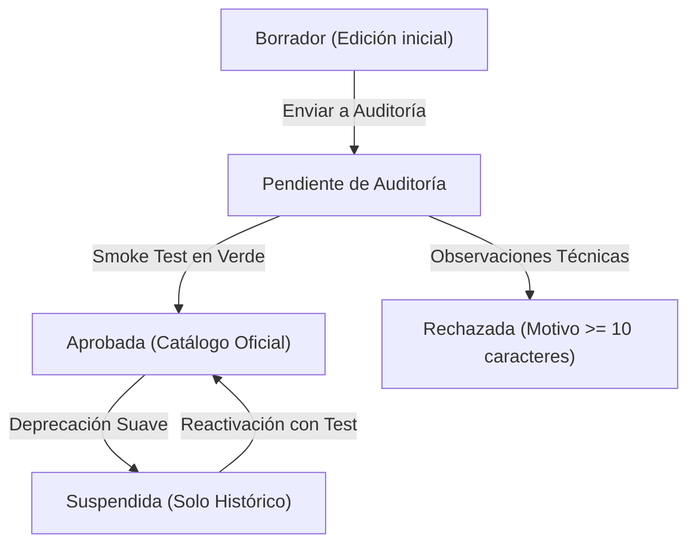

# Manual de Administración del Sistema — SOLV

Guía operativa, técnica y de gestión para administradores de la plataforma SOLV.

---

## 1. Visión General e Identidad del Sistema

### 1.1 Propósito y Alcance
La plataforma SOLV está diseñada para centralizar la gestión, ejecución y evaluación de laboratorios virtuales de programación en entornos académicos. Permite a las instituciones educativas proporcionar a sus estudiantes entornos de desarrollo listos para usar y sistemas de calificación automática de código, manteniendo el control de los recursos del servidor y la seguridad de la infraestructura.

### 1.2 Glosario de Términos
- **Laboratorio Interactivo (IDE):** Entorno de desarrollo completo basado en navegador web (OpenVSCode Server) con terminal integrada, explorador de archivos y persistencia de código durante el semestre.
- **Juez Evaluador (Sandbox):** Entorno de ejecución rápida y aislada que compila y ejecuta código fuente frente a casos de prueba predefinidos para emitir una calificación automática.
- **Contenedor Docker:** Unidad ligera y aislada que empaqueta el sistema operativo base, los compiladores, intérpretes y herramientas necesarias para cada práctica.
- **Límite de Recursos (cgroups v2):** Mecanismo del kernel de Linux que restringe la cantidad de memoria RAM y procesador (CPU) que un contenedor puede utilizar.
- **Análisis Estático (Semgrep):** Verificación previa del código fuente para detectar llamadas al sistema o librerías prohibidas antes de permitir su compilación.

### 1.3 Matriz de Roles y Responsabilidades
| Rol | Alcance y Responsabilidades |
| :--- | :--- |
| **Administrador Central** | Control global de infraestructura, gestión de periodos académicos, aprobación de plantillas de entorno, fijación de límites de hardware, asignación de docentes a materias y auditoría de eventos. |
| **Docente** | Creación de actividades pedagógicas, configuración de ejercicios en el juez, supervisión de entregas de estudiantes y consulta de plantillas aprobadas. |
| **Estudiante** | Acceso a sus materias inscritas, desarrollo en su laboratorio interactivo personal y envío de soluciones para evaluación automática. |

---

## 2. Entornos de Laboratorio y Evaluación

### 2.1 Comparativa Técnica de Entornos
SOLV ofrece dos modalidades de ejecución según la necesidad pedagógica:

| Característica | Laboratorio Interactivo (IDE) | Juez Evaluador (Sandbox) |
| :--- | :--- | :--- |
| **Objetivo** | Desarrollo de proyectos, tareas extensas y aprendizaje guiado. | Exámenes cronometrados y evaluación automática de algoritmos. |
| **Interfaz** | Editor visual completo en el navegador web con terminal. | Sin interfaz gráfica. Proceso automatizado por API. |
| **Persistencia** | Almacena archivos en un volumen de disco asignado al estudiante. | Efímero. Los archivos temporales se destruyen al finalizar la prueba. |
| **Servicios Adicionales** | Admite bases de datos auxiliares (PostgreSQL, MariaDB) en red local. | Aislado totalmente sin bases de datos auxiliares. |
| **Acceso a Red** | Conectividad restringida a la red local del laboratorio. | Aislamiento estricto sin salida a red (`network_mode: none`). |
| **Consumo de Memoria** | Mayor asignación para soportar el editor web y compiladores. | Asignación compacta dimensionada para una prueba individual. |

### 2.2 Políticas de Memoria y Derivación Automática
Para garantizar estabilidad en servidores on-premise compartidos, SOLV calcula de forma automática y determinística el perfil de memoria cgroups v2 a partir de la memoria base (`base_ram_mb`):

$$\text{Memoria Mínima Garantizada } (memory.min) = \frac{\text{base\_ram\_mb}}{2}$$

$$\text{Umbral de Throttling } (memory.high) = \text{base\_ram\_mb} \times 1.5$$

$$\text{Límite Máximo Duro } (memory.max) = \text{base\_ram\_mb} \times 2$$

- **`memory.min` (50%):** Memoria garantizada por el kernel que nunca será reclamada en situaciones de estrés.
- **`memory.high` (150%):** Umbral donde el sistema operativo ralentiza las asignaciones de páginas adicionales para evitar cortes abruptos.
- **`memory.max` (200%):** Límite estricto e infranqueable; superarlo activa inmediatamente el mecanismo de corte por OOM (Out Of Memory).

**Ejemplo de dimensionamiento para una base de 1024 MB:**
- Memoria mínima garantizada: 512 MB.
- Umbral de contención: 1536 MB.
- Límite absoluto de corte (OOM): 2048 MB.

### 2.3 Perfiles Recomendados por Lenguaje
- **C / C++:** 512 MB en Juez Evaluador / 1024 MB en Laboratorio Interactivo.
- **Python:** 512 MB en Juez Evaluador / 1024 MB en Laboratorio Interactivo.
- **Java / OpenJDK:** 1024 MB en Juez Evaluador / 1536 MB a 2048 MB en Laboratorio Interactivo (por la reserva de memoria de la JVM).
- **Node.js / TypeScript:** 1536 MB a 2048 MB en Laboratorio Interactivo (para soportar `node_modules` y compilación en segundo plano).
- **Go:** 512 MB en Juez Evaluador / 1024 MB en Laboratorio Interactivo.

---

## 3. Gestión de Infraestructura y Contenedores

### 3.1 Requisitos de Imágenes Docker
- **Prohibición de la etiqueta `:latest`:** Está estrictamente prohibido utilizar `:latest`. Se deben especificar siempre versiones inmutables (ejemplo: `python:3.12-slim-bookworm`). Esto asegura que los ejercicios se ejecuten exactamente igual en cualquier momento.
- **Variantes Ligeras (`-slim`):** Se recomienda priorizar imágenes basadas en Debian Slim (`-slim`) por su balance entre tamaño reducido y compatibilidad con librerías nativas.
- **Variantes Alpine (`-alpine`):** Utilizarlas únicamente cuando se haya comprobado que las dependencias del curso son totalmente compatibles con la librería `musl-libc`.

### 3.2 Ciclo de Vida y Gobernanza de Plantillas
El ciclo de vida de una plantilla asegura que ningún entorno alcance a los estudiantes sin validación técnica previa:

- **Borrador:** Estado inicial de edición técnica. Solo visible para el autor.
- **Pendiente de Auditoría:** Solicitud enviada a revisión técnica. Requiere la ejecución obligatoria de una prueba de entorno (smoke test) para validar que la imagen descargue y responda.
- **Aprobada:** Plantilla validada e integrada en el catálogo institucional para su uso en materias y laboratorios.
- **Rechazada:** Plantilla observada por no cumplir los requisitos técnicos. Requiere un motivo de justificación de al menos 10 caracteres.
- **Suspendida:** Desactivación temporal de una plantilla obsoleta sin eliminar los historiales ni entornos de cursos anteriores.

---

## 4. Gestión Académica y Operativa

### 4.1 Periodos Académicos (Semestres)
- Los periodos definen el rango de fechas en que las materias están activas.
- Un periodo con fecha final vencida no puede establecerse como activo ni recibir nuevas inscripciones.
- No es posible eliminar un periodo que tenga materias asociadas.

### 4.2 Cursos y Asignación de Docentes
- Cada materia creada pertenece a un periodo académico y cuenta con un docente titular responsable.
- Si un docente deja una cátedra, el Administrador puede reasignar la materia a otro docente registrado sin perder la información del curso ni los laboratorios de los estudiantes.

### 4.3 Directorio de Estudiantes y Desbloqueo de Memoria
- El Administrador puede consultar el estado de cada cuenta de estudiante (Activo o Suspendido).
- **Desbloqueo por exceso de memoria (Reset OOM):** Cuando un estudiante supera repetidamente el límite de memoria de su laboratorio, su acceso queda restringido. El Administrador puede restablecer el contador de penalizaciones ingresando una justificación de al menos 10 caracteres.

---

## 5. Monitoreo, Salud y Auditoría

### 5.1 Métricas de Hardware en Tiempo Real
El panel principal de administración presenta indicadores de salud del servidor:
- **Uso de CPU:** Porcentaje de procesamiento actual respecto a la capacidad del servidor.
- **Uso de Memoria RAM:** Memoria ocupada por el sistema y los contenedores frente al total disponible.
- **Contenedores Activos:** Número de laboratorios interactivos en ejecución simultánea.

### 5.2 Registro de Auditoría
Las acciones sensibles quedan registradas con identificación de usuario, fecha, dirección IP y detalle del cambio:
- Registro y aprobación de plantillas.
- Modificación o suspensión de estados de plantillas.
- Reasignación de docentes en materias.
- Restablecimiento de penalizaciones de memoria de estudiantes.
- Acciones de emergencia sobre el servidor.

---

## 6. Solución de Problemas Frecuentes

### 6.1 Contenedor detenido por falta de memoria (Error OOM)
- **Causa:** El código ejecutado por el usuario consumió más memoria RAM que el límite máximo asignado al contenedor.
- **Solución:** 
  1. Revisar si el código contiene bucles infinitos, fugas de memoria o estructuras de datos sobredimensionadas.
  2. Si la práctica requiere legítimamente más memoria, el Administrador puede editar la plantilla y aumentar la memoria base (`base_ram_mb`).
  3. Restablecer las penalizaciones del estudiante desde el módulo de Estudiantes.

### 6.2 Error al verificar imagen Docker
- **Causa:** La imagen no existe en el registro, se utilizó la etiqueta prohibida `:latest`, o la descarga superó el tiempo de espera.
- **Solución:**
  1. Comprobar que el nombre de la imagen esté escrito correctamente (ejemplo: `gcc:14-bookworm`).
  2. Reemplazar cualquier referencia a `:latest` por un número de versión fijo.
  3. Verificar que el servidor cuente con conexión a internet para descargar la imagen por primera vez.

### 6.3 Código rechazado por análisis estático (Semgrep)
- **Causa:** El archivo de código contiene llamadas al sistema prohibidas (como manipulación directa de procesos, accesos no permitidos al sistema de archivos o apertura de conexiones de red no autorizadas).
- **Solución:** Explicar al estudiante que la solución debe enfocarse en la lógica algorítmica solicitada sin invocar comandos del sistema operativo.

### 6.4 Conflicto al crear materia o periodo
- **Causa:** Se intenta registrar una materia con un código duplicado o activar un periodo académico cuya fecha de fin ya expiró.
- **Solución:** Verificar que el código de la materia sea único y que las fechas del periodo correspondan al calendario académico vigente.
