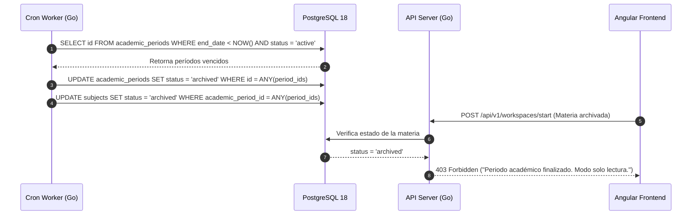

# ADR-029: Períodos Académicos y Archivado de Cursos

## Estado
Aprobado

## Contexto
Las instituciones universitarias organizan sus actividades formativas en ciclos semestrales o anuales definidos por fechas de inicio y fin. En la plataforma SOLV, los cursos (materias) y las inscripciones de estudiantes quedan actualmente vinculados de forma estática, lo que dificulta separar la carga académica activa de los registros históricos. Al concluir un semestre, es necesario que los cursos pasen a un estado de archivo para evitar modificaciones accidentales en calificaciones y entregas, liberando la vista de los estudiantes y docentes sin perder la trazabilidad de notas y auditorías previas.

## Decisión
Implementar la entidad `academic_periods` y un mecanismo automatizado de ciclo de vida mediante un worker periódico en Go.

1. Los períodos académicos contarán con identificador, rango de fechas (`start_date`, `end_date`), estado (`active`, `archived`) y pertenencia por tenant (`tenant_id`).
2. Cada materia (`subjects`) se asociará a un `academic_period_id`.
3. Un worker cron ejecutará una tarea diaria para cambiar a estado `archived` aquellos períodos cuya fecha `end_date` haya sido superada, pasando automáticamente en cascada el acceso de los cursos vinculados a modo solo lectura.
4. Los estudiantes y docentes mantendrán acceso de consulta a los cursos archivados en una sección de histórico, pero quedará bloqueada la creación de nuevos laboratorios, entregas o modificaciones de notas.

## Diagrama de Flujo del Ciclo de Vida



## Esquema de Base de Datos (PostgreSQL 18)

```sql
-- Tabla de períodos académicos
CREATE TABLE IF NOT EXISTS academic_periods (
    id UUID PRIMARY KEY DEFAULT gen_random_uuid(),
    tenant_id UUID NOT NULL REFERENCES tenants(id) ON DELETE RESTRICT,
    code VARCHAR(32) NOT NULL,
    name VARCHAR(128) NOT NULL,
    start_date TIMESTAMPTZ NOT NULL,
    end_date TIMESTAMPTZ NOT NULL,
    status VARCHAR(20) NOT NULL DEFAULT 'active' CHECK (status IN ('active', 'archived', 'upcoming')),
    created_at TIMESTAMPTZ NOT NULL DEFAULT NOW(),
    updated_at TIMESTAMPTZ NOT NULL DEFAULT NOW(),
    CONSTRAINT uk_tenant_period_code UNIQUE (tenant_id, code)
);

CREATE INDEX IF NOT EXISTS idx_academic_periods_tenant_status 
ON academic_periods (tenant_id, status);

-- Modificación de tabla subjects para enlace a período
ALTER TABLE subjects 
ADD COLUMN IF NOT EXISTS academic_period_id UUID REFERENCES academic_periods(id) ON DELETE RESTRICT,
ADD COLUMN IF NOT EXISTS status VARCHAR(20) NOT NULL DEFAULT 'active' CHECK (status IN ('active', 'archived'));
```

## Endpoints HTTP

| Método | Ruta | Status Codes | Descripción |
| :--- | :--- | :--- | :--- |
| `POST` | `/api/v1/admin/academic-periods` | `201 Created`, `400 Bad Request`, `401 Unauthorized` | Crea un nuevo período académico para el tenant. |
| `GET` | `/api/v1/admin/academic-periods` | `200 OK`, `401 Unauthorized` | Lista períodos académicos filtrados por estado. |
| `PUT` | `/api/v1/admin/academic-periods/{id}` | `200 OK`, `400 Bad Request`, `404 Not Found` | Modifica fechas o nombre de un período. |
| `POST` | `/api/v1/admin/academic-periods/{id}/archive` | `200 OK`, `404 Not Found` | Fuerza el archivado manual de un período y sus materias. |

### Ejemplo de Payload (`POST /api/v1/admin/academic-periods`)
```json
{
  "code": "2026-II",
  "name": "Segundo Semestre 2026",
  "start_date": "2026-08-01T00:00:00Z",
  "end_date": "2026-12-15T23:59:59Z"
}
```

## Componentes Angular Afectados

- `features/admin/academic-periods/academic-periods-list.component.ts`: Vista de gestión y creación de semestres.
- `features/admin/academic-periods/academic-period-form.component.ts`: Modal o formulario de alta y edición.
- `features/student/history/student-history.component.ts`: Visualización de cursos de semestres archivados.
- `features/teacher/dashboard/teacher-dashboard.component.ts`: Filtro por período académico activo.

## Relación con Otros ADRs

- **ADR-024 (Esquema Académico Multi-Tenant):** Añade la relación jerárquica entre `tenants`, `academic_periods` y `subjects`.
- **ADR-002 (Autenticación y Manejo de Sesiones):** El contexto de sesión valida el estado del período en las peticiones de mutación académica.

## Justificación Técnica

1. **Integridad de Datos:** Evita la eliminación física de registros escolares requerida para auditorías universitarias oficiales.
2. **Desempeño en Consultas:** Permite que las pantallas principales de estudiantes y docentes consulten únicamente los registros de períodos con estado `active`, reduciendo el volumen de datos transferidos.
3. **Automatización sin Intervención Manual:** El cron programado reduce la carga administrativa del personal de soporte al cierre de semestre.

## Consecuencias / Impacto

- **Positivas:** Separación clara entre datos operativos del semestre en curso e histórico inmutable de años anteriores.
- **Trade-offs:** Requiere que toda creación de materias exija un período académico asociado, agregando un paso previo en la configuración inicial del tenant.
