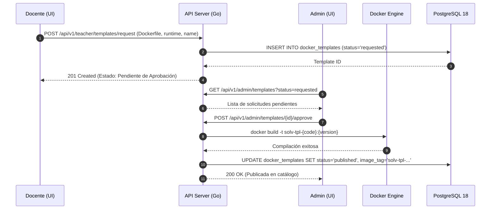

# ADR-030: Catálogo de Plantillas Docker con Flujo de Aprobación

## Estado
Aprobado

## Contexto
Los laboratorios de programación requieren entornos heterogéneos según la materia (Go, Python, C++, Node.js, PostgreSQL). Si bien los docentes conocen las dependencias exactas de sus asignaturas, otorgarles permisos directos para construir imágenes Docker en el servidor Asus representa un riesgo para la estabilidad del host (agotamiento de disco por imágenes huérfanas, consumo descontrolado de CPU durante builds o inclusión de binarios no autorizados). Es necesario un flujo controlado donde el docente defina o solicite una plantilla y el administrador técnico la valide, compile y publique en el catálogo institucional.

## Decisión
Establecer una máquina de estados para la gestión de plantillas Docker (`docker_templates`) con versionado semántico:

1. Estados de la plantilla:
   - `requested`: Creada por el docente con la especificación técnica (Dockerfile base, librerías, versión de runtime).
   - `approved`: Validada por el administrador técnico. El sistema procede con la compilación (`docker build`) y etiquetado local.
   - `published`: Imagen compilada y disponible en el catálogo para ser seleccionada en ejercicios y materias.
   - `rejected`: Rechazada por el administrador con motivo documentado.
   - `deprecated`: Plantilla antigua marcada para no permitir nuevos laboratorios, manteniendo los existentes.
2. Cada plantilla incluye límites de recursos por defecto (RAM en MB, CPU en cores y almacenamiento en disco).
3. Versionado semántico estricto (`v1.0.0`, `v1.1.0`) para evitar discrepancias en la ejecución de código previo.

## Diagrama de Secuencia del Flujo de Aprobación



## Esquema de Base de Datos (PostgreSQL 18)

```sql
CREATE TABLE IF NOT EXISTS docker_templates (
    id UUID PRIMARY KEY DEFAULT gen_random_uuid(),
    tenant_id UUID NOT NULL REFERENCES tenants(id) ON DELETE RESTRICT,
    name VARCHAR(100) NOT NULL,
    description TEXT,
    language VARCHAR(32) NOT NULL,
    runtime_version VARCHAR(32) NOT NULL,
    version VARCHAR(16) NOT NULL DEFAULT 'v1.0.0',
    dockerfile_content TEXT NOT NULL,
    image_tag VARCHAR(128),
    default_memory_mb INT NOT NULL DEFAULT 512,
    default_cpu_cores NUMERIC(3,2) NOT NULL DEFAULT 1.00,
    default_disk_mb INT NOT NULL DEFAULT 1024,
    status VARCHAR(20) NOT NULL DEFAULT 'requested' 
        CHECK (status IN ('requested', 'approved', 'published', 'rejected', 'deprecated')),
    rejection_reason TEXT,
    created_by UUID NOT NULL REFERENCES users(id) ON DELETE RESTRICT,
    approved_by UUID REFERENCES users(id) ON DELETE SET NULL,
    created_at TIMESTAMPTZ NOT NULL DEFAULT NOW(),
    updated_at TIMESTAMPTZ NOT NULL DEFAULT NOW(),
    CONSTRAINT uk_tenant_template_tag UNIQUE (tenant_id, name, version)
);

CREATE INDEX IF NOT EXISTS idx_docker_templates_tenant_status 
ON docker_templates (tenant_id, status);
```

## Endpoints HTTP

| Método | Ruta | Status Codes | Descripción |
| :--- | :--- | :--- | :--- |
| `POST` | `/api/v1/teacher/templates/request` | `201 Created`, `400 Bad Request` | Docente envía solicitud de plantilla personalizada. |
| `GET` | `/api/v1/templates` | `200 OK` | Lista de plantillas con estado `published` disponibles para laboratorios. |
| `GET` | `/api/v1/admin/templates` | `200 OK` | Administrador lista todas las plantillas (incluyendo `requested`). |
| `POST` | `/api/v1/admin/templates/{id}/approve` | `200 OK`, `400 Bad Request`, `500 Server Error` | Admin aprueba y dispara la compilación Docker local. |
| `POST` | `/api/v1/admin/templates/{id}/reject` | `200 OK`, `400 Bad Request` | Admin rechaza la solicitud indicando motivo. |

### Ejemplo de Payload (`POST /api/v1/teacher/templates/request`)
```json
{
  "name": "Python Data Science Stack",
  "description": "Entorno con NumPy, Pandas y Matplotlib para Estadística",
  "language": "python",
  "runtime_version": "3.12",
  "version": "v1.0.0",
  "dockerfile_content": "FROM python:3.12-slim\nRUN pip install numpy pandas matplotlib",
  "default_memory_mb": 768
}
```

## Componentes Angular Afectados

- `features/teacher/templates/template-request.component.ts`: Formulario docente de solicitud de plantilla.
- `features/admin/templates/template-approval-list.component.ts`: Bandeja de revisión de solicitudes Docker para el admin.
- `features/admin/templates/template-details-modal.component.ts`: Visor de Dockerfile y disparador de compilación.
- `features/teacher/exercises/components/template-selector.component.ts`: Dropdown de selección de plantillas publicadas.

## Relación con Otros ADRs

- **ADR-006 (Estrategia Aprovisionamiento Entornos):** Define cómo el daemon de Docker usa las imágenes publicadas para instanciar contenedores.
- **ADR-008 (Estrategia Asignación de Recursos):** Las plantillas determinan los límites base de RAM y CPU asignados a cada contenedor.
- **ADR-027 (Operabilidad B2B y Audit Logs):** Toda aprobación o rechazo de plantilla se registra en el log de auditoría.

## Justificación Técnica

1. **Protección del Host:** El proceso de construcción de imágenes queda centralizado bajo supervisión administrativa, evitando saturación de disco o CPU durante horarios de alta concurrencia.
2. **Reproducibilidad:** El versionado semántico previene que cambios en una imagen rompan laboratorios de semestres anteriores.
3. **Control de Cuotas:** Permite restringir límites de RAM excesivos antes de que la plantilla sea utilizada por cientos de alumnos.

## Consecuencias / Impacto

- **Positivas:** Control granular sobre los recursos consumidos y seguridad de las librerías instaladas en el servidor.
- **Trade-offs:** Introduce un paso asíncrono para los docentes, quienes deben esperar la aprobación administrativa antes de usar una plantilla nueva.
