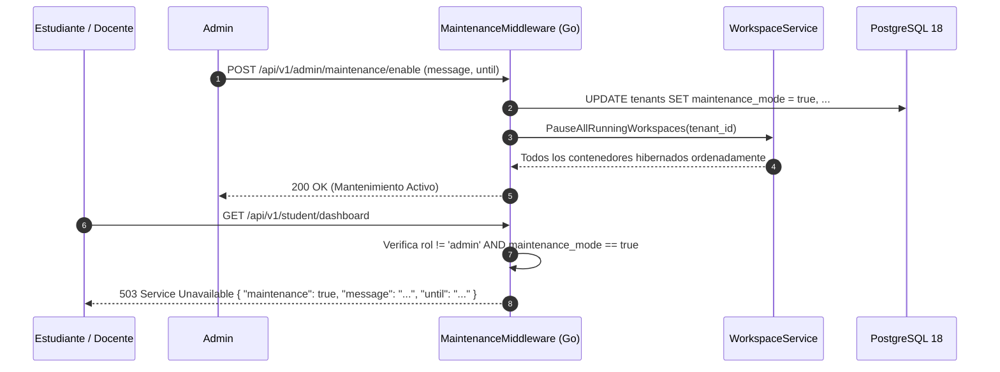

# ADR-031: Modo Mantenimiento Global

## Estado
Aprobado

## Contexto
Durante operaciones críticas de infraestructura (actualizaciones del motor Docker, migraciones de base de datos PostgreSQL, renovación de certificados o reinicio de servicios del host), permitir tráfico de usuarios concurrentes puede ocasionar corrupción de datos, pérdida de código no guardado en los contenedores o inconsistencias transaccionales. El administrador requiere un mecanismo confiable para suspender temporalmente el acceso de estudiantes y docentes de forma ordenada, informando a los usuarios mediante un banner informativo y preservando el estado de los contenedores antes del corte.

## Decisión
Implementar un control de modo de mantenimiento a nivel de middleware y configuración de tenant:

1. Modificar la entidad `tenants` con una bandera booleana `maintenance_mode`, un mensaje informativo `maintenance_message` y una fecha estimada de reactivación `maintenance_until`.
2. Crear un middleware en Go (`MaintenanceMiddleware`) que evalúe la bandera antes de procesar cualquier petición entrante:
   - Si `maintenance_mode = true` y el usuario no posee rol `admin`, la petición es interceptada retornando `503 Service Unavailable` con cuerpo JSON estandarizado.
   - Los usuarios con rol `admin` mantienen acceso total para ejecutar verificaciones y tareas operativas.
3. Procedimiento de activación: Al activar el modo mantenimiento, el sistema dispara automáticamente una hibernación ordenada de todos los workspaces en estado `running` del tenant, asegurando la sincronización de archivos a los volúmenes nombrados antes de cerrar conexiones.

## Diagrama de Secuencia del Middleware de Mantenimiento



## Esquema de Base de Datos (PostgreSQL 18)

```sql
-- Actualización de la tabla tenants
ALTER TABLE tenants 
ADD COLUMN IF NOT EXISTS maintenance_mode BOOLEAN NOT NULL DEFAULT FALSE,
ADD COLUMN IF NOT EXISTS maintenance_message TEXT DEFAULT 'La plataforma se encuentra en mantenimiento programado.',
ADD COLUMN IF NOT EXISTS maintenance_until TIMESTAMPTZ;
```

## Endpoints HTTP

| Método | Ruta | Status Codes | Descripción |
| :--- | :--- | :--- | :--- |
| `POST` | `/api/v1/admin/maintenance/enable` | `200 OK`, `400 Bad Request`, `401 Unauthorized` | Activa modo mantenimiento e hiberna contenedores activos. |
| `POST` | `/api/v1/admin/maintenance/disable` | `200 OK`, `401 Unauthorized` | Desactiva modo mantenimiento y reanuda tráfico regular. |
| `GET` | `/api/v1/config/public` | `200 OK` | Endpoint público que entrega el estado del mantenimiento para el frontend. |

### Ejemplo de Payload (`POST /api/v1/admin/maintenance/enable`)
```json
{
  "message": "Actualización de seguridad del servidor central. Estaremos de vuelta a las 14:00.",
  "until": "2026-09-02T18:00:00Z"
}
```

### Respuesta de Error `503 Service Unavailable`
```json
{
  "error": "maintenance_mode_active",
  "message": "Actualización de seguridad del servidor central. Estaremos de vuelta a las 14:00.",
  "estimated_end": "2026-09-02T18:00:00Z"
}
```

## Componentes Angular Afectados

- `core/interceptors/error.interceptor.ts`: Captura del código `503` con error `maintenance_mode_active` para redirigir a pantalla de mantenimiento.
- `features/system/maintenance/maintenance-view.component.ts`: Pantalla completa de mantenimiento con mensaje institucional y cuenta regresiva.
- `features/admin/settings/maintenance-control.component.ts`: Switch de activación en el panel de administración con modal de confirmación.

## Relación con Otros ADRs

- **ADR-011 (Gestión Dinámica del Ciclo de Vida e Hibernación):** Reutiliza la función de hibernación segura de contenedores para evitar cortes forzados.
- **ADR-027 (Operabilidad B2B y Audit Logs):** Registra eventos de inicio y fin de mantenimiento con el ID del administrador ejecutor.

## Justificación Técnica

1. **Prevención de Pérdida de Datos:** Asegura que los procesos de Docker se detengan ordenadamente antes de operaciones sobre el sistema de archivos del host.
2. **Claridad para el Usuario:** Evita errores genéricos de red o pantallas en blanco, entregando una explicación explícita del estado del servicio.
3. **Control Exclusivo para Administradores:** Permite que el equipo técnico valide el entorno antes de reabrir el acceso público.

## Consecuencias / Impacto

- **Positivas:** Operaciones de actualización predecibles y sin corrupción de sesiones.
- **Trade-offs:** Los estudiantes con laboratorios en curso experimentarán una pausa automática de su sesión, requiriendo reanudar el contenedor una vez levantado el mantenimiento.
