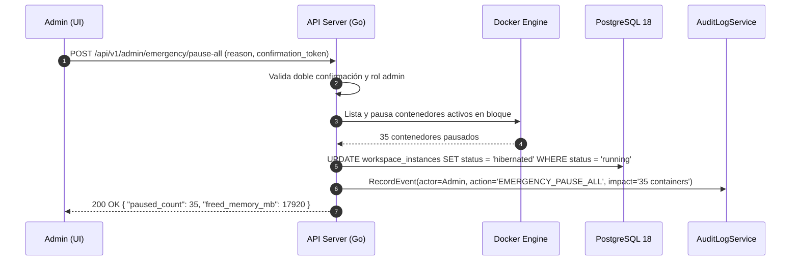

# ADR-032: Acciones de Emergencia del Administrador

## Estado
Aprobado

## Contexto
El servidor central Asus opera en un entorno On-Premise con capacidades fijas de memoria RAM, núcleos de CPU y almacenamiento en disco NVMe. Ante situaciones anómalas de carga (bucles infinitos en código de alumnos no contenidos, fugas de memoria en múltiples instancias, saturación por contenedores huérfanos o fallos en cascada del proxy Traefik), el administrador de la plataforma necesita herramientas de control inmediato para restaurar la operatividad del host sin necesidad de acceder por consola SSH ni reiniciar manualmente el servidor físico.

## Decisión
Implementar un conjunto de 5 acciones operativas de emergencia en el backend Go, expuestas exclusivamente al rol de administrador técnico con validación de doble confirmación y registro obligatorio en el log de auditoría:

1. **Pausar Todos los Workspaces (`POST /api/v1/admin/emergency/pause-all`):**
   Detiene de forma masiva todos los contenedores en estado `running`, liberando inmediatamente la memoria RAM ocupada y manteniéndolos en estado `hibernated`.
2. **Limpiar Contenedores OOM / Fallidos (`POST /api/v1/admin/emergency/purge-failed`):**
   Elimina los contenedores Docker en estado `failed` o `oom_killed` y purga sus entradas transitorias para descongestionar el daemon de Docker.
3. **Cerrar Workspaces Inactivos >2h (`POST /api/v1/admin/emergency/reap-stale`):**
   Fuerza la finalización y recálculo de recursos de todas las sesiones cuyo último latido (`last_heartbeat_at`) supere los 120 minutos.
4. **Limpiar Imágenes y Volúmenes Huérfanos (`POST /api/v1/admin/emergency/docker-prune`):**
   Ejecuta una limpieza selectiva de capas huérfanas (`docker image prune` y contenedores detenidos sin volumen asociado), liberando espacio en disco sin tocar volúmenes nombrados de estudiantes.
5. **Reiniciar Conexiones y Pools Críticos (`POST /api/v1/admin/emergency/reset-pools`):**
   Reinicia los pools de conexiones de PostgreSQL y reinicializa los contadores de circuitos abiertos (Circuit Breakers) en memoria.

## Diagrama de Secuencia de Operación de Emergencia



## Esquema de Base de Datos (PostgreSQL 18)

Estas acciones reutilizan la tabla `audit_logs` (ADR-027) para garantizar trazabilidad estricta:

```sql
-- Estructura de registro en audit_logs para acciones de emergencia
-- Eventos emitidos: EMERGENCY_PAUSE_ALL, EMERGENCY_PURGE_FAILED, EMERGENCY_REAP_STALE, EMERGENCY_PRUNE_DOCKER, EMERGENCY_RESET_POOLS
CREATE INDEX IF NOT EXISTS idx_audit_logs_emergency 
ON audit_logs (tenant_id, action) 
WHERE action LIKE 'EMERGENCY_%';
```

## Endpoints HTTP

| Método | Ruta | Status Codes | Descripción |
| :--- | :--- | :--- | :--- |
| `POST` | `/api/v1/admin/emergency/pause-all` | `200 OK`, `401 Unauthorized`, `403 Forbidden` | Pausa inmediata de todos los contenedores activos. |
| `POST` | `/api/v1/admin/emergency/purge-failed` | `200 OK`, `403 Forbidden` | Limpieza de contenedores terminados o en fallo. |
| `POST` | `/api/v1/admin/emergency/reap-stale` | `200 OK`, `403 Forbidden` | Cierre forzado de sesiones inactivas por más de 2 horas. |
| `POST` | `/api/v1/admin/emergency/docker-prune` | `200 OK`, `403 Forbidden`, `500 Server Error` | Purgado de capas Docker huérfanas en disco. |
| `POST` | `/api/v1/admin/emergency/reset-pools` | `200 OK`, `403 Forbidden` | Reinicio de pools de conexiones y circuit breakers. |

### Ejemplo de Payload (`POST /api/v1/admin/emergency/pause-all`)
```json
{
  "reason": "Saturación del 94% de RAM por pico de evaluación concurrente",
  "confirmation_phrase": "CONFIRMAR_PAUSA_TOTAL"
}
```

## Componentes Angular Afectados

- `features/admin/emergency/emergency-panel.component.ts`: Centro de control con botones de acción rápida clasificados por nivel de impacto.
- `features/admin/emergency/components/confirmation-modal.component.ts`: Diálogo de doble confirmación que exige escribir una frase de seguridad antes de ejecutar la acción.
- `features/admin/dashboard/components/kpi-banner.component.ts`: Banner de alerta que sugiere acciones de emergencia cuando la RAM supera el 90%.

## Relación con Otros ADRs

- **ADR-008 (Estrategia Asignación y Limitación de Recursos):** Proporciona la vía de escape administrativa ante fallos de contención de memoria.
- **ADR-011 (Gestión de Ciclo de Vida e Hibernación):** Ejecuta la lógica de pausa masiva sin pérdida de persistencia.
- **ADR-027 (Operabilidad B2B y Audit Logs):** Registra con máxima prioridad cada disparo de emergencia.

## Justificación Técnica

1. **Tiempo de Respuesta Inmediato:** Permite mitigar caídas del servidor en segundos directamente desde el navegador web.
2. **Seguridad Operativa:** El requisito de doble confirmación evita ejecuciones accidentales que interrumpan las clases activas.
3. **Auditoría Transparente:** Queda constancia explícita de quién ejecutó la acción de emergencia y la justificación técnica ingresada.

## Consecuencias / Impacto

- **Positivas:** Estabilidad operativa del host y capacidad de recuperación rápida sin reiniciar la máquina física.
- **Trade-offs:** Pausar o limpiar instancias puede desconectar temporalmente a estudiantes que se encontraban programando activamente en ese instante.
