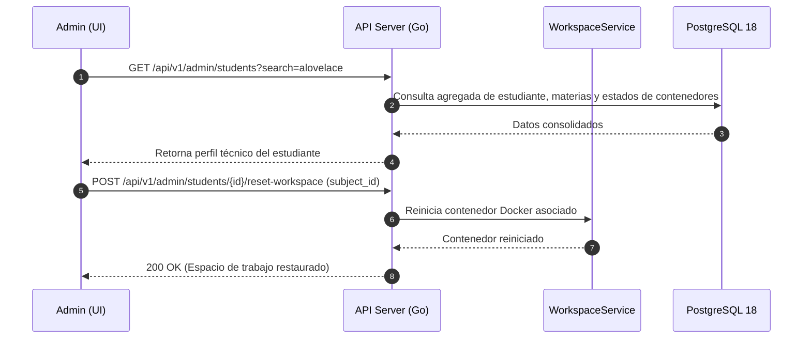

# ADR-033: Gestión de Estudiantes por el Administrador

## Estado
Aprobado

## Contexto
En una institución educativa, los administradores de tenant reciben solicitudes recurrentes de soporte por parte de estudiantes que los docentes no pueden resolver directamente en sus materias: cuentas bloqueadas por intentos fallidos, sesiones colgadas en navegadores cerrados abruptamente, contenedores con bucles bloqueantes que impiden la reconexión al IDE o necesidad de verificar el historial completo de actividad académica en todos los cursos matriculados. Se requiere una vista administrativa global con capacidad de intervención técnica sobre las cuentas de estudiantes, respetando estrictamente los límites pedagógicos (el administrador no debe alterar notas ni veredictos de evaluaciones).

## Decisión
Implementar un módulo de gestión técnica de estudiantes para el administrador de tenant con permisos diferenciados:

1. **Capacidades Permitidas al Administrador:**
   - Búsqueda global por nombre, código de estudiante o correo electrónico institucional.
   - Consulta de materias matriculadas, espacios de trabajo asignados e historial de sesiones.
   - Forzar cierre de sesión activa (`revoke_session`).
   - Reiniciar o pausar el contenedor Docker del estudiante en cualquier materia para desbloquearlo.
   - Desactivar o suspender temporalmente la cuenta del estudiante en la plataforma.
2. **Restricciones Inamovibles:**
   - El administrador tiene prohibido crear, modificar o anular notas (`score`), veredictos o comentarios pedagógicos en las entregas (`submissions`). Estas acciones quedan restringidas exclusivamente al docente titular según ADR-024.

## Diagrama de Secuencia de Gestión de Estudiante



## Esquema de Base de Datos (PostgreSQL 18)

Se añaden campos de control de estado en la tabla de usuarios existente:

```sql
-- Extensión de la tabla users para control administrativo
ALTER TABLE users 
ADD COLUMN IF NOT EXISTS status VARCHAR(20) NOT NULL DEFAULT 'active' 
    CHECK (status IN ('active', 'suspended', 'pending')),
ADD COLUMN IF NOT EXISTS student_code VARCHAR(32),
ADD COLUMN IF NOT EXISTS last_login_at TIMESTAMPTZ,
ADD COLUMN IF NOT EXISTS suspension_reason TEXT;

CREATE INDEX IF NOT EXISTS idx_users_student_lookup 
ON users (tenant_id, role, status) 
WHERE role = 'student';
```

## Endpoints HTTP

| Método | Ruta | Status Codes | Descripción |
| :--- | :--- | :--- | :--- |
| `GET` | `/api/v1/admin/students` | `200 OK`, `401 Unauthorized` | Listado paginado de estudiantes con filtros y buscador. |
| `GET` | `/api/v1/admin/students/{id}` | `200 OK`, `404 Not Found` | Perfil técnico completo del estudiante y sus materias. |
| `POST` | `/api/v1/admin/students/{id}/reset-session` | `200 OK`, `404 Not Found` | Invalida tokens JWT activos y fuerza nuevo login. |
| `POST` | `/api/v1/admin/students/{id}/reset-workspace` | `200 OK`, `400 Bad Request` | Reinicia el contenedor de una materia específica. |
| `PUT` | `/api/v1/admin/students/{id}/status` | `200 OK`, `400 Bad Request` | Cambia estado de la cuenta (activa / suspendida). |

### Ejemplo de Payload (`PUT /api/v1/admin/students/{id}/status`)
```json
{
  "status": "suspended",
  "reason": "Uso indebido reiterado de consumo de memoria en laboratorios"
}
```

## Componentes Angular Afectados

- `features/admin/students/student-directory.component.ts`: Tabla con buscador en tiempo real, filtros por estado y paginación.
- `features/admin/students/student-detail.component.ts`: Vista detallada con tarjeta de salud de contenedores y lista de asignaturas.
- `features/admin/students/components/student-actions-menu.component.ts`: Menú contextual para reseteo de sesión, reinicio de entorno o suspensión.

## Relación con Otros ADRs

- **ADR-002 (Autenticación y Manejo de Sesiones):** El reseteo de sesión interactúa con la lista de revocación de tokens JWT.
- **ADR-024 (Esquema Académico Multi-Tenant):** Respeta la separación de dominios entre gestión de identidades y calificación docente.
- **ADR-027 (Operabilidad B2B y Audit Logs):** Toda intervención sobre un estudiante queda registrada con el identificador del administrador.

## Justificación Técnica

1. **Resolución Rápida de Incidencias:** Desbloquea situaciones técnicas habituales de aula sin depender del soporte directo del docente en plena clase.
2. **Separación de Responsabilidades:** Evita que el administrador tenga privilegios académicos de modificación de calificaciones, garantizando la ética evaluativa del sistema.
3. **Control de Seguridad:** Facilita suspender accesos comprometidos de forma inmediata.

## Consecuencias / Impacto

- **Positivas:** Capacidad de soporte institucional centralizado y reducción de tiempos muertos en laboratorios presenciales.
- **Trade-offs:** Requiere sincronizar los códigos de estudiante desde los sistemas académicos de la universidad (vía importación o SSO).
