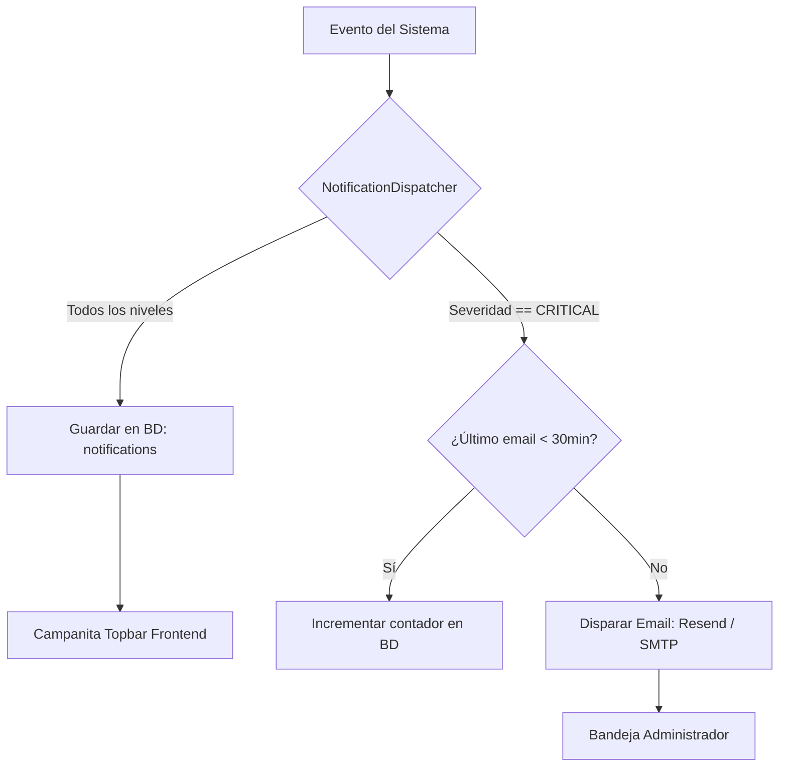

# ADR-034: Sistema de Notificaciones Proactivas (In-App y Correo)

## Estado
Aprobado

## Contexto
El funcionamiento continuo de SOLV depende de eventos críticos de infraestructura y academia que requieren atención oportuna: expiración próxima de certificados SSL/TLS wildcard, umbral de almacenamiento en disco superando el 85%, tokens de Google OAuth desactualizados, detección de caída masiva de contenedores o invitaciones de docentes a punto de expirar. Depender de que el administrador revise manualmente el dashboard introduce riesgos de interrupción no planificada. Es necesario un sistema proactivo con filtros anti-fatiga que despache alertas por dos canales según la severidad.

## Decisión
Diseñar un despachador de notificaciones (`NotificationDispatcher`) en el backend Go con dos canales diferenciados y reglas anti-saturación:

1. **Canal In-App (Campanita en Topbar):**
   - Registra todos los eventos informativos, de advertencia y de error en la tabla `notifications`.
   - Entregado al frontend mediante polling o eventos de interfaz.
2. **Canal de Correo Electrónico (Resend / SMTP Institucional):**
   - Reservado **únicamente para alertas críticas** del sistema:
     - Certificado TLS próximo a expirar (< 5 días para renovación ACME).
     - Disco del servidor con uso superior al 85%.
     - Caída masiva de servicios (más de 10 contenedores fallidos consecutivamente).
     - Estado de modo mantenimiento activado.
3. **Criterios Anti-Fatiga:**
   - Agrupación (Debounce): Alertas idénticas dentro de una ventana de 30 minutos se consolidan en una única notificación con contador de ocurrencias.
   - Límite diario de correos por tipo de evento para evitar saturar la bandeja de entrada del personal técnico.

## Diagrama de Flujo del Despachador de Notificaciones



## Esquema de Base de Datos (PostgreSQL 18)

```sql
CREATE TABLE IF NOT EXISTS notifications (
    id UUID PRIMARY KEY DEFAULT gen_random_uuid(),
    tenant_id UUID NOT NULL REFERENCES tenants(id) ON DELETE CASCADE,
    recipient_user_id UUID REFERENCES users(id) ON DELETE CASCADE,
    channel VARCHAR(20) NOT NULL DEFAULT 'in_app' CHECK (channel IN ('in_app', 'email', 'both')),
    severity VARCHAR(20) NOT NULL DEFAULT 'info' CHECK (severity IN ('info', 'warning', 'critical')),
    title VARCHAR(128) NOT NULL,
    message TEXT NOT NULL,
    event_type VARCHAR(64) NOT NULL,
    metadata JSONB DEFAULT '{}',
    is_read BOOLEAN NOT NULL DEFAULT FALSE,
    email_sent_at TIMESTAMPTZ,
    occurrence_count INT NOT NULL DEFAULT 1,
    created_at TIMESTAMPTZ NOT NULL DEFAULT NOW()
);

CREATE INDEX IF NOT EXISTS idx_notifications_recipient_unread 
ON notifications (recipient_user_id, is_read, created_at DESC);

CREATE INDEX IF NOT EXISTS idx_notifications_antifatigue 
ON notifications (tenant_id, event_type, created_at DESC);
```

## Endpoints HTTP

| Método | Ruta | Status Codes | Descripción |
| :--- | :--- | :--- | :--- |
| `GET` | `/api/v1/notifications` | `200 OK`, `401 Unauthorized` | Obtiene lista de notificaciones del usuario autenticado. |
| `PATCH` | `/api/v1/notifications/{id}/read` | `200 OK`, `404 Not Found` | Marca una notificación individual como leída. |
| `POST` | `/api/v1/notifications/read-all` | `200 OK` | Marca todas las notificaciones pendientes como leídas. |
| `GET` | `/api/v1/admin/notifications/system` | `200 OK`, `403 Forbidden` | Consulta de alertas globales de infraestructura para el admin. |

### Ejemplo de Payload de Notificación (`GET /api/v1/notifications`)
```json
{
  "id": "a0eebc99-9c0b-4ef8-bb6d-6bb9bd380a11",
  "severity": "critical",
  "title": "Espacio en Disco Crítico",
  "message": "El volumen de Docker en el servidor ha alcanzado el 87% de capacidad.",
  "event_type": "DISK_USAGE_HIGH",
  "is_read": false,
  "created_at": "2026-09-02T08:15:00Z"
}
```

## Componentes Angular Afectados

- `shared/components/notification-bell/notification-bell.component.ts`: Dropdown de notificaciones en el Topbar con contador de no leídas.
- `features/admin/notifications/system-alerts-view.component.ts`: Panel completo de alertas de infraestructura con filtrado por severidad.
- `core/services/notification.service.ts`: Servicio reactivo con Signals que mantiene la lista de alertas sincronizada.

## Relación con Otros ADRs

- **ADR-014 (Estrategia Operativa y Observabilidad):** Se alimenta de las métricas de Prometheus y contadores de fallos.
- **ADR-018 (Renovación TLS Wildcard):** Notifica anomalías en la renovación ACME de `desec.io`.
- **ADR-027 (Operabilidad B2B y Audit Logs):** Los despachos de alertas críticas quedan registrados como eventos de auditoría.

## Justificación Técnica

1. **Atención Oportuna:** Disminuye el tiempo medio de respuesta ante incidentes graves antes de que afecten a los estudiantes.
2. **Control Anti-Spam:** La ventana de debounce de 30 minutos previene la saturación de servidores de correo ante tormentas de alertas.
3. **Persistencia Transaccional:** El almacenamiento en PostgreSQL asegura que las alertas no se pierdan si se reinicia la interfaz web.

## Consecuencias / Impacto

- **Positivas:** Visibilidad en tiempo real de la salud del sistema y tranquilidad operativa para el equipo técnico.
- **Trade-offs:** Requiere configurar credenciales SMTP válidas o API Key de servicio de correo (Resend/AWS SES) en las variables de entorno del servidor.
