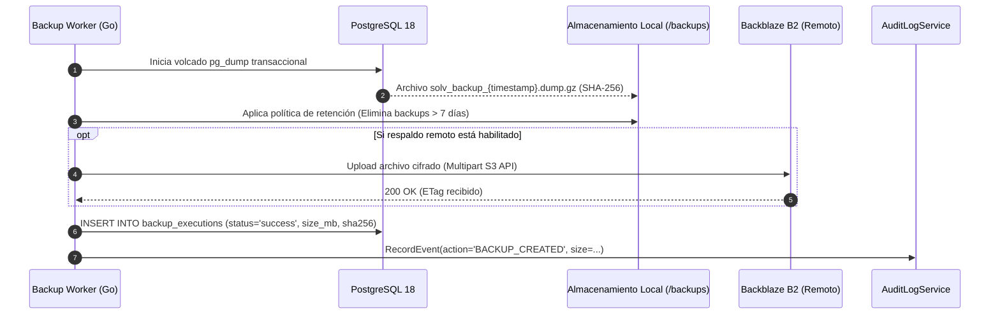

# ADR-035: Copias de Seguridad Configurables con Retención Local y Remota

## Estado
Aprobado

## Contexto
En despliegues institucionales B2B, la garantía de recuperación ante desastres y la integridad de las bases de datos de calificaciones son requisitos contractuales fundamentales. El servidor central Asus opera On-Premise, expuesto a fallos de hardware local o cortes de energía. Se requiere una estrategia de respaldo automatizada de dos niveles: una capa local rápida para restauraciones operativas y una capa remota secundaria (en almacenamiento S3 compatible de bajo costo como Backblaze B2) que preserve los datos ante fallos catastróficos del hardware físico.

## Decisión
Diseñar un subsistema de copias de seguridad configurable desde la interfaz de administración:

1. **Capa 1: Respaldo Local Automatizado:**
   - Ejecución mediante `pg_dump` con compresión en formato custom (`-Fc`).
   - Frecuencia configurable (por defecto cada 6 horas).
   - Política de retención local estricta de 7 días (rotación y eliminación automática de archivos antiguos).
2. **Capa 2: Respaldo Remoto Secundario (Opcional):**
   - Carga cifrada de los volcados hacia un bucket S3 compatible (Backblaze B2 / AWS S3).
   - Frecuencia configurable (diaria) con política de retención de 30 días.
3. **Gestión Administrativa:**
   - Tabla `backup_configs` para parametrizar credenciales, horarios y políticas.
   - Tabla `backup_executions` para registrar historial de copias, tamaño, hash SHA-256 y estado (exitoso / fallido).
   - Endpoint de restauración guiada con bloqueo de seguridad preventivo.

## Diagrama de Flujo del Proceso de Respaldo



## Esquema de Base de Datos (PostgreSQL 18)

```sql
CREATE TABLE IF NOT EXISTS backup_configs (
    id UUID PRIMARY KEY DEFAULT gen_random_uuid(),
    tenant_id UUID NOT NULL REFERENCES tenants(id) ON DELETE CASCADE,
    local_frequency_hours INT NOT NULL DEFAULT 6,
    local_retention_days INT NOT NULL DEFAULT 7,
    remote_enabled BOOLEAN NOT NULL DEFAULT FALSE,
    remote_provider VARCHAR(32) DEFAULT 'backblaze_b2',
    remote_bucket_name VARCHAR(128),
    remote_endpoint VARCHAR(256),
    remote_access_key VARCHAR(128),
    remote_secret_key_encrypted TEXT,
    remote_retention_days INT NOT NULL DEFAULT 30,
    is_active BOOLEAN NOT NULL DEFAULT TRUE,
    updated_at TIMESTAMPTZ NOT NULL DEFAULT NOW(),
    CONSTRAINT uk_tenant_backup_config UNIQUE (tenant_id)
);

CREATE TABLE IF NOT EXISTS backup_executions (
    id UUID PRIMARY KEY DEFAULT gen_random_uuid(),
    tenant_id UUID NOT NULL REFERENCES tenants(id) ON DELETE CASCADE,
    file_name VARCHAR(256) NOT NULL,
    file_size_bytes BIGINT NOT NULL,
    sha256_checksum VARCHAR(64) NOT NULL,
    storage_tier VARCHAR(20) NOT NULL CHECK (storage_tier IN ('local', 'remote', 'both')),
    status VARCHAR(20) NOT NULL CHECK (status IN ('in_progress', 'success', 'failed')),
    error_message TEXT,
    started_at TIMESTAMPTZ NOT NULL DEFAULT NOW(),
    completed_at TIMESTAMPTZ
);

CREATE INDEX IF NOT EXISTS idx_backup_executions_tenant 
ON backup_executions (tenant_id, started_at DESC);
```

## Endpoints HTTP

| Método | Ruta | Status Codes | Descripción |
| :--- | :--- | :--- | :--- |
| `GET` | `/api/v1/admin/backups/config` | `200 OK`, `401 Unauthorized` | Consulta la configuración actual de respaldos. |
| `PUT` | `/api/v1/admin/backups/config` | `200 OK`, `400 Bad Request` | Actualiza frecuencia, retención y credenciales S3. |
| `GET` | `/api/v1/admin/backups/history` | `200 OK` | Historial paginado de copias ejecutadas y tamaños. |
| `POST` | `/api/v1/admin/backups/run-now` | `202 Accepted`, `409 Conflict` | Dispara un respaldo manual inmediato. |
| `POST` | `/api/v1/admin/backups/{id}/restore` | `200 OK`, `403 Forbidden` | Inicia restauración controlada (requiere modo mantenimiento). |

### Ejemplo de Payload (`PUT /api/v1/admin/backups/config`)
```json
{
  "local_frequency_hours": 6,
  "local_retention_days": 7,
  "remote_enabled": true,
  "remote_provider": "backblaze_b2",
  "remote_bucket_name": "solv-uab-backups",
  "remote_endpoint": "https://s3.us-west-004.backblazeb2.com",
  "remote_access_key": "004a1b2c3d4e5f60000000001",
  "remote_secret_key": "K004SecretKeyValueStringHere",
  "remote_retention_days": 30
}
```

## Componentes Angular Afectados

- `features/admin/backups/backup-settings.component.ts`: Formulario de configuración de almacenamiento y frecuencias.
- `features/admin/backups/backup-history-table.component.ts`: Tabla con lista de respaldos, estado, peso en MB y botón de descarga.
- `features/admin/backups/components/restore-dialog.component.ts`: Modal de advertencia de restauración con verificación de hash SHA-256.

## Relación con Otros ADRs

- **ADR-001 (Estrategia Persistencia de Datos):** Complementa la persistencia de volúmenes con el resguardo de la base transaccional.
- **ADR-031 (Modo Mantenimiento Global):** Toda operación de restauración exige la activación previa del modo de mantenimiento.
- **ADR-027 (Operabilidad B2B y Audit Logs):** Registra los eventos de ejecución y descarga de respaldos.

## Justificación Técnica

1. **Rendimiento sin Bloqueos:** `pg_dump` genera respaldos consistentes sin bloquear las transacciones de lectura o escritura de los usuarios.
2. **Control de Almacenamiento Local:** La rotación a 7 días previene el llenado involuntario del disco NVMe del servidor Asus.
3. **Costo Marginal:** El almacenamiento remoto en Backblaze B2 representa un costo insignificante (~$0.005/GB/mes), garantizando tolerancia a fallos de hardware.

## Consecuencias / Impacto

- **Positivas:** Seguridad de datos de grado institucional y recuperación predecible ante contingencias.
- **Trade-offs:** La carga de backups remotos consume ancho de banda de red de salida durante los períodos de sincronización.
