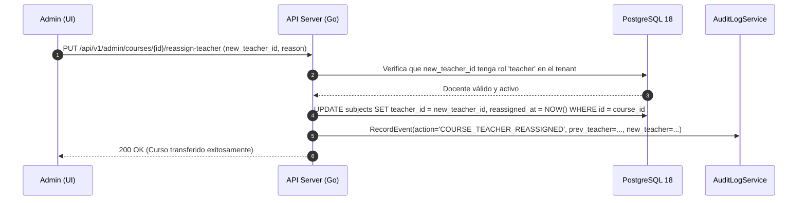

# ADR-036: Reasignación de Docentes y Gestión de Cursos Huérfanos

## Estado
Aprobado

## Contexto
En el ciclo de vida académico institucional ocurren desvinculaciones, renuncias, licencias o transferencias de docentes durante o entre semestres. Cuando un docente deja la institución, sus materias asociadas (`subjects`), ejercicios programados y entregas de estudiantes corren el riesgo de quedar en un estado huérfano sin un responsable que supervise el progreso o califique revisiones pendientes. El administrador requiere un mecanismo seguro para transferir la titularidad de los cursos a otro docente, archivar la materia o transferirla de período académico sin corromper la trazabilidad histórica de quién diseñó o calificó originalmente las entregas.

## Decisión
Implementar un protocolo administrativo de reasignación y auditoría de materias huérfanas:

1. **Opciones Administrativas Disponibles:**
   - **Reasignar Titularidad:** Cambiar el docente titular de la materia a un nuevo docente activo dentro del mismo tenant.
   - **Declarar Materia Huérfana y Archivar:** Marcar la materia con estado `orphan_archived` para congelar entregas y notificar a los estudiantes matriculados.
   - **Transferir Período Académico:** Mover la estructura de la materia hacia un nuevo período lectivo.
2. **Preservación Inmutable de Autoría:**
   - Las entregas previamente calificadas (`submissions`) mantendrán el identificador original de `graded_by` y el historial de override intactos.
   - La tabla `subjects` registrará `teacher_id` (titular actual), `original_teacher_id` (creador) y `reassigned_at`.
3. **Registro en Audit Logs:**
   - Toda reasignación genera un registro obligatorio en `audit_logs` con el motivo formal de la transferencia.

## Diagrama de Secuencia de Reasignación Docente



## Esquema de Base de Datos (PostgreSQL 18)

```sql
-- Extensión de la tabla subjects para trazabilidad de titularidad
ALTER TABLE subjects 
ADD COLUMN IF NOT EXISTS teacher_id UUID REFERENCES users(id) ON DELETE RESTRICT,
ADD COLUMN IF NOT EXISTS original_teacher_id UUID REFERENCES users(id) ON DELETE RESTRICT,
ADD COLUMN IF NOT EXISTS reassigned_at TIMESTAMPTZ,
ADD COLUMN IF NOT EXISTS reassign_reason TEXT;

CREATE INDEX IF NOT EXISTS idx_subjects_teacher_lookup 
ON subjects (tenant_id, teacher_id, status);
```

## Endpoints HTTP

| Método | Ruta | Status Codes | Descripción |
| :--- | :--- | :--- | :--- |
| `GET` | `/api/v1/admin/courses/orphaned` | `200 OK`, `401 Unauthorized` | Lista materias sin docente activo asignado. |
| `PUT` | `/api/v1/admin/courses/{id}/reassign-teacher` | `200 OK`, `400 Bad Request`, `404 Not Found` | Reasigna la titularidad a un nuevo docente. |
| `POST` | `/api/v1/admin/courses/{id}/orphan-archive` | `200 OK`, `400 Bad Request` | Marca el curso como huérfano y congela actividades. |

### Ejemplo de Payload (`PUT /api/v1/admin/courses/{id}/reassign-teacher`)
```json
{
  "new_teacher_id": "b1f8e123-9c0b-4ef8-bb6d-6bb9bd380a22",
  "reason": "Reemplazo por licencia médica del titular original durante el segundo parcial"
}
```

## Componentes Angular Afectados

- `features/admin/courses/orphaned-courses-view.component.ts`: Vista de detección y listado de materias sin docente responsable.
- `features/admin/courses/components/reassign-teacher-modal.component.ts`: Diálogo de selección de nuevo docente con buscador y campo de motivo.
- `features/teacher/dashboard/teacher-dashboard.component.ts`: Indicador visual si una materia asignada proviene de una reasignación.

## Relación con Otros ADRs

- **ADR-024 (Esquema Académico Multi-Tenant):** Mantiene la integridad referencial de asignaturas y alumnos matriculados.
- **ADR-025 (Invitaciones Docentes):** Permite vincular de inmediato nuevos docentes incorporados vía invitación con cursos pendientes.
- **ADR-027 (Operabilidad B2B y Audit Logs):** Asegura la auditoría legal ante cambios de evaluador académico.

## Justificación Técnica

1. **Continuidad del Servicio Educativo:** Impide que los estudiantes queden bloqueados en sus laboratorios si el profesor deja de prestar servicios.
2. **Trazabilidad Forense:** Preserva la autoría de calificaciones históricas evitando que la reasignación sobreescriba registros antiguos.
3. **Control Centralizado:** Permite al decanato o jefatura de carrera gestionar contingencias de personal en minutos.

## Consecuencias / Impacto

- **Positivas:** Resolución rápida de vacantes docentes sin pérdida de información de aula.
- **Trade-offs:** El nuevo docente asume la revisión de ejercicios y configuraciones diseñadas por el docente predecesor.
