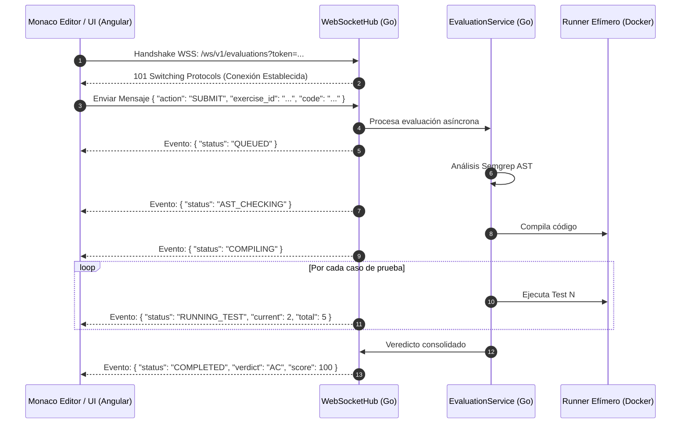

# ADR-037: Concentrador WebSocket para Evaluación del Juez Virtual

## Estado
Aprobado

## Contexto
El modelo actual de evaluación algorítmica procesa los envíos (`submissions`) mediante peticiones HTTP síncronas bloqueantes. Cuando una solución requiere compilarse, verificarse contra reglas Semgrep (AST) y ejecutarse contra múltiples casos de prueba secuenciales, el tiempo de respuesta HTTP puede extenderse entre 3 y 12 segundos. Durante este intervalo, la interfaz de usuario permanece en estado de espera genérico sin ofrecer visibilidad sobre qué fase del pipeline se está ejecutando, generando incertidumbre en el estudiante. Se requiere un canal bidireccional en tiempo real que transmita los micro-estados del pipeline de evaluación y permita actualizar la barra de progreso paso a paso.

## Decisión
Implementar un concentrador de WebSockets (`WebSocketHub`) en el backend Go (`delivery/http/websocket_handler.go`) para la transmisión de eventos de evaluación:

1. **Máquina de Estados de Evaluación en Tiempo Real:**
   - `QUEUED`: Envío recibido y encolado para procesamiento.
   - `AST_CHECKING`: Análisis estático de sintaxis y restricciones Semgrep.
   - `COMPILING`: Compilación del código fuente en el entorno efímero.
   - `RUNNING_TEST`: Ejecución individual por caso (`test_case_index` de `total_test_cases`).
   - `COMPLETED`: Evaluación finalizada con veredicto estructurado (`AC`, `WA`, `TLE`, `RE`, `AST_BLOCKED`).
   - `ERROR`: Fallo irrecuperable del runner o tiempo excedido del sistema.
2. **Arquitectura del Concentrador en Go:**
   - Manejo de conexiones concurrentes mediante goroutines y canales (`chan`).
   - Autenticación por token de sesión en el handshake inicial (validación de cookie `solv_session` o query param seguro).
   - Mecanismo de heartbeat/ping-pong cada 30 segundos para purga automática de conexiones inactivas (zombies).
3. **Consumo en Angular 22:**
   - Integración mediante `WebSocketSubject` de RxJS encapsulado en un servicio reactivo (`JudgeSocketService`) que expone Signals de estado para la UI.

## Diagrama de Secuencia de Evaluación Vía WebSocket



## Estructura de Mensajes JSON (Protocolo WS)

### Mensaje de Estado en Progreso (Backend -> Frontend)
```json
{
  "event": "EVALUATION_PROGRESS",
  "submission_id": "f47ac10b-58cc-4372-a567-0e02b2c3d479",
  "stage": "RUNNING_TEST",
  "data": {
    "current_test": 3,
    "total_tests": 8,
    "elapsed_ms": 420
  },
  "timestamp": "2026-09-02T10:30:01.420Z"
}
```

### Mensaje de Finalización (Backend -> Frontend)
```json
{
  "event": "EVALUATION_COMPLETED",
  "submission_id": "f47ac10b-58cc-4372-a567-0e02b2c3d479",
  "verdict": "AC",
  "score": 100,
  "execution_time_ms": 680,
  "memory_used_mb": 24,
  "test_results": [
    { "index": 1, "status": "PASS", "visible": true, "time_ms": 12 },
    { "index": 2, "status": "PASS", "visible": true, "time_ms": 15 },
    { "index": 3, "status": "PASS", "visible": false, "time_ms": 18 }
  ]
}
```

## Endpoints y Rutas

| Protocolo | Ruta | Descripción |
| :--- | :--- | :--- |
| `WSS` | `/ws/v1/evaluations` | Canal dúplex para transmisión de estados de evaluación algorítmica. |
| `POST` | `/api/v1/evaluations` | Mantenido como fallback HTTP síncrono para clientes con restricciones de red o proxy. |

## Componentes Angular Afectados

- `core/services/judge-socket.service.ts`: Wrapper de `WebSocketSubject` con reconexión automática y emisión de Signals.
- `features/student/judge/components/evaluation-progress/evaluation-progress.component.ts`: Barra de progreso animada paso a paso.
- `features/student/judge/components/verdicts-drawer/verdicts-drawer.component.ts`: Drawer desplegable con los resultados de casos de prueba.

## Relación con Otros ADRs

- **ADR-005 (Sistema Evaluación Juez Virtual Dual):** Añade la capa de comunicación en tiempo real sobre el motor existente.
- **ADR-010 (Arquitectura Evaluación Segura y Aislamiento):** Reporta los eventos emitidos durante la ejecución de los runners efímeros.
- **ADR-026 (Pre-chequeo AST con Semgrep):** Emite el estado intermedio `AST_CHECKING` previo a la compilación.

## Justificación Técnica

1. **Retroalimentación Inmediata:** Disminuye la percepción de latencia y proporciona claridad visual del avance de la calificación.
2. **Eficiencia de Recursos:** Elimina la necesidad de técnicas ineficientes de sondeo corto (Short Polling) HTTP.
3. **Compatibilidad:** Mantiene el endpoint HTTP existente como alternativa si el protocolo WebSocket es bloqueado por firewalls institucionales estrictos.

## Consecuencias / Impacto

- **Positivas:** Experiencia de usuario ágil y moderna, reduciendo la ansiedad del estudiante durante evaluaciones oficiales.
- **Trade-offs:** Exige mantener un mapa de conexiones activas en memoria dentro del backend Go y gestionar reconexiones ante cortes de red transitorios.
