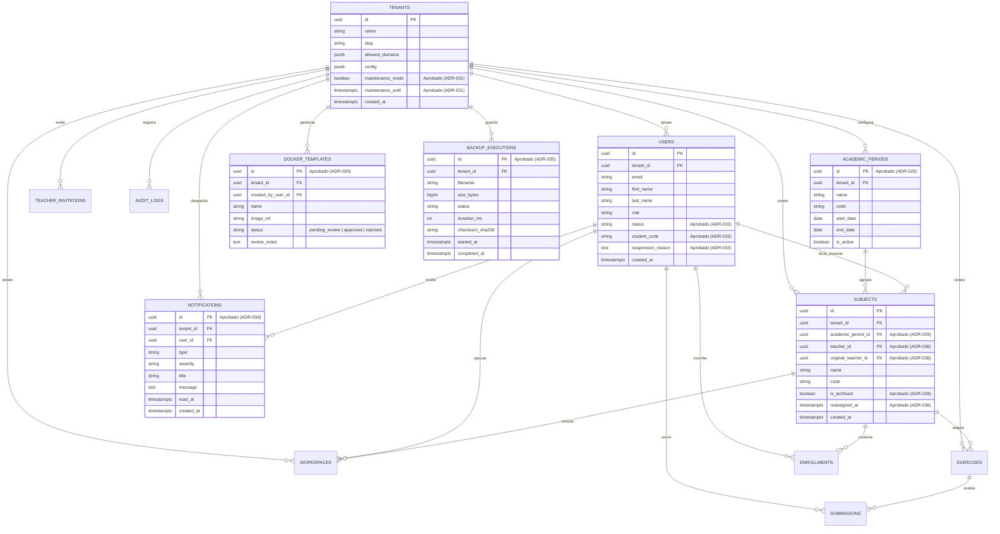

# Diseño de Base de Datos y Modelo Relacional — SOLV BaaS

Este documento define la estructura de la base de datos relacional PostgreSQL 18 del proyecto **SOLV**, distinguiendo con rigurosidad entre el **esquema actualmente implementado** en `postgres.go` y el **esquema aprobado pendiente de implementar** derivado de los ADRs (ADR-029 a ADR-037).

---

## 1. Diagrama Entidad-Relación Global (Mermaid ERD)



---

## 2. Esquema DDL Implementado (En Código Base `postgres.go`)

### 2.1 Tablas Base y Multi-Tenant
* **`tenants`**: Identidad del campus/cliente B2B (`id`, `name`, `slug`, `allowed_domains`, `config`, `created_at`).
* **`users`**: Usuarios y credenciales de acceso (`id`, `tenant_id`, `email`, `first_name`, `last_name`, `role`, `created_at`).
* **`templates`**: Plantillas globales de entorno (`id`, `name`, `docker_image`, `description`, `created_at`).
* **`workspaces`**: Instancias de OpenVSCode Server (`id`, `student_id`, `subject_id`, `status`, `type`, `container_id`, `access_url`, `memory_limit_mb`, `last_heartbeat_at`, `oom_strike_count`, `semgrep_audit`, `tenant_id`).
* **`exercises`**: Ejercicios del Juez Virtual (`id`, `subject_id`, `title`, `description`, `type`, `due_date`, `config`, `tenant_id`).
* **`subjects`**: Materias institucionales (`id`, `tenant_id`, `name`, `code`, `classroom_course_id`, `created_at`).
* **`enrollments`**: Matrícula estudiante-materia (`id`, `tenant_id`, `student_id`, `subject_id`, `enrolled_at`).
* **`submissions`**: Entregas procesadas por el juez (`id`, `tenant_id`, `exercise_id`, `student_id`, `workspace_id`, `code`, `verdict`, `ast_result`, `execution_time_ms`, `memory_used_mb`, `submitted_at`).
* **`teacher_invitations`**: Tokens de invitación docente (`id`, `tenant_id`, `token`, `email`, `used`, `expires_at`, `created_at`).
* **`audit_logs`**: Auditoría inmutable de eventos (`id`, `tenant_id`, `user_id`, `user_role`, `action`, `resource`, `resource_id`, `details`, `ip_address`, `status_code`, `created_at`).

---

## 3. Esquema DDL Aprobado Pendiente de Implementación (ADR-029 a ADR-037)

### 3.1 `academic_periods` (ADR-029)
```sql
CREATE TABLE IF NOT EXISTS academic_periods (
    id UUID PRIMARY KEY DEFAULT gen_random_uuid(),
    tenant_id UUID NOT NULL REFERENCES tenants(id) ON DELETE CASCADE,
    name VARCHAR(100) NOT NULL,
    code VARCHAR(50) NOT NULL,
    start_date DATE NOT NULL,
    end_date DATE NOT NULL,
    is_active BOOLEAN NOT NULL DEFAULT true,
    created_at TIMESTAMPTZ NOT NULL DEFAULT NOW(),
    CONSTRAINT uq_tenant_period_code UNIQUE(tenant_id, code)
);
```

### 3.2 `docker_templates` (ADR-030)
```sql
CREATE TABLE IF NOT EXISTS docker_templates (
    id UUID PRIMARY KEY DEFAULT gen_random_uuid(),
    tenant_id UUID NOT NULL REFERENCES tenants(id) ON DELETE CASCADE,
    created_by_user_id UUID NOT NULL REFERENCES users(id),
    name VARCHAR(150) NOT NULL,
    image_ref VARCHAR(255) NOT NULL,
    default_memory_mb INT NOT NULL DEFAULT 256,
    status VARCHAR(30) NOT NULL DEFAULT 'pending_review', -- pending_review, approved, rejected
    review_notes TEXT,
    reviewed_by_user_id UUID REFERENCES users(id),
    reviewed_at TIMESTAMPTZ,
    created_at TIMESTAMPTZ NOT NULL DEFAULT NOW()
);
```

### 3.3 `notifications` (ADR-034)
```sql
CREATE TABLE IF NOT EXISTS notifications (
    id UUID PRIMARY KEY DEFAULT gen_random_uuid(),
    tenant_id UUID NOT NULL REFERENCES tenants(id) ON DELETE CASCADE,
    user_id UUID NOT NULL REFERENCES users(id) ON DELETE CASCADE,
    type VARCHAR(50) NOT NULL,
    severity VARCHAR(20) NOT NULL DEFAULT 'info', -- info, warning, error, critical
    title VARCHAR(200) NOT NULL,
    message TEXT NOT NULL,
    read_at TIMESTAMPTZ,
    created_at TIMESTAMPTZ NOT NULL DEFAULT NOW()
);
CREATE INDEX IF NOT EXISTS idx_notifications_user_unread ON notifications(user_id) WHERE read_at IS NULL;
```

### 3.4 `backup_executions` y `backup_configs` (ADR-035)
```sql
CREATE TABLE IF NOT EXISTS backup_executions (
    id UUID PRIMARY KEY DEFAULT gen_random_uuid(),
    tenant_id UUID NOT NULL REFERENCES tenants(id) ON DELETE CASCADE,
    filename VARCHAR(255) NOT NULL,
    size_bytes BIGINT NOT NULL DEFAULT 0,
    status VARCHAR(30) NOT NULL, -- success, failed, in_progress
    duration_ms INT NOT NULL DEFAULT 0,
    checksum_sha256 VARCHAR(64),
    error_message TEXT,
    started_at TIMESTAMPTZ NOT NULL DEFAULT NOW(),
    completed_at TIMESTAMPTZ
);
```

### 3.5 Extensiones a Tablas Existentes (Alter Migrations)
```sql
-- ADR-031: Modo Mantenimiento
ALTER TABLE tenants ADD COLUMN IF NOT EXISTS maintenance_mode BOOLEAN NOT NULL DEFAULT false;
ALTER TABLE tenants ADD COLUMN IF NOT EXISTS maintenance_until TIMESTAMPTZ;

-- ADR-029 y ADR-036: Periodos y Reasignación en Materias
ALTER TABLE subjects ADD COLUMN IF NOT EXISTS academic_period_id UUID REFERENCES academic_periods(id);
ALTER TABLE subjects ADD COLUMN IF NOT EXISTS teacher_id UUID REFERENCES users(id);
ALTER TABLE subjects ADD COLUMN IF NOT EXISTS original_teacher_id UUID REFERENCES users(id);
ALTER TABLE subjects ADD COLUMN IF NOT EXISTS is_archived BOOLEAN NOT NULL DEFAULT false;
ALTER TABLE subjects ADD COLUMN IF NOT EXISTS reassigned_at TIMESTAMPTZ;

-- ADR-033: Gestión Administrativa de Estudiantes
ALTER TABLE users ADD COLUMN IF NOT EXISTS status VARCHAR(30) NOT NULL DEFAULT 'active'; -- active, suspended
ALTER TABLE users ADD COLUMN IF NOT EXISTS student_code VARCHAR(50);
ALTER TABLE users ADD COLUMN IF NOT EXISTS suspension_reason TEXT;
```
