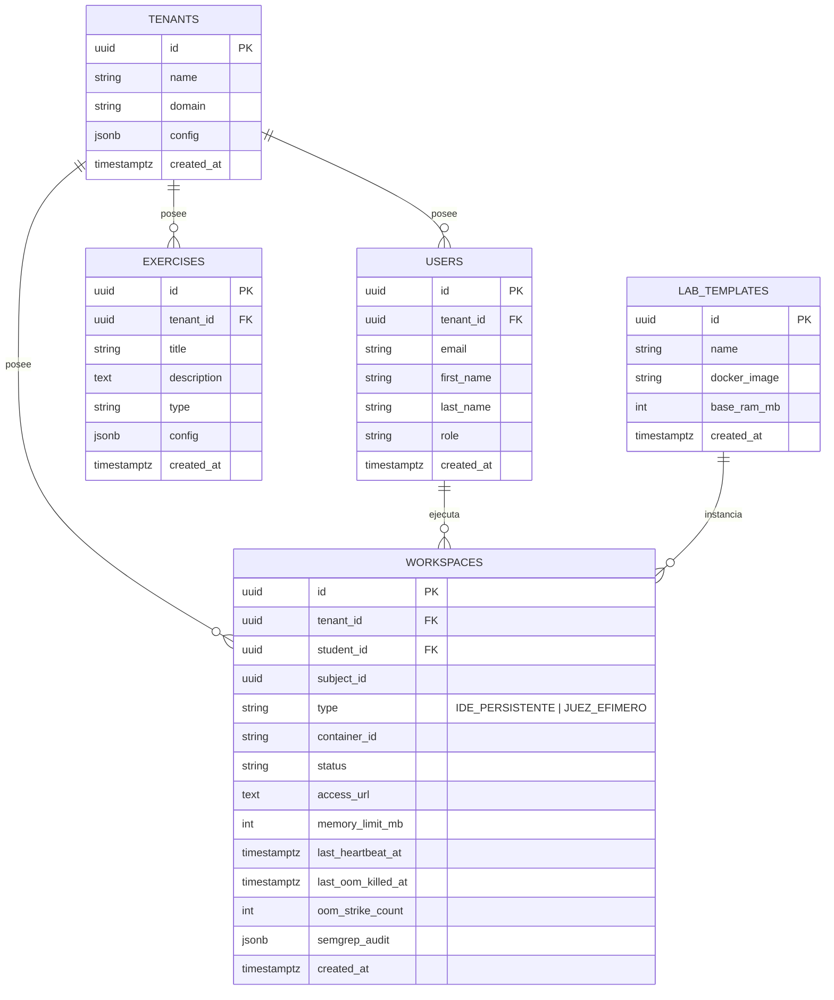

# Diseño de Base de Datos y Modelo Relacional — SOLV BaaS

Este documento define la estructura oficial de la base de datos relacional PostgreSQL 18 del proyecto **SOLV**, incorporando el aislamiento Multi-Tenant por discriminador y la unificación del modelo de workspaces.

---

## 1. Diagrama Entidad-Relación (ERD)



---

## 2. Esquema DDL en PostgreSQL (`postgres.go`)

```sql
CREATE TABLE IF NOT EXISTS tenants (
    id UUID PRIMARY KEY DEFAULT gen_random_uuid(),
    name VARCHAR(255) NOT NULL,
    domain VARCHAR(255) UNIQUE NOT NULL,
    config JSONB DEFAULT '{}'::jsonb,
    created_at TIMESTAMPTZ DEFAULT NOW(),
    updated_at TIMESTAMPTZ DEFAULT NOW()
);

CREATE TABLE IF NOT EXISTS users (
    id UUID PRIMARY KEY DEFAULT gen_random_uuid(),
    tenant_id UUID NOT NULL DEFAULT '00000000-0000-0000-0000-000000000001',
    email VARCHAR(255) UNIQUE NOT NULL,
    first_name VARCHAR(255) NOT NULL,
    last_name VARCHAR(255) NOT NULL,
    role VARCHAR(50) NOT NULL DEFAULT 'student',
    created_at TIMESTAMPTZ DEFAULT NOW(),
    updated_at TIMESTAMPTZ DEFAULT NOW()
);

CREATE TABLE IF NOT EXISTS workspaces (
    id UUID PRIMARY KEY DEFAULT gen_random_uuid(),
    tenant_id UUID NOT NULL DEFAULT '00000000-0000-0000-0000-000000000001',
    student_id UUID NOT NULL,
    subject_id UUID NOT NULL,
    type VARCHAR(50) NOT NULL DEFAULT 'IDE_PERSISTENTE',
    container_id VARCHAR(255),
    status VARCHAR(50) NOT NULL DEFAULT 'pending',
    access_url TEXT NOT NULL DEFAULT '',
    memory_limit_mb INT NOT NULL DEFAULT 256,
    last_heartbeat_at TIMESTAMPTZ DEFAULT NOW(),
    last_oom_killed_at TIMESTAMPTZ,
    oom_strike_count INT NOT NULL DEFAULT 0,
    semgrep_audit JSONB DEFAULT '{}'::jsonb,
    created_at TIMESTAMPTZ DEFAULT NOW(),
    updated_at TIMESTAMPTZ DEFAULT NOW()
);
```

> [!NOTE]
> La tabla legacy `lab_instances` ha sido eliminada por completo mediante la migración idempotente de consolidación D3 (`DROP TABLE IF EXISTS lab_instances CASCADE`).
