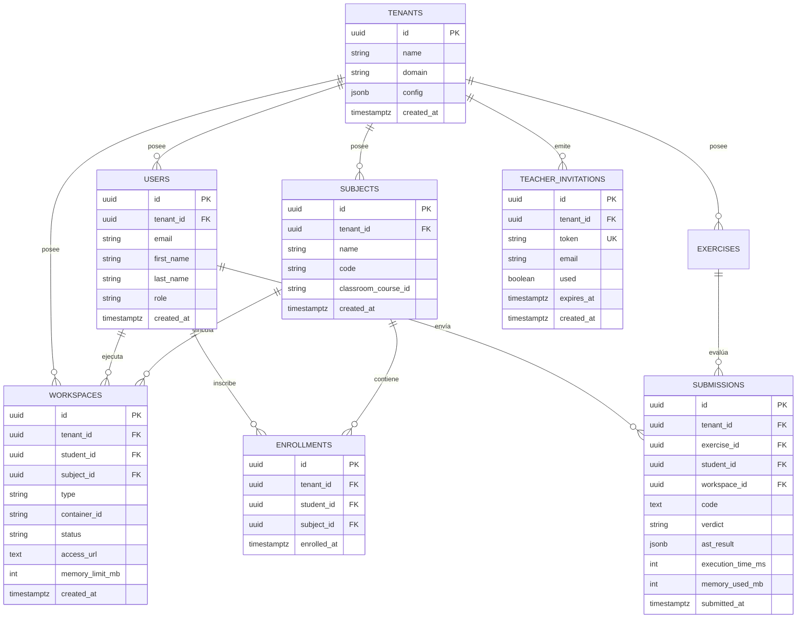

# Diseño de Base de Datos y Modelo Relacional — SOLV BaaS

Este documento define la estructura oficial de la base de datos relacional PostgreSQL 18 del proyecto **SOLV**, incorporando el aislamiento Multi-Tenant por discriminador, la unificación del modelo de workspaces y el esquema académico (Slice 9 / CRIT-02).

---

## 1. Diagrama Entidad-Relación (ERD)



---

## 2. Esquema DDL en PostgreSQL (`postgres.go`)

```sql
CREATE TABLE IF NOT EXISTS tenants (
    id UUID PRIMARY KEY DEFAULT gen_random_uuid(),
    name VARCHAR(255) NOT NULL,
    domain VARCHAR(255) UNIQUE NOT NULL,
    config JSONB DEFAULT '{}'::jsonb,
    created_at TIMESTAMPTZ DEFAULT NOW(),
    updated_at TIMESTAMPTZ DEFAULT NOW()
);

CREATE TABLE IF NOT EXISTS users (
    id UUID PRIMARY KEY DEFAULT gen_random_uuid(),
    tenant_id UUID NOT NULL DEFAULT '00000000-0000-0000-0000-000000000001',
    email VARCHAR(255) UNIQUE NOT NULL,
    first_name VARCHAR(255) NOT NULL,
    last_name VARCHAR(255) NOT NULL,
    role VARCHAR(50) NOT NULL DEFAULT 'student',
    created_at TIMESTAMPTZ DEFAULT NOW(),
    updated_at TIMESTAMPTZ DEFAULT NOW()
);

CREATE TABLE IF NOT EXISTS subjects (
    id UUID PRIMARY KEY DEFAULT gen_random_uuid(),
    tenant_id UUID NOT NULL REFERENCES tenants(id) ON DELETE RESTRICT,
    name VARCHAR(255) NOT NULL,
    code VARCHAR(50) NOT NULL,
    classroom_course_id VARCHAR(255),
    created_at TIMESTAMPTZ DEFAULT NOW(),
    updated_at TIMESTAMPTZ DEFAULT NOW()
);

CREATE TABLE IF NOT EXISTS exercises (
    id UUID PRIMARY KEY DEFAULT gen_random_uuid(),
    tenant_id UUID NOT NULL REFERENCES tenants(id) ON DELETE RESTRICT,
    title VARCHAR(255) NOT NULL,
    description TEXT,
    type VARCHAR(50) NOT NULL DEFAULT 'algorithm',
    config JSONB NOT NULL DEFAULT '{}'::jsonb, -- Contiene test_cases con inputs/outputs (SENSIBLE: NO exponer a rol student, usar ExercisePublicResponse DTO - CRIT-03)
    created_at TIMESTAMPTZ DEFAULT NOW()
);

CREATE TABLE IF NOT EXISTS enrollments (
    id UUID PRIMARY KEY DEFAULT gen_random_uuid(),
    tenant_id UUID NOT NULL REFERENCES tenants(id) ON DELETE RESTRICT,
    student_id UUID NOT NULL REFERENCES users(id) ON DELETE CASCADE,
    subject_id UUID NOT NULL REFERENCES subjects(id) ON DELETE CASCADE,
    enrolled_at TIMESTAMPTZ DEFAULT NOW(),
    CONSTRAINT unique_enrollment_per_tenant UNIQUE (tenant_id, student_id, subject_id)
);

CREATE TABLE IF NOT EXISTS workspaces (
    id UUID PRIMARY KEY DEFAULT gen_random_uuid(),
    tenant_id UUID NOT NULL DEFAULT '00000000-0000-0000-0000-000000000001',
    student_id UUID NOT NULL,
    subject_id UUID NOT NULL REFERENCES subjects(id) ON DELETE RESTRICT,
    type VARCHAR(50) NOT NULL DEFAULT 'IDE_PERSISTENTE',
    container_id VARCHAR(255),
    status VARCHAR(50) NOT NULL DEFAULT 'pending',
    access_url TEXT NOT NULL DEFAULT '',
    memory_limit_mb INT NOT NULL DEFAULT 256,
    last_heartbeat_at TIMESTAMPTZ DEFAULT NOW(),
    last_oom_killed_at TIMESTAMPTZ,
    oom_strike_count INT NOT NULL DEFAULT 0,
    semgrep_audit JSONB DEFAULT '{}'::jsonb,
    created_at TIMESTAMPTZ DEFAULT NOW(),
    updated_at TIMESTAMPTZ DEFAULT NOW()
);

CREATE TABLE IF NOT EXISTS submissions (
    id UUID PRIMARY KEY DEFAULT gen_random_uuid(),
    tenant_id UUID NOT NULL REFERENCES tenants(id) ON DELETE RESTRICT,
    exercise_id UUID NOT NULL REFERENCES exercises(id) ON DELETE CASCADE,
    student_id UUID NOT NULL REFERENCES users(id) ON DELETE CASCADE,
    workspace_id UUID REFERENCES workspaces(id) ON DELETE SET NULL,
    code TEXT NOT NULL DEFAULT '',
    verdict VARCHAR(50) NOT NULL, -- AC, WA, TLE, RE, CE, AST_VIOLATION, AST_BLOCKED
    ast_result JSONB DEFAULT '{}'::jsonb, -- Almacena violaciones del pre-chequeo Semgrep (has_violations, violations[])
    execution_time_ms INT NOT NULL DEFAULT 0,
    memory_used_mb INT NOT NULL DEFAULT 0,
    submitted_at TIMESTAMPTZ DEFAULT NOW()
);

CREATE TABLE IF NOT EXISTS teacher_invitations (
    id UUID PRIMARY KEY DEFAULT gen_random_uuid(),
    tenant_id UUID NOT NULL REFERENCES tenants(id) ON DELETE RESTRICT,
    token VARCHAR(255) UNIQUE NOT NULL,
    email VARCHAR(255) NOT NULL,
    used BOOLEAN DEFAULT FALSE,
    expires_at TIMESTAMPTZ NOT NULL,
    created_at TIMESTAMPTZ DEFAULT NOW()
);

-- Índices de Rendimiento y Filtrado Tenant
CREATE INDEX IF NOT EXISTS idx_subjects_tenant ON subjects(tenant_id);
CREATE INDEX IF NOT EXISTS idx_submissions_tenant ON submissions(tenant_id);
CREATE INDEX IF NOT EXISTS idx_submissions_exercise ON submissions(exercise_id);
CREATE INDEX IF NOT EXISTS idx_enrollments_student ON enrollments(student_id);
```
