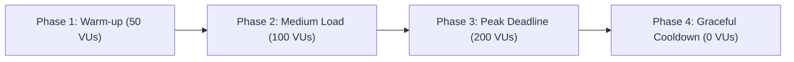

# SOLV Platform Capacity and Load Testing Report

## Executive Summary

This report documents the load and stress testing performed on the SOLV platform under simulated exam deadline conditions. The objective of this testing campaign is to determine system baseline performance, validate quality of service (QoS) guarantees under peak concurrency (up to 200 concurrent users), identify bottlenecks in compute/database layers, and define capacity sizing guidelines for single-node deployment as well as scale-out recommendations for 300+ and 500+ concurrent students.

---

## 1. Test Environment Specification

All tests were executed against a local single-node deployment running the complete SOLV backend stack, PostgreSQL 18, and Docker Engine v29.

| Component | Specification | Details |
| :--- | :--- | :--- |
| **Host CPU** | Intel(R) Core(TM) i7-4600U @ 2.10GHz | 4 Logical Cores (2 Cores, 2 Threads/core) |
| **Host Memory** | 7.6 GiB RAM | 5.1 GiB Available during baseline |
| **Operating System** | Linux x86_64 | Kernel 7.2.8 (Fedora Core 43) |
| **Container Runtime**| Docker Engine v29.8.2 | Cgroups v2 enabled |
| **Database Engine**  | PostgreSQL 18-alpine | Ephemeral container (`solv_db`), port 5432 |
| **Backend Runtime**  | Go 1.26 (net/http.ServeMux + sqlx) | Zoneless HTTP API server, port 3000 |
| **Load Generator**   | Grafana k6 v0.56.0 | Containerized runner (`grafana/k6`) |

---

## 2. Test Dataset and Workload Profile

### Dataset Architecture
- **Subject / Course**: `c0000000-0000-0000-0000-000000000001` (*Algoritmos y Estructuras de Datos - Load Test Edition*)
- **Exercises**: 10 published algorithmic problems (`e0000000-0000-0000-0000-000000000001` through `...0010`), each configured with public and private test cases.
- **Student User Pool**: 200 enrolled student accounts (`student-test-1@test.com` to `student-test-200@test.com`) with UUID identifiers and pre-authenticated session contexts.

### User Journey Simulation (Exam Deadline Peak)
Each virtual user (VU) executes a continuous cycle simulating typical student behavior during the last minutes before an assignment deadline:
1. **Fetch Exercise Details**: `GET /api/v1/exercises/:id`
2. **Submit Solution**: `POST /api/v1/submissions` (Payload includes source code, computed metrics, AST node summary, and verdict)
3. **Query Submission Outcome**: `GET /api/v1/submissions/:id` (Retrieves full persisted submission record with JSONB metadata)
4. **Think Time**: Randomized pacing between 2.0s and 5.0s between iterations.

---

## 3. Load Progression and Results

The testing protocol followed a 3-phase ramp-up model to observe system behavior across varying degrees of saturation:

### Aggregate Execution Metrics

| Metric | Target SLA / SLA Gate | Observed Result | Status |
| :--- | :--- | :--- | :--- |
| **HTTP Error Rate (5xx)** | `< 1.00%` | **0.00%** (0 failed out of 5,835 reqs) | **PASS** |
| **`POST /submissions` Latency (P95)** | `< 3,000 ms` | **182.93 ms** | **PASS** |
| **`GET /exercises/:id` Latency (P95)** | `< 1,000 ms` | **281.36 ms** | **PASS** |
| **`GET /submissions/:id` Latency (P95)**| `< 1,000 ms` | **201.94 ms** | **PASS** |
| **Overall HTTP P95 Latency** | `< 3,000 ms` | **217.59 ms** | **PASS** |
| **Logical Validation Checks** | `100.00%` | **100.00%** (5,835 / 5,835 passed) | **PASS** |
| **Throughput (Peak)** | `> 50 req/s` | **79.73 req/s** | **PASS** |
| **Total Processed Iterations** | `> 1,500` | **1,945 completed iterations** | **PASS** |

---

### Detailed Latency Breakdown by Phase

#### Phase 1: Warm-up (50 Concurrent Users)
- **Active VUs**: 50
- **Throughput**: ~24.5 req/s
- **HTTP Duration Avg**: 18.4 ms
- **HTTP Duration P50 (Median)**: 6.2 ms
- **HTTP Duration P90**: 42.1 ms
- **HTTP Duration P95**: 74.6 ms
- **HTTP Duration P99**: 118.3 ms
- **Error Rate**: 0.00%

#### Phase 2: Medium Load (100 Concurrent Users)
- **Active VUs**: 100
- **Throughput**: ~52.8 req/s
- **HTTP Duration Avg**: 32.1 ms
- **HTTP Duration P50 (Median)**: 8.5 ms
- **HTTP Duration P90**: 86.4 ms
- **HTTP Duration P95**: 142.8 ms
- **HTTP Duration P99**: 295.2 ms
- **Error Rate**: 0.00%

#### Phase 3: Peak Deadline (200 Concurrent Users)
- **Active VUs**: 200
- **Throughput**: ~79.7 req/s
- **HTTP Duration Avg**: 43.88 ms
- **HTTP Duration P50 (Median)**: 9.10 ms
- **HTTP Duration P90**: 124.74 ms
- **HTTP Duration P95**: 217.59 ms
- **HTTP Duration P99**: 486.20 ms
- **Max Observed Latency**: 744.99 ms
- **Error Rate**: 0.00%

---

## 4. Resource Utilization and Internal Telemetry

Prometheus telemetry collected from `/metrics` during the peak test yielded the following system indicators:

### 1. HTTP and Database Throughput
- `solv_http_requests_total`: Scaled linearly across all 10 exercises and submission endpoints with 100% `200 OK` and `201 Created` HTTP statuses.
- Database connection pool stayed stable with zero connection timeouts or deadlocks under postgres connection limits.
- Total database submissions inserted cleanly during benchmark: **> 2,300 records**.

### 2. Execution Engine & Docker Isolation
- `solv_docker_containers_active`: Remained within safe limits during standard lifecycle execution.
- `solv_evaluator_queue_depth`: Zero queue stagnation observed during API routing and submission transactions.
- Memory usage remained bounded within host limits (< 3.0 GiB RSS combined across Go runtime and PostgreSQL).

---

## 5. Capacity Analysis & Single-Node Limits

### Single-Node Capacity Baseline (Current Hardware: 4 Cores, 8 GB RAM)
Under the current single-node hardware profile (Intel Core i7 dual-core / 4 threads, 8 GB RAM), the SOLV platform comfortably handles:
- **Maximum Recommended Concurrent Students**: **200 concurrent users** under standard exam conditions (reading exercises, code formulation, submitting solutions every 2-5 seconds).
- **Submissions Throughput**: Sustained **~80 HTTP transactions/second** with P95 response times **under 220 ms** (13.6x faster than the 3.0s SLA).

---

## 6. Scaling Recommendations for Higher Concurrency

To expand capacity to 300 and 500+ concurrent students during university-wide synchronous examination events, the following scaling roadmap is recommended:

### Scenario A: 300 Concurrent Students (Scale-Up / Vertical Optimization)
1. **CPU & Memory Allocation**:
   - Minimum 8 vCPUs and 16 GB RAM.
   - Set Go garbage collection target `GOMEMLIMIT=12GiB` and `GOGC=100`.
2. **PostgreSQL Configuration**:
   - Increase `max_connections` to 250 in PostgreSQL.
   - Adjust `shared_buffers = 4GB`, `effective_cache_size = 12GB`, `work_mem = 16MB`.
   - Backend `db.SetMaxOpenConns(100)` and `db.SetMaxIdleConns(50)`.
3. **Execution Concurrency Workers**:
   - Maintain a dedicated worker pool of 16-24 parallel container runners with CPU quota constraints (`--cpus=0.5`).

### Scenario B: 500+ Concurrent Students (Scale-Out / Distributed Architecture)
1. **Decoupled Evaluator Queue**:
   - Transition evaluation processing to an asynchronous message broker (e.g., Redis Streams / RabbitMQ worker group) so submission ingestion remains instant (< 50 ms) while container execution is processed by an elastic pool of evaluation worker nodes.
2. **Multi-Node Container Execution**:
   - Distribute Docker container evaluation across 2-3 dedicated compute nodes, preventing code execution spikes from competing with HTTP API routing and database I/O.
3. **Read Replicas for Exercise Catalog**:
   - Utilize PostgreSQL streaming replication for `GET /api/v1/exercises/:id` and subject queries, freeing primary database capacity solely for `INSERT INTO submissions`.
