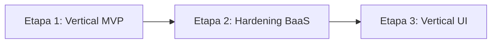

# Metodología de Desarrollo Dirigido por Slices — SOLV BaaS

Este documento define la metodología oficial de ingeniería de software utilizada en la construcción de la plataforma **SOLV**.

---

## Las 3 Etapas del Proyecto

### 1. Etapa 1: Vertical MVP (Slices 1–7)
Construcción de la columna vertebral y prototipo funcional funcional extremo a extremo (Backend en Go nativo, Docker SDK, Traefik v3, PostgreSQL, OpenVSCode Server y análisis AST con Semgrep).

### 2. Etapa 2: Hardening BaaS & Seguridad Perimetral (Slices 8–11)
Fortalecimiento de infraestructura On-Premise, blindaje Zero Trust del host (`DOCKER-USER`), aislamiento Multi-Tenant por discriminador `tenant_id`, autenticación perimetral ForwardAuth con cookie HttpOnly cross-subdomain, control de admisión de memoria, límites de procesos, resiliencia y optimización de recursos.

### 3. Etapa 3: Vertical UI & Experiencia de Usuario (Slices 12–14)
Construcción de la interfaz gráfica en Angular 22, componentes de dashboard estudiantil y docente, integración de `iframes` de laboratorios y paneles de administración de inquilinos.
