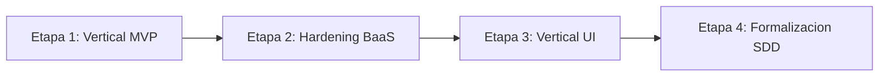
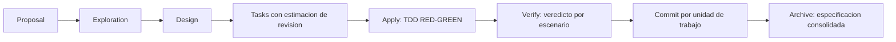

# Metodología de Ingeniería — SOLV BaaS

Este documento define la metodología oficial de ingeniería de software utilizada en la construcción de la plataforma **SOLV**, y describe su evolución desde la especificación por Rebanadas Verticales hasta la formalización del ciclo Spec-Driven Development (SDD).

---

## Principio Rector

**Especificar antes de construir, verificar después de construir.** Ninguna unidad de trabajo comienza sin un diseño técnico previo y un criterio de verificación definido; ninguna se cierra sin evidencia de pruebas ejecutadas. La herramienta cambia entre etapas; el principio no.

---

## Las 4 Etapas del Proyecto

```mermaid
graph LR
    E1[Etapa 1: Vertical MVP] --> E2[Etapa 2: Hardening BaaS]
    E2 --> E3[Etapa 3: Vertical UI]
    E3 --> E4[Etapa 4: Formalizacion SDD]
```

### Etapa 1: Vertical MVP (Slices 1–7)

Construcción de la columna vertebral y prototipo funcional extremo a extremo (Backend en Go nativo, Docker SDK, Traefik v3, PostgreSQL, OpenVSCode Server y análisis AST con Semgrep).

### Etapa 2: Hardening BaaS y Seguridad Perimetral (Slices 8–11)

Fortalecimiento de infraestructura On-Premise, blindaje Zero Trust del host (`DOCKER-USER`), aislamiento Multi-Tenant por discriminador `tenant_id`, autenticación perimetral ForwardAuth con cookie HttpOnly cross-subdomain, control de admisión de memoria, límites de procesos, resiliencia y optimización de recursos.

### Etapa 3: Vertical UI y Experiencia de Usuario (Slices 12–16)

Construcción de la interfaz gráfica en Angular 22, componentes de dashboard estudiantil y docente, integración de `iframes` de laboratorios, paneles de administración de inquilinos, notificaciones proactivas y respaldos institucionales.

### Etapa 4: Formalización del Proceso SDD (Cambios de endurecimiento post-MVP)

Al cerrar el MVP, los cambios restantes ya no eran funciones nuevas sino endurecimientos de comportamiento existente (validación fail-closed, persistencia de verificación de integridad, tipografía white-label). Este tipo de cambio exige trazabilidad estricta: qué se prometió, qué se implementó, qué se verificó y qué comportamiento queda vigente. Para satisfacerlo, el proceso de especificación por slices se formalizó con la herramienta **OpenSpec** (`openspec/`), que materializa el mismo ciclo de ingeniería en documentos estandarizados y consolida las decisiones de comportamiento como especificaciones de capacidad reutilizables.

**Justificación de la evolución:** la especificación por slices resolvió la construcción del producto, pero sus documentos eran lineales y de un solo uso: no distinguían entre el comportamiento vigente del sistema y el registro histórico de cómo se llegó a él. OpenSpec introduce esa separación (`specs/` vigente vs `changes/archive/` histórico) y añade una verificación formal con veredicto por cambio. La metodología no cambió; se instrumentó.

---

## Correspondencia entre Slices y OpenSpec

La siguiente tabla demuestra que ambas etapas del proceso siguen el mismo ciclo de ingeniería, con distinto soporte documental:

| Momento del ciclo | Etapa 1–3: Documento por Slice | Etapa 4: Artefacto OpenSpec |
|---|---|---|
| Problema y objetivo | `01-OBJETIVO.md` | `proposal.md` |
| Análisis previo | Diagramas dentro del diseño técnico | `exploration.md` |
| Diseño de la solución | `02-TECHNICAL_DESIGN.md` | `design.md` (incluye decisiones descartadas y su porqué) |
| Contrato de comportamiento | `03-DOCUMENTATION.md` / contratos de API | `specs/<capacidad>/spec.md` (escenarios Given/When/Then) |
| Descomposición del trabajo | Backlog interno del slice | `tasks.md` (fases RED/GREEN, unidades de revisión) |
| Construcción | Implementación del slice | Aplicación de tareas con TDD estricto |
| Verificación | `04-VERIFICACION_TESTS.md` (evidencia de suites) | `verify-report.md` (veredicto formal por escenario) |
| Cierre y trazabilidad | `00-MAPA_SLICES.md` + ADR | `archive-report.md` (change archivado con fecha) |

Las **Architecture Decision Records (ADRs)** atraviesan las cuatro etapas: toda decisión de arquitectura o base de datos se registra en `docs/ARQUITECTURA/ADR/` con entrada en el índice, independiente del mecanismo de especificación vigente.

---

## Ciclo de Trabajo con OpenSpec

Cada cambio de comportamiento post-MVP sigue este ciclo, cuyo detalle operativo (comandos de prueba obligatorios, umbrales de revisión, reglas de archivo) reside en [`openspec/config.yaml`](../../openspec/config.yaml):

```mermaid
graph LR
    P[Proposal] --> X[Exploration]
    X --> D[Design]
    D --> T[Tasks con estimacion de revision]
    T --> A[Apply: TDD RED-GREEN]
    A --> V[Verify: veredicto por escenario]
    V --> C[Commit por unidad de trabajo]
    C --> AR[Archive: especificacion consolidada]
```

### Reglas del ciclo

1. **Proposal antes de código.** Todo cambio declara alcance, capacidades afectadas, riesgos y plan de reversión.
2. **TDD estricto en la aplicación.** Primero la prueba que falla (RED), después la implementación que la hace pasar (GREEN), con evidencia registrada por tarea.
3. **Presupuesto de revisión.** Cada unidad de trabajo se mantiene por debajo de 400 líneas cambiadas; los cambios grandes se dividen en PRs encadenados (`chained PRs`).
4. **Verificación formal.** El `verify-report` emite veredicto (PASS / PASS WITH WARNINGS / FAIL) escenario por escenario; un cambio con bloqueadores no se archiva.
5. **Commits por unidad de trabajo.** Cada commit representa una unidad entregable con su prueba incluida, según [`CONVENCIONES.md`](CONVENCIONES.md).
6. **Archivo con consolidación.** Al cerrar, el change se mueve a `openspec/changes/archive/<fecha>-<nombre>/` y sus deltas de especificación se consolidan en `openspec/specs/`, que queda como descripción vigente del sistema.

### Dónde mirar según lo que se busca

| Pregunta del lector | Carpeta | Ejemplo |
|---|---|---|
| Qué es y cómo funciona el sistema hoy | `docs/` | ADRs, modelo de BD, contratos de API, wireframes |
| Qué comportamiento debe cumplir una capacidad | `openspec/specs/` | `backup-config-validation`, `maintenance-activation` |
| Cómo se construyó y verificó un cambio concreto | `openspec/changes/` (y `archive/`) | `fix-respaldo-corrupto` con su ciclo completo |
| Qué decisiones de arquitectura tomé y por qué | `docs/ARQUITECTURA/ADR/` | ADR-035 (respaldos), ADR-040 (verificación) |
