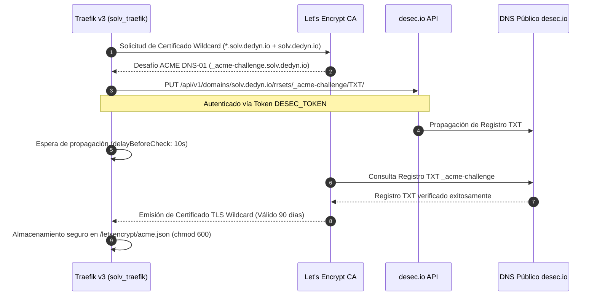

# Diseño Técnico — Slice 10: TLS Wildcard & Container Hardening

## Flujo de Validación ACME DNS-01 con desec.io



## Arquitectura de Aislamiento de Contenedores (Hardening)

```text
+-----------------------------------------------------------------------+
|                              HOST ASUS                                |
|                                                                       |
|  +------------------------+          +-----------------------------+  |
|  |   Contenedores IDE     |          |  Contenedores Juez (BD/Lang)|  |
|  | (openvscode-server)    |          |   (ephemeral execution)     |  |
|  +------------------------+          +-----------------------------+  |
|  | - SecurityOpt:         |          | - SecurityOpt:              |  |
|  |   no-new-privileges:true|          |   no-new-privileges:true    |  |
|  | - User: "1000:1000"    |          | - Memory & CPU Caps         |  |
|  | - Seccomp default      |          | - Seccomp default           |  |
|  | - Network: solv_net    |          | - Network: none (sin red)   |  |
|  +------------------------+          +-----------------------------+  |
+-----------------------------------------------------------------------+
```
