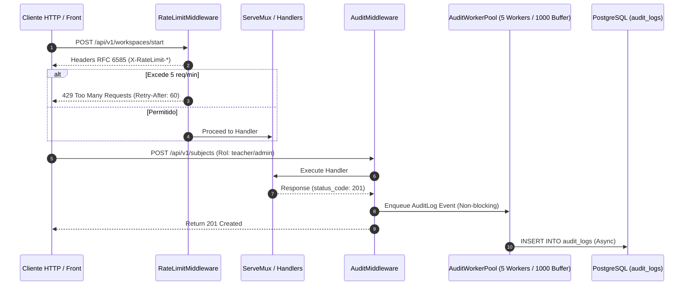

# Diseño Técnico — Slice 11: Operabilidad B2B & Backups

## Arquitectura de Audit Worker Pool & Middlewares

```mermaid
sequenceDiagram
    autonumber
    participant Client as Cliente HTTP / Front
    participant RateLimiter as RateLimitMiddleware
    participant Router as ServeMux / Handlers
    participant AuditMW as AuditMiddleware
    participant WorkerPool as AuditWorkerPool (5 Workers / 1000 Buffer)
    participant DB as PostgreSQL (audit_logs)

    Client->>RateLimiter: POST /api/v1/workspaces/start
    RateLimiter-->>Client: Headers RFC 6585 (X-RateLimit-*)
    alt Excede 5 req/min
        RateLimiter-->>Client: 429 Too Many Requests (Retry-After: 60)
    else Permitido
        RateLimiter->>Router: Proceed to Handler
    end

    Client->>AuditMW: POST /api/v1/subjects (Rol: teacher/admin)
    AuditMW->>Router: Execute Handler
    Router-->>AuditMW: Response (status_code: 201)
    AuditMW->>WorkerPool: Enqueue AuditLog Event (Non-blocking)
    AuditMW-->>Client: Return 201 Created
    WorkerPool->>DB: INSERT INTO audit_logs (Async)
```
