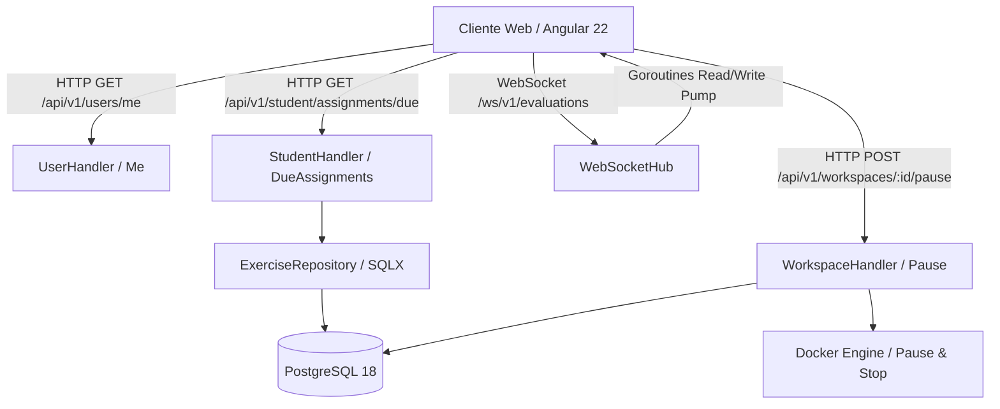

# Diseño Técnico — SLICE 12: Experiencia Estudiante y Juez en Tiempo Real

## 1. Arquitectura de Componentes

## 2. Componentes Implementados en Backend

### 2.1 Identidad del Usuario (`UserHandler.GetMe`)
- Resuelve la identidad a partir del header `X-User-Id` (inyectado tras ForwardAuth o JWT).
- Retorna el DTO con `id`, `email`, `first_name`, `last_name`, `full_name`, `role` y `tenant_id`.

### 2.2 Entregas Próximas (`StudentHandler.GetDueAssignments`)
- Consulta materias en las que el estudiante está inscrito (`enrollments`).
- Filtra ejercicios con `due_date > NOW()` y los ordena ascendentemente por proximidad de entrega.
- Retorna `exercise_id`, `title`, `description`, `subject_id`, `subject_name`, `subject_code`, `due_date`, `type`.

### 2.3 Pausa Manual de Workspaces (`WorkspaceHandler.PauseWorkspace`)
- Detiene el contenedor OpenVSCode Server liberando RAM en el host.
- Actualiza el estado en base de datos a `hibernated`.
- Aplica control de acceso (solo el dueño del workspace o roles docente/admin pueden pausar).

### 2.4 Concentrador WebSocket para el Juez (`WebSocketHub` & `WebSocketHandler` — ADR-037)
- Handshake con validación de token JWT en query param, header o cookie `solv_session`.
- Control de conexiones con goroutines `readPump` y `writePump`.
- Heartbeat cada 25s con deadline de 60s para desalojo de clientes zombies.
- Emisión de micro-estados durante la evaluación: `QUEUED`, `AST_CHECKING`, `COMPILING`, `RUNNING_TEST`, `COMPLETED`, `ERROR`.

## 3. Estado del Incremento
- **Backend:** Implementado y verificado.
- **Frontend:** Pendiente de integración.
