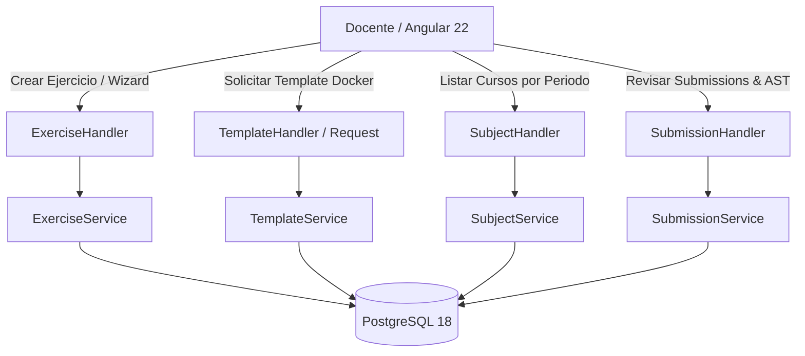

# Diseño Técnico — SLICE 13: Experiencia Docente, Cursos y Creación de Laboratorios

## 1. Arquitectura de Dominio y Flujo

## 2. Componentes Funcionales

### 2.1 Gestión y Creación de Ejercicios (Wizard)
- Formulario de creación de ejercicios algorítmicos y de base de datos.
- Configuración de casos de prueba visibles y secretos (`is_hidden: true`).
- Reglas AST personalizadas por ejercicio (Semgrep YAML).

### 2.2 Solicitud de Plantillas Docker Personalizadas (ADR-030)
- El docente puede proponer una nueva plantilla Docker con nombre, tags y límites de recursos recomendados.
- Estado inicial: `pending_review` (bloqueado para uso de alumnos hasta aprobación por admin).

### 2.3 Filtrado por Periodos Académicos (ADR-029)
- Selector de periodo académico activo en el header docente.
- Listado segregado de cursos activos y archivados (`is_archived: true`).

### 2.4 Cola de Revisión de Entregas y Auditoría AST
- Tablero de entregas recibidas con veredictos (`AC`, `WA`, `TLE`, `RE`, `AST_BLOCKED`).
- Capacidad de anulación y calificación manual (`POST /api/v1/submissions/{id}/override`).

## 3. Estado del Incremento
- **Backend:** Parcialmente estructurado (modelos base listos, endpoints de templates y periodos pendientes).
- **Frontend:** Pendiente de implementación.
