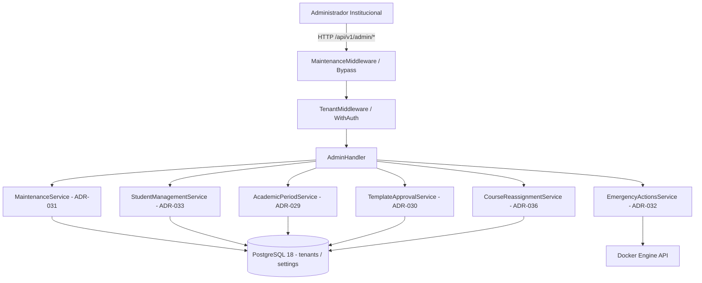

# Diseño Técnico — SLICE 14: Panel Administrador Institucional

## 1. Arquitectura de Control y Middleware

## 2. Bloques Funcionales del Administrador

### 2.1 Modo Mantenimiento Global (ADR-031)
- `MaintenanceMiddleware` intercepta tráfico HTTP.
- Si el tenant está en mantenimiento (`tenants.maintenance_mode = true`), retorna `503 Service Unavailable` a estudiantes y docentes con cabecera `Retry-After`.
- Exclusiones (Bypass): Rol `admin`, rutas `/api/v1/auth/*`, `/api/v1/admin/*` y `/api/v1/config/public`.

### 2.2 Cinco Acciones de Emergencia (ADR-032)
1. **Evicción Masiva de Contenedores:** Detiene y elimina contenedores activos liberando RAM.
2. **Purga de Conexiones DB:** Ejecuta `pg_terminate_backend` para conexiones no administradoras.
3. **Invalidación de Sesiones:** Revoca tokens y cookies de sesión forzando re-autenticación.
4. **Reseteo de Penalizaciones OOM:** Limpia los 3 strikes de estudiantes bloqueados.
5. **Reinicio Seguro del Servicio:** Forzado de ciclo graceful sin pérdida de estado en volúmenes.
- Exige confirmación tipada (`confirmation_phrase`) y genera registro en `audit_logs`.

### 2.3 Gestión de Estudiantes (ADR-033)
- Búsqueda y filtrado por nombre, correo y código de estudiante.
- Consulta de workspaces activos, strikes OOM y reinicio puntual de entorno.
- Suspensión y reactivación administrativa con motivo tipificado.

### 2.4 Periodos Académicos y Archivado de Cursos (ADR-029)
- CRUD de periodos (`name`, `code`, `start_date`, `end_date`, `is_active`).
- Archivado masivo o individual de materias al cierre del semestre.

### 2.5 Aprobación de Plantillas Docker (ADR-030)
- Bandeja de revisión de plantillas enviadas por docentes.
- Acciones: Aprobar (`approved`), Rechazar con observaciones (`rejected`).

### 2.6 Reasignación de Docentes para Cursos Huérfanos (ADR-036)
- Detección de materias sin docente activo (usuario deshabilitado o eliminado).
- Reasignación a nuevo docente conservando el historial de entregas e inscripciones.

## 3. Estado del Incremento
- **Backend:** Planificado.
- **Frontend:** Planificado.
