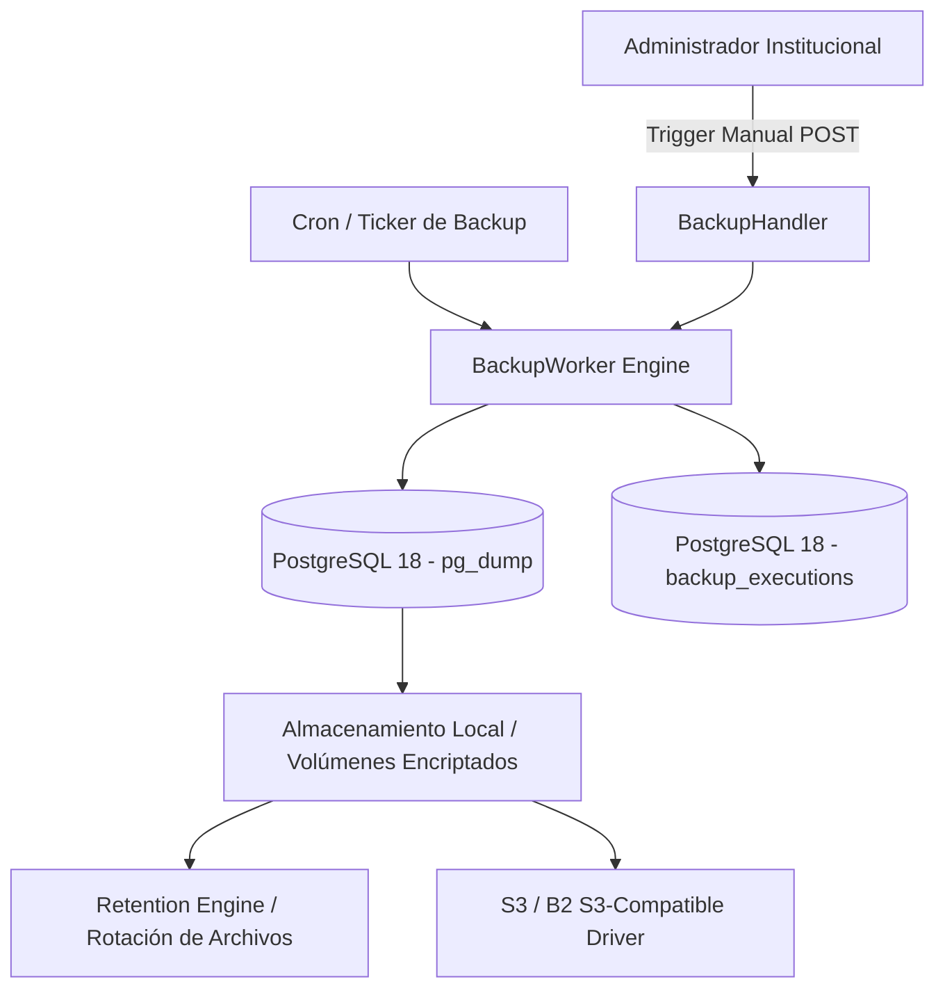

# Diseño Técnico — SLICE 16: Backups y Retención Institucional

## 1. Arquitectura del Motor de Backups

## 2. Componentes y Reglas de Retención

### 2.1 Ejecución y Formato del Respaldo
- Volcado consistente de esquemas y datos mediante `pg_dump` con compresión `.tar.gz` o custom format `.dump`.
- Registro detallado en tabla `backup_executions` (`id`, `tenant_id`, `filename`, `size_bytes`, `status`, `duration_ms`, `checksum_sha256`, `started_at`, `completed_at`).

### 2.2 Política de Retención y Purgado
- Regla de retención local configurable (por defecto: últimos 7 respaldos diarios + 4 semanales).
- Eliminación segura y automática de archivos obsoletos para evitar agotamiento de almacenamiento en el servidor Asus.

### 2.3 Sincronización Remota (Opcional)
- Envío opcional a bucket compatible S3 (AWS S3 o Backblaze B2) con cifrado en reposo.

## 3. Estado del Incremento
- **Backend:** Planificado.
- **Frontend:** Planificado.
