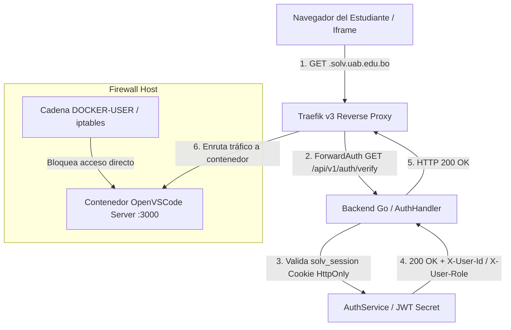

# Diseño Técnico: Hardening BaaS y Modelo Unificado — Slice 8

Este documento describe la arquitectura detallada, modelos de datos, flujos de datos y componentes implementados durante el **Slice 8**.

---

## 1. Arquitectura de Componentes de Seguridad y Enrutamiento



---

## 2. Multi-Tenancy Lógico (`tenant_id`)

### Modelo de Datos Relacional (PostgreSQL)

Todas las tablas principales incorporan el discriminador de inquilino:

```sql
ALTER TABLE workspaces ADD COLUMN IF NOT EXISTS tenant_id UUID NOT NULL DEFAULT '00000000-0000-0000-0000-000000000001';
ALTER TABLE users ADD COLUMN IF NOT EXISTS tenant_id UUID NOT NULL DEFAULT '00000000-0000-0000-0000-000000000001';
ALTER TABLE exercises ADD COLUMN IF NOT EXISTS tenant_id UUID NOT NULL DEFAULT '00000000-0000-0000-0000-000000000001';

CREATE INDEX IF NOT EXISTS idx_workspaces_tenant_id ON workspaces(tenant_id);
```

### Middleware de Aislamiento en Go (`middleware.go`)

```go
func TenantMiddleware(next http.Handler) http.Handler {
    return http.HandlerFunc(func(w http.ResponseWriter, r *http.Request) {
        tenantID := r.Header.Get("X-Tenant-ID")
        if tenantID == "" {
            tenantID = "00000000-0000-0000-0000-000000000001" // Default Tenant
        }
        ctx := context.WithValue(r.Context(), "tenant_id", tenantID)
        next.ServeHTTP(w, r.WithContext(ctx))
    })
}
```

---

## 3. Autenticación Perimetral ForwardAuth (`solv_session`)

### Configuración Dinámica de Traefik v3 ([infra/traefik/dynamic_conf.yml](file:///home/alvarorivera/Documentos/Desarrollo/SOLV_PG/infra/traefik/dynamic_conf.yml))

```yaml
http:
  middlewares:
    solv-forwardauth:
      forwardAuth:
        address: "http://solv_backend:3000/api/v1/auth/verify"
        trustForwardHeader: true
        authResponseHeaders:
          - "X-User-Id"
          - "X-User-Role"
```

### Flujo de Callback Google SSO y SetCookie

```go
cookie := &http.Cookie{
    Name:     "solv_session",
    Value:    tokenString,
    Path:     "/",
    Domain:   os.Getenv("COOKIE_DOMAIN"),
    HttpOnly: true,
    Secure:   true,
    SameSite: http.SameSiteLaxMode,
    MaxAge:   86400,
}
http.SetCookie(w, cookie)
```

---

## 4. Unificación de Workspaces (`type` Discriminator)

### Esquema de la Tabla `workspaces`

```sql
CREATE TABLE IF NOT EXISTS workspaces (
    id UUID PRIMARY KEY DEFAULT gen_random_uuid(),
    student_id UUID NOT NULL,
    subject_id UUID NOT NULL,
    type VARCHAR(50) NOT NULL DEFAULT 'IDE_PERSISTENTE',
    container_id VARCHAR(255),
    status VARCHAR(50) NOT NULL DEFAULT 'pending',
    access_url TEXT NOT NULL DEFAULT '',
    memory_limit_mb INT NOT NULL DEFAULT 256,
    last_heartbeat_at TIMESTAMPTZ DEFAULT NOW(),
    last_oom_killed_at TIMESTAMPTZ,
    oom_strike_count INT NOT NULL DEFAULT 0,
    semgrep_audit JSONB DEFAULT '{}'::jsonb,
    created_at TIMESTAMPTZ DEFAULT NOW(),
    updated_at TIMESTAMPTZ DEFAULT NOW()
);
```

---

## 5. Script de Aislamiento de Red `DOCKER-USER`

El script [infra/firewall/docker-user-rules.sh](file:///home/alvarorivera/Documentos/Desarrollo/SOLV_PG/infra/firewall/docker-user-rules.sh) configura la cadena `DOCKER-USER` en Linux:

```bash
#!/usr/bin/env bash
iptables -F DOCKER-USER
iptables -A DOCKER-USER -i eth0 -p tcp --dport 5432 -j DROP
iptables -A DOCKER-USER -j RETURN
```
