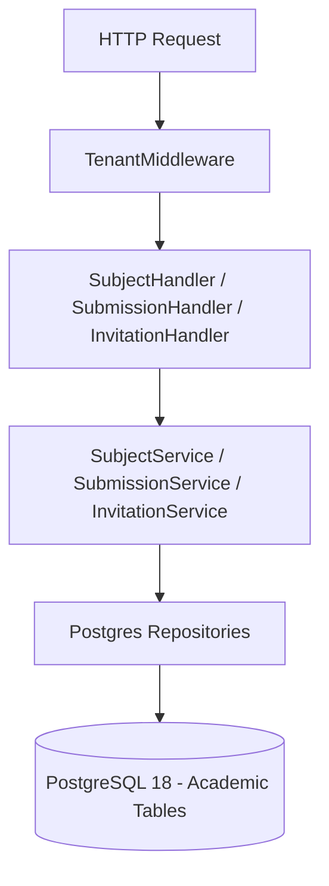

# Diseño Técnico — SLICE 9: Esquema Académico Completo

## 1. Arquitectura de Dominio e Infraestructura
El Slice 9 implementa el modelo de datos académico relacional garantizando aislamiento multi-tenant por discriminador `tenant_id`:

## 2. Componentes Implementados

### 2.1 Tablas y Relaciones DDL (`postgres.go`)
- `subjects`: materias asociadas a cada tenant.
- `enrollments`: inscripciones de alumnos en materias (`UNIQUE(tenant_id, student_id, subject_id)`).
- `submissions`: entregas enviadas al Juez Virtual (con veredictos, métricas y AST).
- `teacher_invitations`: tokens de un solo uso para otorgar rol `teacher`.
- `fk_workspaces_subject`: vinculación relacional entre `workspaces` y `subjects`.

### 2.2 Reglas de Negocio
- **Invitaciones Docentes**: Aceptación transaccional (`AcceptInvitationTx`) que valida coincidencia de correo electrónico y marca el token como usado atómicamente.
- **Filtrado de Submissions por Rol**: El rol `student` sólo puede consultar sus propias entregas; los roles `teacher` y `admin` consultan todas las entregas del ejercicio para su tenant.
- **Google Classroom (D6)**: Endpoint `GET /api/v1/classroom/import` para la importación manual unidireccional de nóminas.
