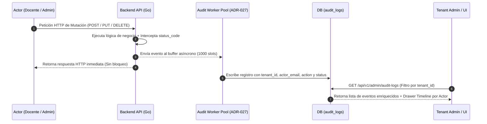

# Vista 3: Registro de Auditoría y Trazabilidad (Audit Logs)

> **Especificación Oficial de Interfaz, Componentes y Wireframes**  
> **Rol:** Administrador de Institución (Tenant Admin)  
> **Gobernanza:** SDD / Docs-as-Code / SOLV Design System / ADR-027  

---

## 1. Diagrama de Arquitectura de Auditoría (Mermaid Visual HD)



---

## 2. Especificación Visual de Componentes e Iconografía Lucide

- **Traducción Semántica de Verbos HTTP (Event Enrichment):**
  - `POST`: Expresado como `"Creación"` con icono `lucide:plus-circle` e indicador `201 Created` en verde (`#16A34A`).
  - `PUT`: Expresado como `"Actualización"` con icono `lucide:edit-2` e indicador `200 OK` en azul/neutro (`#2563EB`).
  - `DELETE`: Expresado como `"Eliminación"` con icono `lucide:trash-2` e indicador `200 OK` o `403 Forbidden` en rojo (`#DC2626`).
- **Navegación Off-Canvas Drawer:** Icono `lucide:panel-right-open` para desplegar la cronología exclusiva de un docente seleccionado.

---

## 3. Diagrama ASCII Técnico — Tabla General y Off-Canvas Drawer Timeline

```text
┌──────────────────────────────────────────────────────────────────────────────────────────────────┐
│ SOLV | Universidad Adventista de Bolivia                                     [lucide:bell] Admin │
├──────────────┬───────────────────────────────────────────────────────────────────────────────────┤
│              │ REGISTRO DE AUDITORÍA Y TRAZABILIDAD (Audit Logs — ADR-027)                      │
│ [ ] Inicio   │ Buscador: [ Buscar evento...       ] Filtros: [Acción: Todas v] [Actor v] [Fecha v]│
│ [ ] Docentes │ ┌───────────────────────────────────────────────────────────────────────────────┐ │
│ [*] AuditLogs│ │ Timestamp │ Actor (Docente/Admin) │ Acción Enriquecida │ Recurso │ Status │ Ver │ │
│ [ ] Ajustes  │ ├───────────┼───────────────────────┼────────────────────┼─────────┼────────┼─────┤ │
│              │ │ 14:15:00  │ admin@uab.edu.bo      │ Actualización Cuotas│ Tenant │ 200 OK │ [>] │ │
│              │ │ 13:42:12  │ mhamilton@uab.edu.bo  │ Creación Materia   │ Prog.II │ 201 Crd│ [>] │ │
│              │ │ 09:11:05  │ alovelace@uab.edu.bo  │ Eliminación Lab    │ Lab #04 │ 403 Den│ [>] │ │
│              │ └───────────────────────────────────────────────────────────────────────────────┘ │
│              │ Página 1 de 245 [Siguiente >]                                                     │
└──────────────┴───────────────────────────────────────────────────────────────────────────────────┘

===================== OFF-CANVAS DRAWER TIMELINE (Disparado al hacer clic en [>]) ====================
┌──────────────────────────────────────────────────────────────────────────────────────────────────┐
│ Cronología de Actividad: Margaret Hamilton (mhamilton@uab.edu.bo)                            [X] │
├──────────────────────────────────────────────────────────────────────────────────────────────────┤
│ (o) Hoy 13:42:12 ── Creó la materia 'Programación II' [ 201 Created ]                            │
│  |                                                                                               │
│ (o) Ayer 16:20:00 ─ Publicó el Laboratorio #04: Estructuras Avanzadas [ 200 OK ]                 │
│  |                                                                                               │
│ (o) 20-Ago 11:05:10 ─ Anuló veredicto del alumno Carlos Ruiz a 'AC' [ 200 OK ]                    │
│                        Motivo: 'Criterio parcial aceptado en algoritmo'                          │
└──────────────────────────────────────────────────────────────────────────────────────────────────┘
```

---

## 4. Justificación Técnica y de UX

1. **Event Enrichment (ADR-027 / CRIT-11):** Traduce URLs y rutas técnicas de API a eventos legibles en lenguaje humano (`"Creación de Materia"`, `"Eliminación de Lab"`), abstrayendo la complejidad de red.
2. **Resolución de Identidades Institucionales:** Muestra los nombres y correos reales de los profesores en lugar de UUIDs de base de datos (`550e8400...`), permitiendo al administrador auditar la actividad de su universidad al instante.
3. **Off-Canvas Drawer Timeline:** Permite al administrador aislar la cronología completa de interacciones de un profesor sospechoso sin salir de la tabla general ni perder el contexto de búsqueda.

---

## 5. Inventario de Componentes Angular a Construir

| Componente | Tipo / Rol | Ubicación en Código |
|---|---|---|
| `AuditLogsGrid` | Tabla principal de eventos de auditoría | `features/admin/audit-logs/` |
| `AuditTimelineDrawer` | Panel lateral flotante con la cronología del usuario | `features/admin/audit-logs/components/` |
| `EnrichedEventBadge` | Badge con icono y traducción semántica de acción HTTP | `shared/ui/badges/` |
