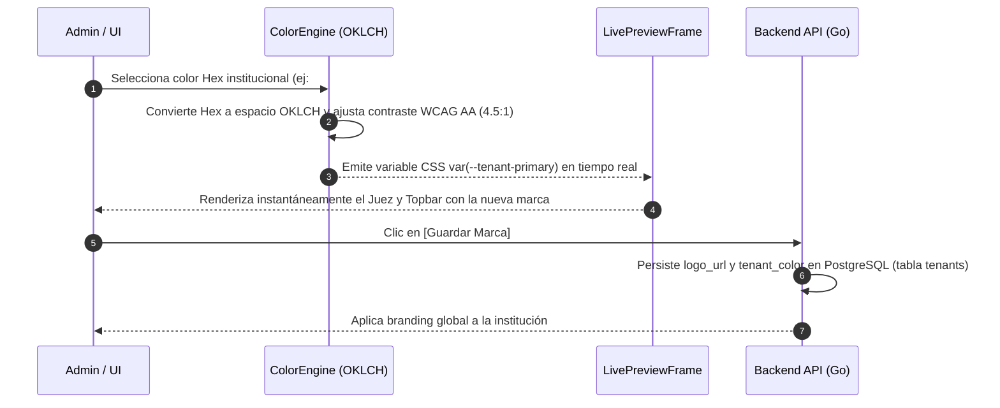

# Vista 4: Personalización White-Label y Ajustes (Branding e Identidad)

> **Especificación Oficial de Interfaz, Componentes y Wireframes**  
> **Rol:** Administrador de Institución (Tenant Admin)  
> **Gobernanza:** SDD / Docs-as-Code / SOLV Design System / OKLCH Engine / ADR-022 / ADR-024  

---

## 1. Diagrama de Arquitectura de Personalización (Mermaid Visual HD)



---

## 2. Especificación Visual de Componentes e Iconografía Lucide

- **Selector de Archivo de Logo:** Zona *Drag and Drop* con icono `lucide:upload-cloud` para archivos `.png` o `.svg` con vista previa de miniatura.
- **Selector de Color Perceptual (OKLCH):** Input de color con badge de validación de contraste `lucide:check-circle` que garantiza el cumplimiento de la norma WCAG AA (mínimo 4.5:1 sobre texto plano).
- **Control de Sincronización Google Classroom:** Píldora con icono `lucide:link-2` para configurar la clave de API y Scopes OAuth (ADR-022 / D6).

---

## 3. Diagrama ASCII Técnico — Personalización White-Label en Split-Screen

```text
┌──────────────────────────────────────────────────────────────────────────────────────────────────┐
│ SOLV | Personalización e Identidad de la Institución                     [lucide:bell] Admin     │
├──────────────┬───────────────────────────────────────────────────────────────────────────────────┤
│              │ PANEL DE CONFIGURACIÓN (50%)              │ VISTA PREVIA EN VIVO (50% Live Preview)│
│ [ ] Inicio   │ ┌───────────────────────────────────────┐ │ ┌───────────────────────────────────┐ │
│ [ ] Docentes │ │ 1. LOGO DE LA INSTITUCIÓN             │ │ │ SOLV | UAB          [lucide:bell] │ │
│ [ ] AuditLogs│ │ [lucide:upload] Arrastrar logo (.png) │ │ ├───────────────────────────────────┤ │
│ [*] Ajustes  │ │ Archivo actual: logo_uab_hd.png       │ │ │ JUEZ VIRTUAL                        │ │
│              │ ├───────────────────────────────────────┤ │ │ [ AC ] Accepted  (Color: #2563EB)   │ │
│              │ │ 2. NOMBRE DE LA UNIVERSIDAD           │ │ │ [ Enviar Solución a Evaluación ]  │ │
│              │ │ [ Univ. Adventista de Bolivia       ] │ │ └───────────────────────────────────┘ │
│              │ ├───────────────────────────────────────┤ │ Nota: Cualquier cambio en la izquierda│ │
│              │ │ 3. COLOR PRIMARIO DE LA MARCA         │ │ se refleja instantáneamente aquí.     │ │
│              │ │ Color Hex: [ #2563EB ] (Azul UAB)     │ │                                       │ │
│              │ │ Motor OKLCH: Contraste 4.5:1 (WCAG AA)│ │                                       │ │
│              │ └───────────────────────────────────────┘ │                                       │ │
│              │ [ Cancelar Cambios ] [ Guardar Marca ]    │                                       │ │
└──────────────┴───────────────────────────────────────────┴───────────────────────────────────────┘
```

---

## 4. Justificación Técnica y de UX

1. **Layout Split-Screen con Live Preview:** Elimina la fricción de guardar y recargar la página. El administrador modifica el color o el logo en la izquierda y observa el resultado en la vista previa del Juez Virtual a la derecha de forma instantánea.
2. **Motor de Color Perceptual OKLCH (WCAG AA):** A diferencia de HSL o RGB (que no tienen uniformidad perceptual), OKLCH ajusta la luminosidad matemáticamente para asegurar que el texto sea siempre legible (contraste mínimo de 4.5:1) independientemente del color que elija la universidad.
3. **Persistencia Multi-Tenant (`var(--tenant-primary)`):** Los valores guardados actualizan dinámicamente el tema CSS del tenant sin alterar el código fuente de la plataforma.

---

## 5. Inventario de Componentes Angular a Construir

| Componente | Tipo / Rol | Ubicación en Código |
|---|---|---|
| `WhiteLabelConfigurator` | Contenedor Split-Screen de personalización | `features/admin/settings/` |
| `OklchColorPicker` | Selector de color con motor de contraste WCAG AA | `shared/ui/color-picker/` |
| `LivePreviewEmulators` | Marco dinámico que simula el Juez y el Dashboard en vivo | `features/admin/settings/components/` |
| `LogoUploader` | Componente Drag and Drop para subida de logos institucionales | `shared/ui/uploaders/` |
