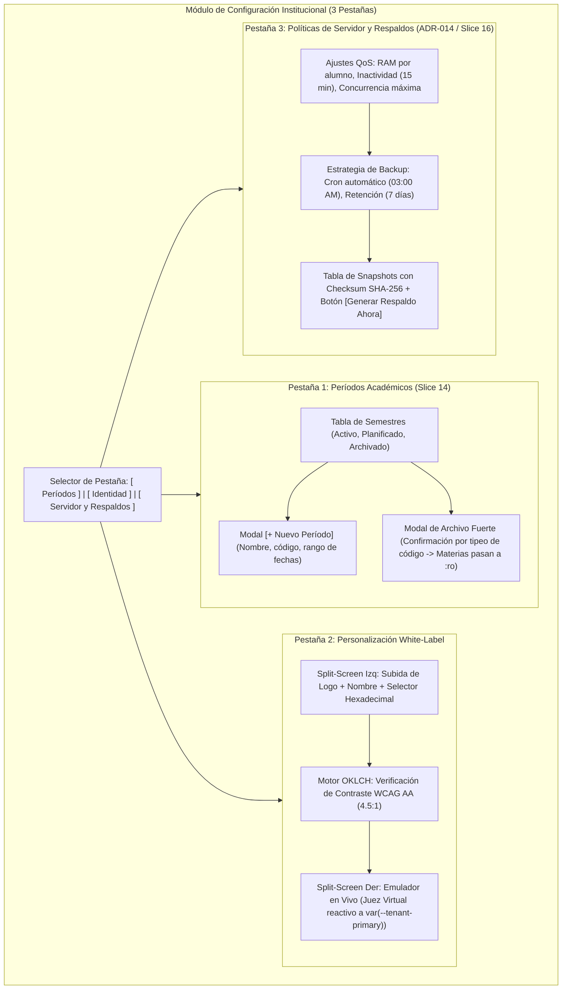

# Vista 4: Configuración Institucional (Períodos, Marca y Políticas de Servidor)

> **Especificación Oficial de Interfaz, Componentes y Wireframes**  
> **Rol:** Administrador de Institución (Tenant Admin)  
> **Gobernanza:** SDD / Docs-as-Code / SOLV Design System / Slice 14 / Slice 16 / OKLCH Engine / ADR-014 / ADR-022 / ADR-024  

---

## 1. Diagrama de Arquitectura de Configuración (Mermaid HD)


```mermaid
graph TD
    subgraph ConfigInstitucional ["Módulo de Configuración Institucional (3 Pestañas)"]
        TabSelector["Selector de Pestaña: [ Períodos ] | [ Identidad ] | [ Servidor y Respaldos ]"]
        
        subgraph TabPeriodos ["Pestaña 1: Períodos Académicos (Slice 14)"]
            TablaPeriodos["Tabla de Semestres (Activo, Planificado, Archivado)"]
            ModalCrear["Modal [+ Nuevo Período] (Nombre, código, rango de fechas)"]
            ModalArchivar["Modal de Archivo Fuerte (Confirmación por tipeo de código -> Materias pasan a :ro)"]
            
            TablaPeriodos --> ModalCrear
            TablaPeriodos --> ModalArchivar
        end

        subgraph TabWhiteLabel ["Pestaña 2: Personalización White-Label"]
            PanelBranding["Split-Screen Izq: Subida de Logo + Nombre + Selector Hexadecimal"]
            ColorEngine["Motor OKLCH: Verificación de Contraste WCAG AA (4.5:1)"]
            LivePreview["Split-Screen Der: Emulador en Vivo (Juez Virtual reactivo a var(--tenant-primary))"]
            
            PanelBranding --> ColorEngine
            ColorEngine --> LivePreview
        end

        subgraph TabServidor ["Pestaña 3: Políticas de Servidor y Respaldos (ADR-014 / Slice 16)"]
            QoSPolicies["Ajustes QoS: RAM por alumno, Inactividad (15 min), Concurrencia máxima"]
            BackupStrategy["Estrategia de Backup: Cron automático (03:00 AM), Retención (7 días)"]
            BackupHistory["Tabla de Snapshots con Checksum SHA-256 + Botón [Generar Respaldo Ahora]"]
            
            QoSPolicies --> BackupStrategy
            BackupStrategy --> BackupHistory
        end

        TabSelector --> TabPeriodos
        TabSelector --> TabWhiteLabel
        TabSelector --> TabServidor
    end
```

---

## 2. Anatomía Visual y Wireframes ASCII Técnicos

### 2.1 Pestaña 1: Gestión de Períodos Académicos y Semestres (Slice 14)

Permite controlar el ciclo lectivo de la facultad sin saturar el menú principal:

```text
┌──────────────────────────────────────────────────────────────────────────────────────────────────┐
│ SOLV | Universidad Adventista de Bolivia                                     [lucide:bell] Admin │
├──────────────┬───────────────────────────────────────────────────────────────────────────────────┤
│              │ CONFIGURACIÓN INSTITUCIONAL                                                       │
│ [ ] Inicio   │ Pestañas: [x] Períodos Académicos | [ ] Identidad (White-Label) | [ ] Servidor    │
│ [ ] Docentes ├───────────────────────────────────────────────────────────────────────────────────┤
│ [ ]Plantillas│ SEMESTRES Y CICLOS LECTIVOS REGISTRADOS                  [+ Nuevo Período ]       │
│ [*]Configur. │ ┌───────────────────────────────────────────────────────────────────────────────┐ │
│ [ ] Auditoría│ │ Nombre del Período  │ Código │ Rango de Fechas   │ Materias │ Estado    │ Acciones│ │
│              │ ├─────────────────────┼────────┼───────────────────┼──────────┼───────────┼─────────┤ │
│              │ │ Semestre II / 2026  │ 2026-2 │ 01 Ago - 15 Dic   │ 24 Cursos│ [Activo]  │[Archivar│ │
│              │ │ Semestre I / 2027   │ 2027-1 │ 01 Feb - 30 Jun   │ 0 Cursos │ [Próximo] │[Activar]│ │
│              │ │ Semestre I / 2026   │ 2026-1 │ 01 Feb - 30 Jun   │ 22 Cursos│ [Archivad]│[Ver :ro]│ │
│              │ │ Semestre II / 2025  │ 2025-2 │ 01 Ago - 15 Dic   │ 18 Cursos│ [Archivad]│[Ver :ro]│ │
│              │ └───────────────────────────────────────────────────────────────────────────────┘ │
│              │                                                                                   │
│              │  Nota: Al archivar un período, todas sus materias pasan a modo Solo Lectura (:ro) │
│              │  para garantizar la inmutabilidad de actas y soluciones entregadas.               │
└──────────────┴───────────────────────────────────────────────────────────────────────────────────┘
```

---

### 2.2 Modales de Gestión de Períodos

#### A. Modal: `[+ Nuevo Período Académico]`
```text
┌──────────────────────────────────────────────────────────────────────────────────────────────────┐
│ Nuevo Período Académico                                                              [lucide:x]  │
├──────────────────────────────────────────────────────────────────────────────────────────────────┤
│ Nombre del Semestre / Ciclo: [ Semestre I / 2027                                               ] │
│ Código Corto Institucional:  [ 2027-1                                                          ] │
│                                                                                                  │
│ Rango de Fechas:                                                                                 │
│ Fecha de Inicio: [ 2027-02-01 ]              Fecha de Fin: [ 2027-06-30 ]                        │
│                                                                                                  │
│ [ ] Establecer como período activo de la universidad inmediatamente                              │
│                                                                                                  │
│                                                      [ Cancelar ]   [ Crear Período Académico ]  │
└──────────────────────────────────────────────────────────────────────────────────────────────────┘
```

#### B. Modal de Confirmación Fuerte: `[ Archivar Período ]`
Para salvaguardar las calificaciones y el trabajo de los estudiantes, archivar exige ingresar manualmente el código del período:

```text
┌──────────────────────────────────────────────────────────────────────────────────────────────────┐
│ ¿Archivar Semestre II / 2026 (2026-2)?                                               [lucide:x]  │
├──────────────────────────────────────────────────────────────────────────────────────────────────┤
│ Atención: Esta es una acción de congelamiento institucional permanente:                          │
│                                                                                                  │
│ [!] 24 materias asignadas pasarán automáticamente a modo Solo Lectura (:ro).                     │
│ [!] Los estudiantes ya no podrán iniciar entornos de desarrollo ni enviar soluciones.            │
│ [!] Los docentes solo podrán consultar calificaciones y código en modo auditoría.               │
│ [!] La acción quedará registrada en el libro de auditoría de la universidad.                    │
│                                                                                                  │
│ Para confirmar, escribe el código del período (2026-2):                                          │
│ [ 2026-2                       ]                                                                 │
│                                                                                                  │
│                                                   [ Cancelar ]   [ Confirmar y Archivar Período ]│
└──────────────────────────────────────────────────────────────────────────────────────────────────┘
```

---

### 2.3 Pestaña 2: Personalización White-Label en Split-Screen

Permite adaptar el branding de la universidad con verificación matemática de contraste perceptual en tiempo real:

```text
┌──────────────────────────────────────────────────────────────────────────────────────────────────┐
│ SOLV | Universidad Adventista de Bolivia                                     [lucide:bell] Admin │
├──────────────┬───────────────────────────────────────────────────────────────────────────────────┤
│              │ CONFIGURACIÓN INSTITUCIONAL                                                       │
│ [ ] Inicio   │ Pestañas: [ ] Períodos Académicos | [x] Identidad (White-Label) | [ ] Servidor    │
│ [ ] Docentes ├───────────────────────────────────────────────────────────────────────────────────┤
│ [ ]Plantillas│ PANEL DE CONFIGURACIÓN (50%)              │ VISTA PREVIA EN VIVO (50% Live Preview)│
│ [*]Configur. │ ┌───────────────────────────────────────┐ │ ┌───────────────────────────────────┐ │
│ [ ] Auditoría│ │ 1. LOGO DE LA INSTITUCIÓN             │ │ │ SOLV | UAB          [lucide:bell] │ │
│              │ │ [lucide:upload] Arrastrar logo (.png) │ │ ├───────────────────────────────────┤ │
│              │ │ Archivo actual: logo_uab_hd.png       │ │ │ JUEZ VIRTUAL                        │ │
│              │ ├───────────────────────────────────────┤ │ │ [ AC ] Accepted  (Color: #2563EB)   │ │
│              │ │ 2. NOMBRE DE LA UNIVERSIDAD           │ │ │ [ Enviar Solución a Evaluación ]  │ │
│              │ │ [ Univ. Adventista de Bolivia       ] │ │ └───────────────────────────────────┘ │
│              │ ├───────────────────────────────────────┤ │ Nota: Cualquier cambio en la izquierda│ │
│              │ │ 3. COLOR PRIMARIO DE LA MARCA         │ │ se refleja instantáneamente aquí.     │ │
│              │ │ Color Hex: [ #2563EB ] (Azul UAB)     │ │                                       │ │
│              │ │ Motor OKLCH: Contraste 4.5:1 (WCAG AA)│ │                                       │ │
│              │ └───────────────────────────────────────┘ │                                       │ │
│              │ [ Cancelar Cambios ] [ Guardar Marca ]    │                                       │ │
└──────────────┴───────────────────────────────────────────┴───────────────────────────────────────┘
```

---

### 2.4 Pestaña 3: Políticas de Servidor y Respaldos (ADR-014 / ADR-024 / Slice 16)

Permite ajustar los límites de hardware del host, los parámetros del trabajador QoS y la estrategia de copias de seguridad de la facultad:

```text
┌──────────────────────────────────────────────────────────────────────────────────────────────────┐
│ SOLV | Universidad Adventista de Bolivia                                     [lucide:bell] Admin │
├──────────────┬───────────────────────────────────────────────────────────────────────────────────┤
│              │ CONFIGURACIÓN INSTITUCIONAL                                                       │
│ [ ] Inicio   │ Pestañas: [ ] Períodos Académicos | [ ] Identidad (White-Label) | [x] Servidor    │
│ [ ] Docentes ├───────────────────────────────────────────────────────────────────────────────────┤
│ [ ]Plantillas│ BLOQUE 1: POLÍTICAS DE CONCURRENCIA Y RECURSOS ESTUDIANTILES                      │
│ [*]Configur. │ ┌───────────────────────────────────────────────────────────────────────────────┐ │
│ [ ] Auditoría│ │ Límite de Memoria RAM por Alumno:                                             │ │
│              │ │ ( ) 256 MB      (*) 512 MB (Recomendado)      ( ) 1024 MB                     │ │
│              │ │                                                                               │ │
│              │ │ Toque de Queda por Inactividad (Hibernación Automática):                      │ │
│              │ │ ( ) 10 minutos  (*) 15 minutos (Recomendado)  ( ) 30 minutos                  │ │
│              │ │                                                                               │ │
│              │ │ Concurrencia Máxima del Servidor:                                             │ │
│              │ │ [ 40 ] Contenedores simultáneos máximos (Protección contra saturación)        │ │
│              │ │                                                                               │ │
│              │ │                                                 [ Guardar Parámetros de QoS ] │ │
│              │ └───────────────────────────────────────────────────────────────────────────────┘ │
│              │                                                                                   │
│              │ BLOQUE 2: ESTRATEGIA DE RESPALDOS Y CONTINGENCIA        [ Generar Respaldo Ahora ]│
│              │ ┌───────────────────────────────────────────────────────────────────────────────┐ │
│              │ │ Modo de Respaldo:     (*) Automático Programado    ( ) Exclusivamente Manual  │ │
│              │ │ Frecuencia y Horario: [ Diario a las 03:00 AM (Ventana de bajo tráfico)    v ] │ │
│              │ │ Política Retención:   [ Conservar últimos 7 días rotativos                 v ] │ │
│              │ ├───────────────────────────────────────────────────────────────────────────────┤ │
│              │ │ ÚLTIMOS RESPALDOS DISPONIBLES EN SERVIDOR                                     │ │
│              │ │ Archivo Snapshot         │ Fecha Generación │ Tamaño  │ Integridad │ Acción   │ │
│              │ ├──────────────────────────┼──────────────────┼─────────┼────────────┼──────────┤ │
│              │ │ solv_snap_20260914.tar.gz│ Hoy 03:00 AM     │ 1.8 GB  │ SHA-256 [x]│[Descargar│ │
│              │ │ solv_snap_20260913.tar.gz│ Ayer 03:00 AM    │ 1.8 GB  │ SHA-256 [x]│[Descargar│ │
│              │ │ solv_snap_20260912.tar.gz│ 12-Sep 03:00 AM  │ 1.7 GB  │ SHA-256 [x]│[Descargar│ │
│              │ └───────────────────────────────────────────────────────────────────────────────┘ │
└──────────────┴───────────────────────────────────────────────────────────────────────────────────┘
```

---

## 3. Reglas de Negocio, Integridad y Gobernanza

1. **Exclusividad del Semestre Activo:**
   - La institución solo puede tener **un único período con `is_active = true`** en cualquier momento. Al activar un período nuevo, el anterior deja de ser activo automáticamente pero permanece editable hasta su archivo formal.
2. **Inmutabilidad Post-Archivo (Ley 4 de UX):**
   - Cuando un período se marca con `is_archived = true`, todas las materias, guías de práctica y entregas vinculadas quedan selladas. En la base de datos se rechaza cualquier operación de escritura (`INSERT`/`UPDATE`) en tablas de calificaciones para ese período.
3. **Aislamiento y Cuotas Estudiantiles (ADR-014 / ADR-024):**
   - El límite de memoria RAM por estudiante se aplica directamente como directiva `--memory` de Docker en cgroups de Linux para evitar incidentes que comprometan la estabilidad del host.
4. **Respaldos Transaccionales (Slice 16):**
   - Los respaldos se generan mediante `pg_dump` transaccional sin interrumpir los contenedores en ejecución. Los archivos generados se verifican con checksum SHA-256 y se eliminan automáticamente tras vencer el período de retención rotativa (7 días).

---

## 4. Contrato de Integración y Endpoints (v0.16.0)

| Método | Endpoint | Parámetros / Payload | Propósito |
| :--- | :--- | :--- | :--- |
| `GET` | `/api/v1/academic-periods` | `?active_only=false` | Lista períodos académicos de la facultad con conteo de cursos. |
| `POST` | `/api/v1/academic-periods` | `{ "name": "...", "code": "2027-1", "start_date": "...", "end_date": "..." }` | Registra un nuevo ciclo lectivo. |
| `PUT` | `/api/v1/academic-periods/{id}/activate` | — | Establece el período como activo en toda la universidad. |
| `POST` | `/api/v1/academic-periods/{id}/archive` | `{ "confirmation_code": "2026-2" }` | Archiva y congela formalmente el semestre en modo solo lectura (:ro). |
| `GET` | `/api/v1/tenants/branding` | — | Obtiene la configuración de marca, logo y color primario institucional. |
| `PUT` | `/api/v1/tenants/branding` | `{ "name": "...", "primary_color": "#2563EB" }` | Actualiza la identidad visual institucional calculada con OKLCH. |
| `POST` | `/api/v1/tenants/logo` | `multipart/form-data` (logo file) | Sube y almacena el imagotipo institucional. |
| `GET` | `/api/v1/admin/server/policies` | — | Obtiene los parámetros actuales de cuota RAM, toque de queda y concurrencia. |
| `PUT` | `/api/v1/admin/server/policies` | `{ "ram_limit_mb": 512, "inactivity_minutes": 15, "max_containers": 40 }` | Guarda las políticas de QoS del servidor. |
| `GET` | `/api/v1/admin/backups` | — | Lista los snapshots disponibles en el servidor con fecha, tamaño y checksum. |
| `POST` | `/api/v1/admin/backups` | — | Dispara la generación manual de un nuevo respaldo en segundo plano. |
| `GET` | `/api/v1/admin/backups/{id}/download` | — | Descarga el archivo de respaldo seleccionado. |
