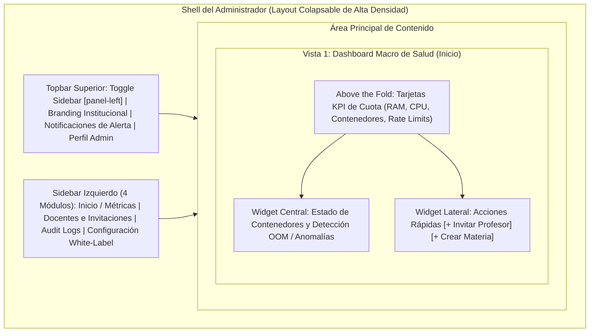

# Vista 1: Dashboard del Administrador de Institución (Centro de Mando B2B)

> **Especificación Oficial de Interfaz, Componentes y Wireframes**  
> **Rol:** Administrador de Institución (Tenant Admin)  
> **Gobernanza:** SDD / Docs-as-Code / SOLV Design System / ADR-014 / ADR-024 / ADR-027  

---

## 1. Diagrama de Arquitectura de Pantalla (Mermaid Visual HD)



---

## 2. Especificación Visual de Componentes e Iconografía Lucide

- **Sidebar Colapsable de Alta Densidad:** `lucide:activity` (Inicio / Métricas), `lucide:users` (Docentes), `lucide:shield-check` (Audit Logs), `lucide:palette` (Configuración / White-Label).
- **Indicadores de Umbrales de Recursos (Linux cgroups):**
  - `< 79%`: Saludable (`#16A34A` - Verde)
  - `80% - 89%`: Advertencia (`#D97706` - Ámbar) con sugerencia de hibernación manual.
  - `>= 90%`: Crítico (`#DC2626` - Rojo Pulsante) con banner de congelamiento de provisión (Throttling).
- **Traducción Semántica de Errores:** Intercepción del evento `OOM Killer` (Exit code 137 / `oom_score_adj`) como `"OOM Killed - Límite de Memoria Excedido"`.

---

## 3. Diagrama ASCII Técnico — Dashboard Principal del Tenant Admin

```text
┌──────────────────────────────────────────────────────────────────────────────────────────────────┐
│ SOLV | Universidad Adventista de Bolivia                 [lucide:bell] [ Alerta RAM 90% ]  Admin  │
├──────────────┬───────────────────────────────────────────────────────────────────────────────────┤
│              │ ZONA 1: SALUD Y RECURSOS DE LA INSTITUCIÓN (Above the Fold - Escaneo en F)        │
│ [x] Inicio   │ ┌──────────────────────┬──────────────────────┬──────────────────┬──────────────┐ │
│ [ ] Docentes │ │ 1. CUOTA DE RAM      │ 2. CUOTA DE CPU      │ 3. CONTENEDORES  │ 4. RATE LIMIT│ │
│ [ ] AuditLogs│ │ [||||||||||||||=] 90%│ [||||||||    ] 42%   │ 35 Activos       │ 95% Disponib.│ │
│ [ ] Ajustes  │ │ 900 GB / 1000 GB     │ 210 vCPU / 500 vCPU  │ 12 Hibernados    │ 0 Bloqueados │ │
│              │ │ [lucide:alert-trig]  │ [lucide:check-circle]│ 2 OOM Killed [!] │ Normal       │ │
│              │ └──────────────────────┴──────────────────────┴──────────────────┴──────────────┘ │
│              ├───────────────────────────────────────────────────────────┬───────────────────────┤
│              │ ZONA 2: CONTENEDORES EN MONITOREO VIVO                    │ ZONA 3: ACCIONES      │
│              │ ┌───────────────────────────────────────────────────────┐ │ RÁPIDAS               │
│              │ │ ID Lab   │ Usuario    │ Estado     │ Memoria │ Acción │ │                       │
│              │ ├──────────┼────────────┼────────────┼─────────┼────────┤ │ [+ Invitar Profesor]  │
│              │ │ LAB-089  │ C. Ruiz    │ OOM Killed │ 256MB   │ [Rein] │ │                       │
│              │ │ LAB-112  │ A. Torres  │ Running    │ 240MB   │ [Paus] │ │ [+ Crear Materia]     │
│              │ │ LAB-304  │ M. López   │ Hibernated │ 0MB     │ [Rean] │ │                       │
│              │ └───────────────────────────────────────────────────────┘ │ [Sincronizar Classr.] │
└──────────────┴───────────────────────────────────────────────────────────┴───────────────────────┘
```

---

## 4. Justificación Técnica y de UX de cada Componente

1. **Sidebar Colapsable de Alta Densidad:** Reserva espacio horizontal limpio para tablas densas de monitoreo y registros de auditoría.
2. **Tarjetas KPI "Above the Fold":** Ofrecen un triaje visual instantáneo de la salud del tenant mediante umbrales semánticos de memoria RAM (80%/90%) y vCPUs activas.
3. **Traducción Semántica del OOM Killer:** Abstrae el código de salida de Linux (Exit code 137) traduciéndolo a `"OOM Killed - Límite de Memoria Excedido"` para facilitar la toma de decisiones sin acceder a la terminal de comandos.
4. **Rate Limit Indicator (ADR-027 / CRIT-10):** Visualiza la cuota del limitador de tasa por usuario (algoritmo Token Bucket) para proteger el hardware contra abusos.

---

## 5. Inventario de Componentes Angular a Construir

| Componente | Tipo / Rol | Ubicación en Código |
|---|---|---|
| `TenantAdminDashboard` | Contenedor Principal Macro del Administrador | `features/admin/dashboard/` |
| `QuotaKpiCard` | Tarjeta KPI con barra de umbral semántico (Verde/Ámbar/Rojo) | `features/admin/dashboard/components/` |
| `LiveContainersTable` | Tabla de monitoreo de contenedores con badges OOM | `features/admin/dashboard/components/` |
| `QuickActionsWidget` | Panel de accesos directos para invitaciones y sincronización | `features/admin/dashboard/components/` |
