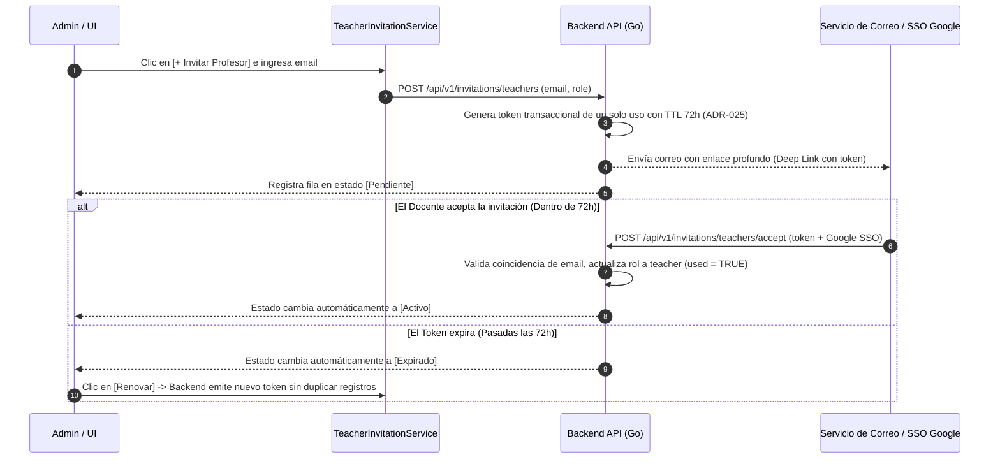

# Vista 2: Gestión de Docentes e Invitaciones (Ciclo de Vida de Identidades)

> **Especificación Oficial de Interfaz, Componentes y Wireframes**  
> **Rol:** Administrador de Institución (Tenant Admin)  
> **Gobernanza:** SDD / Docs-as-Code / SOLV Design System / ADR-022 / ADR-024 / ADR-025  

---

## 1. Diagrama de Arquitectura de Invitación (Mermaid Visual HD)



---

## 2. Especificación Visual de Componentes e Iconografía Lucide

- **Acción Principal Topbar:** Botón `[+ Invitar Profesor]` con icono `lucide:user-plus` e interfaz destacada en `var(--tenant-primary)`.
- **Badges Semánticos de Estado del Usuario:**
  - `Activo`: Píldora verde (`#16A34A`) con icono `lucide:check-circle`.
  - `Pendiente`: Píldora ámbar (`#D97706`) con icono `lucide:clock` (Expira en 72 horas).
  - `Expirado`: Píldora roja (`#DC2626`) con icono `lucide:alert-circle`.
- **Identificador de Origen:** Distinctivo `GClassroom` con icono de candado `lucide:lock` para identidades sincronizadas desde Google Classroom mediante flujo unidireccional (ADR-022 / Decisión D6).

---

## 3. Diagrama ASCII Técnico — Gestión de Docentes y Modal de Invitación

```text
┌──────────────────────────────────────────────────────────────────────────────────────────────────┐
│ SOLV | Universidad Adventista de Bolivia                 [+ Invitar Profesor]  [lucide:bell] Admin│
├──────────────┬───────────────────────────────────────────────────────────────────────────────────┤
│              │ GESTIÓN Y ALTA DE DOCENTES (Ciclo de Vida de Identidades — ADR-025)               │
│ [ ] Inicio   │ Buscador: [ Buscar por nombre o email...       ] Filtros: [Estado: Todos v] [Origen v]│
│ [*] Docentes │ ┌───────────────────────────────────────────────────────────────────────────────┐ │
│ [ ] AuditLogs│ │ Nombre y Email                 │ Origen      │ Estado     │ Invitado │ Acción │ │
│ [ ] Ajustes  │ ├────────────────────────────────┼─────────────┼────────────┼──────────┼────────┤ │
│              │ │ Margaret Hamilton (mhamilton)  │ Manual      │ Activo     │ 15-Ago   │ [ ••• ]│ │
│              │ │ Ada Lovelace (alovelace)       │ GClassroom  │ Activo     │ 10-Ago   │ [ ••• ]│ │
│              │ │ Tim Berners-Lee (tberners)     │ Manual      │ Pendiente  │ Hace 24h │ [Reenv]│ │
│              │ │ Linus Torvalds (ltorvalds)     │ Manual      │ Expirado   │ Hace 4d  │ [Renov]│ │
│              │ └───────────────────────────────────────────────────────────────────────────────┘ │
└──────────────┴───────────────────────────────────────────────────────────────────────────────────┘

==================== MODAL DE INVITACIÓN (Disparado por [+ Invitar Profesor]) =====================
┌──────────────────────────────────────────────────────────────────────────────────────────────────┐
│ Invitar Nuevo Docente a la Institución                                                       [X] │
├──────────────────────────────────────────────────────────────────────────────────────────────────┤
│ Ingrese el correo electrónico institucional del profesor. Se emitirá un token transaccional (72h).│
│                                                                                                  │
│ Correo Institucional: [ docente@uab.edu.bo                                                     ] │
│ Rol Institucional:    (*) Profesor Titular    ( ) Auxiliar / Ayudante                            │
│                                                                                                  │
│ [x] Enviar enlace de invitación por correo electrónico (Token expira en 72 horas — ADR-025)    │
│                                                                                                  │
│                                                                 [ Cancelar ]  [ Generar Token ]  │
└──────────────────────────────────────────────────────────────────────────────────────────────────┘
```

---

## 4. Justificación Técnica y de UX

1. **Tokens Transaccionales (ADR-025):** Elimina el riesgo de contraseñas genéricas. El admin solo ingresa el email y el backend emite un token criptográfico de un solo uso con vencimiento a las 72 horas. El profesor completa su alta mediante Google SSO institucional.
2. **Tríada de Estados de Identidad:**
   * `Activo`: Profesor con cuenta activa y permisos.
   * `Pendiente`: Esperando que el profesor ingrese. Ofrece la acción rápida `[Reenviar]`.
   * `Expirado`: Permite la acción `[Renovar]` para emitir un nuevo token sin generar filas duplicadas en la base de datos.
3. **Integración Unidireccional Google Classroom (ADR-022 / D6):** Los profesores con origen `GClassroom` muestran el distintivo con candado `lucide:lock` para advertir que la nómina se administra desde el LMS institucional externo.

---

## 5. Inventario de Componentes Angular a Construir

| Componente | Tipo / Rol | Ubicación en Código |
|---|---|---|
| `TeacherManagementGrid` | Tabla principal de gestión de profesores | `features/admin/teachers/` |
| `TeacherInviteModal` | Modal de generación de tokens de invitación | `features/admin/teachers/components/` |
| `UserStatusBadge` | Badge semántico con color fijo por estado (Activo/Pendiente/Expirado) | `shared/ui/badges/` |
| `ClassroomOriginBadge` | Indicador visual de origen Google Classroom con icono lock | `shared/ui/badges/` |
