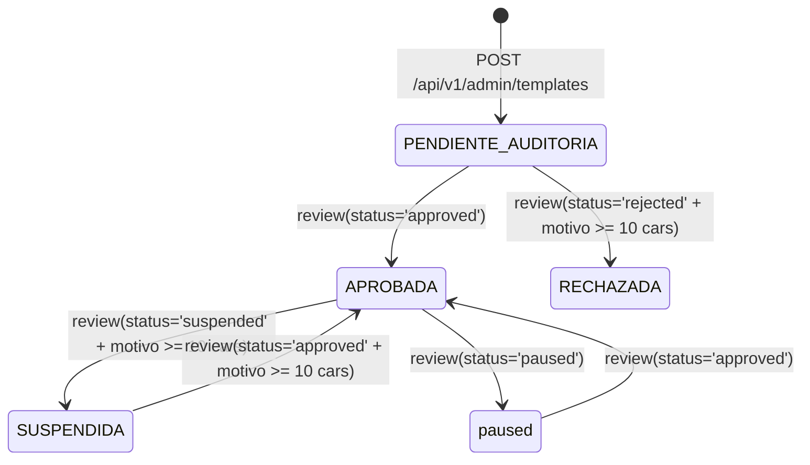

# Documentación de Estado Actual (As-Built): Gobernanza y Gestión de Plantillas de Entornos

> **Archivo:** `docs/UI/ADMIN/PLANTILLAS_AS_BUILT.md`  
> **Alcance:** Auditoría técnica estricta del código fuente existente en Backend (Go), Base de Datos (PostgreSQL) y Frontend (Angular 22).  
> **Regla de redacción:** Describe únicamente lo que el código hace hoy en producción local. No propone soluciones ni planes futuros. Todo desvío contra `docs/UI/ADMIN/PLANTILLAS_DOCKER.md` está etiquetado explícitamente como **[DESVÍO]**.

---

## 1. Modelo de Datos Real

### 1.1 Tabla `lab_templates` (PostgreSQL)
Definida y migrada en [`backend/internal/infrastructure/database/postgres.go`](file:///home/alvarorivera/Documentos/Desarrollo/SOLV_PG/backend/internal/infrastructure/database/postgres.go#L57-L63) y alterada en líneas 338-364.

| Columna | Tipo SQL | Nullable | Default | Constraints / Índices | Uso en Código |
| :--- | :--- | :--- | :--- | :--- | :--- |
| `id` | `UUID` | NOT NULL | `gen_random_uuid()` | PK (`lab_templates_pkey`) | Identificador único de plantilla. |
| `name` | `VARCHAR(100)` | NOT NULL | Sin default | UNIQUE compuesto con `tenant_id` (`idx_lab_templates_tenant_name`) | Nombre formal de la plantilla. |
| `docker_image` | `VARCHAR(255)` | NOT NULL | Sin default | Ninguno | Referencia OCI / Tag Docker. |
| `base_ram_mb` | `INT` | NOT NULL | Sin default | Ninguno | Memoria base asignada al contenedor. |
| `tenant_id` | `UUID` | NOT NULL | Sin default | FK `tenants(id)` RESTRICT (`fk_lab_templates_tenant`), Index (`idx_lab_templates_tenant`) | Aislamiento multi-tenant. |
| `status` | `VARCHAR(50)` | NULL | `'approved'` | Index (`idx_lab_templates_status`) | Estado del ciclo de vida (`pending`, `approved`, `rejected`, `paused`, `PENDIENTE_AUDITORIA`, `APROBADA`, `SUSPENDIDA`, `RECHAZADA`). |
| `rejection_reason` | `TEXT` | NULL | `''` | Ninguno | Justificación de rechazo o suspensión. |
| `reviewed_by` | `UUID` | NULL | NULL | FK `users(id)` ON DELETE SET NULL | Administrador que dictaminó la revisión. |
| `reviewed_at` | `TIMESTAMPTZ` | NULL | NULL | Ninguno | Timestamp de aprobación/suspensión. |
| `requested_by` | `UUID` | NULL | NULL | FK `users(id)` ON DELETE SET NULL | Docente que solicitó el entorno. |
| `description` | `TEXT` | NULL | `''` | Ninguno | Descripción pedagógica o técnica. |
| `created_at` | `TIMESTAMPTZ` | NULL | `NOW()` | Ninguno | Creación del registro. |
| `updated_at` | `TIMESTAMPTZ` | NULL | `NOW()` | Ninguno | Última modificación. |
| `target_environment` | `VARCHAR(50)` | NOT NULL | `'IDE_PERSISTENTE'` | Index (`idx_lab_templates_env`) | Propósito (`IDE_PERSISTENTE` o `JUEZ_EFIMERO`). |
| `entrypoint` | `TEXT` | NULL | `''` | Ninguno | Comando de compilación/ejecución para Juez. |
| `timeout_ms` | `INT` | NULL | `5000` | Ninguno | Límite de tiempo de ejecución para Juez. |
| `services_config` | `JSONB` | NOT NULL | `'{"database": {"enabled": false}}'` | Ninguno | Configuración de satélites (`services: []ServiceRequirement`). |
| `resource_profile` | `JSONB` | NOT NULL | `'{"min_mb": 256, "high_mb": 768, "max_mb": 1024}'` | Ninguno | Perfil cgroups v2 MQoS. |
| `setup_script` | `TEXT` | NOT NULL | `''` | Ninguno | Script bash de inicialización en primer arranque. |
| `tools_declared` | `JSONB` | NOT NULL | `'[]'` | Ninguno | Array de binarios declarados para smoke test. |
| `smoke_test_status` | `VARCHAR(50)` | NULL | `'pending'` | Ninguno | Resultado del smoke test (`pending`, `passed`, `failed`). |
| `smoke_test_output` | `TEXT` | NULL | `''` | Ninguno | Salida textual de stdout/stderr de la prueba. |
| `security_audit_status` | `VARCHAR(50)` | NULL | `'pending'` | Index (`idx_lab_templates_audit`) | Estado de escaneo de seguridad. |
| `cve_critical_count` | `INT` | NULL | `0` | Ninguno | Vulnerabilidades críticas detectadas. |
| `cve_high_count` | `INT` | NULL | `0` | Ninguno | Vulnerabilidades altas detectadas. |
| `security_audit_report` | `JSONB` | NULL | `'{}'` | Ninguno | Detalle completo de hallazgos Semgrep/Trivy. |
| `security_audited_at` | `TIMESTAMPTZ` | NULL | NULL | Ninguno | Timestamp del escaneo de seguridad. |
| `eol_status` | `VARCHAR(50)` | NULL | `'supported'` | Index (`idx_lab_templates_eol`) | Estado de ciclo de vida del runtime. |
| `eol_date` | `VARCHAR(50)` | NULL | `''` | Ninguno | Fecha límite de soporte oficial. |
| `eol_message` | `TEXT` | NULL | `''` | Ninguno | Mensaje descriptivo de obsolescencia. |
| `eol_checked_at` | `TIMESTAMPTZ` | NULL | NULL | Ninguno | Timestamp de comprobación EOL. |

### 1.2 Tabla `audit_logs` (PostgreSQL)
Definida en [`backend/internal/infrastructure/database/postgres.go`](file:///home/alvarorivera/Documentos/Desarrollo/SOLV_PG/backend/internal/infrastructure/database/postgres.go).

| Columna | Tipo SQL | Constraints | Propósito en Flujo de Plantillas |
| :--- | :--- | :--- | :--- |
| `id` | `UUID` | PK | Identificador del log. |
| `tenant_id` | `UUID` | NOT NULL, FK `tenants(id)` | Tenant institucional. |
| `actor_id` | `UUID` | NOT NULL, Index (`idx_audit_logs_actor`) | Admin que revisó, creó o suspendió la plantilla. |
| `action` | `VARCHAR(255)` | NOT NULL | Acción registrada: `TEMPLATE_REVIEWED`, `TEMPLATE_CREATED`, `EMERGENCY_ACTION`. |
| `resource_type` | `VARCHAR(100)` | NOT NULL | Valor fijo `'lab_template'`. |
| `resource_id` | `UUID` | NULL | ID de la plantilla afectada. |
| `status_code` | `INT` | NOT NULL (200) | Código de respuesta HTTP asociado. |
| `metadata` | `JSONB` | DEFAULT `'{}'` | Almacena status anterior, nuevo status y motivo justificado. |
| `ip_address` | `INET` | NULL | Dirección IP del cliente. |
| `user_agent` | `TEXT` | NULL | Cabecera User-Agent del navegador. |
| `created_at` | `TIMESTAMPTZ` | DEFAULT `NOW()`, Index | Marca temporal del evento. |

### 1.3 Entidad de Solicitudes Docentes
* **[DESVÍO]:** No existe tabla física `solicitudes` ni `docker_template_requests`. La spec (`PLANTILLAS_DOCKER.md` sec 1 y 4) asume una entidad de solicitud desacoplada (`POST /api/v1/docker-templates/requests`). En el código actual, la solicitud se almacena directamente en `lab_templates` mediante la presencia de `requested_by` con estado `pending` o `PENDIENTE_AUDITORIA`.

### 1.4 Campos en BD no usados por la UI actual
* `eol_status`, `eol_date`, `eol_message`, `eol_checked_at`: Existen y son actualizados por workers en backend, pero [`admin-templates.component.html`](file:///home/alvarorivera/Documentos/Desarrollo/SOLV_PG/frontend/src/app/features/admin/templates/admin-templates.component.html) no renderiza columnas ni badges para el ciclo de vida EOL.
* `security_audit_report`: Almacena el JSON crudo del reporte; la UI solo lee `cve_critical_count` y `cve_high_count`.

### 1.5 Campos que la UI muestra pero no existen en BD
* `discipline` / `categoria`: Mostrado en tarjetas de modelos (ej. "Ciencia de Datos & IA") y selector de disciplinas. En BD no existe columna `category` ni `discipline` en `lab_templates`.
* `usageCount` ("X usos"): Mostrado en tarjetas de modelos. En BD no se computa ni persiste en `lab_templates`.
* `sampleInput`: Signal en [`template-create-modal.component.ts:155`](file:///home/alvarorivera/Documentos/Desarrollo/SOLV_PG/frontend/src/app/features/admin/templates/components/template-create-modal/template-create-modal.component.ts#L155) usado durante el smoke test efímero del Juez; no se guarda en la base de datos de plantillas.

---

## 2. Migraciones y Seeds

### 2.1 Mecanismo de Migración
Las migraciones se ejecutan de manera imperativa en [`backend/internal/infrastructure/database/postgres.go`](file:///home/alvarorivera/Documentos/Desarrollo/SOLV_PG/backend/internal/infrastructure/database/postgres.go#L43-L450) mediante sentencias directas `CREATE TABLE IF NOT EXISTS` y `ALTER TABLE ... ADD COLUMN IF NOT EXISTS`. No existe una herramienta de versionado de esquemas (como golang-migrate o goose).

### 2.2 Lista de Seeds en Backend
1. **Tenant UAB Inicial:** Inserta `'00000000-0000-0000-0000-000000000001'` con nombre `'Universidad Adventista de Bolivia'` (`ON CONFLICT (id) DO NOTHING`) en [`postgres.go:169`](file:///home/alvarorivera/Documentos/Desarrollo/SOLV_PG/backend/internal/infrastructure/database/postgres.go#L169).
2. **Periodo Académico Base:** Inserta gestión activa `'2026-1'` para el tenant UAB (`ON CONFLICT DO NOTHING`) en [`postgres.go:321`](file:///home/alvarorivera/Documentos/Desarrollo/SOLV_PG/backend/internal/infrastructure/database/postgres.go#L321).
3. **Materia General:** Inserta subject base `'Materia General'` con código `'GEN-101'` en [`postgres.go:384`](file:///home/alvarorivera/Documentos/Desarrollo/SOLV_PG/backend/internal/infrastructure/database/postgres.go#L384).
4. **Ejercicios de Evaluación:** Inserta 2 ejercicios de prueba (`seedAlgoQuery`, `seedDBQuery`) en [`postgres.go:510-560`](file:///home/alvarorivera/Documentos/Desarrollo/SOLV_PG/backend/internal/infrastructure/database/postgres.go#L510).
5. **Plantillas Docker en Base de Datos:** **No existe seed de `lab_templates` en `postgres.go`**. Las filas iniciales provinieron de inserciones de pruebas o del worker de auditoría.

### 2.3 Diagnóstico del Incidente de las 139 Filas
* **Causa técnica histórica:** Las migraciones previas y suites de tests insertaban plantillas con `gen_random_uuid()` sin ninguna restricción de unicidad por nombre y tenant en la tabla `lab_templates`. Cada arranque de tests o re-ejecución acumulaba réplicas idénticas de las mismas 8 imágenes.
* **Mecanismo de remediación aplicado:** Líneas 371-376 de [`postgres.go`](file:///home/alvarorivera/Documentos/Desarrollo/SOLV_PG/backend/internal/infrastructure/database/postgres.go#L371-L376):
  ```sql
  DELETE FROM lab_templates a USING lab_templates b
  WHERE a.ctid < b.ctid AND a.tenant_id IS NOT DISTINCT FROM b.tenant_id AND a.name = b.name;

  CREATE UNIQUE INDEX IF NOT EXISTS idx_lab_templates_tenant_name ON lab_templates(tenant_id, name);
  ```
* **¿Puede repetirse hoy?:**
  * Para plantillas oficiales y guardado normal: **No**. Si el nombre ya existe para el tenant, [`admin_governance_repository.go`](file:///home/alvarorivera/Documentos/Desarrollo/SOLV_PG/backend/internal/infrastructure/storage/postgres/admin_governance_repository.go) retorna `ErrTemplateNameConflict` mapped a **HTTP 409 Conflict** con mensaje claro (`Ya existe una plantilla con este nombre`), impidiendo la sobrescritura silenciosa.
  * **Duplicación protegida:** [`admin_governance_repository.go`](file:///home/alvarorivera/Documentos/Desarrollo/SOLV_PG/backend/internal/infrastructure/storage/postgres/admin_governance_repository.go) calcula de forma incremental nombres disponibles: `(Copia) Nombre`, `(Copia 2) Nombre`, `(Copia 3) Nombre`, evitando colisiones y errores 500 al duplicar repetidas veces.

---

## 3. Endpoints Implementados

| Ruta | Método | Consumidor Frontend | Payload Request | Respuesta Backend | Estados que Produce |
| :--- | :--- | :--- | :--- | :--- | :--- |
| `/api/v1/admin/templates` | `GET` | [`admin-templates.service.ts`](file:///home/alvarorivera/Documentos/Desarrollo/SOLV_PG/frontend/src/app/features/admin/services/admin-templates.service.ts) | Query params: `status`, `search` | `{ "data": AdminTemplateItem[], "message": "..." }` | Lectura pura con categorías asociadas. |
| `/api/v1/admin/templates` | `POST` | [`admin-templates.service.ts`](file:///home/alvarorivera/Documentos/Desarrollo/SOLV_PG/frontend/src/app/features/admin/services/admin-templates.service.ts) | `CreateOfficialTemplateDTO` (`name`, `docker_image`, `base_ram_mb`, `category_id`, `model_id`, `sample_input`, etc.) | `{ "data": AdminTemplateReviewItem }` | Inserta con `status = 'PENDIENTE_AUDITORIA'`. Si el nombre existe, 409 Conflict. |
| `/api/v1/admin/templates/{id}/review` | `PUT` | [`admin-templates.service.ts`](file:///home/alvarorivera/Documentos/Desarrollo/SOLV_PG/frontend/src/app/features/admin/services/admin-templates.service.ts) | `ReviewTemplateDTO` (`status`: approved, rejected, suspended, paused; `rejection_reason`: string; `base_ram_mb`: int opcional) | `{ "data": AdminTemplateReviewItem }` | Transiciona a `APROBADA`, `RECHAZADA`, `SUSPENDIDA` o `paused`. Registra log en `audit_logs`. |
| `/api/v1/admin/templates/{id}/duplicate` | `POST` | [`admin-templates.service.ts`](file:///home/alvarorivera/Documentos/Desarrollo/SOLV_PG/frontend/src/app/features/admin/services/admin-templates.service.ts) | Sin cuerpo | `{ "data": AdminTemplateReviewItem }` | Clona fila en BD con sufijo seguro `(Copia N)` y `status = 'PENDIENTE_AUDITORIA'`. |
| `/api/v1/admin/templates/{id}/promote-to-model` | `POST` | [`admin-templates.service.ts`](file:///home/alvarorivera/Documentos/Desarrollo/SOLV_PG/frontend/src/app/features/admin/services/admin-templates.service.ts) | `PromoteTemplateToModelDTO` (`name`, `category_id`, `description`) | `{ "data": TemplateModelItem }` | Guarda en `template_models` si la plantilla está `APROBADA` (400 si no). Registra `TEMPLATE_PROMOTED_TO_MODEL` en `audit_logs`. |
| `/api/v1/admin/template-categories` | `GET` | [`admin-templates.service.ts`](file:///home/alvarorivera/Documentos/Desarrollo/SOLV_PG/frontend/src/app/features/admin/services/admin-templates.service.ts) | Sin cuerpo | `{ "data": TemplateCategory[] }` | Listado ordenado alfabéticamente por nombre. |
| `/api/v1/admin/template-categories` | `POST` | [`admin-templates.service.ts`](file:///home/alvarorivera/Documentos/Desarrollo/SOLV_PG/frontend/src/app/features/admin/services/admin-templates.service.ts) | `CreateCategoryDTO` (`name`, `description`) | `{ "data": TemplateCategory }` | Crea categoría (409 Conflict si ya existe el nombre en el tenant). |
| `/api/v1/admin/template-categories/{id}` | `PUT` | [`admin-templates.service.ts`](file:///home/alvarorivera/Documentos/Desarrollo/SOLV_PG/frontend/src/app/features/admin/services/admin-templates.service.ts) | `UpdateCategoryDTO` (`name`, `description`) | `{ "data": TemplateCategory }` | Actualiza categoría (409 si nombre duplicado). |
| `/api/v1/admin/template-categories/{id}` | `DELETE` | [`admin-templates.service.ts`](file:///home/alvarorivera/Documentos/Desarrollo/SOLV_PG/frontend/src/app/features/admin/services/admin-templates.service.ts) | Path param `id` | `204 No Content` | Elimina categoría. Si está en uso por plantillas o modelos, devuelve 409 Conflict. Registra log en `audit_logs`. |
| `/api/v1/admin/template-models` | `GET` | [`admin-templates.service.ts`](file:///home/alvarorivera/Documentos/Desarrollo/SOLV_PG/frontend/src/app/features/admin/services/admin-templates.service.ts) | Query param opcional `target_environment` | `{ "data": TemplateModelItem[] }` | Modelos dinámicos con `usage_count` real calculado de `lab_templates` aprobadas. |
| `/api/v1/admin/templates/capabilities` | `GET` | [`admin-templates.service.ts`](file:///home/alvarorivera/Documentos/Desarrollo/SOLV_PG/frontend/src/app/features/admin/services/admin-templates.service.ts) | Sin cuerpo | `{ "data": RuntimeCapabilities }` | Lectura viva de hardware y presets dinámicos consumidos por los modales de creación y revisión. |
| `/api/v1/admin/templates/local-images` | `GET` | [`admin-templates.service.ts`](file:///home/alvarorivera/Documentos/Desarrollo/SOLV_PG/frontend/src/app/features/admin/services/admin-templates.service.ts) | Sin cuerpo | `{ "data": LocalImageItem[] }` | Lectura de imágenes locales en Docker daemon. |
| `/api/v1/admin/templates/verify-image` | `POST` | [`admin-templates.service.ts`](file:///home/alvarorivera/Documentos/Desarrollo/SOLV_PG/frontend/src/app/features/admin/services/admin-templates.service.ts) | `{ "image": string, "force": boolean }` | `{ "data": ImageVerificationResult }` | Lectura y validación OCI. |
| `/api/v1/jobs/env-test` | `POST` | [`admin-templates.service.ts`](file:///home/alvarorivera/Documentos/Desarrollo/SOLV_PG/frontend/src/app/features/admin/services/admin-templates.service.ts) | Smoke test payload (`sample_input`, `base_ram_mb`, etc.) | `202 Accepted` `{ "data": EnvTestJob }` | Dispara job asíncrono con límite de RAM configurado. |
| `/api/v1/jobs/env-test/{id}` | `GET` | [`admin-templates.service.ts`](file:///home/alvarorivera/Documentos/Desarrollo/SOLV_PG/frontend/src/app/features/admin/services/admin-templates.service.ts) | Path param `id` | `{ "data": EnvTestJob }` | Polling del smoke test. |
| `/api/v1/jobs/env-test/{id}/cancel` | `POST` | [`admin-templates.service.ts`](file:///home/alvarorivera/Documentos/Desarrollo/SOLV_PG/frontend/src/app/features/admin/services/admin-templates.service.ts) | Path param `id` | `{ "data": EnvTestJob }` | Cancela el contenedor y libera slots. |

### 3.1 Contrato del Job `env-test` y Modos de Prueba Existentes
Implementado en [`backend/internal/infrastructure/docker/env_test_adapter.go`](file:///home/alvarorivera/Documentos/Desarrollo/SOLV_PG/backend/internal/infrastructure/docker/env_test_adapter.go) y coordinado por [`backend/internal/core/services/env_test_service.go`](file:///home/alvarorivera/Documentos/Desarrollo/SOLV_PG/backend/internal/core/services/env_test_service.go).
1. **Modo IDE (`target_environment = "IDE_PERSISTENTE"`):**
   * Anula entrypoint original (`Cmd: ["sh", "-c", "sleep 60"]`).
   * Ejecuta `docker exec` iterando sobre el array de `tools` (`type <tool> || which <tool>`).
   * Mide memoria en reposo y escribe log de capacidades.
2. **Modo Juez (`target_environment = "JUEZ_EFIMERO"`):**
   * Configura aislamiento duro: `NetworkMode: "none"`, `ReadonlyRootfs: true`, memoria fija (`Memory: 256MB`).
   * Ejecuta `entrypoint` declarado inyectando `sample_input` mediante un pipe a stdin (`AttachStdin: true`).
   * Mide tiempo transcurrido con `time.Since` y cancela con context timeout según `timeout_ms`.
   * Considera exitoso únicamente si `ExitCode == 0` y no hubo timeout.
3. **[DESVÍO vs Spec]:** La spec v0.16.0 en `PLANTILLAS_DOCKER.md:204-208` documenta rutas bajo `/api/v1/admin/docker-templates/*` y `/api/v1/docker-templates/requests/*`. El backend real no expone esas URLs; expone `/api/v1/admin/templates/*`.

---

## 4. Máquina de Estados Implementada

### 4.1 Estados Físicos en Base de Datos
En la columna `lab_templates.status` conviven dos nomenclaturas debido a la evolución de migraciones:
* Nomenclatura v1: `'pending'`, `'approved'`, `'rejected'`, `'paused'`.
* Nomenclatura v2: `'PENDIENTE_AUDITORIA'`, `'APROBADA'`, `'SUSPENDIDA'`, `'RECHAZADA'`.

### 4.2 Matriz de Transiciones Reales (`PUT /api/v1/admin/templates/{id}/review`)
Código en [`backend/internal/core/services/admin_governance_service.go:170-220`](file:///home/alvarorivera/Documentos/Desarrollo/SOLV_PG/backend/internal/core/services/admin_governance_service.go#L170-L220).



### 4.3 Comportamiento del Estado `SUSPENDIDA`
* **Validación de Motivo:** Si `rejection_reason` tiene menos de 10 caracteres, el backend aborta con HTTP 400 (`ErrRejectionReasonRequired`).
* **Efecto Operativo:**
  * La consulta del selector de duplicación ([`template-create-modal.component.ts:339`](file:///home/alvarorivera/Documentos/Desarrollo/SOLV_PG/frontend/src/app/features/admin/templates/components/template-create-modal/template-create-modal.component.ts#L339)) filtra explícitamente `status === 'approved' || status === 'APROBADA'`. Las plantillas `SUSPENDIDA` quedan ocultas.
  * El listado de materias del docente no permite asociar plantillas suspendidas.
* **Grandfathering:** En [`backend/internal/core/services/workspace_service.go`](file:///home/alvarorivera/Documentos/Desarrollo/SOLV_PG/backend/internal/core/services/workspace_service.go), los workspaces que ya estaban corriendo con esa plantilla continúan operando normalmente. No hay borrado en cascada ni apagado forzoso.

---

## 5. Frontend: Datos Reales vs Hardcodeados

### 5.1 [`template-create-modal.component.ts`](file:///home/alvarorivera/Documentos/Desarrollo/SOLV_PG/frontend/src/app/features/admin/templates/components/template-create-modal/template-create-modal.component.ts)

| Símbolo | Tipo | Naturaleza | Contenido / Origen |
| :--- | :--- | :--- | :--- |
| `runtimeCapabilities` (L417) | Signal | **DATO REAL** | Consulta `/api/v1/admin/templates/capabilities`. Provee RAM física del host (`total_ram_mb: 7831`, `available_ram_mb: 997`, etc.). |
| `availableServices` (L419) | Signal | **DATO REAL** | Alimentado por `runtimeCapabilities.satellite_services` desde el backend. |
| `existingCatalog` (L331) | Signal | **DATO REAL** | Consulta `/api/v1/admin/templates?status=approved` para el selector de duplicación. |
| `localImages` (L176) | Signal | **DATO REAL** | Consulta `/api/v1/admin/templates/local-images`. |
| `verificationResult` (L172) | Signal | **DATO REAL** | Consulta `/api/v1/admin/templates/verify-image`. |
| `models` | Signal | **DATO REAL** | Consulta `GET /api/v1/admin/template-models`. Conteo de uso real calculado desde `lab_templates.model_id` y normalización de estados aprobados. |
| `categories` | Signal | **DATO REAL** | Consulta `GET /api/v1/admin/template-categories`. Entidades persistidas en tabla `template_categories`. |
| `curatedOfficialImages` | Propiedad Array | **CONFIG (Semilla)** | 8 sugerencias OCI fijas en frontend como semilla curada para typeahead (no es catálogo ni telemetría inventada). |
| `RAM_PRESETS_IDE` | Constante TS | **FALLBACK** | `[512 MB, 1 GB, 2 GB, 4 GB]`. Se usa solo si `runtimeCapabilities` está cargando o falla. |
| `RAM_PRESETS_JUDGE` | Constante TS | **FALLBACK** | `[128 MB, 256 MB, 512 MB]`. Se usa solo si `runtimeCapabilities` está cargando o falla. |
| `editorBase = 210` | Constante local | **CALIBRACIÓN** | Estimación fija del consumo del editor OpenVSCode en reposo (210 MB). |
| `runtimeBase = 32` | Constante local | **CALIBRACIÓN** | Estimación fija del consumo de memoria del sandbox del Juez (32 MB). |

---

## 6. Inventario de Datos Ficticios Mostrados como Reales

| Elemento Visual | Dónde se Renderiza | Archivo y Línea | Origen Actual | Estado |
| :--- | :--- | :--- | :--- | :--- |
| Contador `"{count} plantillas basadas en este modelo"` | Tarjeta de cada modelo en puerta "Desde modelo" | [`template-create-modal.component.html:138`](file:///home/alvarorivera/Documentos/Desarrollo/SOLV_PG/frontend/src/app/features/admin/templates/components/template-create-modal/template-create-modal.component.html#L138) | `models[i].usage_count` desde `/api/v1/admin/template-models` | **DATO REAL.** Calculado con `COUNT(lt.id)` en PostgreSQL sobre estados aprobados. |
| Agrupador por Categoría | Encabezados de grupo en pestaña de modelos y selector en Paso 2 | [`template-create-modal.component.html`](file:///home/alvarorivera/Documentos/Desarrollo/SOLV_PG/frontend/src/app/features/admin/templates/components/template-create-modal/template-create-modal.component.html) | Tabla `template_categories` en PostgreSQL | **DATO REAL.** Entidad relacional con CRUD y guarda 409 si está en uso. |
| Presets de RAM en Modal de Revisión | Selector de cuotas en revisión administrativa | [`template-review-modal.component.html:43`](file:///home/alvarorivera/Documentos/Desarrollo/SOLV_PG/frontend/src/app/features/admin/templates/components/template-review-modal/template-review-modal.component.html#L43) | `getRuntimeCapabilities()` | **DATO REAL.** Se obtienen de las capacidades reportadas por el host. |

---

## 7. Flujos por Estado de Completitud

| Flujo Funcional | Estado de Completitud | Evidencia en Código |
| :--- | :--- | :--- |
| **Promoción a modelo de plantilla** (`ST-15`) | **Implementado (BD + API + UI)** | Endpoint `POST /api/v1/admin/templates/{id}/promote-to-model` con guarda `APROBADA`, audit log, tabla `template_models` y diálogo modal en catálogo. |
| **Gestión de categorías** (`CA-01` a `CA-07`) | **Implementado (BD + API + UI)** | CRUD completo en `/api/v1/admin/template-categories`, guarda HTTP 409 si está en uso, audit log al eliminar y modal de gestión en frontend. |
| **Canal de solicitudes docente -> admin** | **No existe** | El docente no tiene vista ni endpoint para enviar `POST /api/v1/docker-templates/requests`. Solo el admin opera plantillas. |
| **Borradores y reanudación** (`ST-07` a `ST-09`) | **Solo UI (LocalStorage)** | Guardado en `localStorage.getItem('solv_template_draft')` en [`template-create-modal.component.ts:537`](file:///home/alvarorivera/Documentos/Desarrollo/SOLV_PG/frontend/src/app/features/admin/templates/components/template-create-modal/template-create-modal.component.ts#L537). No existe persistencia en BD para borradores. |
| **Duplicación de plantillas** (`MO-14`, `MO-15`, `Adenda 4`) | **Endpoint + UI** | `POST /api/v1/admin/templates/{id}/duplicate` en backend con generación de nombre incremental `(Copia N)` y puerta 3 en frontend. |
| **Cambio de propósito y adaptación** (`PU-01` a `PU-07`) | **Endpoint + UI** | Paso 1 en modal con diálogo de confirmación si está dirty y persistencia de `target_environment` en backend. |

---

## 8. Configuración y Valores Mágicos

| Parámetro / Límite | Dónde Vive en el Código | Valor Asignado |
| :--- | :--- | :--- |
| Presets de RAM para IDE | [`template-create-modal.component.ts:83`](file:///home/alvarorivera/Documentos/Desarrollo/SOLV_PG/frontend/src/app/features/admin/templates/components/template-create-modal/template-create-modal.component.ts#L83) y [`admin_governance_service.go:336`](file:///home/alvarorivera/Documentos/Desarrollo/SOLV_PG/backend/internal/core/services/admin_governance_service.go#L336) | 512 MB, 1024 MB, 2048 MB, 4096 MB. |
| Presets de RAM para Juez | [`template-create-modal.component.ts:90`](file:///home/alvarorivera/Documentos/Desarrollo/SOLV_PG/frontend/src/app/features/admin/templates/components/template-create-modal/template-create-modal.component.ts#L90) y [`admin_governance_service.go:324`](file:///home/alvarorivera/Documentos/Desarrollo/SOLV_PG/backend/internal/core/services/admin_governance_service.go#L324) | 128 MB, 256 MB, 512 MB. |
| Timeout de Juez por Defecto | [`template-create-modal.component.ts:154`](file:///home/alvarorivera/Documentos/Desarrollo/SOLV_PG/frontend/src/app/features/admin/templates/components/template-create-modal/template-create-modal.component.ts#L154), [`postgres.go:364`](file:///home/alvarorivera/Documentos/Desarrollo/SOLV_PG/backend/internal/infrastructure/database/postgres.go#L364) | `5000 ms` (5 segundos). |
| Semáforo de pruebas concurrentes | [`backend/cmd/api/main.go:57`](file:///home/alvarorivera/Documentos/Desarrollo/SOLV_PG/backend/cmd/api/main.go#L57) | `2 slots` simultáneos. |
| Límite de RAM del contenedor de prueba | [`backend/cmd/api/main.go:57`](file:///home/alvarorivera/Documentos/Desarrollo/SOLV_PG/backend/cmd/api/main.go#L57) | `256 MB`. |
| Timeout de inactividad de red Docker | [`backend/cmd/api/main.go:57`](file:///home/alvarorivera/Documentos/Desarrollo/SOLV_PG/backend/cmd/api/main.go#L57) | `60 segundos`. |
| Timeout total del job de prueba | [`backend/cmd/api/main.go:57`](file:///home/alvarorivera/Documentos/Desarrollo/SOLV_PG/backend/cmd/api/main.go#L57) | `15 minutos`. |

---

## 9. Cobertura de Tests

### 9.1 Tests Existentes y Qué Afirman
1. [`backend/tests/integration/slice14_template_governance_test.go`](file:///home/alvarorivera/Documentos/Desarrollo/SOLV_PG/backend/tests/integration/slice14_template_governance_test.go):
   * Afirma que `GET /api/v1/admin/templates` lista plantillas y filtra por `status=pending`.
   * Afirma que estudiantes reciben `403 Forbidden`.
   * Afirma que aprobar una plantilla cambia su estado a `approved`.
   * Afirma que rechazar sin motivo falla con `400 Bad Request`.
   * Afirma que rechazar con motivo guarda la justificación y transiciona a `rejected`.
   * Afirma que pausar transiciona a `paused`.
   * Afirma que duplicar genera una nueva fila con prefijo `(Copia)`.
2. [`backend/internal/core/services/admin_governance_service_test.go`](file:///home/alvarorivera/Documentos/Desarrollo/SOLV_PG/backend/internal/core/services/admin_governance_service_test.go):
   * Afirma que suspender sin motivo falla con `ErrRejectionReasonRequired`.
   * Afirma que suspender con motivo persiste `SUSPENDIDA` y la razón.
   * Afirma que `GetRuntimeCapabilities` retorna RAM física mayor a cero, servicios satélite y presets contextuales.
3. [`backend/internal/core/services/env_test_service_test.go`](file:///home/alvarorivera/Documentos/Desarrollo/SOLV_PG/backend/internal/core/services/env_test_service_test.go):
   * Afirma que un smoke test en modo Juez verifica el exit code 0 y mide el tiempo de respuesta.
   * Afirma que un exit code distinto de cero reporta veredicto de error.
4. [`backend/internal/infrastructure/docker/env_test_adapter_test.go`](file:///home/alvarorivera/Documentos/Desarrollo/SOLV_PG/backend/internal/infrastructure/docker/env_test_adapter_test.go):
   * Afirma que el contenedor de prueba del Juez corre con `NetworkMode: "none"` y `ReadonlyRootfs: true`.
5. [`frontend/src/app/features/admin/templates/components/env-test-button/env-test-button.component.spec.ts`](file:///home/alvarorivera/Documentos/Desarrollo/SOLV_PG/frontend/src/app/features/admin/templates/components/env-test-button/env-test-button.component.spec.ts):
   * Afirma el mapeo de los 6 códigos de error de máquina (`pull_stalled`, `pull_timeout`, `registry_unreachable`, `test_oom`, `test_crash`, `internal`).

### 9.2 Cobertura Frontend
* [`template-create-modal.component.spec.ts`](file:///home/alvarorivera/Documentos/Desarrollo/SOLV_PG/frontend/src/app/features/admin/templates/components/template-create-modal/template-create-modal.component.spec.ts): **5 tests pasando**.
  * Carga inicial y obtención de capacidades, categorías y modelos desde API.
  * Flujo de navegación entre pasos.
  * Reset matrix al cambiar de propósito con limpieza de satélites y fijación de entrypoint.
  * Validación requerida de `entrypoint` para propósito `JUEZ_EFIMERO`.
  * Creación con `category_id`, `model_id` y `sample_input`.
* [`template-review-modal.component.ts`](file:///home/alvarorivera/Documentos/Desarrollo/SOLV_PG/frontend/src/app/features/admin/templates/components/template-review-modal/template-review-modal.component.ts): Sin tests unitarios propios (usa `getRuntimeCapabilities`).
* [`template-reject-modal.component.ts`](file:///home/alvarorivera/Documentos/Desarrollo/SOLV_PG/frontend/src/app/features/admin/templates/components/template-reject-modal/template-reject-modal.component.ts): Sin tests unitarios propios (probado vía integración backend).
* [`admin-templates.component.ts`](file:///home/alvarorivera/Documentos/Desarrollo/SOLV_PG/frontend/src/app/features/admin/templates/admin-templates.component.ts): Sin tests unitarios frontend.

---

## 10. Tabla Final de Desvíos Contra Especificación

| ID / Requisito | Estado en Código As-Built | Evidencia en Código y Descripción del Desvío |
| :--- | :--- | :--- |
| **D1 (Puertas de creación)** | **Implementado** | [`template-create-modal.component.ts:350-360`](file:///home/alvarorivera/Documentos/Desarrollo/SOLV_PG/frontend/src/app/features/admin/templates/components/template-create-modal/template-create-modal.component.ts#L350): "En blanco", "Desde modelo" y "Duplicar" con diálogo de confirmación si `isFormDirty()`. |
| **D2 (Footer contextual y borrador)** | **Implementado** | [`template-create-modal.component.ts:364-377`](file:///home/alvarorivera/Documentos/Desarrollo/SOLV_PG/frontend/src/app/features/admin/templates/components/template-create-modal/template-create-modal.component.ts#L364): Primario "Guardar borrador" hasta verificación exitosa; pre-flight dialog al publicar. |
| **D3 (Desacoplamiento Juez vs IDE)** | **Implementado** | [`template-create-modal.component.ts:639`](file:///home/alvarorivera/Documentos/Desarrollo/SOLV_PG/frontend/src/app/features/admin/templates/components/template-create-modal/template-create-modal.component.ts#L639): Paso 1 define propósito; Juez oculta satélites y exige entrypoint. |
| **D4 (Gobernanza institucional recursos)** | **Parcial** | El admin fija recursos en [`template-review-modal.component.ts`](file:///home/alvarorivera/Documentos/Desarrollo/SOLV_PG/frontend/src/app/features/admin/templates/components/template-review-modal/template-review-modal.component.ts), pero el canal de solicitud del docente no existe para sugerir intensidad pedagógica. |
| **D5 (Grilla de modelos y categorías)** | **Implementado** | Categorías y modelos son entidades relacionales en PostgreSQL (`template_categories`, `template_models`), consumidas dinámicamente vía API. |
| **Adenda 1 (Stepper de 6 pasos)** | **Implementado** | [`template-create-modal.component.ts:96`](file:///home/alvarorivera/Documentos/Desarrollo/SOLV_PG/frontend/src/app/features/admin/templates/components/template-create-modal/template-create-modal.component.ts#L96): `purpose -> identity -> image -> execution -> resources -> verification`. |
| **Adenda 2 (Contrato de Juez Virtual)** | **Implementado** | [`postgres.go`](file:///home/alvarorivera/Documentos/Desarrollo/SOLV_PG/backend/internal/infrastructure/database/postgres.go): Columnas `entrypoint`, `timeout_ms` y `sample_input`; runner aislado sin red en [`env_test_adapter.go`](file:///home/alvarorivera/Documentos/Desarrollo/SOLV_PG/backend/internal/infrastructure/docker/env_test_adapter.go). |
| **Adenda 3 (Smoke test adaptativo)** | **Implementado** | [`env_test_service.go:120`](file:///home/alvarorivera/Documentos/Desarrollo/SOLV_PG/backend/internal/core/services/env_test_service.go#L120): Despacha `RunJudgeSmokeTest` con RAM del preset si `target_environment == "JUEZ_EFIMERO"`, de lo contrario `RunCapabilitiesTest`. |
| **Adenda 4 (Duplicación filtrada)** | **Implementado** | [`template-create-modal.component.ts:339`](file:///home/alvarorivera/Documentos/Desarrollo/SOLV_PG/frontend/src/app/features/admin/templates/components/template-create-modal/template-create-modal.component.ts#L339): Filtra por `target_environment` activo y `status === 'approved'`. Duplicar genera sufijo incremental `(Copia N)` sin errores 500. |
| **Adenda 5 (Reset matrix propósito)** | **Implementado** | [`template-create-modal.component.ts:639`](file:///home/alvarorivera/Documentos/Desarrollo/SOLV_PG/frontend/src/app/features/admin/templates/components/template-create-modal/template-create-modal.component.ts#L639): Diálogo de confirmación antes de cambiar propósito si hay datos sucios. |
| **Adenda 6 (Capacidades dinámicas host)** | **Implementado** | [`admin_academic_handler.go`](file:///home/alvarorivera/Documentos/Desarrollo/SOLV_PG/backend/internal/delivery/http/admin_academic_handler.go): Endpoint `GET /capabilities` entrega RAM física real; frontend no usa los 32 GB hardcodeados. |
| **INV-01 (Tag :latest prohibido)** | **Implementado** | [`template-create-modal.component.ts`](file:///home/alvarorivera/Documentos/Desarrollo/SOLV_PG/frontend/src/app/features/admin/templates/components/template-create-modal/template-create-modal.component.ts): Validación dura en cliente; rechazo con código 400 en backend. |
| **INV-04 (Grandfathering al suspender)** | **Implementado** | [`workspace_service.go`](file:///home/alvarorivera/Documentos/Desarrollo/SOLV_PG/backend/internal/core/services/workspace_service.go): Workspaces preexistentes no se interrumpen; la plantilla se oculta para nuevos labs. |
| **INV-10 (Copy deck exhaustivo)** | **Implementado** | Textos sincronizados en [`messages.json`](file:///home/alvarorivera/Documentos/Desarrollo/SOLV_PG/frontend/messages.json), incluyendo Anterior (`@@NV-01`), Siguiente (`@@NV-02`) y familia `CA-*` para categorías. |
| **PU-01 a PU-21 (Copy y flujo Juez)** | **Implementado** | Textos e interpolaciones de evaluaciones concurrentes implementados en template. |
| **MO-05 ("{count} plantillas basadas en este modelo")** | **Implementado** | Renderizado en tarjeta con dato real calculado dinámicamente desde la base de datos vía `COUNT(lt.id)`. |
| **MO-10 a MO-13 (Suspensión obligatoria)** | **Implementado** | [`template-reject-modal.component.ts`](file:///home/alvarorivera/Documentos/Desarrollo/SOLV_PG/frontend/src/app/features/admin/templates/components/template-reject-modal/template-reject-modal.component.ts): Exige justificación de al menos 10 caracteres. |
| **ST-07 a ST-09 (Borradores y reanudación)** | **Parcial** | Funciona solo localmente vía `localStorage`. No existe persistencia de borradores en base de datos. |
| **ST-15 ("Promover a modelo")** | **Implementado** | Endpoint backend `POST /templates/{id}/promote-to-model` con guarda `APROBADA`, audit log y modal en frontend. |
| **PB-01 a PB-41 (Pre-flight dialog)** | **Implementado** | [`publish-dialog.component.ts`](file:///home/alvarorivera/Documentos/Desarrollo/SOLV_PG/frontend/src/app/features/admin/templates/components/publish-dialog/publish-dialog.component.ts): Validación pre-publicación con comprobaciones duras y advertencias. |
| **TE-01 a TE-77 (Botón prueba asíncrona)** | **Implementado** | [`env-test-button.component.ts`](file:///home/alvarorivera/Documentos/Desarrollo/SOLV_PG/frontend/src/app/features/admin/templates/components/env-test-button/env-test-button.component.ts): Máquina de estados E0-E3 y 6 códigos de error de máquina con tests unitarios. |
