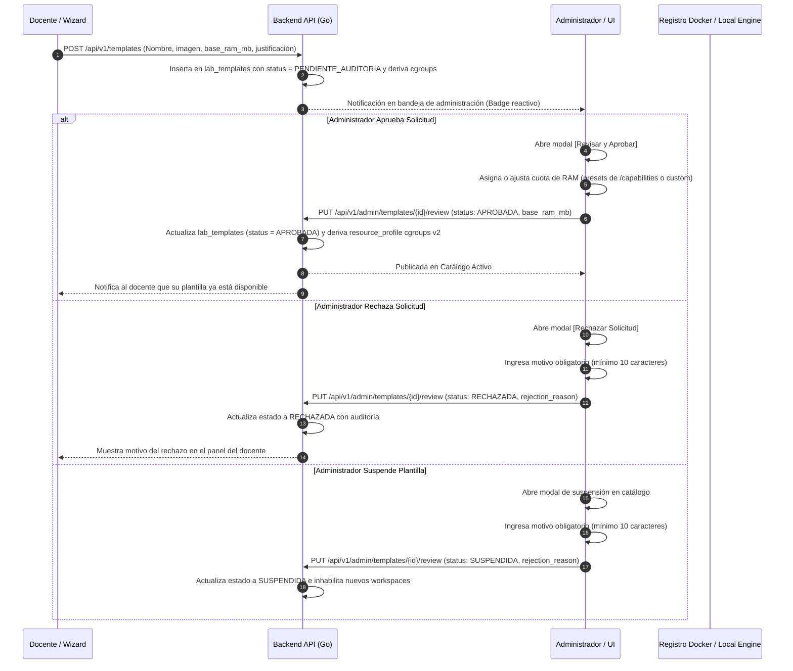

# Vista 5: Gobernanza y Aprobación de Plantillas Docker

> **Especificación Oficial de Interfaz, Componentes y Wireframes**  
> **Rol:** Administrador de Institución (Tenant Admin)  
> **Gobernanza:** SDD / Docs-as-Code / SOLV Design System / ADR-030 / Decisión D4  

---

## 1. Diagrama de Arquitectura de Gobernanza (Mermaid HD)



---

## 2. Anatomía Visual y Wireframes ASCII Técnicos

La interfaz presenta dos pestañas principales: **Solicitudes Pendientes** (con contador reactivo) y **Catálogo Activo**. Además, dispone del alternador de vista **[ Tarjetas | Lista ]** para adaptarse a la densidad de trabajo del administrador.

### 2.1 Vista en Tarjetas: Grilla Lado a Lado (Solicitudes Pendientes)

En formato tarjetas, las solicitudes se disponen en una grilla responsiva de 2 columnas donde cada tarjeta permite leer la justificación pedagógica completa sin truncamiento:

```text
┌──────────────────────────────────────────────────────────────────────────────────────────────────┐
│ SOLV | Universidad                                                           [lucide:bell] Admin │
├──────────────┬───────────────────────────────────────────────────────────────────────────────────┤
│              │ PLANTILLAS DE ENTORNOS                              Vista: [ Tarjetas | Lista ]   │
│ [ ] Inicio   │ Pestañas: [x] Solicitudes Pendientes (2)   |   [ ] Catálogo Activo (6)            │
│ [ ] Docentes ├───────────────────────────────────────────────────────────────────────────────────┤
│ [*]Plantillas│ ┌───────────────────────────────────────┐ ┌───────────────────────────────────────┐ │
│ [ ] Config.  │ │ Rust 1.80 con Herramientas            │ │ C++20 con Compilador Clang 18         │ │
│ [ ] Auditoría│ │ [ Pendiente ]      Perfil: Estándar   │ │ [ Pendiente ]      Perfil: Estándar   │ │
│              │ │ Prof. Carlos García · Prog. Avanzada  │ │ Prof. Ana Torres · Algoritmos Complej.│ │
│              │ │ Imagen: rust:1.80-slim                │ │ Imagen: silkeh/clang:18               │ │
│              │ │                                       │ │                                       │ │
│              │ │ Justificación pedagógica:             │ │ Justificación pedagógica:             │ │
│              │ │ "Práctica de concurrencia segura sin  │ │ "Necesitamos soporte de Concepts y    │ │
│              │ │ recolector de basura (GC) y Clippy."  │ │ Ranges para optimización en memoria." │ │
│              │ │                                       │ │                                       │ │
│              │ │ [ Rechazar ]    [ Revisar y Aprobar ] │ │ [ Rechazar ]    [ Revisar y Aprobar ] │ │
│              │ └───────────────────────────────────────┘ └───────────────────────────────────────┘ │
└──────────────┴───────────────────────────────────────────────────────────────────────────────────┘
```

---

### 2.2 Vista en Lista Compacta (Tabla de Alta Densidad)

Para cuando existen múltiples solicitudes acumuladas, la vista de lista proporciona una tabla rápida con acciones directas:

```text
┌──────────────────────────────────────────────────────────────────────────────────────────────────┐
│ SOLV | Universidad                                                           [lucide:bell] Admin │
├──────────────┬───────────────────────────────────────────────────────────────────────────────────┤
│              │ PLANTILLAS DE ENTORNOS                              Vista: [ Tarjetas | Lista ]   │
│ [ ] Inicio   │ Pestañas: [x] Solicitudes Pendientes (2)   |   [ ] Catálogo Activo (6)            │
│ [ ] Docentes ├───────────────────────────────────────────────────────────────────────────────────┤
│ [*]Plantillas│ ┌───────────────────────────────────────────────────────────────────────────────┐ │
│ [ ] Config.  │ │ Plantilla / Imagen     │ Solicitante   │ Materia       │ Perfil   │ Fecha     │ Acciones│ │
│ [ ] Auditoría│ ├────────────────────────┼───────────────┼───────────────┼──────────┼───────────┼─────────┤ │
│              │ │ Rust 1.80              │ C. García     │ Prog. Avanzada│ Estándar │ Hoy 10:30 │[Revisar]│ │
│              │ │ rust:1.80-slim         │               │               │          │           │         │ │
│              │ │ C++20 Clang 18         │ A. Torres     │ Algor.Complej.│ Estándar │ Ayer 16:20│[Revisar]│ │
│              │ │ silkeh/clang:18        │               │               │          │           │         │ │
│              │ └───────────────────────────────────────────────────────────────────────────────┘ │
└──────────────┴───────────────────────────────────────────────────────────────────────────────────┘
```

---

### 2.3 Modal: [ Revisar y Aprobar ] con Selector Compacto y Revelación Progresiva

Este diálogo resuelve la asignación de hardware y el alcance sin sobrecargar la pantalla:

```text
┌──────────────────────────────────────────────────────────────────────────────────────────────────┐
│ Aprobar Plantilla y Fijar Cuotas                                                     [lucide:x]  │
├──────────────────────────────────────────────────────────────────────────────────────────────────┤
│ Imagen Docker Validada: [ rust:1.80-slim                                                       ] │
│                                                                                                  │
│ Asignación de Memoria RAM por Contenedor Estudiante:                                             │
│ [ 256 MB ]   [ 512 MB (Sugerido) ]   [ 1024 MB ]                                                 │
│                                                                                                  │
│ Límite de CPU:                                                                                   │
│ [ 0.5 vCPU ]   [ 1.0 vCPU (Sugerido) ]   [ 2.0 vCPU ]                                            │
│                                                                                                  │
│ Alcance y Visibilidad:                                                                           │
│ [ Catálogo Global (Toda la universidad)                                                        v ]│
│   ├── Catálogo Global (Toda la universidad)                                                      │
│   ├── Solo materia solicitante ('Programación Avanzada')                                         │
│   └── Otra materia específica...  ────────────────────────┐                                      │
│                                                           ▼                                      │
│ (Se revela únicamente si se elige 'Otra materia'):                                               │
│ [ Seleccionar materia de destino: Sistemas Operativos I                                        v ]│
│                                                                                                  │
│                                              [ Cancelar ]   [ Confirmar y Publicar en Catálogo ] │
└──────────────────────────────────────────────────────────────────────────────────────────────────┘
```

---

### 2.4 Modal: [ Rechazar Solicitud ]

Requiere justificación obligatoria para evitar retroalimentación opaca hacia el profesor:

```text
┌──────────────────────────────────────────────────────────────────────────────────────────────────┐
│ Rechazar Solicitud de Plantilla                                                      [lucide:x]  │
├──────────────────────────────────────────────────────────────────────────────────────────────────┤
│ Docente solicitante: Prof. Carlos García · Programación Avanzada                                 │
│ Plantilla: Rust 1.80 con Herramientas                                                            │
│                                                                                                  │
│ Motivo de Rechazo (Obligatorio, visible para el docente):                                        │
│ ┌──────────────────────────────────────────────────────────────────────────────────────────────┐ │
│ │ La imagen solicitada excede el límite de peso en disco del cluster local (máximo 1.5 GB).    │ │
│ │ Por favor solicitar una variante alpine o slim con menos paquetes preinstalados.            │ │
│ └──────────────────────────────────────────────────────────────────────────────────────────────┘ │
│                                                                                                  │
│                                                      [ Cancelar ]   [ Confirmar Rechazo ]        │
└──────────────────────────────────────────────────────────────────────────────────────────────────┘
```

---

### 2.5 Pestaña 2: Catálogo Activo y Control de Ciclo de Vida

Permite supervisar los entornos en producción y desactivar versiones obsoletas:

```text
┌──────────────────────────────────────────────────────────────────────────────────────────────────┐
│ Pestañas: [ ] Solicitudes Pendientes (2)   |   [x] Catálogo Activo (6 Oficiales)                 │
├──────────────────────────────────────────────────────────────────────────────────────────────────┤
│ ┌──────────────────────────────────────────────────────────────────────────────────────────────┐ │
│ │ Entorno Oficial           │ Imagen Base           │ RAM / CPU   │ Labs Usándola │ Estado     │ Acción│ │
│ ├───────────────────────────┼───────────────────────┼─────────────┼───────────────┼────────────┼───────┤ │
│ │ Python 3.11 Data Science  │ solv/python:3.11-ds   │ 512MB / 1.0 │ 12 Prácticas  │ [Activa] │ [Pause│ │
│ │ Go 1.23 Backend Services  │ golang:1.23-bookworm  │ 512MB / 1.0 │ 8 Prácticas   │ [Activa] │ [Pause│ │
│ │ Java 21 LTS OpenJDK       │ eclipse-temurin:21    │ 1024MB/ 1.0 │ 15 Prácticas  │ [Activa] │ [Pause│ │
│ │ Node.js 20 LTS Fullstack  │ node:20-alpine        │ 512MB / 1.0 │ 6 Prácticas   │ [Activa] │ [Pause│ │
│ │ Python 3.9 Legacy         │ python:3.9-slim       │ 256MB / 0.5 │ 0 Prácticas   │ [Pausada]│ [Rean]│ │
│ └──────────────────────────────────────────────────────────────────────────────────────────────┘ │
│ Nota: Al pausar una plantilla, ya no aparece en el selector para nuevos laboratorios, pero no    │
│ altera los entornos ya creados ni las entregas pasadas.                                          │
└──────────────────────────────────────────────────────────────────────────────────────────────────┘
```

---

## 3. Reglas de Negocio, Gobernanza y Seguridad

1. **Gobernanza Institucional de Recursos (Decisión D4) y Derivación cgroups v2:**
   - El docente solo sugiere la intensidad pedagógica (Ligera / Estándar / Intensiva). La potestad de asignar megabytes de RAM y vCPUs recae 100% en el Administrador para salvaguardar la capacidad del hardware.
   - **Fórmula determinística de derivación cgroups v2:** Todo alta (`POST /api/v1/templates`), duplicación (`POST /api/v1/admin/templates/{id}/duplicate`) o cambio de memoria en revisión (`PUT /api/v1/admin/templates/{id}/review`) deriva y persiste obligatoriamente el perfil de recursos (`resource_profile`) a partir de `base_ram_mb`:
     - `min_mb = base_ram_mb / 2` (memoria garantizada de cgroups v2 `memory.min`)
     - `high_mb = base_ram_mb * 1.5` (umbral de throttling de cgroups v2 `memory.high`)
     - `max_mb = base_ram_mb * 2` (límite duro de cgroups v2 `memory.max`)
   - Las pruebas de entorno (prueba de arranque) en el worker de auditoría se configuran utilizando `base_ram_mb` (con piso de 256 MB) para respetar exactamente la cuota definida.
2. **Validación de Imagen en Registro:**
   - Antes de completar la aprobación, el backend efectúa un sondeo al registro o daemon local para certificar que el repositorio y tag especificados existen y son públicamente descargables o locales.
3. **Inmutabilidad y Deprecación Suave:**
   - Las plantillas en uso nunca se eliminan físicamente (`hard delete`) para preservar la reproducibilidad histórica de entregas y auditorías. Se marcan como `paused` o `SUSPENDIDA` para ocultarlas del asistente de creación de nuevos laboratorios.
4. **Visibilidad Granular:**
   - Por defecto, las plantillas aprobadas se publican en el Catálogo Global. No obstante, si se restringe a una materia, solo los docentes asignados a esa materia la verán en su lista de opciones.
5. **Máquina de Estados de Ciclo de Vida v2 y Gobernanza:**
   - Estados canónicos: `BORRADOR` -> `PENDIENTE_AUDITORIA` -> `APROBADA` <-> `SUSPENDIDA` / `RECHAZADA` (con soporte para `paused`).
   - Transición `APROBADA` -> `SUSPENDIDA` o `paused`:
     - Disparada únicamente por el Administrador con **motivo obligatorio de al menos 10 caracteres**.
     - Registra evento en el log de auditoría (`TEMPLATE_REVIEWED` con status `SUSPENDIDA` y justificación SEC-04).
     - **Efecto operativo:** Bloquea inmediatamente nuevas asignaciones a materias y la creación de nuevos workspaces con esa plantilla.
     - **Grandfathering:** No destruye ni altera workspaces existentes que estuvieran utilizándola. Es invisible para docentes en el selector de nuevos labs.
   - Transición `PENDIENTE_AUDITORIA` -> `RECHAZADA`:
     - Requiere justificación técnica obligatoria de al menos 10 caracteres, visible para el docente.
   - Transición `SUSPENDIDA` -> `APROBADA` (Reactivación):
     - Requiere pasar obligatoriamente por la verificación técnica completa: ejecución satisfactoria de prueba de entorno (prueba de arranque) y auditoría CVE sin vulnerabilidades críticas.
6. **Cómputo de Uso Institucional de Imágenes OCI:**
   - Para evitar métricas distorsionadas, el conteo de uso de una imagen (`usage_count` y `usage_map`) considera únicamente plantillas que fueron efectivamente válidas u operativas.
   - **Exclusión explícita:** Las plantillas con estado `RECHAZADA` nunca llegaron a desplegar un laboratorio ni workspace docente, por lo que quedan estrictamente excluidas del conteo (`WHERE status != 'RECHAZADA'`).
   - **Inclusión de suspendidas:** Las plantillas en estado `SUSPENDIDA` (o `paused`) sí se contabilizan, puesto que existieron, fueron aprobadas y operaron activamente en el entorno institucional antes de su deprecación preventiva.

---

## 4. Contrato de Integración y Endpoints Reales

### 4.1 Plantillas y Gobernanza (`/api/v1/admin/templates`)

| Método | Endpoint | Parámetros / Payload | Propósito |
| :--- | :--- | :--- | :--- |
| `GET` | `/api/v1/admin/templates` | `?status=...&search=...` | Lista plantillas con filtro por estado v2 y búsqueda de texto. |
| `GET` | `/api/v1/admin/templates/capabilities` | — | Retorna presets dinámicos de RAM y CPU según hardware del host. |
| `POST` | `/api/v1/admin/templates` | `CreateTemplateDTO` | Registra plantilla oficial derivando perfil cgroups v2. |
| `PUT` | `/api/v1/admin/templates/{id}/review` | `{ "status": "APROBADA"\|"RECHAZADA"\|"SUSPENDIDA", "rejection_reason": "...", "base_ram_mb": 1024 }` | Dictamen de revisión. Si se actualiza RAM, regenera `resource_profile`. Rechazo y suspensión exigen motivo >= 10 caracteres. |
| `POST` | `/api/v1/admin/templates/{id}/duplicate` | `{ "name": "..." }` | Clona plantilla institucional derivando perfil cgroups v2 del nuevo registro. |
| `POST` | `/api/v1/admin/templates/{id}/promote-to-model` | `{ "name": "...", "category_id": "...", "description": "..." }` | Promueve plantilla aprobada a modelo institucional reusable. |
| `GET` | `/api/v1/admin/templates/local-images` | — | Lista imágenes OCI presentes localmente en el Docker Engine. |
| `POST` | `/api/v1/admin/templates/verify-image` | `{ "image": "..." }` | Valida existencia de imagen OCI remota o local. |
| `GET` | `/api/v1/registry/verify` | `?image=...` | Consulta metadata OCI y verificación previa. |

### 4.2 Borradores Persistidos (`/api/v1/admin/templates/drafts`)

| Método | Endpoint | Parámetros / Payload | Propósito |
| :--- | :--- | :--- | :--- |
| `POST` | `/api/v1/admin/templates/drafts` | `{ "form_data": {...}, "template_id": null }` | Guarda o actualiza borrador en PostgreSQL (`template_drafts`). |
| `GET` | `/api/v1/admin/templates/drafts` | — | Obtiene el borrador activo del usuario y tenant actual. |
| `DELETE` | `/api/v1/admin/templates/drafts` | — | Elimina el borrador activo al publicar o descartar. |

### 4.3 Modelos y Categorías Institucionales

| Método | Endpoint | Parámetros / Payload | Propósito |
| :--- | :--- | :--- | :--- |
| `GET` | `/api/v1/admin/template-categories` | — | Lista categorías ordenadas por `sort_order`. |
| `POST` | `/api/v1/admin/template-categories` | `{ "name": "...", "description": "..." }` | Crea categoría institucional. |
| `PUT` | `/api/v1/admin/template-categories/reorder` | `{ "order": ["id1", "id2", ...] }` | Reordena prioridades de visualización. |
| `PUT` | `/api/v1/admin/template-categories/{id}` | `{ "name": "...", "description": "...", "is_active": true }` | Actualiza atributos de categoría. |
| `DELETE` | `/api/v1/admin/template-categories/{id}` | — | Elimina categoría si no tiene modelos ni plantillas asociadas (409 si tiene dependencias). |
| `GET` | `/api/v1/admin/template-models` | — | Lista modelos disponibles con conteo real de uso y categoría. |
| `PUT` | `/api/v1/admin/template-models/{id}` | `{ "name": "...", "description": "...", "category_id": "...", "is_active": true }` | Modifica configuración del modelo institucional. |
| `POST` | `/api/v1/admin/template-models/{id}/deactivate` | — | Desactiva modelo institucional. |
| `POST` | `/api/v1/admin/template-models/{id}/reactivate` | — | Reactiva modelo institucional. |

### 4.4 Pruebas Asíncronas de Entorno (`/api/v1/jobs/env-test`)

| Método | Endpoint | Parámetros / Payload | Propósito |
| :--- | :--- | :--- | :--- |
| `POST` | `/api/v1/jobs/env-test` | `{ "image": "...", "tools": ["python3"] }` | Despacha trabajo de prueba asíncrono con semáforo. |
| `GET` | `/api/v1/jobs/env-test/{id}` | — | Consulta avance de capas OCI y resultado de herramientas. |
| `POST` | `/api/v1/jobs/env-test/{id}/cancel` | — | Cancela job y libera ranura de semáforo inmediatamente. |

---

## 5. Asistente Modular de Registro y Prueba Asíncrona de Entorno (v1.1)

### 5.1 Principios de Diseño
- **P-01 (Input libre y universal):** El campo de imagen Docker es texto libre; ninguna asistencia lo restringe.
- **P-02 (Bloqueos proporcionales):** Solo bloquean duro la seguridad y la reproducibilidad (tag `:latest`, binarios requeridos ausentes). Todo lo demás advierte o sugiere.
- **P-03 (Sin bloqueos síncronos largos):** Ninguna operación larga bloquea la interfaz; las descargas y smoke tests se despachan como jobs asíncronos con progreso real.
- **P-04 (Revelación progresiva):** Navegación no-lineal en 3 secciones (Identidad, Entorno, Recursos) con chips de validez por sección (`COMPLETO`, `PENDIENTE`, `AVISO`).
- **P-05 (Recetas de inicio rápido):** Presets curados de 1-click para Python DS, Node LTS, GCC C++, Go SDK y Java.
- **P-06 (Autosave y reanudación en PostgreSQL):** Persistencia en BD (`template_drafts`) por usuario y tenant (`UNIQUE(tenant_id, user_id)`), reanudación automática entre sesiones o dispositivos, y guardado directo sin confirmación obligatoria.
- **P-07 (Pre-flight de publicación):** Diálogo con comprobaciones duras y advertencias informativas antes de impactar el catálogo docente.

### 5.2 Máquina de Estados del Botón de Prueba (`solv-env-test-button`)
1. **Idle (Inactivo):** 
   - E0 (Sin imagen o :latest): Deshabilitado.
   - E1 (Local): "Probar entorno (local, < 2s)".
   - E2 (Remoto): "Descargar y probar (~X MB)".
   - E3 (Stale / Digest mismatch): "Actualizar imagen y probar".
2. **Running (En ejecución):** Barra de progreso con bytes descargados, capas completadas y botón de cancelación.
3. **OK (Verificado):** Chip verde con recuento de herramientas detectadas y tiempo de ejecución.
4. **Missing (Incompleto):** Chip advertencia con detalle de binarios faltantes.
5. **Error:** Chip de error con código estructurado (`pull_stalled`, `pull_timeout`, `registry_unreachable`, `test_oom`, `test_crash`).

### 5.3 Contratos de Integración de Jobs

| Método | Endpoint | Payload / Respuesta | Propósito |
| :--- | :--- | :--- | :--- |
| `POST` | `/api/v1/jobs/env-test` | `{ "image": "...", "tools": ["python3", "pip"] }` | Inicia la prueba asíncrona (retorna `202 Accepted` con `EnvTestJob`). |
| `GET` | `/api/v1/jobs/env-test/{id}` | `{ "data": EnvTestJob }` | Consulta estado, progreso de capas y resultado. |
| `POST` | `/api/v1/jobs/env-test/{id}/cancel` | `{ "status": "canceled" }` | Cancela el job y libera el semáforo. |
| `GET` | `/api/v1/registry/verify` | `exists, archs[], size_mb, official, maintainer, is_local, digest_mismatch, from_cache` | Verificación previa de imagen y metadata OCI. |

### 5.4 Decisiones de Arquitectura
- **DA-01 (Hexagonal puro):** Cero dependencias de Docker SDK o `net/http` en `internal/core/domain` ni en `internal/core/services/env_test_service.go`.
- **DA-02 (Deadline de inactividad):** Timeout de inactividad de 60 s ante cortes de red en el streaming de capas Docker; timeout total de 15 min; liberación de semáforo en todos los caminos terminales.
- **DA-03 (Degradación de digest en 3 niveles):** Si el registro remoto es inaccesible pero la imagen existe localmente, el sistema opera en modo offline (`digest_unverified = true`).
- **DA-04 (Error codes de máquina):** Errores estructurados sin parseo de strings en el frontend.
- **DA-05 (Angular 22 Zoneless):** Signals nativos, control flow nativo (`@if`, `@for`, `@switch`), `output<void>()` y marcadores i18n correspondientes al copy deck (`TE-*`, `PB-*`).
- **DA-06 (Inyección en Composition Root):** Semáforo (2 slots), límites de memoria (256 MB) y timeouts configurados en `cmd/api/main.go`.

### 5.5 Copy Deck v1.2 y Alcance de INV-10

#### Alcance de INV-10
La regla de exhaustividad INV-10 ("ningún string fuera del deck") aplica al **flujo completo de plantillas**: modal de creación/edición, stepper, botón de prueba, diálogo de pre-flight de publicación, toasts de acción y menú de entrada.
*Nota de alcance:* El drawer de guía institucional se audita por contenido contra UX-12, no por ID unitario.

#### Tabla Adendum v1.2 (90 IDs Consolidados)

| Rango | Componente / Flujo | Descripción / Ejemplos |
| :--- | :--- | :--- |
| `TE-01` a `TE-77` | Botón de prueba asíncrona (`solv-env-test-button`) y toasts de ejecución | Estados E0-E3, progreso de descarga, capas, resultados de herramientas y fallos |
| `PB-01` a `PB-32` | Diálogo de pre-flight de publicación (`solv-publish-dialog`) | Comprobaciones duras, advertencias ámbar, métricas de hardware |
| `PB-33` a `PB-38` | Resumen de publicación (`solv-publish-dialog`) | Labels: Nombre, Imagen, Herramientas, Memoria, Servicios, Script de inicialización |
| `PB-39` | Resumen de publicación | Link: "Ver" |
| `PB-40` a `PB-41` | Resumen de publicación | Valores vacíos: "Sin script", "Sin servicios" |
| `ST-01` a `ST-03` | Stepper y navegación | Secciones: "Identidad", "Entorno", "Recursos" |
| `ST-04` a `ST-06` | Stepper chips de validez | "COMPLETO", "PENDIENTE", "AVISO" |
| `ST-07` | Stepper acciones | Botón: "Guardar borrador" |
| `ST-08` | Stepper toasts | Toast: "Borrador guardado." |
| `ST-09` | Stepper reanudación | Banner: "Continuar borrador anterior (guardado {time})." |
| `ST-10` | Menú de entrada | "Nuevo entorno" / "Nueva plantilla" |
| `ST-11` a `ST-13` | Puertas de creación | "En blanco", "Desde modelo", "Duplicar existente" |
| `ST-14` | Modelos de plantilla | Toast: "Modelo {name} aplicado. Edite lo que necesite." |
| `ST-15` | Acción catálogo | "Promover a modelo de plantilla" (acción en listado de plantillas aprobadas) |
| `ST-16` | Toast catálogo | "Plantilla promovida a modelo institucional." |

#### Familia MO-* (Modelos de Plantilla, Puertas y Suspensión)

| ID | Texto / Descripción | Contexto |
| :--- | :--- | :--- |
| `MO-01` | "Modelos de plantilla" | Título de sección de modelos |
| `MO-02` | "Entornos preconfigurados listos para usar o personalizar" | Subtítulo de sección de modelos |
| `MO-03` | "Buscar modelos (ej: Python, Web, C++)..." | Placeholder de búsqueda de modelos |
| `MO-04` | "Herramientas:" | Label de herramientas de la tarjeta |
| `MO-05` | "{count, plural, =1 {1 plantilla basada en este modelo} other {# plantillas basadas en este modelo}}" | Contador real de plantillas derivadas |
| `MO-06` | "Usar este modelo" | Botón de selección de tarjeta |
| `MO-07` | "No se encontraron modelos para la búsqueda" | Estado vacío de búsqueda de modelos |
| `MO-08` | "Confirmar cambio de modo" | Título diálogo de confirmación de puerta |
| `MO-09` | "Tiene cambios en el formulario. Cambiar de modo sobrescribirá los datos actuales. ¿Desea continuar?" | Mensaje diálogo de confirmación de puerta |
| `MO-10` | "Suspender plantilla" | Título modal de suspensión |
| `MO-11` | "Motivo de suspensión (obligatorio, visible en auditoría):" | Label de motivo de suspensión |
| `MO-12` | "Confirmar suspensión" | Botón confirmar suspensión |
| `MO-13` | "Plantilla suspendida exitosamente." | Toast de confirmación de suspensión |
| `MO-14` | "Buscar plantillas del catálogo para duplicar..." | Placeholder de búsqueda en clonación |
| `MO-15` | "Duplicar esta plantilla" | Botón de acción para duplicar plantilla |

#### Familia CA-* (Gestión Institucional de Categorías)

| ID | Texto / Descripción | Contexto |
| :--- | :--- | :--- |
| `CA-01` | "Categoría institucional:" | Label selector de categoría en Paso 2 (Identidad) |
| `CA-02` | "Administrar categorías" | Botón para abrir modal de gestión mínima |
| `CA-03` | "Gestión de Categorías de Entornos" | Título modal de categorías |
| `CA-04` | "Nombre de categoría (ej: Ciberseguridad)" | Placeholder para nueva categoría |
| `CA-05` | "Guardar categoría" | Botón guardar categoría |
| `CA-06` | "Eliminar categoría" | Botón eliminar categoría |
| `CA-07` | "No es posible eliminar la categoría porque tiene plantillas o modelos asociados." | Mensaje de error 409 Conflict |
| `CA-08` | "Sin categoría asignada" | Opción nula por defecto |

#### Configuración de Sugerencias OCI (curatedOfficialImages)
La lista de 8 imágenes Docker sugeridas en el autocompletado (`python:3.12-slim-bookworm`, `node:20-bookworm-slim`, etc.) constituye una **configuración estática semilla en cliente (allowlist)** para asistir al administrador al tipear imágenes reconocidas en el asistente de creación. No es telemetría viva ni reemplaza los modelos ni categorías dinámicos alojados en la base de datos PostgreSQL.

#### Familia PU-* (Propósito del Entorno: IDE Persistente vs Juez Virtual)

| ID | Texto / Descripción | Contexto |
| :--- | :--- | :--- |
| `PU-01` | "Propósito del entorno" | Título del Paso 1 del stepper |
| `PU-02` | "Laboratorio Interactivo (IDE Persistente)" | Título tarjeta de propósito IDE |
| `PU-03` | "Sesiones completas con editor web OpenVSCode, persistencia y soporte para bases de datos adicionales." | Descripción tarjeta IDE |
| `PU-04` | "Juez Virtual (Sandbox Algorítmico)" | Título tarjeta de propósito Juez |
| `PU-05` | "Ejecución efímera aislada en terminal para evaluación automática de código y algoritmos. Sin interfaz web ni bases de datos." | Descripción tarjeta Juez |
| `PU-06` | "Confirmar cambio de propósito" | Título diálogo de confirmación de propósito |
| `PU-07` | "Cambiar de propósito descarta las configuraciones específicas del entorno. ¿Desea continuar?" | Mensaje advertencia al cambiar de propósito con datos sucios |
| `PU-08` | "Comando de compilación o ejecución:" | Label de comando en Paso 4 para Juez |
| `PU-09` | "Tiempo límite de ejecución (ms):" | Label de timeout en Paso 4 para Juez |
| `PU-10` | "Entrada estándar de prueba (stdin - recomendada):" | Label de muestra stdin en Paso 4 para Juez |
| `PU-11` | "≈ {$INTERPOLATION} evaluaciones concurrentes estimadas en este host" | Métrica viva de capacidad para Juez Virtual |
| `PU-12` | "No hay modelos de juez registrados todavía. Podés comenzar con una plantilla en blanco." | Estado vacío de modelos para Juez |
| `PU-13` | "Completá el nombre y comando de ejecución para habilitar el guardado" | Tooltip en botón guardar borrador deshabilitado en Juez |
| `PU-14` | "Los entornos de juez virtual no utilizan bases de datos adicionales." | Mensaje informativo en Paso 5 para Juez |
| `PU-15` | "Comando de ejecución obligatorio para plantillas de juez virtual." | Validación de entrypoint en Juez |
| `PU-16` | "Anterior" | Botón de navegación anterior en stepper |
| `PU-17` | "Siguiente" | Botón de navegación siguiente en stepper |
| `PU-18` | "Propósito" | Título corto en tab 1 del stepper |
| `PU-19` | "Imagen" | Título corto en tab 3 del stepper |
| `PU-20` | "Ejecución" | Título corto en tab 4 del stepper |
| `PU-21` | "Verificación" | Título corto en tab 6 del stepper |
| `PU-21-HEADING` | "Verificación y prueba de arranque" | Título del Paso 6 del stepper |
| `PU-22` | "Registro Completo de Ejecución (Prueba de Arranque)" | Título del modal de logs completos |
| `PU-23` | "Copiar log" | Acción para copiar salida de prueba al portapapeles |
| `PU-24` | "Descargar log (.txt)" | Acción para descargar archivo de log |
| `PU-25` | "Ver log completo" | Botón para abrir modal de registro de ejecución |
| `PU-26` | "Borrador guardado automáticamente · {$TIME}" | Indicador de autoguardado en footer del asistente |
| `PU-27` | "Descartar borrador" | Botón de descarte explícito de borrador |
| `PU-28` | "Prueba obsoleta: la configuración cambió" | Mensaje de advertencia por regla stale |
| `PU-29` | "Excede la capacidad del host en {$EXCESS} MB (máximo permitido: {$MAX} MB)." | Error inline de techo estructural de RAM |
| `PU-30` | "No disponible en este host" | Badge en base de datos adicional no provista por el host |
| `PU-31` | "Opcional" | Badge en base de datos adicional disponible no obligatoria |
| `PU-32` | "Bases de datos adicionales (opcional):" | Label de sección de bases de datos en Paso 5 |

#### Familia AY-* (Ayuda Contextual, Accesibilidad por Teclado y Combobox)

| ID | Texto / Descripción | Contexto |
| :--- | :--- | :--- |
| `AY-01` | "← → eligen propósito · Enter continúa" | Hint visible de atajos de teclado en footer del Paso 1 |
| `AY-02` | "Ayuda contextual del paso" | Tooltip y aria-label del botón '?' en cabeceras de paso |
| `AY-03` | "Ver manual completo" | Enlace al manual administrativo al pie del drawer de ayuda |
| `AY-04` | "＋ Nueva categoría…" | Opción de disclosure progresivo en select de categorías |
| `AY-05` | "Nombre de la nueva categoría:" | Label / placeholder para creación inline de categoría |
| `AY-06` | "Agregar categoría" | Botón para confirmar creación de categoría inline |
| `AY-07` | "Cancelar creación de categoría" | Botón para cancelar creación de categoría inline |
| `AY-08` | "La categoría agrupa plantillas para el filtro docente." | Helper informativo debajo del selector de categorías |
| `AY-09` | "En este servidor — despliegue inmediato" | Header sticky del Grupo 1 en combobox de imágenes |
| `AY-10` | "Catálogo oficial curado — se descargará una vez" | Header sticky del Grupo 2 en combobox de imágenes |
| `AY-11` | "Sin coincidencias locales; verificaremos en el registro al continuar" | Mensaje de estado vacío en combobox de imágenes |
| `AY-12` | "{count, plural, =1 {usada en 1 plantilla} other {usada en # plantillas}}" | Chip de uso institucional real en opciones del combobox |
| `AY-13` | "Anatomía de una referencia de imagen Docker" | Título del popover de descomposición visual de imagen |
| `AY-14` | "El tag :latest está prohibido por reproducibilidad y gobernanza." | Texto explicativo en popover de imagen |
| `AY-15` | "Sugerencias según el propósito:" | Label para chips clickeables de herramientas cuando no hay familia detectada |
| `AY-16` | "Comparativa de Entornos: IDE Persistente vs Juez Virtual" | Título de tabla comparativa en drawer de ayuda (Paso 1) |
| `AY-17` | "Cerrar panel de ayuda" | Aria-label del botón cerrar del drawer lateral de ayuda |
| `AY-18` | "Sugerencias según la imagen elegida:" | Label reactivo para chips clickeables cuando se detecta familia de imagen |
| `AY-19` | "Los modelos se originan a partir de plantillas aprobadas promovidas desde el catálogo institucional o de entornos base predeterminados." | Línea informativa en la puerta Desde modelo |
| `AY-20` | "Ver detalles de promoción en el manual" | Enlace al manual para promoción de plantillas a modelos |
| `AY-21` | "Se ejecuta en segundo plano una sola vez al aprovisionar el volumen, como usuario no-root en /home/workspace. Timeout: 5 minutos. Logs en /.solv_setup.log." | Helper debajo del textarea de setup_script en Paso 4 (IDE) |
| `AY-22` | "Contrato de ejecución del script de inicialización" | Título de tabla del contrato en drawer de ayuda de Paso 4 (IDE) |
| `AY-23` | "Plantillas de script recomendadas:" | Encabezado para chips de snippets de inicialización en Paso 4 (IDE) |
| `AY-24` | "La plantilla ya está insertada en el editor" | Aviso flotante / toast al hacer segundo clic en un chip ya insertado |
| `AY-25` | "Contrato de ejecución del Juez Virtual" | Título de sección de contrato en drawer de ayuda de Paso 4 (Juez) |
| `AY-26` | "Glosario de veredictos (en tiempo de ejecución)" | Título del glosario de veredictos en drawer de ayuda de Paso 4 (Juez) |
| `AY-27` | "AC (Accepted): Código 0 y salida idéntica al caso de prueba." | Glosario veredicto AC |
| `AY-28` | "WA (Wrong Answer): Salida diferente a la esperada por el ejercicio." | Glosario veredicto WA |
| `AY-29` | "TLE (Time Limit Exceeded): Ejecución interrumpida al exceder el timeout configurado." | Glosario veredicto TLE |
| `AY-30` | "RE (Runtime Error): Terminación con código de salida distinto de cero o excepción no capturada." | Glosario veredicto RE |
| `AY-31` | "AST_BLOCKED: Bloqueo estático por análisis de sintaxis prohibida." | Glosario veredicto AST_BLOCKED |
| `AY-32` | "Reglas de Idempotencia y Contraejemplos" | Título de reglas de idempotencia en drawer de ayuda de Paso 4 (IDE) |
| `AY-33` | "Rango de 1 a 30 segundos (default: 5.000 ms). Veredicto TLE al sobrepasarlo." | Helper de campo timeout en Paso 4 (Juez) |
| `AY-34` | "Entrada recomendada para alimentar el proceso durante la prueba de arranque." | Helper de campo sample_input en Paso 4 (Juez) |
| `AY-35` | "Comando de ejecución obligatorio para plantillas de juez virtual." | Helper de campo entrypoint en Paso 4 (Juez) |


