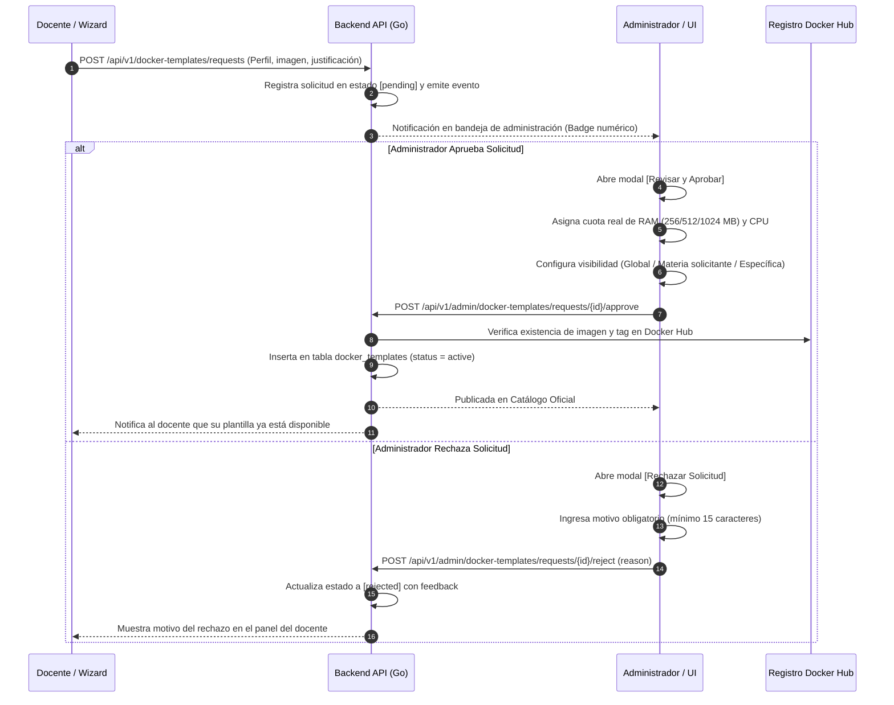

# Vista 5: Gobernanza y Aprobación de Plantillas Docker

> **Especificación Oficial de Interfaz, Componentes y Wireframes**  
> **Rol:** Administrador de Institución (Tenant Admin)  
> **Gobernanza:** SDD / Docs-as-Code / SOLV Design System / ADR-030 / Decisión D4  

---

## 1. Diagrama de Arquitectura de Gobernanza (Mermaid HD)



---

## 2. Anatomía Visual y Wireframes ASCII Técnicos

La interfaz presenta dos pestañas principales: **Solicitudes Pendientes** (con contador reactivo) y **Catálogo Activo**. Además, dispone del alternador de vista **[ Tarjetas | Lista ]** para adaptarse a la densidad de trabajo del administrador.

### 2.1 Vista en Tarjetas: Grilla Lado a Lado (Solicitudes Pendientes)

En formato tarjetas, las solicitudes se disponen en una grilla responsiva de 2 columnas donde cada tarjeta permite leer la justificación pedagógica completa sin truncamiento:

```text
┌──────────────────────────────────────────────────────────────────────────────────────────────────┐
│ SOLV | Universidad                                                           [lucide:bell] Admin │
├──────────────┬───────────────────────────────────────────────────────────────────────────────────┤
│              │ PLANTILLAS DE ENTORNOS                              Vista: [ Tarjetas | Lista ]   │
│ [ ] Inicio   │ Pestañas: [x] Solicitudes Pendientes (2)   |   [ ] Catálogo Activo (6)            │
│ [ ] Docentes ├───────────────────────────────────────────────────────────────────────────────────┤
│ [*]Plantillas│ ┌───────────────────────────────────────┐ ┌───────────────────────────────────────┐ │
│ [ ] Config.  │ │ Rust 1.80 con Herramientas            │ │ C++20 con Compilador Clang 18         │ │
│ [ ] Auditoría│ │ [ Pendiente ]      Perfil: Estándar   │ │ [ Pendiente ]      Perfil: Estándar   │ │
│              │ │ Prof. Carlos García · Prog. Avanzada  │ │ Prof. Ana Torres · Algoritmos Complej.│ │
│              │ │ Imagen: rust:1.80-slim                │ │ Imagen: silkeh/clang:18               │ │
│              │ │                                       │ │                                       │ │
│              │ │ Justificación pedagógica:             │ │ Justificación pedagógica:             │ │
│              │ │ "Práctica de concurrencia segura sin  │ │ "Necesitamos soporte de Concepts y    │ │
│              │ │ recolector de basura (GC) y Clippy."  │ │ Ranges para optimización en memoria." │ │
│              │ │                                       │ │                                       │ │
│              │ │ [ Rechazar ]    [ Revisar y Aprobar ] │ │ [ Rechazar ]    [ Revisar y Aprobar ] │ │
│              │ └───────────────────────────────────────┘ └───────────────────────────────────────┘ │
└──────────────┴───────────────────────────────────────────────────────────────────────────────────┘
```

---

### 2.2 Vista en Lista Compacta (Tabla de Alta Densidad)

Para cuando existen múltiples solicitudes acumuladas, la vista de lista proporciona una tabla rápida con acciones directas:

```text
┌──────────────────────────────────────────────────────────────────────────────────────────────────┐
│ SOLV | Universidad                                                           [lucide:bell] Admin │
├──────────────┬───────────────────────────────────────────────────────────────────────────────────┤
│              │ PLANTILLAS DE ENTORNOS                              Vista: [ Tarjetas | Lista ]   │
│ [ ] Inicio   │ Pestañas: [x] Solicitudes Pendientes (2)   |   [ ] Catálogo Activo (6)            │
│ [ ] Docentes ├───────────────────────────────────────────────────────────────────────────────────┤
│ [*]Plantillas│ ┌───────────────────────────────────────────────────────────────────────────────┐ │
│ [ ] Config.  │ │ Plantilla / Imagen     │ Solicitante   │ Materia       │ Perfil   │ Fecha     │ Acciones│ │
│ [ ] Auditoría│ ├────────────────────────┼───────────────┼───────────────┼──────────┼───────────┼─────────┤ │
│              │ │ Rust 1.80              │ C. García     │ Prog. Avanzada│ Estándar │ Hoy 10:30 │[Revisar]│ │
│              │ │ rust:1.80-slim         │               │               │          │           │         │ │
│              │ │ C++20 Clang 18         │ A. Torres     │ Algor.Complej.│ Estándar │ Ayer 16:20│[Revisar]│ │
│              │ │ silkeh/clang:18        │               │               │          │           │         │ │
│              │ └───────────────────────────────────────────────────────────────────────────────┘ │
└──────────────┴───────────────────────────────────────────────────────────────────────────────────┘
```

---

### 2.3 Modal: [ Revisar y Aprobar ] con Selector Compacto y Revelación Progresiva

Este diálogo resuelve la asignación de hardware y el alcance sin sobrecargar la pantalla:

```text
┌──────────────────────────────────────────────────────────────────────────────────────────────────┐
│ Aprobar Plantilla y Fijar Cuotas                                                     [lucide:x]  │
├──────────────────────────────────────────────────────────────────────────────────────────────────┤
│ Imagen Docker Validada: [ rust:1.80-slim                                                       ] │
│                                                                                                  │
│ Asignación de Memoria RAM por Contenedor Estudiante:                                             │
│ [ 256 MB ]   [ 512 MB (Sugerido) ]   [ 1024 MB ]                                                 │
│                                                                                                  │
│ Límite de CPU:                                                                                   │
│ [ 0.5 vCPU ]   [ 1.0 vCPU (Sugerido) ]   [ 2.0 vCPU ]                                            │
│                                                                                                  │
│ Alcance y Visibilidad:                                                                           │
│ [ Catálogo Global (Toda la universidad)                                                        v ]│
│   ├── Catálogo Global (Toda la universidad)                                                      │
│   ├── Solo materia solicitante ('Programación Avanzada')                                         │
│   └── Otra materia específica...  ────────────────────────┐                                      │
│                                                           ▼                                      │
│ (Se revela únicamente si se elige 'Otra materia'):                                               │
│ [ Seleccionar materia de destino: Sistemas Operativos I                                        v ]│
│                                                                                                  │
│                                              [ Cancelar ]   [ Confirmar y Publicar en Catálogo ] │
└──────────────────────────────────────────────────────────────────────────────────────────────────┘
```

---

### 2.4 Modal: [ Rechazar Solicitud ]

Requiere justificación obligatoria para evitar retroalimentación opaca hacia el profesor:

```text
┌──────────────────────────────────────────────────────────────────────────────────────────────────┐
│ Rechazar Solicitud de Plantilla                                                      [lucide:x]  │
├──────────────────────────────────────────────────────────────────────────────────────────────────┤
│ Docente solicitante: Prof. Carlos García · Programación Avanzada                                 │
│ Plantilla: Rust 1.80 con Herramientas                                                            │
│                                                                                                  │
│ Motivo de Rechazo (Obligatorio, visible para el docente):                                        │
│ ┌──────────────────────────────────────────────────────────────────────────────────────────────┐ │
│ │ La imagen solicitada excede el límite de peso en disco del cluster local (máximo 1.5 GB).    │ │
│ │ Por favor solicitar una variante alpine o slim con menos paquetes preinstalados.            │ │
│ └──────────────────────────────────────────────────────────────────────────────────────────────┘ │
│                                                                                                  │
│                                                      [ Cancelar ]   [ Confirmar Rechazo ]        │
└──────────────────────────────────────────────────────────────────────────────────────────────────┘
```

---

### 2.5 Pestaña 2: Catálogo Activo y Control de Ciclo de Vida

Permite supervisar los entornos en producción y desactivar versiones obsoletas:

```text
┌──────────────────────────────────────────────────────────────────────────────────────────────────┐
│ Pestañas: [ ] Solicitudes Pendientes (2)   |   [x] Catálogo Activo (6 Oficiales)                 │
├──────────────────────────────────────────────────────────────────────────────────────────────────┤
│ ┌──────────────────────────────────────────────────────────────────────────────────────────────┐ │
│ │ Entorno Oficial           │ Imagen Base           │ RAM / CPU   │ Labs Usándola │ Estado     │ Acción│ │
│ ├───────────────────────────┼───────────────────────┼─────────────┼───────────────┼────────────┼───────┤ │
│ │ Python 3.11 Data Science  │ solv/python:3.11-ds   │ 512MB / 1.0 │ 12 Prácticas  │ [Activa] │ [Pause│ │
│ │ Go 1.23 Backend Services  │ golang:1.23-bookworm  │ 512MB / 1.0 │ 8 Prácticas   │ [Activa] │ [Pause│ │
│ │ Java 21 LTS OpenJDK       │ eclipse-temurin:21    │ 1024MB/ 1.0 │ 15 Prácticas  │ [Activa] │ [Pause│ │
│ │ Node.js 20 LTS Fullstack  │ node:20-alpine        │ 512MB / 1.0 │ 6 Prácticas   │ [Activa] │ [Pause│ │
│ │ Python 3.9 Legacy         │ python:3.9-slim       │ 256MB / 0.5 │ 0 Prácticas   │ [Pausada]│ [Rean]│ │
│ └──────────────────────────────────────────────────────────────────────────────────────────────┘ │
│ Nota: Al pausar una plantilla, ya no aparece en el selector para nuevos laboratorios, pero no    │
│ altera los entornos ya creados ni las entregas pasadas.                                          │
└──────────────────────────────────────────────────────────────────────────────────────────────────┘
```

---

## 3. Reglas de Negocio, Gobernanza y Seguridad

1. **Gobernanza Institucional de Recursos (Decisión D4):**
   - El docente solo sugiere la intensidad pedagógica (Ligera / Estándar / Intensiva). La potestad de asignar megabytes de RAM y vCPUs recae 100% en el Administrador para salvaguardar la capacidad del hardware.
2. **Validación de Imagen en Registro:**
   - Antes de completar la aprobación, el backend efectúa un sondeo al registro oficial para certificar que el repositorio y tag especificados existen y son públicamente descargables.
3. **Inmutabilidad y Deprecación Suave:**
   - Las plantillas en uso nunca se eliminan físicamente (`hard delete`) para preservar la reproducibilidad histórica de entregas y auditorías. Se marcan como `paused` para ocultarlas del asistente de creación de nuevos laboratorios.
4. **Visibilidad Granular:**
   - Por defecto, las plantillas aprobadas se publican en el Catálogo Global. No obstante, si se restringe a una materia, solo los docentes asignados a esa materia la verán en su lista de opciones.

---

## 4. Contrato de Integración y Endpoints (v0.16.0)

| Método | Endpoint | Parámetros / Payload | Propósito |
| :--- | :--- | :--- | :--- |
| `GET` | `/api/v1/admin/docker-templates/requests` | `?status=pending` | Lista solicitudes docentes pendientes de revisión. |
| `POST` | `/api/v1/admin/docker-templates/requests/{id}/approve` | `{ "ram_limit_mb": 512, "cpu_limit": 1.0, "scope": "global", "course_id": null }` | Aprueba la solicitud, fija límites y publica la plantilla. |
| `POST` | `/api/v1/admin/docker-templates/requests/{id}/reject` | `{ "reason": "La imagen excede el límite de peso..." }` | Rechaza la solicitud con justificación obligatoria. |
| `GET` | `/api/v1/admin/docker-templates` | `?include_paused=true` | Lista el catálogo institucional completo de plantillas. |
| `PATCH` | `/api/v1/admin/docker-templates/{id}/status` | `{ "is_active": false }` | Pausa o reactiva una plantilla en el catálogo oficial. |

---

## 5. Asistente Modular de Registro y Prueba Asíncrona de Entorno (v1.1)

### 5.1 Principios de Diseño
- **P-01 (Input libre y universal):** El campo de imagen Docker es texto libre; ninguna asistencia lo restringe.
- **P-02 (Bloqueos proporcionales):** Solo bloquean duro la seguridad y la reproducibilidad (tag `:latest`, binarios requeridos ausentes). Todo lo demás advierte o sugiere.
- **P-03 (Sin bloqueos síncronos largos):** Ninguna operación larga bloquea la interfaz; las descargas y smoke tests se despachan como jobs asíncronos con progreso real.
- **P-04 (Revelación progresiva):** Navegación no-lineal en 3 secciones (Identidad, Entorno, Recursos) con chips de validez por sección (`COMPLETO`, `PENDIENTE`, `AVISO`).
- **P-05 (Recetas de inicio rápido):** Presets curados de 1-click para Python DS, Node LTS, GCC C++, Go SDK y Java.
- **P-06 (Autosave y reanudación):** Persistencia automática de borrador en almacenamiento local y guardado directo sin confirmación obligatoria.
- **P-07 (Pre-flight de publicación):** Diálogo con comprobaciones duras y advertencias informativas antes de impactar el catálogo docente.

### 5.2 Máquina de Estados del Botón de Prueba (`solv-env-test-button`)
1. **Idle (Inactivo):** 
   - E0 (Sin imagen o :latest): Deshabilitado.
   - E1 (Local): "Probar entorno (local, < 2s)".
   - E2 (Remoto): "Descargar y probar (~X MB)".
   - E3 (Stale / Digest mismatch): "Actualizar imagen y probar".
2. **Running (En ejecución):** Barra de progreso con bytes descargados, capas completadas y botón de cancelación.
3. **OK (Verificado):** Chip verde con recuento de herramientas detectadas y tiempo de ejecución.
4. **Missing (Incompleto):** Chip advertencia con detalle de binarios faltantes.
5. **Error:** Chip de error con código estructurado (`pull_stalled`, `pull_timeout`, `registry_unreachable`, `test_oom`, `test_crash`).

### 5.3 Contratos de Integración de Jobs

| Método | Endpoint | Payload / Respuesta | Propósito |
| :--- | :--- | :--- | :--- |
| `POST` | `/api/v1/jobs/env-test` | `{ "image": "...", "tools": ["python3", "pip"] }` | Inicia la prueba asíncrona (retorna `202 Accepted` con `EnvTestJob`). |
| `GET` | `/api/v1/jobs/env-test/{id}` | `{ "data": EnvTestJob }` | Consulta estado, progreso de capas y resultado. |
| `POST` | `/api/v1/jobs/env-test/{id}/cancel` | `{ "status": "canceled" }` | Cancela el job y libera el semáforo. |
| `GET` | `/api/v1/registry/verify` | `exists, archs[], size_mb, official, maintainer, is_local, digest_mismatch, from_cache` | Verificación previa de imagen y metadata OCI. |

### 5.4 Decisiones de Arquitectura
- **DA-01 (Hexagonal puro):** Cero dependencias de Docker SDK o `net/http` en `internal/core/domain` ni en `internal/core/services/env_test_service.go`.
- **DA-02 (Deadline de inactividad):** Timeout de inactividad de 60 s ante cortes de red en el streaming de capas Docker; timeout total de 15 min; liberación de semáforo en todos los caminos terminales.
- **DA-03 (Degradación de digest en 3 niveles):** Si el registro remoto es inaccesible pero la imagen existe localmente, el sistema opera en modo offline (`digest_unverified = true`).
- **DA-04 (Error codes de máquina):** Errores estructurados sin parseo de strings en el frontend.
- **DA-05 (Angular 22 Zoneless):** Signals nativos, control flow nativo (`@if`, `@for`, `@switch`), `output<void>()` y marcadores i18n correspondientes al copy deck (`TE-*`, `PB-*`).
- **DA-06 (Inyección en Composition Root):** Semáforo (2 slots), límites de memoria (256 MB) y timeouts configurados en `cmd/api/main.go`.

### 5.5 Copy Deck v1.2 y Alcance de INV-10

#### Alcance de INV-10
La regla de exhaustividad INV-10 ("ningún string fuera del deck") aplica al **flujo completo de plantillas**: modal de creación/edición, stepper, botón de prueba, diálogo de pre-flight de publicación, toasts de acción y menú de entrada.
*Nota de alcance:* El drawer de guía institucional se audita por contenido contra UX-12, no por ID unitario.

#### Tabla Adendum v1.2 (90 IDs Consolidados)

| Rango | Componente / Flujo | Descripción / Ejemplos |
| :--- | :--- | :--- |
| `TE-01` a `TE-77` | Botón de prueba asíncrona (`solv-env-test-button`) y toasts de ejecución | Estados E0-E3, progreso de descarga, capas, resultados de herramientas y fallos |
| `PB-01` a `PB-32` | Diálogo de pre-flight de publicación (`solv-publish-dialog`) | Comprobaciones duras, advertencias ámbar, métricas de hardware |
| `PB-33` a `PB-38` | Resumen de publicación (`solv-publish-dialog`) | Labels: Nombre, Imagen, Herramientas, Memoria, Servicios, Script de inicialización |
| `PB-39` | Resumen de publicación | Link: "Ver" |
| `PB-40` a `PB-41` | Resumen de publicación | Valores vacíos: "Sin script", "Sin servicios" |
| `ST-01` a `ST-03` | Stepper y navegación | Secciones: "Identidad", "Entorno", "Recursos" |
| `ST-04` a `ST-06` | Stepper chips de validez | "COMPLETO", "PENDIENTE", "AVISO" |
| `ST-07` | Stepper acciones | Botón: "Guardar borrador" |
| `ST-08` | Stepper toasts | Toast: "Borrador guardado." |
| `ST-09` | Stepper reanudación | Banner: "Continuar borrador anterior (guardado {time})." |
| `ST-10` | Menú de entrada | "Nueva plantilla" |
| `ST-11` a `ST-13` | Puertas de creación | "En blanco", "Desde receta", "Duplicar existente" |
| `ST-14` | Recetas rápidas | Toast: "Receta {name} aplicada. Edite lo que necesite." |
| `ST-15` | Recetas institucionales | Acción: "Guardar como receta institucional" |
| `ST-16` | Recetas institucionales | Toast: "Solicitud de receta enviada a aprobación." |

