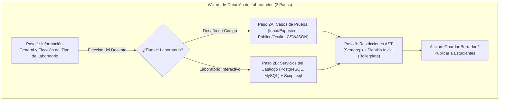

# Vista 4: Creación y Edición de Laboratorios — Wizard Unificado

> **Especificación Oficial de Interfaz, Componentes y Wireframes**  
> **Rol:** Docente  
> **Gobernanza:** SDD / Docs-as-Code / SOLV Design System / ADR-006 / ADR-019 / ADR-026  

---

## 1. Diagrama de Arquitectura del Wizard (Mermaid Visual HD)



---

## 2. Anatomía Visual y Wireframes ASCII Técnicos

### 2.1 Paso 1: Información General y Tipo de Laboratorio

```text
┌──────────────────────────────────────────────────────────────────────────────────────────────────┐
│ [< Volver a Cursos]   Crear Nuevo Laboratorio                                                    │
├──────────────────────────────────────────────────────────────────────────────────────────────────┤
│ PASOS:  [x] 1. Tipo y Enunciado  ───  [ ] 2. Configuración Técnica  ───  [ ] 3. Reglas y Plantilla │
├──────────────────────────────────────────────────────────────────────────────────────────────────┤
│ Título del Laboratorio: [ Ej: Estructuras de Datos Avanzadas                                   ] │
│ Materia / Curso:        [ Programación II · Semestre 2026-2                                  v ] │
│                                                                                                  │
│ SELECCIONAR TIPO DE LABORATORIO:                                                                 │
│ ┌──────────────────────────────────────────────┬───────────────────────────────────────────────┐ │
│ │ (*) Desafío de Código (Juez Automático)      │ ( ) Laboratorio Interactivo (VS Code + DB)     │ │
│ │ Evaluación algorítmica efímera mediante      │ Entorno interactivo persistente con servicios │ │
│ │ casos de prueba automáticos y reglas AST.    │ de catálogo (PostgreSQL, MySQL) acoplados.   │ │
│ └──────────────────────────────────────────────┴───────────────────────────────────────────────┘ │
│                                                                                                  │
│ Lenguaje Principal: [ Python 3.11 v ]   | Límites: Tiempo [ 1000 ] ms  | Memoria RAM [ 128 ] MB    │
│                                                                                                  │
│ Enunciado / Guía de Práctica (Editor Markdown con Vista Previa):                                 │
│ ┌──────────────────────────────────────────────┬───────────────────────────────────────────────┐ │
│ │ [lucide:edit-3] Escribir Enunciado           │ [lucide:eye] Vista Previa Renderizada         │ │
│ │                                              │                                               │ │
│ │ Implemente una función de búsqueda...        │ Implemente una función de búsqueda...         │ │
│ └──────────────────────────────────────────────┴───────────────────────────────────────────────┘ │
│                                                                                                  │
│                                                                 [ Cancelar ]  [ Siguiente Paso > ]│
└──────────────────────────────────────────────────────────────────────────────────────────────────┘
```

---

### 2.2 Paso 2A: Casos de Prueba (Para Desafío de Código)

```text
┌──────────────────────────────────────────────────────────────────────────────────────────────────┐
│ [< Volver a Cursos]   Crear Nuevo Laboratorio                                                    │
├──────────────────────────────────────────────────────────────────────────────────────────────────┤
│ PASOS:  [ ] 1. Tipo y Enunciado  ───  [x] 2. Casos de Prueba  ───  [ ] 3. Reglas y Plantilla     │
├──────────────────────────────────────────────────────────────────────────────────────────────────┤
│ BATERÍA DE CASOS DE PRUEBA                                                                       │
│ [+ Añadir Caso Manual]   [lucide:upload] Importar desde CSV/JSON                                 │
│ ┌────┬─────────────────────────┬─────────────────────────┬───────────────────┬─────────────────┐ │
│ │ #  │ Entrada (Input)         │ Salida Esperada (Output)│ Visibilidad       │ Acción          │ │
│ ├────┼─────────────────────────┼─────────────────────────┼───────────────────┼─────────────────┤ │
│ │ 1  │ [5, 2, 9, 1]            │ [1, 2, 5, 9]            │ [x] Caso Público  │ [lucide:trash-2]│ │
│ │ 2  │ [100, -50, 0, 9999]     │ [-50, 0, 100, 9999]     │ [ ] Caso Privado  │ [lucide:trash-2]│ │
│ └────┴─────────────────────────┴─────────────────────────┴───────────────────┴─────────────────┘ │
│ Nota: Los casos marcados como "Privados" evalúan a ciegas sin mostrar entradas/salidas al alumno. │
│                                                                                                  │
│                                                                [< Anterior]   [ Siguiente Paso > ]│
└──────────────────────────────────────────────────────────────────────────────────────────────────┘
```

---

### 2.3 Paso 2B: Configuración de Catálogo (Para Laboratorio Interactivo — ADR-006)

```text
┌──────────────────────────────────────────────────────────────────────────────────────────────────┐
│ [< Volver a Cursos]   Crear Nuevo Laboratorio                                                    │
├──────────────────────────────────────────────────────────────────────────────────────────────────┤
│ PASOS:  [ ] 1. Tipo y Enunciado  ───  [x] 2. Base de Datos y Catálogo  ───  [ ] 3. Plantilla     │
├──────────────────────────────────────────────────────────────────────────────────────────────────┤
│ SERVICIOS DEL CATÁLOGO LOCAL (ADR-006)                                                           │
│ Seleccione la Base de Datos acoplada al entorno del estudiante:                                  │
│ [(*) PostgreSQL 18]   [ ( ) MySQL 8.4 ]   [ ( ) MongoDB 7.0 ]   [ ( ) Sin Base de Datos]        │
│                                                                                                  │
│ SCRIPT DE INICIALIZACIÓN SQL (Seeding de Base de Datos):                                         │
│ ┌──────────────────────────────────────────────────────────────────────────────────────────────┐ │
│ │ CREATE TABLE estudiantes (id SERIAL PRIMARY KEY, nombre VARCHAR(100));                       │ │
│ │ INSERT INTO estudiantes (nombre) VALUES ('Carlos Ruiz'), ('Ana Torres');                     │ │
│ └──────────────────────────────────────────────────────────────────────────────────────────────┘ │
│ [lucide:paperclip] Adjuntar archivo script.sql o dump inicial                                    │
│                                                                                                  │
│                                                                [< Anterior]   [ Siguiente Paso > ]│
└──────────────────────────────────────────────────────────────────────────────────────────────────┘
```

---

### 2.4 Paso 3: Restricciones AST y Plantilla Inicial (Boilerplate)

```text
┌──────────────────────────────────────────────────────────────────────────────────────────────────┐
│ [< Volver a Cursos]   Crear Nuevo Laboratorio                                                    │
├──────────────────────────────────────────────────────────────────────────────────────────────────┤
│ PASOS:  [ ] 1. Tipo y Enunciado  ───  [ ] 2. Configuración Técnica  ───  [x] 3. Reglas y Plantilla │
├──────────────────────────────────────────────────────────────────────────────────────────────────┤
│ 1. RESTRICCIONES DE ANÁLISIS ESTÁTICO (AST / Semgrep — ADR-026)                                  │
│ Active reglas pedagógicas para bloquear atajos sintácticos:                                      │
│ [x] Bloquear funciones nativas de ordenamiento (ej: .sort(), sorted())                           │
│ [x] Bloquear importación de módulos de sistema (ej: os, sys, subprocess)                         │
│ [ ] Bloquear estructuras iterativas 'for' (Forzar resolución recursiva)                          │
│                                                                                                  │
│ 2. CÓDIGO INICIAL PARA EL ESTUDIANTE (Boilerplate)                                               │
│ ┌──────────────────────────────────────────────────────────────────────────────────────────────┐ │
│ │ 1  def busqueda_matriz(arr, target):                                                         │ │
│ │ 2      # TODO: Implemente su algoritmo aquí                                                  │ │
│ │ 3      pass                                                                                  │ │
│ └──────────────────────────────────────────────────────────────────────────────────────────────┘ │
│                                                                                                  │
│                                           [ Guardar Borrador ]   [lucide:check] [ Publicar Lab ] │
└──────────────────────────────────────────────────────────────────────────────────────────────────┘
```

---

## 3. Especificación Visual e Iconografía Lucide

- **Navegación del Wizard:** Indicador de pasos con estado `[x]` para completado/activo y `[ ]` para pendiente.
- **Importación Masiva de Pruebas:** Botón `[lucide:upload] Importar desde CSV/JSON` para procesar archivos de test cases grandes en el frontend.
- **Iconos de Acción:** `lucide:trash-2` para remover filas de casos de prueba, `lucide:paperclip` para adjuntar scripts SQL o datasets y `lucide:check` para la acción final de publicación.

---

## 4. Inventario de Componentes Angular a Construir

| Componente | Tipo / Rol | Ubicación en Código |
|---|---|---|
| `CreateLabWizard` | Contenedor Principal del Formulario por Pasos | `features/teacher/create-lab/` |
| `LabTypeSelector` | Selector de Modalidad (*Desafío de Código* vs *Laboratorio Interactivo*) | `features/teacher/create-lab/components/` |
| `MarkdownEditorWithPreview` | Editor de Enunciado en Tiempo Real | `shared/ui/editors/` |
| `TestCasesGrid` | Tabla Dinámica con Importador CSV/JSON | `features/teacher/create-lab/components/` |
| `DatabaseCatalogSelector` | Selector de BD del Catálogo con Carga de Script SQL | `features/teacher/create-lab/components/` |
| `AstRulesForm` | Formulario de Checkboxes Semgrep y Boilerplate Editor | `features/teacher/create-lab/components/` |
