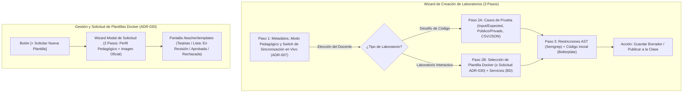

# Vista 4: Creación y Edición de Laboratorios — Wizard Unificado y Gestión de Plantillas

> **Especificación Oficial de Interfaz, Componentes y Wireframes**  
> **Rol:** Docente  
> **Gobernanza:** SDD / Docs-as-Code / SOLV Design System / ADR-006 / ADR-007 / ADR-019 / ADR-026 / ADR-030  

---

## 1. Diagrama de Arquitectura del Wizard


```mermaid
graph TD
    subgraph WizardDocente ["Wizard de Creación de Laboratorios (3 Pasos)"]
        Paso1["Paso 1: Metadatos, Modo Pedagógico y Switch de Sincronización en Vivo (ADR-007)"]
        
        Paso1 -->|Elección del Docente| DecisionTipo{"¿Tipo de Laboratorio?"}
        
        DecisionTipo -->|Desafío de Código| Paso2Juez["Paso 2A: Casos de Prueba (Input/Expected, Público/Privado, CSV/JSON)"]
        DecisionTipo -->|Laboratorio Interactivo| Paso2IDE["Paso 2B: Selección de Plantilla Docker (o Solicitud ADR-030) + Servicios (BD)"]
        
        Paso2Juez --> Paso3["Paso 3: Restricciones AST (Semgrep) + Código Inicial (Boilerplate)"]
        Paso2IDE --> Paso3
        
        Paso3 --> Guardar["Acción: Guardar Borrador / Publicar a la Clase"]
    end

    subgraph FlujoPlantillas ["Gestión y Solicitud de Plantillas Docker (ADR-030)"]
        BotonSolicitar["Botón [+ Solicitar Nueva Plantilla]"]
        ModalSolicitud["Wizard Modal de Solicitud (2 Pasos: Perfil Pedagógico + Imagen Oficial)"]
        VistaSeguimiento["Pantalla /teacher/templates (Tarjetas / Lista: En Revisión / Aprobada / Rechazada)"]
        
        BotonSolicitar --> ModalSolicitud
        ModalSolicitud --> VistaSeguimiento
    end
```

---

## 2. Anatomía Visual y Wireframes ASCII Técnicos

### 2.1 Paso 1: Información General, Tipo de Laboratorio y Switch ADR-007

```text
┌──────────────────────────────────────────────────────────────────────────────────────────────────┐
│ [< Volver a Cursos]   Crear Nuevo Laboratorio                                                    │
├──────────────────────────────────────────────────────────────────────────────────────────────────┤
│ PASOS:  [x] 1. Tipo y Enunciado  ───  [ ] 2. Configuración Técnica  ───  [ ] 3. Reglas y Plantilla │
├──────────────────────────────────────────────────────────────────────────────────────────────────┤
│ Título del Laboratorio: [ Ej: Estructuras de Datos Avanzadas                                   ] │
│ Materia / Curso:        [ Programación II · Semestre 2026-2                                  v ] │
│                                                                                                  │
│ SELECCIONAR MODALIDAD:                                                                           │
│ ┌──────────────────────────────────────────────┬───────────────────────────────────────────────┐ │
│ │ (*) Desafío de Código (Juez Automático)      │ ( ) Laboratorio Interactivo (VS Code + DB)     │ │
│ │ Evaluación algorítmica efímera con casos de  │ Entorno completo persistente con servicios    │ │
│ │ prueba automáticos y restricciones AST.      │ de catálogo (PostgreSQL, MySQL) acoplados.    │ │
│ └──────────────────────────────────────────────┴───────────────────────────────────────────────┘ │
│                                                                                                  │
│ OPCIONES PEDAGÓGICAS Y DE CONTROL:                                                               │
│ [x] Permitir emisión de código en vivo a la clase (ADR-007)                                      │
│     (Habilita que puedas enviar snapshots de tu código durante la clase práctica)                │
│                                                                                                  │
│ Lenguaje Principal: [ Python 3.11 v ]   | Límites: Tiempo [ 1000 ] ms  | Memoria [ Estándar v ]  │
│                                                                                                  │
│ Enunciado / Guía de Práctica (Editor Markdown con Vista Previa):                                 │
│ ┌──────────────────────────────────────────────┬───────────────────────────────────────────────┐ │
│ │ [lucide:edit-3] Escribir Enunciado           │ [lucide:eye] Vista Previa Renderizada         │ │
│ │                                              │                                               │ │
│ │ Implemente una función de búsqueda...        │ Implemente una función de búsqueda...         │ │
│ └──────────────────────────────────────────────┴───────────────────────────────────────────────┘ │
│                                                                                                  │
│                                                                 [ Cancelar ]  [ Siguiente Paso > ]│
└──────────────────────────────────────────────────────────────────────────────────────────────────┘
```

---

### 2.2 Paso 2A: Casos de Prueba (Para Desafío de Código)

```text
┌──────────────────────────────────────────────────────────────────────────────────────────────────┐
│ [< Volver a Cursos]   Crear Nuevo Laboratorio                                                    │
├──────────────────────────────────────────────────────────────────────────────────────────────────┤
│ PASOS:  [ ] 1. Tipo y Enunciado  ───  [x] 2. Casos de Prueba  ───  [ ] 3. Reglas y Plantilla     │
├──────────────────────────────────────────────────────────────────────────────────────────────────┤
│ BATERÍA DE CASOS DE PRUEBA                                                                       │
│ [+ Añadir Caso Manual]   [lucide:upload] Importar desde CSV/JSON                                 │
│ ┌────┬─────────────────────────┬─────────────────────────┬───────────────────┬─────────────────┐ │
│ │ #  │ Entrada (Input)         │ Salida Esperada (Output)│ Visibilidad       │ Acción          │ │
│ ├────┼─────────────────────────┼─────────────────────────┼───────────────────┼─────────────────┤ │
│ │ 1  │ [5, 2, 9, 1]            │ [1, 2, 5, 9]            │ [x] Caso Público  │ [lucide:trash-2]│ │
│ │ 2  │ [100, -50, 0, 9999]     │ [-50, 0, 100, 9999]     │ [ ] Caso Privado  │ [lucide:trash-2]│ │
│ └────┴─────────────────────────┴─────────────────────────┴───────────────────┴─────────────────┘ │
│ Nota: Los casos privados evalúan sin mostrar entradas ni salidas al estudiante (cero filtración).│
│                                                                                                  │
│                                                                [< Anterior]   [ Siguiente Paso > ]│
└──────────────────────────────────────────────────────────────────────────────────────────────────┘
```

---

### 2.3 Paso 2B: Selección de Entorno y Catálogo (Para Laboratorio Interactivo)

```text
┌──────────────────────────────────────────────────────────────────────────────────────────────────┐
│ [< Volver a Cursos]   Crear Nuevo Laboratorio                                                    │
├──────────────────────────────────────────────────────────────────────────────────────────────────┤
│ PASOS:  [ ] 1. Tipo y Enunciado  ───  [x] 2. Entorno y Base de Datos  ───  [ ] 3. Plantilla       │
├──────────────────────────────────────────────────────────────────────────────────────────────────┤
│ PLANTILLA DEL ENTORNO DE DESARROLLO (ADR-030)                                                    │
│ Seleccione la plantilla base para el OpenVSCode Server:                                          │
│ [ Python 3.11 Data Science (Oficial) v ]    [ + Solicitar Nueva Plantilla Docker ]              │
│                                                                                                  │
│ SERVICIOS DE BASE DE DATOS (ADR-006):                                                            │
│ [(*) PostgreSQL 18]   [ ( ) MySQL 8.4 ]   [ ( ) MongoDB 7.0 ]   [ ( ) Sin Base de Datos]        │
│                                                                                                  │
│ SCRIPT DE INICIALIZACIÓN SQL (Opcional):                                                         │
│ ┌──────────────────────────────────────────────────────────────────────────────────────────────┐ │
│ │ CREATE TABLE estudiantes (id SERIAL PRIMARY KEY, nombre VARCHAR(100));                       │ │
│ │ INSERT INTO estudiantes (nombre) VALUES ('Carlos Ruiz'), ('Ana Torres');                     │ │
│ └──────────────────────────────────────────────────────────────────────────────────────────────┘ │
│ [lucide:paperclip] Adjuntar archivo script.sql o dump inicial                                    │
│                                                                                                  │
│                                                                [< Anterior]   [ Siguiente Paso > ]│
└──────────────────────────────────────────────────────────────────────────────────────────────────┘
```

---

### 2.4 Paso 3: Restricciones AST y Plantilla Inicial (Boilerplate)

```text
┌──────────────────────────────────────────────────────────────────────────────────────────────────┐
│ [< Volver a Cursos]   Crear Nuevo Laboratorio                                                    │
├──────────────────────────────────────────────────────────────────────────────────────────────────┤
│ PASOS:  [ ] 1. Tipo y Enunciado  ───  [ ] 2. Configuración Técnica  ───  [x] 3. Reglas y Plantilla │
├──────────────────────────────────────────────────────────────────────────────────────────────────┤
│ 1. RESTRICCIONES DE ANÁLISIS ESTÁTICO (AST / Semgrep — ADR-026)                                  │
│ Active reglas pedagógicas para bloquear atajos sintácticos:                                      │
│ [x] Bloquear funciones nativas de ordenamiento (ej: .sort(), sorted())                           │
│ [x] Bloquear importación de módulos de sistema (ej: os, sys, subprocess)                         │
│ [ ] Bloquear estructuras iterativas 'for' (Forzar resolución recursiva)                          │
│                                                                                                  │
│ 2. CÓDIGO INICIAL PARA EL ESTUDIANTE (Boilerplate)                                               │
│ ┌──────────────────────────────────────────────────────────────────────────────────────────────┐ │
│ │ 1  def busqueda_matriz(arr, target):                                                         │ │
│ │ 2      # TODO: Implemente su algoritmo aquí                                                  │ │
│ │ 3      pass                                                                                  │ │
│ └──────────────────────────────────────────────────────────────────────────────────────────────┘ │
│                                                                                                  │
│                                           [ Guardar Borrador ]   [lucide:check] [ Publicar Lab ] │
└──────────────────────────────────────────────────────────────────────────────────────────────────┘
```

---

## 3. Flujo de Solicitud de Plantilla Docker (ADR-030)

Para evitar sobrecargar al docente con detalles técnicos de infraestructura (como calcular megabytes exactos de memoria RAM) y asegurar la gobernanza del servidor, la solicitud se realiza mediante un diálogo modal de 2 pasos asistidos:

### 3.1 Modal de Solicitud (2 Pasos)

#### Paso 1: Perfil de Carga Pedagógica
```text
┌──────────────────────────────────────────────────────────────────────────────────────────────────┐
│ Solicitar Nueva Plantilla Docker                                                   [lucide:x]   │
├──────────────────────────────────────────────────────────────────────────────────────────────────┤
│ PASO 1 de 2: Selecciona la intensidad de cómputo para la materia                                 │
│                                                                                                  │
│ ( ) Ligera: Lenguajes interpretados o scripts básicos (ej: Python básico, Node.js scripts).      │
│ (*) Estándar: Compilación estándar, frameworks web o bases de datos ligeras (ej: Go, C++, Java). │
│ ( ) Intensiva: Procesamiento pesado, ciencia de datos o compilación masiva (ej: Rust, Android).  │
│                                                                                                  │
│  Nota: La asignación de cuota de memoria real será fijada por la administración del sistema.    │
│                                                                                                  │
│                                                                             [ Siguiente Paso > ] │
└──────────────────────────────────────────────────────────────────────────────────────────────────┘
```

#### Paso 2: Imagen Base y Justificación Académica
```text
┌──────────────────────────────────────────────────────────────────────────────────────────────────┐
│ Solicitar Nueva Plantilla Docker                                                   [lucide:x]   │
├──────────────────────────────────────────────────────────────────────────────────────────────────┤
│ PASO 2 de 2: Referencia de imagen y justificación de la materia                                  │
│                                                                                                  │
│ Nombre descriptivo: [ Ej: Rust 1.80 con Herramientas de Análisis                               ] │
│ Imagen Docker Hub:  [ rust:1.80-slim                                                           ] │
│ Materia solicitante: [ Programación Avanzada · Semestre 2026-2                                v ] │
│ Justificación:      [ Se requiere para la práctica de concurrencia segura y manejo de memoria ] │
│                                                                                                  │
│                                                                [< Anterior]   [ Enviar Solicitud ]│
└──────────────────────────────────────────────────────────────────────────────────────────────────┘
```

---

### 3.2 Pantalla de Seguimiento de Plantillas (`/teacher/templates`)

El docente puede revisar el estado de sus solicitudes desde su módulo de ajustes o catálogo personal, con alternador entre vista de Tarjetas y Lista:

```text
┌──────────────────────────────────────────────────────────────────────────────────────────────────┐
│ MIS PLANTILLAS Y SOLICITUDES                                        Vista: [ Tarjetas | Lista ]  │
├──────────────────────────────────────────────────────────────────────────────────────────────────┤
│ ┌──────────────────────────────────────────────────────────────────────────────────────────────┐ │
│ │ Rust 1.80 con Herramientas                       [En Revisión]  │ Perfil: Estándar        │ │
│ │ Imagen: rust:1.80-slim                           Solicitado: Hoy 10:30                       │ │
│ │ Justificación: Práctica de concurrencia segura.                    [lucide:x] Cancelar       │ │
│ ├──────────────────────────────────────────────────────────────────────────────────────────────┤ │
│ │ C++20 con Compilador GCC 14                      [Aprobada]     │ Perfil: Estándar        │ │
│ │ Imagen: gcc:14-bookworm                          Aprobada: Ayer                              │ │
│ │ Disponible en el selector de entornos para tus cursos.             [lucide:check] Lista      │ │
│ ├──────────────────────────────────────────────────────────────────────────────────────────────┤ │
│ │ Python Machine Learning GPU                      [Rechazada]    │ Perfil: Intensiva       │ │
│ │ Imagen: pytorch/pytorch:latest                   Rechazada: 10/09                            │ │
│ │ Motivo: "El servidor de laboratorio no cuenta con aceleración por hardware GPU".              │ │
│ └──────────────────────────────────────────────────────────────────────────────────────────────┘ │
└──────────────────────────────────────────────────────────────────────────────────────────────────┘
```

---

## 4. Contrato de Integración y Endpoints (v0.16.0)

| Método | Endpoint | Parámetros / Payload | Propósito |
| :--- | :--- | :--- | :--- |
| `POST` | `/api/v1/courses/{id}/labs` | JSON con título, tipo, enunciado, reglas y switch `allow_broadcast` | Crea y publica o guarda borrador de laboratorio. |
| `GET` | `/api/v1/docker-templates` | `?available=true` | Lista plantillas Docker aprobadas para el selector de entornos. |
| `POST` | `/api/v1/docker-templates/requests` | `{ "name": "...", "image": "...", "profile": "standard", "reason": "..." }` | Envía solicitud de nueva plantilla para revisión del Admin (ADR-030). |
| `GET` | `/api/v1/docker-templates/requests` | `?teacher_id=me` | Lista solicitudes del docente con sus estados (`pending`, `approved`, `rejected`). |
| `DELETE` | `/api/v1/docker-templates/requests/{id}` | — | Cancela una solicitud mientras se encuentre en estado pendiente. |
| `POST` | `/api/v1/labs/{id}/test-cases/import` | `multipart/form-data` (CSV/JSON) | Carga masiva de casos de prueba para el Juez Automático. |
