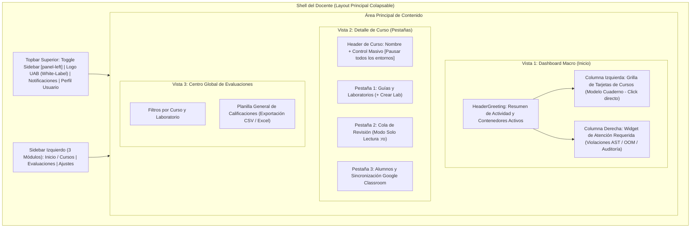

# Vista 1: Dashboard del Docente (Centro de Mando y Gestión Académica)

> **Especificación Oficial de Interfaz, Componentes y Wireframes**  
> **Rol:** Docente  
> **Gobernanza:** SDD / Docs-as-Code / SOLV Design System  

---

## 1. Diagrama de Arquitectura de Pantalla (Mermaid Visual HD)



---

## 2. Especificación Visual de Componentes e Iconografía Lucide

- **Sidebar Simplificado (3 Módulos):** `lucide:home` (Inicio / Cursos), `lucide:award` (Evaluaciones), `lucide:settings` (Ajustes).
- **Tarjetas de Cursos (Click Directo):** Área interactiva completa con elevación en hover y chevron `lucide:chevron-right`.
- **Estados Técnicos Absorbidos (Sin métricas pasivas de CPU/RAM):**
  - `Activos ahora`: Muestra estudiantes con contenedor `status = running` detectados mediante heartbeats recientes (< 2 min).
  - `Atención requerida`: Alertas de violaciones estáticas (`AST_BLOCKED`), límite de memoria excedido (`OOM`) o solicitudes de revisión.
  - `En riesgo`: Estudiantes sin entregas ni actividad registrada a menos de 24 horas del cierre.

---

## 3. Diagrama ASCII Técnico — Dashboard Principal del Docente

```text
┌──────────────────────────────────────────────────────────────────────────────────────────────────┐
│ SOLV | Branding UAB                                      [+ Nuevo Lab] [lucide:bell]  Prof.García│
├──────────────┬───────────────────────────────────────────────────────────┬───────────────────────┤
│              │ MIS CURSOS (Click directo en cualquier tarjeta)           │ ATENCIÓN REQUERIDA    │
│ [x] Inicio   │ ┌───────────────────────────────────────────────────────┐ │                       │
│ [ ] Evaluac. │ │ Programación II · Semestre 2026-2                [>] │ │ [lucide:shield-alert] │
│ [ ] Ajustes  │ │ 35 Estudiantes  |  18 Activos ahora (Heartbeats)    │ │ Carlos Ruiz           │
│              │ │ 4 Revisiones pendientes  |  2 En riesgo (Sin inicio)│ │ Restricción violada   │
│              │ └───────────────────────────────────────────────────────┘ │ en Lab #04            │
│              │ ┌───────────────────────────────────────────────────────┐ │ [Auditar entrega]     │
│              │ │ Bases de Datos · Semestre 2026-2                 [>] │ │                       │
│              │ │ 28 Estudiantes  |  0 Activos ahora                   │ │ [lucide:alert-circle] │
│              │ │ 1 Revisión pendiente    |  0 En riesgo                 │ │ Ana Torres            │
│              │ └───────────────────────────────────────────────────────┘ │ Memoria excedida (OOM)│
│              │ ┌───────────────────────────────────────────────────────┐ │ [Ver estado entorno]  │
│              │ │ Redes I · Semestre 2026-2                        [>] │ │                       │
│              │ │ 22 Estudiantes  |  0 Activos ahora                   │ │                       │
│              │ │ 0 Revisiones pendientes  |  0 En riesgo                 │ │                       │
│              │ └───────────────────────────────────────────────────────┘ │                       │
└──────────────┴───────────────────────────────────────────────────────────┴───────────────────────┘
```

---

## 4. Diagrama ASCII Técnico — Vista Detalle del Curso

### 4.1 Pestaña 1: Guías y Laboratorios del Curso

```text
┌──────────────────────────────────────────────────────────────────────────────────────────────────┐
│ [< Volver a Cursos]  Programación II · 35 Estudiantes        [Pausar Entornos] [+ Crear Lab]     │
├──────────────────────────────────────────────────────────────────────────────────────────────────┤
│ PESTAÑAS:  [x] 1. Guías y Laboratorios  |  [ ] 2. Cola de Revisión  |  [ ] 3. Alumnos y Classroom │
├──────────────────────────────────────────────────────────────────────────────────────────────────┤
│ LABS ASIGNADOS                                                                                   │
│ ┌──────────────────────────────────────────────────────────────────────────────────────────────┐ │
│ │ Lab #04: Estructuras de Datos Avanzadas   [Publicado]                                        │ │
│ │ Entregas: 28/35 (80%)  |  Auto-calificados: 24  |  Pendientes audit: 4  |  En riesgo: 2      │ │
│ │ [lucide:edit] Editar  |  [lucide:eye] Vista previa  |  [lucide:list] Ver cola de entregas    │ │
│ ├──────────────────────────────────────────────────────────────────────────────────────────────┤ │
│ │ Lab #03: Algoritmos de Búsqueda           [Cerrado]                                          │ │
│ │ Entregas: 35/35 (100%) |  Nota Promedio: 88/100                                              │ │
│ └──────────────────────────────────────────────────────────────────────────────────────────────┘ │
└──────────────────────────────────────────────────────────────────────────────────────────────────┘
```

### 4.2 Pestaña 2: Cola de Revisión de Entregas (Modo Solo Lectura)

```text
┌──────────────────────────────────────────────────────────────────────────────────────────────────┐
│ [< Volver a Cursos]  Programación II · 35 Estudiantes        [Pausar Entornos] [+ Crear Lab]     │
├──────────────────────────────────────────────────────────────────────────────────────────────────┤
│ PESTAÑAS:  [ ] 1. Guías y Laboratorios  |  [x] 2. Cola de Revisión  |  [ ] 3. Alumnos y Classroom │
├──────────────────────────────────────────────────────────────────────────────────────────────────┤
│ Filtros: [Ejercicio: Todos v] [Estado: Pendiente Audit v] [Buscar alumno...]                   │
│ ┌──────────────────────────────────────────────────────────────────────────────────────────────┐ │
│ │ Estudiante     │ Ejercicio │ Veredicto Juez      │ Estado Revisión │ Fecha      │ Acción     │ │
│ ├────────────────┼───────────┼─────────────────────┼─────────────────┼────────────┼────────────┤ │
│ │ Carlos Ruiz    │ Lab #04   │ Restricción violada │ Pendiente       │ Hoy 12:30  │ [Auditar]  │ │
│ │ Ana Torres     │ Lab #04   │ Memoria excedida    │ Pendiente       │ Hoy 11:15  │ [Auditar]  │ │
│ │ María López    │ Lab #04   │ Respuesta incorrecta│ Auditado (80/100│ Ayer 18:00 │ [Ver]      │ │
│ │ Juan Pérez     │ Lab #04   │ Correcto            │ Auto-aprobado   │ Ayer 15:40 │ [Ver]      │ │
│ └──────────────────────────────────────────────────────────────────────────────────────────────┘ │
│  Nota: Al hacer clic en [Auditar] se abre el entorno congelado en Modo Revisión (solo lectura :ro) │
└──────────────────────────────────────────────────────────────────────────────────────────────────┘
```

### 4.3 Pestaña 3: Alumnos y Sincronización Google Classroom

```text
┌──────────────────────────────────────────────────────────────────────────────────────────────────┐
│ [< Volver a Cursos]  Programación II · 35 Estudiantes        [Pausar Entornos] [+ Crear Lab]     │
├──────────────────────────────────────────────────────────────────────────────────────────────────┤
│ PESTAÑAS:  [ ] 1. Guías y Laboratorios  |  [ ] 2. Cola de Revisión  |  [x] 3. Alumnos y Classroom │
├──────────────────────────────────────────────────────────────────────────────────────────────────┤
│ [lucide:refresh-cw] Sincronizar con Google Classroom   (Última sync: Hoy 08:00 | 35 alumnos)      │
│ ┌──────────────────────────────────────────────────────────────────────────────────────────────┐ │
│ │ Estudiante                  │ Correo UAB               │ Estado Entorno │ Promedio │ Estado  │ │
│ ├─────────────────────────────┼──────────────────────────┼────────────────┼──────────┼─────────┤ │
│ │ Alvaro Rivera               │ a.rivera@uab.edu.bo      │ [x] Activo     │ 95/100   │ Al día  │ │
│ │ Carlos Ruiz                 │ c.ruiz@uab.edu.bo        │ [-] Pausado    │ 70/100   │ Riesgo  │ │
│ │ Ana Torres                  │ a.torres@uab.edu.bo      │ [-] Pausado    │ 82/100   │ Al día  │ │
│ └──────────────────────────────────────────────────────────────────────────────────────────────┘ │
└──────────────────────────────────────────────────────────────────────────────────────────────────┘
```

---

## 5. Diagrama ASCII Técnico — Centro Global de Evaluaciones

```text
┌──────────────────────────────────────────────────────────────────────────────────────────────────┐
│ SOLV | Centro Global de Evaluaciones                   [lucide:download] Exportar Acta CSV/Excel │
├──────────────┬───────────────────────────────────────────────────────────────────────────────────┤
│              │ Seleccionar: [Curso: Programación II v]  [Laboratorio: Todos los labs v]           │
│ [ ] Inicio   │ ┌───────────────────────────────────────────────────────────────────────────────┐ │
│ [*] Evaluac. │ │ Estudiante         │ Lab #01 │ Lab #02 │ Lab #03 │ Lab #04 │ Promedio │ Estado  │ │
│ [ ] Ajustes  │ ├────────────────────┼─────────┼─────────┼─────────┼─────────┼──────────┼─────────┤ │
│              │ │ Alvaro Rivera      │ 100/100 │ 95/100  │ 90/100  │ 100/100 │ 96/100   │ Aprobado│ │
│              │ │ Carlos Ruiz        │ 80/100  │ 75/100  │ 60/100  │ Pend.   │ 71/100   │ Riesgo  │ │
│              │ │ Ana Torres         │ 90/100  │ 85/100  │ 80/100  │ 95/100  │ 87/100   │ Aprobado│ │
│              │ └───────────────────────────────────────────────────────────────────────────────┘ │
└──────────────┴───────────────────────────────────────────────────────────────────────────────────┘
```

---

## 6. Inventario de Componentes Angular a Construir

| Componente | Tipo / Rol | Ubicación en Código |
|---|---|---|
| `TeacherDashboard` | Contenedor Principal Macro | `features/teacher/dashboard/` |
| `TeacherCourseCard` | Tarjeta Interactiva de Curso (Click Directo) | `features/teacher/dashboard/components/` |
| `AttentionRequiredWidget` | Panel Lateral de Alertas Críticas (AST / OOM) | `features/teacher/dashboard/components/` |
| `CourseDetailShell` | Vista Detalle con Nivelación por Pestañas | `features/teacher/course-detail/` |
| `BatchEnvironmentControl` | Botón Acción Masiva de Pausa de Entornos | `features/teacher/course-detail/components/` |
| `ClassroomSyncButton` | Componente de Sincronización Google Classroom API | `features/teacher/course-detail/components/` |
| `TeacherReviewQueue` | Cola de Revisión de Entregas y Excepciones | `features/teacher/course-detail/components/` |
| `GlobalEvaluationsGrid` | Matriz General de Calificaciones y Exportación de Actas | `features/teacher/evaluations/` |
