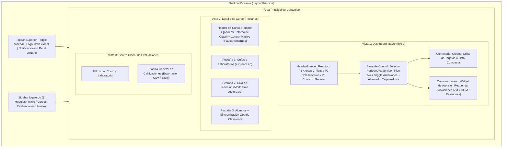

# Vista 1: Dashboard del Docente (Centro de Mando y Gestión Académica)

> **Especificación Oficial de Interfaz, Componentes y Wireframes**  
> **Rol:** Docente  
> **Gobernanza:** SDD / Docs-as-Code / SOLV Design System / Slice 13 / Slice 14 / ADR-007  

---

## 1. Diagrama de Arquitectura de Pantalla


```mermaid
graph TD
    subgraph ShellDocente ["Shell del Docente (Layout Principal)"]
        Topbar["Topbar Superior: Toggle Sidebar | Logo Institucional | Notificaciones | Perfil Usuario"]
        Sidebar["Sidebar Izquierdo (3 Módulos): Inicio / Cursos | Evaluaciones | Ajustes"]
        
        subgraph MainContent ["Área Principal de Contenido"]
            subgraph VistaDashboard ["Vista 1: Dashboard Macro (Inicio)"]
                GreetingDocente["HeaderGreeting Reactivo: P1 Alertas Críticas / P2 Cola Revisión / P3 Contexto General"]
                FiltrosHeader["Barra de Control: Selector Período Académico (Slice 14) + Toggle Archivados + Alternador Tarjetas/Lista"]
                ColCursos["Contenedor Cursos: Grilla de Tarjetas o Lista Compacta"]
                ColAtencion["Columna Lateral: Widget de Atención Requerida (Violaciones AST / OOM / Revisiones)"]
            end
            
            subgraph VistaCursoDetail ["Vista 2: Detalle de Curso (Pestañas)"]
                CursoHeader["Header de Curso: Nombre + [Abrir Mi Entorno de Clase] + Control Masivo [Pausar Entornos]"]
                TabLabs["Pestaña 1: Guías y Laboratorios (+ Crear Lab)"]
                TabRevision["Pestaña 2: Cola de Revisión (Modo Solo Lectura :ro)"]
                TabAlumnos["Pestaña 3: Alumnos y Sincronización Google Classroom"]
            end

            subgraph VistaEvaluaciones ["Vista 3: Centro Global de Evaluaciones"]
                FiltrosEval["Filtros por Curso y Laboratorio"]
                MatrizNotas["Planilla General de Calificaciones (Exportación CSV / Excel)"]
            end
        end
    end

    Topbar --> MainContent
    Sidebar --> MainContent
    GreetingDocente --> FiltrosHeader
    FiltrosHeader --> ColCursos
    FiltrosHeader --> ColAtencion
```

---

## 2. Especificación Visual y Jerarquía del HeaderGreeting

El componente `HeaderGreeting` opera con Signals y reacciona dinámicamente según un árbol de prioridades:

1. **Prioridad 1 (Contingencia / Alertas de Contenedores):** Si existen contenedores en estado de error de memoria (`oom_killed`) o caídos.
   > *"Atención, Prof. García: 1 contenedor excedió el límite de memoria en Programación II · [Ver incidencia]"*
2. **Prioridad 2 (Carga Pedagógica Pendiente):** Si hay entregas en cola de revisión que requieren acción humana.
   > *"Buenas tardes, Prof. García. Tenés 4 entregas pendientes de revisión en Programación II · [Revisar cola]"*
3. **Prioridad 3 (Contexto Normal / Reposo):** Saludo según la hora del día con resumen del semestre activo.
   > *"Buenas tardes, Prof. García · 3 cursos activos en el semestre 2026-2."*

---

## 3. Diagramas ASCII Técnicos — Dashboard Principal del Docente

### 3.1 Barra de Control y Selector de Período Académico (Slice 14)

```text
┌──────────────────────────────────────────────────────────────────────────────────────────────────┐
│ SOLV | Universidad                                       [+ Nuevo Lab] [lucide:bell]  Prof.García│
├──────────────┬───────────────────────────────────────────────────────────────────────────────────┤
│              │ [lucide:sparkles] Buenas tardes, Prof. García. Tenés 4 revisiones pendientes.     │
│              ├───────────────────────────────────────────────────────────────────────────────────┤
│ [x] Inicio   │ Período: [ 2026-2 (Activo) v ]   [ ] Mostrar archivados   │ Vista: [ Tarjetas | Lista ]
│ [ ] Evaluac. ├───────────────────────────────────────────────────────────┬───────────────────────┤
│ [ ] Ajustes  │ MIS CURSOS                                                │ ATENCIÓN REQUERIDA    │
│              │                                                           │                       │
```

---

### 3.2 Opción A: Grilla de Cursos en Formato Tarjetas (Cards)

```text
│              │ ┌───────────────────────────────────────────────────────┐ │ [lucide:shield-alert] │
│              │ │ Programación II · Semestre 2026-2                [>] │ │ Carlos Ruiz           │
│              │ │ 35 Estudiantes  |  18 Activos ahora (Heartbeats)    │ │ Restricción violada   │
│              │ │ 4 Revisiones pendientes  |  2 En riesgo (Sin inicio)│ │ en Lab #04            │
│              │ └───────────────────────────────────────────────────────┘ │ [Auditar entrega]     │
│              │ ┌───────────────────────────────────────────────────────┐ │                       │
│              │ │ Bases de Datos · Semestre 2026-2                 [>] │ │ [lucide:alert-circle] │
│              │ │ 28 Estudiantes  |  0 Activos ahora                   │ │ Ana Torres            │
│              │ │ 1 Revisión pendiente    |  0 En riesgo                 │ │ Memoria excedida (OOM)│
│              │ └───────────────────────────────────────────────────────┘ │ [Ver estado entorno]  │
│              │ ┌───────────────────────────────────────────────────────┐ │                       │
│              │ │ Redes I · Semestre 2026-2                        [>] │ │                       │
│              │ │ 22 Estudiantes  |  0 Activos ahora                   │ │                       │
│              │ │ 0 Revisiones pendientes  |  0 En riesgo                 │ │                       │
│              │ └───────────────────────────────────────────────────────┘ │                       │
└──────────────┴───────────────────────────────────────────────────────────┴───────────────────────┘
```

---

### 3.3 Opción B: Vista en Lista Compacta (Alta Densidad de Cursos)

```text
│              │ LISTADO COMPACTO DE CURSOS                                │ ATENCIÓN REQUERIDA    │
│              │ ┌───────────────────────────────────────────────────────┐ │ (Mismo widget lateral)│
│              │ │ Programación II │ 35 Alumnos │ 18 Activos │ 4 Pend.│>│ │                       │
│              │ ├───────────────────────────────────────────────────────┤ │                       │
│              │ │ Bases de Datos  │ 28 Alumnos │ 0 Activos  │ 1 Pend.│>│ │                       │
│              │ ├───────────────────────────────────────────────────────┤ │                       │
│              │ │ Redes I         │ 22 Alumnos │ 0 Activos  │ 0 Pend.│>│ │                       │
│              │ └───────────────────────────────────────────────────────┘ │                       │
└──────────────┴───────────────────────────────────────────────────────────┴───────────────────────┘
```

---

## 4. Diagramas ASCII Técnicos — Vista Detalle del Curso

### 4.1 Pestaña 1: Guías y Laboratorios del Curso

En esta vista el docente cuenta con el botón **`[Abrir Mi Entorno de Clase]`** para ingresar a su propio OpenVSCode Server y programar en vivo, además de la acción masiva de contingencia **`[Pausar todos los entornos]`** (Slice 14).

```text
┌──────────────────────────────────────────────────────────────────────────────────────────────────┐
│ [< Volver a Cursos]  Programación II · 35 Estudiantes                                            │
│ [Abrir Mi Entorno de Clase]   [lucide:pause-circle] [Pausar todos los entornos]   [+ Crear Lab]│
├──────────────────────────────────────────────────────────────────────────────────────────────────┤
│ PESTAÑAS:  [x] 1. Guías y Laboratorios  |  [ ] 2. Cola de Revisión  |  [ ] 3. Alumnos y Classroom │
├──────────────────────────────────────────────────────────────────────────────────────────────────┤
│ LABS ASIGNADOS                                                                                   │
│ ┌──────────────────────────────────────────────────────────────────────────────────────────────┐ │
│ │ Lab #04: Estructuras de Datos Avanzadas   [Publicado]                                        │ │
│ │ Entregas: 28/35 (80%)  |  Auto-calificados: 24  |  Pendientes audit: 4  |  En riesgo: 2      │ │
│ │ [lucide:edit] Editar  |  [lucide:eye] Vista previa  |  [lucide:list] Ver cola de entregas    │ │
│ ├──────────────────────────────────────────────────────────────────────────────────────────────┤ │
│ │ Lab #03: Algoritmos de Búsqueda           [Cerrado]                                          │ │
│ │ Entregas: 35/35 (100%) |  Nota Promedio: 88/100                                              │ │
│ └──────────────────────────────────────────────────────────────────────────────────────────────┘ │
└──────────────────────────────────────────────────────────────────────────────────────────────────┘
```

---

### 4.2 Topbar del Entorno Docente en Vivo: Emisión de Avance (ADR-007)

Cuando el docente hace clic en `[Abrir Mi Entorno de Clase]`, se abre su propio contenedor OpenVSCode Server con una barra superior que contiene la acción para publicar su avance a los estudiantes:

```text
┌──────────────────────────────────────────────────────────────────────────────────────────────────┐
│ [← Volver al Curso] │ Entorno Docente · Programación II │ [Emitir Avance a la Clase] │ [Activo]│
├──────────────────────────────────────────────────────────────────────────────────────────────────┤
│                                                                                                  │
│                              OPENVSCODE SERVER DEL DOCENTE                                       │
│                    (Espacio de trabajo donde el docente programa en vivo)                        │
│                                                                                                  │
└──────────────────────────────────────────────────────────────────────────────────────────────────┘
```

Al pulsar `[Emitir Avance a la Clase]`:
1. Se abre un diálogo modal de confirmación:  
   *"¿Emitir snapshot de tu código actual a todos los estudiantes activos en el laboratorio?"*
2. El backend emite una notificación en tiempo real vía WebSocket a los estudiantes conectados.
3. Cada estudiante recibe el toast sutil y la activación de su botón `[Sincronizar]`, manteniendo la sincronización como algo **100% voluntario**.

---

### 4.3 Pestaña 2: Cola de Revisión de Entregas (Modo Solo Lectura `:ro`)

```text
┌──────────────────────────────────────────────────────────────────────────────────────────────────┐
│ [< Volver a Cursos]  Programación II · 35 Estudiantes                                            │
├──────────────────────────────────────────────────────────────────────────────────────────────────┤
│ PESTAÑAS:  [ ] 1. Guías y Laboratorios  |  [x] 2. Cola de Revisión  |  [ ] 3. Alumnos y Classroom │
├──────────────────────────────────────────────────────────────────────────────────────────────────┤
│ Filtros: [Ejercicio: Todos v] [Estado: Pendiente Audit v] [Buscar alumno...]                   │
│ ┌──────────────────────────────────────────────────────────────────────────────────────────────┐ │
│ │ Estudiante     │ Ejercicio │ Veredicto Juez      │ Estado Revisión │ Fecha      │ Acción     │ │
│ ├────────────────┼───────────┼─────────────────────┼─────────────────┼────────────┼────────────┤ │
│ │ Carlos Ruiz    │ Lab #04   │ Restricción violada │ Pendiente       │ Hoy 12:30  │ [Auditar]  │ │
│ │ Ana Torres     │ Lab #04   │ Memoria excedida    │ Pendiente       │ Hoy 11:15  │ [Auditar]  │ │
│ │ María López    │ Lab #04   │ Respuesta incorrecta│ Auditado (80/100│ Ayer 18:00 │ [Ver]      │ │
│ │ Juan Pérez     │ Lab #04   │ Correcto            │ Auto-aprobado   │ Ayer 15:40 │ [Ver]      │ │
│ └──────────────────────────────────────────────────────────────────────────────────────────────┘ │
│  Nota: Al hacer clic en [Auditar] se abre el entorno congelado en Modo Revisión (solo lectura :ro) │
└──────────────────────────────────────────────────────────────────────────────────────────────────┘
```

---

### 4.4 Pestaña 3: Alumnos y Sincronización Google Classroom

```text
┌──────────────────────────────────────────────────────────────────────────────────────────────────┐
│ [< Volver a Cursos]  Programación II · 35 Estudiantes                                            │
├──────────────────────────────────────────────────────────────────────────────────────────────────┤
│ PESTAÑAS:  [ ] 1. Guías y Laboratorios  |  [ ] 2. Cola de Revisión  |  [x] 3. Alumnos y Classroom │
├──────────────────────────────────────────────────────────────────────────────────────────────────┤
│ [lucide:refresh-cw] Sincronizar con Google Classroom   (Última sync: Hoy 08:00 | 35 alumnos)      │
│ ┌──────────────────────────────────────────────────────────────────────────────────────────────┐ │
│ │ Estudiante                  │ Correo Institucional     │ Estado Entorno │ Promedio │ Estado  │ │
│ ├─────────────────────────────┼──────────────────────────┼────────────────┼──────────┼─────────┤ │
│ │ Alvaro Rivera               │ a.rivera@uab.edu.bo      │ [x] Activo     │ 95/100   │ Al día  │ │
│ │ Carlos Ruiz                 │ c.ruiz@uab.edu.bo        │ [-] Pausado    │ 70/100   │ Riesgo  │ │
│ │ Ana Torres                  │ a.torres@uab.edu.bo      │ [-] Pausado    │ 82/100   │ Al día  │ │
│ └──────────────────────────────────────────────────────────────────────────────────────────────┘ │
└──────────────────────────────────────────────────────────────────────────────────────────────────┘
```

---

## 5. Diagrama ASCII Técnico — Centro Global de Evaluaciones

```text
┌──────────────────────────────────────────────────────────────────────────────────────────────────┐
│ SOLV | Centro Global de Evaluaciones                   [lucide:download] Exportar Acta CSV/Excel │
├──────────────┬───────────────────────────────────────────────────────────────────────────────────┤
│              │ Seleccionar: [Curso: Programación II v]  [Laboratorio: Todos los labs v]           │
│ [ ] Inicio   │ ┌───────────────────────────────────────────────────────────────────────────────┐ │
│ [*] Evaluac. │ │ Estudiante         │ Lab #01 │ Lab #02 │ Lab #03 │ Lab #04 │ Promedio │ Estado  │ │
│ [ ] Ajustes  │ ├────────────────────┼─────────┼─────────┼─────────┼─────────┼──────────┼─────────┤ │
│              │ │ Alvaro Rivera      │ 100/100 │ 95/100  │ 90/100  │ 100/100 │ 96/100   │ Aprobado│ │
│              │ │ Carlos Ruiz        │ 80/100  │ 75/100  │ 60/100  │ Pend.   │ 71/100   │ Riesgo  │ │
│              │ │ Ana Torres         │ 90/100  │ 85/100  │ 80/100  │ 95/100  │ 87/100   │ Aprobado│ │
│              │ └───────────────────────────────────────────────────────────────────────────────┘ │
└──────────────┴───────────────────────────────────────────────────────────────────────────────────┘
```

---

## 6. Contrato de Integración y Endpoints (v0.16.0)

El panel del docente se alimenta de endpoints reales con autenticación basada en cookies HttpOnly (`solv_session`):

| Método | Endpoint | Parámetros / Payload | Propósito |
| :--- | :--- | :--- | :--- |
| `GET` | `/api/v1/academic-periods` | `?active_only=false` | Lista períodos académicos registrados (Slice 14). |
| `GET` | `/api/v1/teacher/dashboard` | `?period_id={id}` | Resumen macro: cursos, conteo de heartbeats activos y cola de atención. |
| `GET` | `/api/v1/courses/{id}/labs` | — | Lista de guías y laboratorios asignados con métricas de entrega. |
| `POST` | `/api/v1/courses/{id}/pause-all` | — | Acción masiva de contingencia: hiberna todos los contenedores de la clase. |
| `POST` | `/api/v1/courses/{id}/teacher-workspace` | — | Aprovisiona o reanuda el contenedor propio del docente para la clase. |
| `POST` | `/api/v1/workspaces/{id}/broadcast-snapshot`| `{ "lab_id": "...", "note": "..." }` | Emite snapshot del código docente a los alumnos (ADR-007). |
| `GET` | `/api/v1/courses/{id}/submissions` | `?status=pending_review` | Lista de entregas para la cola de revisión. |
| `POST` | `/api/v1/courses/{id}/sync-classroom` | — | Sincronización de nómina mediante Google Classroom API. |
| `GET` | `/api/v1/courses/{id}/grades-matrix` | `?format=csv` / `?format=json` | Matriz global de notas para visualización y exportación. |
