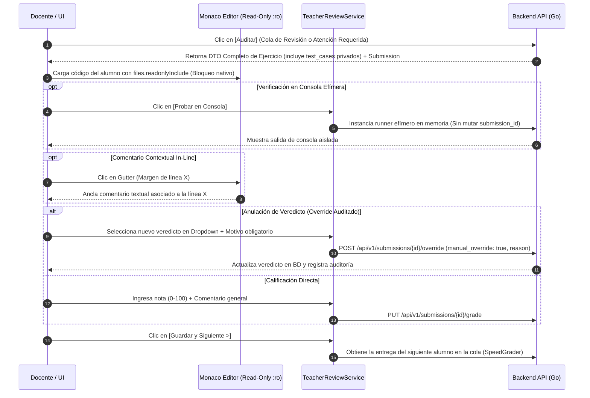

# Vista 3: Juez Virtual — Auditoría y Calificación Docente

> **Especificación Oficial de Interfaz, Componentes y Wireframes**  
> **Rol:** Docente  
> **Gobernanza:** SDD / Docs-as-Code / SOLV Design System / Ley 4 de UX  

---

## 1. Diagrama de Arquitectura de Auditoría



---

## 2. Anatomía Visual y Wireframe ASCII Técnico (Modo Auditoría :ro)

Layout split-screen (35% Enunciado / 65% Monaco Native en solo lectura) con banner superior de advertencia de seguridad y drawer inferior expandible de evaluación y navegación fluida (*SpeedGrader*).

```text
┌──────────────────────────────────────────────────────────────────────────────────────────────────┐
│ [< Volver a Cola] | Lab #04: Algoritmos | Estudiante: Carlos Ruiz | [lucide:lock] Solo Lectura :ro│
│ Nav: [< Anterior] (2 de 18) [Siguiente >]                         | [Probar en Consola Efímera] │
├──────────────────────────────────────────┬█┬─────────────────────────────────────────────────────┤
│ ENUNCIADO Y RESTRICCIONES                │█│ CÓDIGO FUENTE DEL ESTUDIANTE (Monaco Read-Only)       │
│                                          │█│                                                     │
│ Dada una matriz de NxM...                │█│ 1  def busqueda_matriz(arr, target):                 │
│                                          │█│ 2      # Comentario docente anclado en L2 [lucide:msg] │
│ RESTRICCIONES AST (Semgrep):             │█│ 3      for i in range(len(arr)):                    │
│ - Prohibido sort()                       │█│ 4          if arr[i] == target: return True          │
│                                          │█│ 5      return False                                │
│ LÍMITES:                                 │█│                                                     │
│ Tiempo: 1000ms | Memoria: 128MB          │█│                                                     │
├──────────────────────────────────────────┴┴──────────────────────────────────────────────────────┤
│ PANEL DE AUDITORÍA Y CALIFICACIÓN (Drawer Inferior Colapsable)                        [Minimizar]│
│ ┌──────────────────────────────────────────────────────────────────────────────────────────────┐ │
│ │ RESULTADOS DEL JUEZ AUTOMÁTICO (Casos Desenmascarados para el Docente)                        │ │
│ │ Test 1 [ AC ]  45ms  12MB | Input: [1,2,3]  | Expected: True  | Actual: True                   │ │
│ │ Test 2 [ WA ]  52ms  14MB | Input: []       | Expected: False | Actual: IndexError (L3)        │ │
│ │ Test 3 [ WA ] --    --    | [Caso Privado]  | Expected: False | Actual: IndexError (L3)        │ │
│ ├──────────────────────────────────────────────────────────────────────────────────────────────┤ │
│ │ CALIFICACIÓN Y ANULACIÓN DE VEREDICTO                                                        │ │
│ │ Veredicto Juez: [ WA (Wrong Answer) v] -> Cambiar a: [ Anular a AC (Correcto) v ]             │ │
│ │ Motivo de Anulación (Obligatorio): [ Lógica válida para casos normales, excepción menor ___ ]│ │
│ │ Nota Asignada: [ 85 ] / 100        | Comentario General: [ Buen intento, manejar arreglos vacíos ]│ │
│ │                                    | [lucide:check-circle] [ Guardar y Siguiente Estudiante > ]│ │
│ └──────────────────────────────────────────────────────────────────────────────────────────────┘ │
└──────────────────────────────────────────────────────────────────────────────────────────────────┘
```

---

## 3. Especificación Visual de Componentes e Iconografía Lucide

- **Banner de Modo Auditoría:** Color de fondo `gray-100` con borde `gray-300` y badge `lucide:lock` en neutro para denotar inmutabilidad.
- **Navegación SpeedGrader:** `lucide:chevron-left` y `lucide:chevron-right` en el Topbar para alternar entregas sin volver al listado.
- **Icono de Comentario In-line:** `lucide:message-square` en el *gutter* de Monaco para indicar líneas con observaciones.
- **Selector de Anulación:** Dropdown dinámico sobre la píldora del veredicto actual con las opciones:
  - `Mantener Veredicto del Juez`
  - `Anular -> Marcar como AC (Accepted)`
  - `Anular -> Asignar Calificación Manual`
- **Botón Principal de Guardado:** `lucide:check-circle` con estilo primario `var(--tenant-primary)`.

---

## 4. Reglas de Inmutabilidad, Auditoría y Seguridad

1. **Inmutabilidad en Backend y Frontend (Ley 4 de UX):**
   - El volumen del estudiante se monta exclusivamente en modo **Solo Lectura (`:ro`)**.
   - Monaco Editor deshabilita la edición nativa mediante `readOnly: true` y `files.readonlyInclude`.
2. **Desenmascaramiento de Casos Privados:**
   - La API para el rol `teacher` retorna el DTO completo `Exercise` con la estructura de `test_cases` desglosada (incluyendo `input`, `expected_output` y `actual_output`), permitiendo al docente diagnosticar fallos en casos de prueba ocultos.
3. **Trazabilidad de Override (Anulación de Veredictos):**
   - No se permite cambiar un veredicto sin ingresar un texto en el campo `override_reason` (mínimo 10 caracteres).
   - El backend registra en PostgreSQL: `manual_override = true`, `original_verdict`, `new_verdict`, `override_reason` y `teacher_id`.
4. **Ejecución Efímera Aislada:**
   - El botón `[Probar en Consola Efímera]` ejecuta el código sobre un sandbox temporal en memoria. La salida se muestra en un cuadro de consola modal o colapsable sin escribir en la tabla `submissions`.

---

## 5. Inventario de Componentes Angular a Construir

| Componente | Tipo / Rol | Ubicación en Código |
|---|---|---|
| `TeacherJudgeReview` | Contenedor Principal Split-Screen en Solo Lectura | `features/teacher/judge-review/` |
| `SpeedGraderNav` | Control de Navegación entre Alumnos (`<` / `>`) | `features/teacher/judge-review/components/` |
| `ReadOnlyMonacoWrapper` | Editor Encapsulado Bloqueado (`:ro`) con Marcadores | `shared/ui/editors/` |
| `UnmaskedVerdictsTable` | Lista de Tests con Casos Privados Desglosados | `features/teacher/judge-review/components/` |
| `VerdictOverrideForm` | Formulario de Anulación con Motivo Obligatorio y Nota | `features/teacher/judge-review/components/` |
| `EphemeralRunnerConsole` | Consola Modal para Pruebas del Docente en Memoria | `features/teacher/judge-review/components/` |
