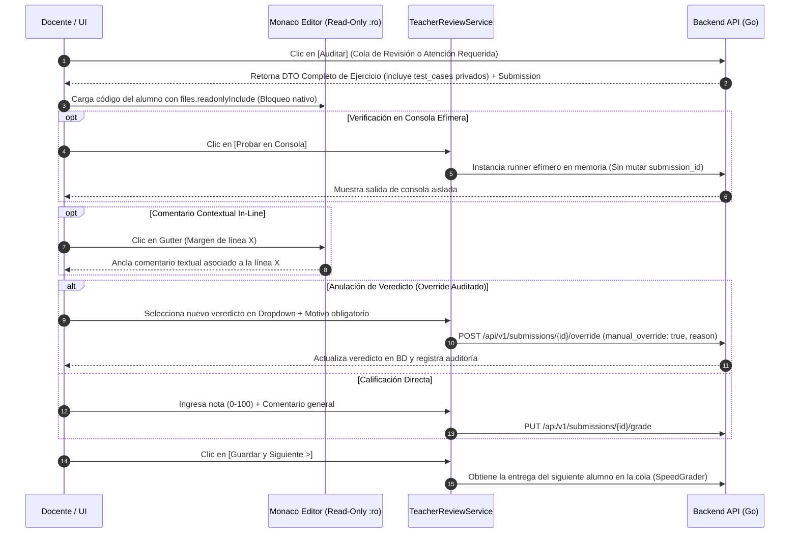

# Vista 3: Juez Virtual — Auditoría y Calificación Docente

> **Especificación Oficial de Interfaz, Componentes y Wireframes**  
> **Rol:** Docente  
> **Gobernanza:** SDD / Docs-as-Code / SOLV Design System / Ley 4 de UX  

---

## 1. Diagrama de Arquitectura de Auditoría


```mermaid
sequenceDiagram
    autonumber
    participant D as Docente / UI
    participant M as Monaco Editor (Read-Only :ro)
    participant R as TeacherReviewService
    participant B as Backend API (Go)

    D->>B: Clic en [Auditar] (Cola de Revisión o Atención Requerida)
    B-->>D: Retorna DTO Completo de Ejercicio (incluye test_cases privados) + Submission
    D->>M: Carga código del alumno con files.readonlyInclude (Bloqueo nativo)

    opt Verificación en Consola Efímera
        D->>R: Clic en [Probar en Consola]
        R->>B: Instancia runner efímero en memoria (Sin mutar submission_id)
        B-->>D: Muestra salida de consola aislada
    end

    opt Comentario Contextual In-Line
        D->>M: Clic en Gutter (Margen de línea X)
        M-->>D: Ancla comentario textual asociado a la línea X
    end

    alt Anulación de Veredicto (Override Auditado)
        D->>R: Selecciona nuevo veredicto en Dropdown + Motivo obligatorio
        R->>B: POST /api/v1/submissions/{id}/override (manual_override: true, reason)
        B-->>D: Actualiza veredicto en BD y registra auditoría
    else Calificación Directa
        D->>R: Ingresa nota (0-100) + Comentario general
        R->>B: PUT /api/v1/submissions/{id}/grade
    end

    D->>R: Clic en [Guardar y Siguiente >]
    R->>B: Obtiene la entrega del siguiente alumno en la cola (SpeedGrader)
```

---

## 2. Anatomía Visual y Wireframe ASCII Técnico (Modo Auditoría :ro)

Layout split-screen (35% Enunciado / 65% Monaco Native en solo lectura) con banner superior de advertencia de seguridad y drawer inferior colapsable de evaluación y navegación fluida (*SpeedGrader*).

```text
┌──────────────────────────────────────────────────────────────────────────────────────────────────┐
│ [< Volver a Cola] | Lab #04: Algoritmos | Estudiante: Carlos Ruiz | [lucide:lock] Solo Lectura :ro│
│ Nav: [< Anterior] (2 de 18) [Siguiente >]                         | [Probar en Consola Efímera] │
├──────────────────────────────────────────┬█┬─────────────────────────────────────────────────────┤
│ ENUNCIADO Y RESTRICCIONES                │█│ CÓDIGO FUENTE DEL ESTUDIANTE (Monaco Read-Only)       │
│                                          │█│                                                     │
│ Dada una matriz de NxM...                │█│ 1  def busqueda_matriz(arr, target):                 │
│                                          │█│ 2      # Comentario docente anclado en L2 [lucide:msg] │
│ RESTRICCIONES AST (Semgrep):             │█│ 3      for i in range(len(arr)):                    │
│ - Prohibido sort()                       │█│ 4          if arr[i] == target: return True          │
│                                          │█│ 5      return False                                │
│ LÍMITES:                                 │█│                                                     │
│ Tiempo: 1000ms | Memoria: 128MB          │█│                                                     │
├──────────────────────────────────────────┴┴──────────────────────────────────────────────────────┤
│ PANEL DE AUDITORÍA Y CALIFICACIÓN (Drawer Inferior Colapsable)                        [Minimizar]│
│ ┌──────────────────────────────────────────────────────────────────────────────────────────────┐ │
│ │ RESULTADOS DEL JUEZ AUTOMÁTICO (Casos Desenmascarados para el Docente)                        │ │
│ │ Test 1 [ AC ]  45ms  12MB | Input: [1,2,3]  | Expected: True  | Actual: True                   │ │
│ │ Test 2 [ WA ]  52ms  14MB | Input: []       | Expected: False | Actual: IndexError (L3)        │ │
│ │ Test 3 [ WA ] --    --    | [Caso Privado]  | Expected: False | Actual: IndexError (L3)        │ │
│ ├──────────────────────────────────────────────────────────────────────────────────────────────┤ │
│ │ CALIFICACIÓN Y ANULACIÓN DE VEREDICTO                                                        │ │
│ │ Veredicto Juez: [ WA (Wrong Answer) v] -> Cambiar a: [ Anular a AC (Correcto) v ]             │ │
│ │ Motivo de Anulación (Obligatorio): [ Lógica válida para casos normales, excepción menor ___ ]│ │
│ │ Nota Asignada: [ 85 ] / 100        | Comentario General: [ Buen intento, manejar arreglos vacíos ]│ │
│ │                                    | [lucide:check-circle] [ Guardar y Siguiente Estudiante > ]│ │
│ └──────────────────────────────────────────────────────────────────────────────────────────────┘ │
└──────────────────────────────────────────────────────────────────────────────────────────────────┘
```

---

## 3. Especificación Visual de Componentes e Iconografía Lucide

- **Banner de Modo Auditoría:** Fondo neutro tenue con borde sutil y badge `lucide:lock` para clarificar que el código es inmutable durante la revisión.
- **Navegación SpeedGrader:** Controles `lucide:chevron-left` y `lucide:chevron-right` en la cabecera para pasar de un alumno al siguiente de forma inmediata.
- **Icono de Comentario In-line:** `lucide:message-square` anclado al margen (*gutter*) de Monaco para comentarios puntuales sobre líneas de código.
- **Selector de Anulación:** Desplegable sobre el veredicto del juez con opciones auditadas:
  - `Mantener Veredicto del Juez`
  - `Anular -> Marcar como AC (Accepted)`
  - `Anular -> Asignar Calificación Manual`
- **Botón Principal de Guardado:** `lucide:check-circle` con estilo primario del tema institucional.

---

## 4. Reglas de Inmutabilidad, Auditoría y Seguridad

1. **Inmutabilidad en Backend y Frontend (Ley 4 de UX):**
   - El volumen del estudiante se monta exclusivamente en modo **Solo Lectura (`:ro`)**.
   - Monaco Editor deshabilita la edición nativa mediante `readOnly: true` y `files.readonlyInclude`.
2. **Desenmascaramiento de Casos Privados:**
   - La API para el rol `teacher` retorna el DTO completo `Exercise` con la estructura de `test_cases` desglosada (incluyendo `input`, `expected_output` y `actual_output`), permitiendo diagnosticar fallos en casos de prueba ocultos.
3. **Trazabilidad de Override (Anulación de Veredictos):**
   - No se permite cambiar un veredicto sin ingresar una justificación en el campo `override_reason` (mínimo 10 caracteres).
   - El backend registra en PostgreSQL: `manual_override = true`, `original_verdict`, `new_verdict`, `override_reason` y `teacher_id`.
4. **Ejecución Efímera Aislada:**
   - El botón `[Probar en Consola Efímera]` ejecuta el código sobre un sandbox temporal en memoria sin alterar la entrega registrada ni mutar la tabla `submissions`.

---

## 5. Contrato de Integración y Endpoints (v0.16.0)

| Método | Endpoint | Parámetros / Payload | Propósito |
| :--- | :--- | :--- | :--- |
| `GET` | `/api/v1/submissions/{id}/audit` | — | Obtiene el DTO completo de la entrega: código, casos públicos y casos privados desenmascarados. |
| `POST` | `/api/v1/submissions/{id}/override` | `{ "new_verdict": "AC", "reason": "...", "score": 85 }` | Anulación auditada del veredicto del juez con justificación obligatoria. |
| `PUT` | `/api/v1/submissions/{id}/grade` | `{ "score": 85, "feedback": "...", "line_comments": [...] }` | Asignación de calificación manual y comentarios pedagógicos. |
| `POST` | `/api/v1/submissions/{id}/test-run` | `{ "custom_input": "..." }` | Ejecución efímera en memoria sobre sandbox aislado sin registrar entrega. |
| `GET` | `/api/v1/courses/{course_id}/labs/{lab_id}/queue` | `?current_submission_id={id}` | Obtiene referencias para navegación fluida hacia el estudiante anterior/siguiente. |
