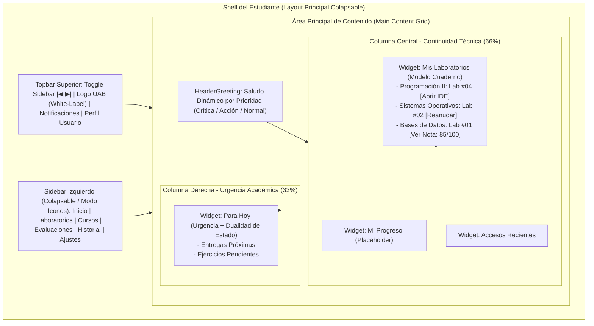

# Vista 1: Dashboard del Estudiante (Centro de Mando)

> **Especificación Oficial de Interfaz y Wireframe**  
> **Rol:** Estudiante  
> **Gobernanza:** SDD / Docs-as-Code / SOLV Design System  

---

## 1. Diagrama de Arquitectura de Pantalla (Mermaid Visual HD)



---

## 2. Especificación Visual de Componentes e Iconografía Lucide
- **Sidebar Colapsable (Lucide Icons):** Botón Toggle (`lucide:panel-left-close` / `lucide:panel-left-open`). Módulos: `lucide:home` (Inicio), `lucide:terminal` (Laboratorios), `lucide:book-open` (Cursos), `lucide:award` (Evaluaciones), `lucide:history` (Historial), `lucide:settings` (Ajustes). En estado colapsado muestra únicamente la columna de iconos con tooltips.
- **Dualidad de Estados Absorbida:** El botón de acción absorbe el estado técnico sin métricas pasivas de RAM/CPU:
  - `[ Abrir IDE ]` (Estado: Running / En ejecución).
  - `[ Reanudar ]` (Estado: Hibernated / Pausado).
  - `[ Reintentar ]` (Estado: Error / Falla de inicio).
  - `[ Ver Nota: 85/100 ]` (Estado: Entregado / Calificado).

---

## 3. Diagrama ASCII Técnico — Dashboard Estudiante

```text
┌──────────────────────────────────────────────────────────────────────────────────────────────────┐
│ SOLV | Branding UAB                                                      [Notif (2)]  Alvaro v   │
├──────────────┬───────────────────────────────────────────────────────────┬───────────────────────┤
│              │ [ HeaderGreeting: Prioridad Dinámica ]                    │                       │
│ [x] Inicio   │  Buenos días, Álvaro. Tienes 2 entregas pendientes.       │ [!] Para hoy          │
│ [x] Labs     │                                                           │                       │
│ [x] Cursos   │  [ WIDGET: MIS LABORATORIOS (Modelo Cuaderno) ]           │ [!] Lab #04: Prog II  │
│ [x] Evaluac. │  +-----------------------------------------------------+  │ Entrega: Mañana 18:00 │
│ [x] Historial│  | Programación II                                       |  │                       │
│              │  | Lab #04: Estructuras          [ Abrir IDE ] (Activo) |  │ [o] Ejercicio Alg     │
│ [*] Ajustes  │  | Lab #03: Algoritmos           [ Reanudar ] (Pausado) |  │ Suma de Arrays        │
│              │  | Lab #02: Queries SQL          [ Reintentar ] (Error) |  │                       │
│              │  +-----------------------------------------------------+  │ [o] Lab #02: BD SQL   │
│              │  | Bases de Datos                                       |  │ Entrega: 25 Ago       │
│              │  | Lab #01: Modelo ER          [ Ver nota: 85/100 ]    |  │                       │
│              │  +-----------------------------------------------------+  +-----------------------+
│              │                                                           │                       │
│              │  Progreso (Placeholder)                                   │ [>] Recientes         │
│              │  Prog II: [========  ] 80%   | BD: [======    ] 60%       │ • Lab #04 (hace 2h)   │
└──────────────┴───────────────────────────────────────────────────────────┴───────────────────────┘
```
