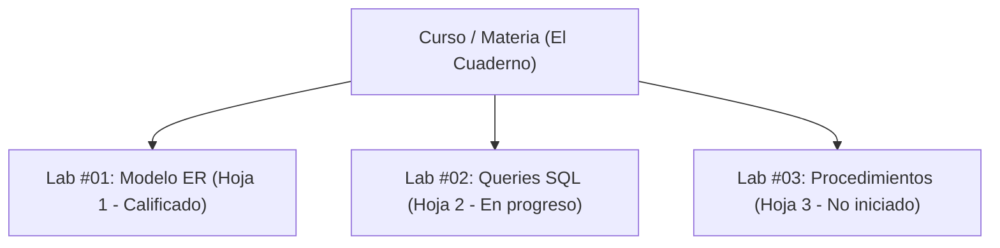
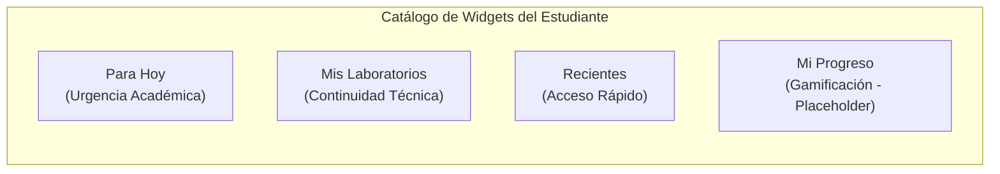
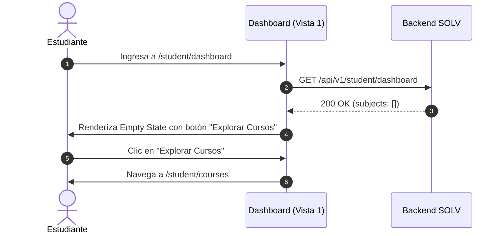

# Vista 1: Dashboard del Estudiante (Centro de Mando)

> **Especificación Oficial de Interfaz, Contratos y Flujos de Usuario**  
> **Rol:** Estudiante  
> **Estado del Sistema:** Conectado a contratos reales v0.16.0 (Slices 12 y 15)  
> **Gobernanza:** SDD / Docs-as-Code / SOLV Design System  

---

## 1. Modelo Mental y Principios de Dominio

### 1.1. La Analogía del Cuaderno Académico
El modelo mental del estudiante no debe reflejar la infraestructura de contenedores ni la complejidad del clúster. Se estructura bajo el concepto de **Cuaderno Académico**:
- **El Curso es el Cuaderno:** Representa la carpeta o materia contenedora (ej. *Programación II*, *Bases de Datos*). Agrupa las actividades y mantiene el contexto pedagógico.
- **Los Laboratorios son las Hojas:** Son las unidades prácticas ordenadas cronológicamente dentro de cada curso. Cada hoja tiene su propio estado académico (*No iniciado*, *En progreso*, *Entregado*, *Calificado*) y su propio entorno de trabajo ejecutable.


```mermaid
graph TD
    Curso["Curso / Materia (El Cuaderno)"]
    Lab1["Lab #01: Modelo ER (Hoja 1 - Calificado)"]
    Lab2["Lab #02: Queries SQL (Hoja 2 - En progreso)"]
    Lab3["Lab #03: Procedimientos (Hoja 3 - No iniciado)"]

    Curso --> Lab1
    Curso --> Lab2
    Curso --> Lab3
```

### 1.2. Política de Cero Ruido Técnico
- Queda **prohibido** exponer al estudiante métricas pasivas de telemetría (uso de CPU, RAM en megabytes, IDs de contenedores Docker, nombres de nodos o términos de infraestructura).
- El estado técnico no compite visualmente con el estado académico: se encuentra **absorbido dentro del botón de acción principal** o reservado para un modal de soporte si el alumno solicita "más detalles".

---

## 2. Motor Reactivo de Saludo (`HeaderGreeting`)

El encabezado del dashboard no es un texto estático; es un componente standalone gobernado por una **señal computada en Angular** que evalúa eventos del estudiante bajo un orden estricto de precedencia:

| Nivel | Prioridad | Condición de Activación | Copy / Mensaje Visible | Acción Asociada |
| :---: | :---: | :--- | :--- | :--- |
| **P1** | **Crítica** | Falla de inicio o caída de un workspace activo del alumno. | *"Álvaro, tu laboratorio de Programación II no pudo iniciarse."* | Botón `[ Reintentar ]` en el propio banner. |
| **P2** | **Acción** | Entrega académica con fecha límite a menos de 24 horas (`due_date < now() + 24h`). | *"Álvaro, mañana a las 18:00 vence el Lab #04 de Programación II."* | Enlace directo hacia la hoja del laboratorio. |
| **P3** | **Normal** | Sin bloqueos técnicos ni urgencias inminentes. | *"Buenos días, Álvaro"* (según franja horaria: Mañana / Tarde / Noche). | Ninguna (saludo contextual estándar). |

---

## 3. Sistema Modular de Widgets Draggable (CDK DragDrop)

El área principal del dashboard se estructura como una grilla de widgets configurables mediante `@angular/cdk/drag-drop`, permitiendo al estudiante organizar su espacio de trabajo según sus prioridades de estudio.

### 3.1. Flexibilidad de Disposición ("Para Hoy")
El widget de urgencia académica **"Para hoy"** no está anclado de forma rígida a una barra lateral:
- **Modo Columna Lateral:** Se ubica como panel lateral (derecha o izquierda) con tarjetas verticales de tareas pendientes.
- **Modo Franja Superior:** Puede arrastrarse arriba de "Mis laboratorios" para funcionar como banner horizontal de alerta temprana.
- **Responsividad:** En pantallas menores a `1024px`, se apila automáticamente en la parte superior antes de los laboratorios.

### 3.2. Catálogo de Widgets Oficiales


```mermaid
graph LR
    subgraph Widgets ["Catálogo de Widgets del Estudiante"]
        W1["Para Hoy<br/>(Urgencia Académica)"]
        W2["Mis Laboratorios<br/>(Continuidad Técnica)"]
        W3["Recientes<br/>(Acceso Rápido)"]
        W4["Mi Progreso<br/>(Gamificación - Placeholder)"]
    end
```

1. **Para hoy (Urgencia Académica):** Lista de entregas próximas y ejercicios pendientes consumidos desde `GET /api/v1/student/assignments/due`.
2. **Mis laboratorios (Continuidad Técnica):** Listado agrupado por cursos bajo la analogía del cuaderno. Muestra los laboratorios activos, hibernados o por comenzar.
3. **Recientes (Acceso Rápido):** Acceso directo a los últimos 3 espacios o ejercicios donde el estudiante tuvo actividad.
4. **Mi progreso (Placeholder):** Resumen visual del porcentaje de avance por materia.

### 3.3. Persistencia y Accesibilidad
- **Almacenamiento Local (`localStorage`):** La configuración de orden y visibilidad de los widgets se guarda en el navegador bajo la clave `solv_student_dashboard_layout_${userId}`. Esto evita llamadas innecesarias de red y desacopla la preferencia estética del usuario.
- **Botón "Restaurar distribución":** Permite al estudiante volver al orden de fábrica en cualquier momento con un solo clic.
- **Accesibilidad (a11y):** Cada widget incluye en su cabecera botones de reordenamiento por teclado (`Mover arriba`, `Mover abajo`, `Ocultar`) para usuarios de lectores de pantalla o sin puntero ratón.

---

## 4. Tarjetas de Laboratorio: Absorción de Estados

Cada tarjeta de laboratorio dentro de un curso muestra con claridad su **estado académico** y resuelve la acción técnica en un único botón:

### 4.1. Matriz de Estados y Acciones

| Estado Académico | Estado Técnico Workspace | Botón de Acción Principal | Efecto al Hacer Clic |
| :--- | :--- | :--- | :--- |
| **En progreso** | `running` | `[ Abrir IDE ]` (Estilo Primario) | Abre la Vista 2 (OpenVSCode en fullscreen/iframe). |
| **En progreso** | `hibernated` | `[ Reanudar ]` (Estilo Neutro/Accent) | Lanza reanudación y pasa temporalmente a estado spinner. |
| **En progreso** | `failed` / `oom_killed` | `[ Reintentar ]` (Estilo Alerta Sutil) | Dispara nuevo intento de inicio del contenedor. |
| **Entregado** | `hibernated` / `stopped` | `[ Ver Entrega ]` (Estilo Outline) | Abre el visor de código entregado en modo lectura. |
| **Calificado** | Terminado | `[ Ver nota: 85/100 ]` (Estilo Éxito) | Despliega el desglose del veredicto y feedback docente. |
| **No iniciado** | Inexistente | `[ Iniciar Lab ]` (Estilo Primario) | Aprovisiona el workspace y monta el entorno. |

### 4.2. Selector de Visualización y Disclosure Progresivo
- **Modos de Vista:** El estudiante puede alternar entre **Vista de Tarjetas (Cards)** y **Vista de Lista Compacta**.
- **Modal de Más Detalles:** Cada tarjeta incluye un enlace secundario sutil *"Detalles"*. Al hacer clic, abre un modal ligero que muestra metadatos no alarmantes: fecha de último guardado, lenguaje base y tiempo acumulado de práctica, evitando mostrar telemetría de clúster o métricas de infraestructura.

---

## 5. Contratos de API Reales (Slices 12 y 15 — v0.16.0)

La interfaz se conecta con los siguientes endpoints ya existentes y verificados en el backend:

### 5.1. Identidad y Contexto
- `GET /api/v1/users/me`: Perfil del estudiante logueado (nombre, apellido, correo, roles).
- `GET /api/v1/config/public`: Información institucional del tenant (nombre, logo, colores white-label aplicados vía `TenantService`).

### 5.2. Asignaciones y Cuaderno Académico
- `GET /api/v1/student/dashboard`: Estructura completa de asignaturas activas y laboratorios vinculados.
- `GET /api/v1/student/assignments/due`: Lista de entregas próximas ordenadas por urgencia (alimenta *Para hoy* y *HeaderGreeting P2*).

### 5.3. Control de Workspaces
- `POST /api/v1/workspaces/{id}/pause`: Pausa/hibernación manual del entorno.
- `POST /api/v1/workspaces`: Creación/reanudación del workspace de laboratorio.

### 5.4. Notificaciones Proactivas (Slice 15)
- `GET /api/v1/notifications/unread-count`: Contador numérico ultraliviano para el badge de la campana en el topbar.
- `GET /api/v1/notifications?unread_only=false&page=1&limit=20`: Listado para el popover de la campana con severidades (`info`, `warning`, `critical`).
- `PATCH /api/v1/notifications/{id}/read`: Marcar notificación individual como leída.
- `POST /api/v1/notifications/mark-all-read`: Marcar todas las notificaciones como leídas.

---

## 6. Flujos de Usuario Clave

### 6.1. Flujo de Primer Ingreso (Empty State)
Cuando un alumno inicia sesión por primera vez y no cuenta con laboratorios asignados:
1. El widget "Mis laboratorios" muestra un estado vacío ilustrado con icono `lucide:book-open`.
2. Texto orientador: *"Todavía no tienes laboratorios activos. Explora tus cursos matriculados para comenzar tus prácticas."*
3. Botón de acción principal: `[ Explorar Cursos ]` con navegación hacia `/student/courses`.


```mermaid
sequenceDiagram
    autonumber
    actor Estudiante
    participant UI as Dashboard (Vista 1)
    participant API as Backend SOLV

    Estudiante->>UI: Ingresa a /student/dashboard
    UI->>API: GET /api/v1/student/dashboard
    API-->>UI: 200 OK (subjects: [])
    UI->>Estudiante: Renderiza Empty State con botón "Explorar Cursos"
    Estudiante->>UI: Clic en "Explorar Cursos"
    UI->>Estudiante: Navega a /student/courses
```

### 6.2. Flujo de Reanudación de Laboratorio hacia Vista 2
1. El estudiante ubica su laboratorio en el curso (ej. *Programación II - Lab #03*).
2. El botón muestra `[ Reanudar ]`.
3. Al hacer clic, el botón entra en estado de carga (*"Iniciando..."* con spinner).
4. El frontend envía la solicitud al backend y valida disponibilidad de Traefik.
5. Al recibir confirmación, el shell transiciona hacia la **Vista 2: Laboratorio Activo** en pantalla completa con el iframe de OpenVSCode Server.

---

## 7. Diagrama ASCII Técnico Actualizado

```text
┌──────────────────────────────────────────────────────────────────────────────────────────────────┐
│ [≡] SOLV | Universidad Adventista de Bolivia                             [lucide:bell 3]   Alvaro R. v    │
├──────────────┬───────────────────────────────────────────────────────────┬───────────────────────┤
│              │ [ HeaderGreeting: Prioridad P2 - Acción ]                 │                       │
│ Inicio    │  Álvaro, mañana a las 18:00 vence el Lab #04 de Prog II.   │ Para hoy     [::]  │
│              │                                                           ├───────────────────────┤
│ Laborat.  │ Programación II                       [Cards | Lista]  │ Lab #04: Prog II   │
│              │ ┌───────────────────────────────────────────────────────┐ │ Entrega: Mañana 18:00 │
│ Cursos    │ │ Lab #04: Estructuras de Datos                         │ │ [Abrir Lab]           │
│              │ │ Entrega: Mañana · Estado: En progreso                 │ │                       │
│ Evaluac.  │ │ [ Abrir IDE ] (running)                               │ │ Suma de Arrays     │
│              │ ├───────────────────────────────────────────────────────┤ │ Ejercicio Algorítmico │
│ Historial │ │ Lab #03: Algoritmos de Búsqueda                       │ │ Sin empezar           │
│              │ │ Estado: Hibernado                                     │ │ [Resolver]            │
│ Ajustes   │ │ [ Reanudar ] (hibernated)                             │ └───────────────────────┘
│              │ └───────────────────────────────────────────────────────┘                         │
│              │ Bases de Datos                                         Recientes     [::]  │
│              │ ┌───────────────────────────────────────────────────────┐ ├───────────────────────┤
│              │ │ Lab #01: Diseño Entidad Relación                      │ │ • Lab #04 (hace 2h)   │
│              │ │ Estado: Calificado                                    │ │ • Suma Arrays (ayer)  │
│              │ │ [ Ver nota: 85/100 ]                                  │ └───────────────────────┘
│              │ └───────────────────────────────────────────────────────┘                         │
│              │                                                                                   │
│              │ Mi Progreso (Placeholder)                                  [Restaurar Layout]  │
└──────────────┴───────────────────────────────────────────────────────────────────────────────────┘
```

---

## 8. Tokens Visuales e Identidad Aplicada

- **Tipografía:**
  - Textos de interfaz y lectura: `'Inter', -apple-system, sans-serif`.
  - Código, calificaciones numéricas y tags de archivos: `'JetBrains Mono', monospace`.
- **Paleta de Tokens CSS:**
  - Primario institucional: `var(--tenant-primary, #2563EB)`.
  - Éxito (notas, activo): `var(--color-success, #16A34A)`.
  - Advertencia (entregas próximas): `var(--color-warning, #D97706)`.
  - Error (bloqueos, fallas): `var(--color-error, #DC2626)`.
  - Superficie y tarjetas: `var(--color-surface, #FFFFFF)` con bordes `var(--color-border, #E2E8F0)`.
- **Iconografía:** Iconos Lucide estandarizados (`lucide:book-open`, `lucide:terminal`, `lucide:history`, `lucide:clock`, `lucide:alert-circle`, `lucide:rotate-ccw`).
- **Tema:** Modo claro predeterminado institucional, sin animaciones decorativas superfluas (únicamente transiciones funcionales de 150-200ms).

---
---

## 9. Manejo de Estados Técnicos en Interfaz

Cada widget gestiona sus tres estados esenciales de interfaz:
1. **Loading State (Skeletons):** Mientras los datos estén en vuelo, se renderiza una estructura de tres filas pulsantes (`skeleton`) para evitar saltos bruscos de diseño (Cumulative Layout Shift).
2. **Error State Aislado:** Si un endpoint puntual falla (ej. `assignments/due`), solo el widget afectado muestra un aviso de error con opción de reintentar. El resto del dashboard permanece totalmente operativo.
3. **Empty State:** Si el arreglo de datos está vacío, se renderiza el estado vacío con ilustración orientadora y llamada a la acción pedagógica.

