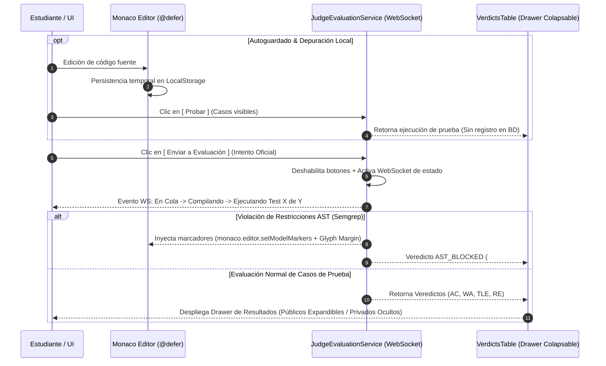

# Vista 3: Juez Virtual — Evaluación Algorítmica con Monaco Editor

> **Especificación Oficial de Interfaz, Componentes y Flujos de Evaluación**  
> **Rol:** Estudiante  
> **Gobernanza:** SDD / Docs-as-Code / SOLV Design System  

---

## 1. Diagrama de Arquitectura de Evaluación (Mermaid Visual HD)



---

## 2. Anatomía Visual y Wireframe ASCII Técnico (Split-Screen Resizable y Colapsable)

El layout se estructura en un modelo split-screen **resizable y colapsable** (por defecto 35% Enunciado y Restricciones / 65% Monaco Native). Incluye un divisor arrastrable con control interactivo para colapsar/expandir el panel del enunciado (0% a 50%) y un drawer colapsable inferior para los resultados.

```text
┌──────────────────────────────────────────────────────────────────────────────────────────────────┐
│ [< Volver]  Ejercicio: Estructura de Datos   [◀|▶ Panel] | Lenguaje: Python 3.11 | [Probar] [Enviar]│
├──────────────────────────────────────────┬█┬─────────────────────────────────────────────────────┤
│ ENUNCIADO DE PROBLEMA (Markdown Render)  │█│ EDITOR DE CÓDIGO (Monaco Native @defer)             │
│                                          │█│                                                     │
│ Dada una matriz de NxM, implemente...    │█│ 1  def resolver_matriz(n, m):                       │
│                                          │█│ 2      # Implementación del estudiante              │
│ RESTRICCIONES AST (Sección Separada):    │█│ 3      return [[0]*m for _ in range(n)]             │
│ - Prohibido usar sort() nativo           │█│                                                     │
│ - Prohibido import os, sys, subprocess   │█│                                                     │
│                                          │█│                                                     │
│ LÍMITES DE EJECUCIÓN:                    │█│                                                     │
│ Tiempo: 1000ms | Memoria: 128MB          │█│                                                     │
├──────────────────────────────────────────┴┴──────────────────────────────────────────────────────┤
│ RESULTADOS DE EVALUACIÓN (Drawer Colapsable Inferior)                                 [Expandir] │
│ ┌──────────────────────────────────────────────────────────────────────────────────────────────┐ │
│ │ Test 1  [ AC ]   45ms   12MB  | Caso Público Correcto                                        │ │
│ │ Test 2  [ AC ]   38ms   11MB  | Caso Público Correcto                                        │ │
│ │ Test 3  [ WA ]   52ms   14MB  | Caso Público Incorrecto [ Expandir: Input / Expected / Actual ]│ │
│ │ Test 4  [ WA ]   --     --    | [Test Oculto: Validación de Edge Cases]                       │ │
│ │ Test 5  [ AST_BLOCKED ] --    | Violación sintáctica detectada por Semgrep (Línea 2)         │ │
│ └──────────────────────────────────────────────────────────────────────────────────────────────┘ │
└──────────────────────────────────────────────────────────────────────────────────────────────────┘
```

---

## 3. Taxonomía Universal de Veredictos y Paleta Semántica

| Veredicto | Significado Técnico | Color Hex | Icono / Estado |
|---|---|---|---|
| **AC** | Accepted (Código correcto y verificado) | `#2ECC71` | `[ AC ]` Verde Esmeralda |
| **WA** | Wrong Answer (Lógica o salida incorrecta) | `#E74C3C` | `[ WA ]` Rojo Estándar |
| **TLE** | Time Limit Exceeded (Tiempo límite excedido) | `#F1C40F` | `[ TLE ]` Ámbar |
| **RE** | Runtime Error (Excepción o fallo de ejecución) | `#E67E22` | `[ RE ]` Naranja |
| **AST_BLOCKED** | Violación de restricciones estáticas AST | `#900C3F` | `[ AST_BLOCKED ]` Rojo Intenso |

---

## 4. Feedback In-Line en Monaco para Violaciones AST (`AST_BLOCKED`)

Cuando el pre-chequeo sintáctico de Semgrep detecta el uso de funciones o librerías vetadas, la interfaz notifica al estudiante mediante dos mecanismos simultáneos:

1. **Subrayado Ondulado Rojo (*Squiggly Line*):** Inyectado directamente en el editor nativo mediante `monaco.editor.setModelMarkers` con severidad `MarkerSeverity.Error`.
2. **Glifo de Advertencia en Margen (*Glyph Margin*):** Inyección de icono visual de advertencia (`lucide:slash` / `lucide:alert-octagon`) en el margen del número de línea vía `glyphMarginClassName`. Al hacer hover, un cuadro contextual explica la restricción pedagógica violada.
3. **Respuesta en Tabla de Veredictos:** Registro con veredicto `AST_BLOCKED` en color rojo intenso (`#900C3F`).

---

## 5. Divulgación Progresiva Asimétrica de Resultados

- **Casos de Prueba Públicos (Visibles):** Si el resultado es `WA`, la fila se expande mediante un chevron interactivo desplegando 3 bloques en fuente `JetBrains Mono`:
  - **Entrada (Input):** Datos inyectados al programa.
  - **Resultado Esperado (Expected):** Salida requerida.
  - **Resultado Obtenido (Actual):** Retorno defectuoso generado por el estudiante.
- **Casos de Prueba Privados (Ocultos):** Si el resultado es `WA`, la fila se muestra con fondo rojo pero permanece deshabilitada. Una píldora muestra `[Test Oculto: Validación de Edge Cases]` (con icono `lucide:lock`), sin divulgar entradas ni salidas para preservar el diseño evaluativo del docente.

---

## 6. Inventario de Componentes Angular a Construir

| Componente | Tipo / Rol | Ubicación en Código |
|---|---|---|
| `JudgeWorkspace` | Contenedor Principal Split-Screen Resizable y Colapsable | `features/student/judge/` |
| `ProblemStatement` | Panel Izquierdo (Enunciado + Restricciones + Límites) | `features/student/judge/components/` |
| `MonacoEditorWrapper` | Editor Nativo encapsulado con `@defer` | `shared/ui/editors/` |
| `JudgeActionBar` | Barra de Acciones (`Probar` / `Enviar` + Selector Lenguaje) | `features/student/judge/components/` |
| `VerdictsTable` | Drawer Colapsable de Resultados | `features/student/judge/components/` |
| `VerdictBadge` | Badge semántico con color fijo por veredicto | `shared/ui/badges/` |
| `ExpandableTestCase` | Fila Expandible para comparativa Input/Expected/Actual | `features/student/judge/components/` |
| `SubmissionHistory` | Tabla Cronológica de Intentos Pasados | `features/student/judge/components/` |
| `AstBlockFeedbackService` | Servicio de inyección de marcadores AST en Monaco | `features/student/judge/services/` |
| `JudgeEvaluationService` | Cliente WebSocket de comunicación en tiempo real | `features/student/judge/services/` |
