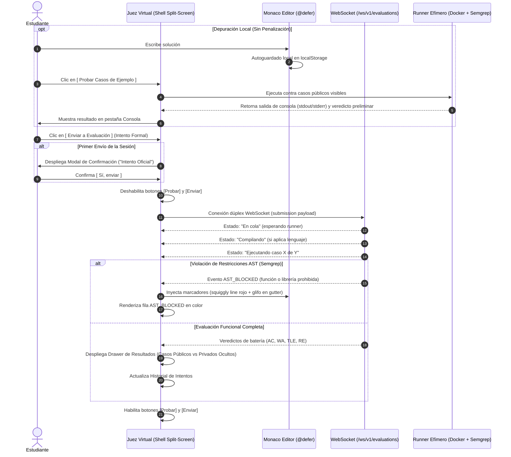
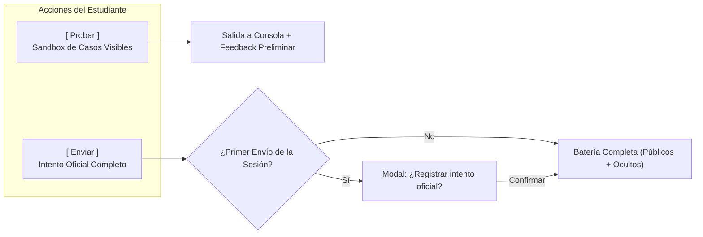

# Vista 3: Juez Virtual — Evaluación Algorítmica con Monaco Editor

> **Especificación Oficial de Interfaz, Protocolos, Contratos y Flujos de Evaluación**  
> **Rol:** Estudiante  
> **Estado del Sistema:** Conectado a contratos reales v0.16.0 (Slice 03 y Slice 12)  
> **Gobernanza:** SDD / Docs-as-Code / SOLV Design System  

---

## 1. Modelo Mental y Principios de Dominio

### 1.1. Propósito Formativo del Juez Virtual
El Juez Virtual de SOLV es el entorno de resolución algorítmica interactiva. A diferencia de las plataformas comerciales orientadas a la competencia (ej. LeetCode, Codeforces), su diseño responde a un **enfoque formativo universitario**:
- **Integrado al Cuaderno:** El ejercicio no es un recurso huérfano; vive como una hoja de práctica dentro de un curso específico (ej. *Programación II -> Ejercicio: Búsqueda Binaria*) o se accede directamente desde el widget de urgencia *Para hoy*.
- **Evaluación Dual (Estructura y Comportamiento):** No basta con que el algoritmo devuelva la salida correcta; debe respetar las restricciones pedagógicas de diseño (auditoría AST con Semgrep).
- **Control de Frustración:** Toda respuesta del sistema ofrece salidas constructivas, evitando callejones sin salida o trazas de error incomprensibles.

---

## 2. Diagrama de Arquitectura de Evaluación (WebSocket en Tiempo Real)


```mermaid
sequenceDiagram
    autonumber
    actor Estudiante
    participant UI as Juez Virtual (Shell Split-Screen)
    participant M as Monaco Editor (@defer)
    participant WS as WebSocket (/ws/v1/evaluations)
    participant B as Runner Efímero (Docker + Semgrep)

    opt Depuración Local (Sin Penalización)
        Estudiante->>M: Escribe solución
        M->>M: Autoguardado local en localStorage
        Estudiante->>UI: Clic en [ Probar Casos de Ejemplo ]
        UI->>B: Ejecuta contra casos públicos visibles
        B-->>UI: Retorna salida de consola (stdout/stderr) y veredicto preliminar
        UI->>Estudiante: Muestra resultado en pestaña Consola
    end

    Estudiante->>UI: Clic en [ Enviar a Evaluación ] (Intento Formal)
    alt Primer Envío de la Sesión
        UI->>Estudiante: Despliega Modal de Confirmación ("Intento Oficial")
        Estudiante->>UI: Confirma [ Sí, enviar ]
    end

    UI->>UI: Deshabilita botones [Probar] y [Enviar]
    UI->>WS: Conexión dúplex WebSocket (submission payload)
    
    WS-->>UI: Estado: "En cola" (esperando runner)
    WS-->>UI: Estado: "Compilando" (si aplica lenguaje)
    WS-->>UI: Estado: "Ejecutando caso X de Y"

    alt Violación de Restricciones AST (Semgrep)
        WS-->>UI: Evento AST_BLOCKED (función o librería prohibida)
        UI->>M: Inyecta marcadores (squiggly line rojo + glifo en gutter)
        UI->>UI: Renderiza fila AST_BLOCKED en color #900C3F
    else Evaluación Funcional Completa
        WS-->>UI: Veredictos de batería (AC, WA, TLE, RE)
        UI->>UI: Despliega Drawer de Resultados (Casos Públicos vs Privados Ocultos)
        UI->>UI: Actualiza Historial de Intentos
    end
    UI->>UI: Habilita botones [Probar] y [Enviar]
```

---

## 3. Ergonomía del Layout: Split-Screen Híbrido Resizable

Se descarta el modelo de paneles flotantes y arrastrables ("Dynamic Layout") por degradar la memoria espacial del alumno. Se adopta un **Split-Screen estático y predecible con divisor redimensionable**:

```text
┌──────────────────────────────────────────────────────────────────────────────────────────────────┐
│ [← Volver al Curso]  │  Ejercicio: Búsqueda Binaria  │  Python 3.11 ▼  │  [ Probar ]  [ Enviar ] │
├──────────────────────────────────────────┬█┬─────────────────────────────────────────────────────┤
│ ENUNCIADO Y RESTRICCIONES (Panel 35%)    │█│ EDITOR DE CÓDIGO (Monaco Native 65% @defer)        │
│                                          │█│                                                     │
│ Dada una lista de enteros ordenados...   │█│  1  def busqueda_binaria(arreglo, objetivo):        │
│                                          │█│  2      # Escribe tu solución aquí                  │
│ ┌──────────────────────────────────────┐ │█│  3      pass                                        │
│ │ RESTRICCIONES PEDAGÓGICAS         │ │█│                                                     │
│ │ • Prohibido el uso de bisect o sort  │ │█│                                                     │
│ │ • Prohibido el método .index()       │ │█│                                                     │
│ │ • Complejidad requerida: O(log n)    │ │█│                                                     │
│ └──────────────────────────────────────┘ │█│                                                     │
│                                          │█│                                                     │
│ LÍMITES TÉCNICOS:                        │█│                                                     │
│ Tiempo: 1000 ms  │  Memoria: 128 MB      │█│                                [ Restaurar Plantilla ]│
├──────────────────────────────────────────┴┴──────────────────────────────────────────────────────┤
│ ▼ RESULTADOS Y PRUEBAS (Drawer Colapsable Inferior)                                              │
│ [ Pestaña: Veredictos (5) ]  [ Pestaña: Consola (stdout) ]  [ Pestaña: Historial de Intentos (3) ]   │
│ ┌──────────────────────────────────────────────────────────────────────────────────────────────┐ │
│ │ Caso 1  [ AC ]   45ms   12MB  │ Caso público correcto                                        │ │
│ │ Caso 2  [ AC ]   38ms   11MB  │ Caso público correcto                                        │ │
│ │ Caso 3  [ WA ]   52ms   14MB  │ Caso público incorrecto              [ ▼ Expandir Comparativa ]│ │
│ │ Caso 4  [ WA ]   --     --    │ Test Oculto: Validación de Edge Cases                     │ │
│ └──────────────────────────────────────────────────────────────────────────────────────────────┘ │
└──────────────────────────────────────────────────────────────────────────────────────────────────┘
```

### 3.1. Reglas de Composición
1. **Panel Izquierdo (Enunciado, 35% por defecto):**
   - Renderizado Markdown seguro con tipografía de lectura (`Inter`).
   - **Sección de Restricciones Separada:** Las funciones o sintaxis prohibidas se destacan en una tarjeta visual independiente para que el alumno no deba buscarlas en el texto.
   - Límites operativos de CPU y memoria.
   - Colapsable a 0% mediante botón de toggle (`[◀|▶]`) para maximizar el editor si se desea.
2. **Panel Derecho (Monaco Editor, 65% por defecto):**
   - Editor nativo encapsulado en Angular mediante `@defer` para arranque liviano.
   - Fuente tipográfica exclusiva: `JetBrains Mono`.
   - Botonera de acción `[ Probar ]` y `[ Enviar ]` situada inmediatamente contigua al área de trabajo para evitar recorridos de cursor distantes.
3. **Drawer Inferior Colapsable (Resultados):**
   - Nace minimizado y se eleva automáticamente tras la primera ejecución.
   - Navegación por pestañas: **Veredictos**, **Consola de Salida** e **Historial**.

---

## 4. Dicotomía Operativa: Probar vs. Enviar

| Dimensión | `[ Probar ]` (Secundario / Contorneado) | `[ Enviar ]` (Primario / Sólido) |
| :--- | :--- | :--- |
| **Alcance** | Evalúa únicamente los casos de ejemplo públicos visibles. | Evalúa la batería completa (casos públicos + casos ocultos). |
| **Penalización** | Ninguna. Es un espacio seguro de experimentación. | Registra un intento formal en el expediente académico. |
| **Persistencia** | No genera registro en base de datos. | Registra submission formal con métricas de tiempo y memoria. |
| **Confirmación** | Ejecución instantánea sin modales. | **Primer clic en la sesión:** modal de confirmación preventiva. |
| **Disponibilidad** | Deshabilitado durante la ejecución activa. | Deshabilitado durante la ejecución activa. |


```mermaid
graph LR
    subgraph Acciones ["Acciones del Estudiante"]
        P["[ Probar ]<br/>Sandbox de Casos Visibles"]
        E["[ Enviar ]<br/>Intento Oficial Completo"]
    end
    P --> C["Salida a Consola + Feedback Preliminar"]
    E --> M{"¿Primer Envío de la Sesión?"}
    M -- Sí --> Conf["Modal: ¿Registrar intento oficial?"]
    M -- No --> Eval["Batería Completa (Públicos + Ocultos)"]
    Conf -- Confirmar --> Eval
```

---

## 5. Taxonomía de Veredictos y Colores Inmutables

Los colores de veredicto representan señales operativas universales y **no se modifican por white-labeling**:

| Veredicto | Significado Formativo | Código Hex | Icono / Píldora |
| :---: | :--- | :---: | :---: |
| **AC** | **Accepted:** Algoritmo correcto y verificado en todos los casos. | `#2ECC71` | `AC` (Verde Esmeralda) |
| **WA** | **Wrong Answer:** Salida divergente de la solución esperada. | `#E74C3C` | `WA` (Rojo Estándar) |
| **TLE** | **Time Limit Exceeded:** Tiempo excedido (posible bucle infinito o algoritmo ineficiente). | `#F1C40F` | `TLE` (Ámbar) |
| **RE** | **Runtime Error:** Excepción no controlada durante la ejecución. | `#E67E22` | `RE` (Naranja) |
| **AST_BLOCKED** | **Restricción Violada:** Detección de sintaxis o función prohibida por el docente. | `#900C3F` | `AST_BLOCKED` (Rojo Intenso) |

---

## 6. Divulgación Progresiva Asimétrica de Pruebas

Para evitar que el alumno memorice o condicione respuestas ("hardcoding"), los resultados siguen una regla estricta de divulgación:

### 6.1. Casos Públicos (Visibles en el Enunciado)
- Si el veredicto es `WA`, la fila incluye un chevron interactivo `[ ▼ Expandir Comparativa ]`.
- Al expandir, despliega tres bloques de código en `JetBrains Mono`:
  1. **Entrada (Input):** Argumentos inyectados a la función.
  2. **Resultado Esperado (Expected):** Salida que el problema exigía.
  3. **Resultado Obtenido (Actual):** Lo que devolvió el código del alumno.
- **Resalte de Diferencias:** Si el error se debe a espacios finales o saltos de línea superfluos, se resalta con fondo visible sobre el carácter divergente.

### 6.2. Casos Privados (Pruebas Ocultas del Docente)
- Si el veredicto es `WA`, la fila muestra el estado rojo pero el chevron está bloqueado.
- Muestra una píldora: `Test Oculto: Validación de Casos Borde`.
- Copy orientador: *"Tu solución no superó una prueba oculta. Verifica cómo responde tu código ante listas vacías, valores extremos o duplicados."*
- Queda **estrictamente prohibido** exponer la entrada o la salida esperada al estudiante.

---

## 7. El Factor Diferencial: AST_BLOCKED con Feedback In-Line

Cuando el pre-chequeo estático de Semgrep detecta una violación (ej. uso de `sort()` nativo en un ejercicio de ordenamiento manual):

```text
Editor Monaco:
 2 | def ordenar_lista(elementos):
 3 |     return elementos.sort()
         ~~~~~~~~~~~~~~~~~~~~~~~  [Violación de Restricción Activa]
                                     Se detectó el uso de '.sort()'. Debes programar
                                     el algoritmo de ordenamiento manualmente.
```

1. **Subrayado Ondulado Rojo (*Squiggly Line*):** Inyectado exactamente bajo la función prohibida mediante `monaco.editor.setModelMarkers` con severidad `MarkerSeverity.Error`.
2. **Glifo en Margen Lateral (*Glyph Margin*):** Icono inyectado en el gutter de la línea infractora.
3. **Tooltip Explicativo al Hover:** Explica la restricción pedagógica sin lenguaje hostil.
4. **Despacho Automático:** En cuanto el estudiante edita o borra la llamada vetada, los marcadores se eliminan en tiempo real.
5. **En la Tabla de Resultados:** Se despliega una fila destacada a todo el ancho con veredicto `AST_BLOCKED` en rojo intenso (`#900C3F`).

---

## 8. Prevención de Frustración: Pedagogía del Error

### 8.1. Traducción de Excepciones (ECEMs)
NUNCA se exponen trazas crudas (*stack traces*) de 40 líneas al estudiante. Se intercala una capa de traducción comprensible:

| Error Crudo del Compilador / Runtime | Traducción en Lenguaje Humano |
| :--- | :--- |
| `java.lang.ArrayIndexOutOfBoundsException: Index 10 out of bounds for length 10` | *"Error de Ejecución: Intentaste acceder a la posición 10 en un arreglo de 10 elementos (cuyos índices van de 0 a 9). Revisa la condición de tu bucle en la línea 12."* |
| `ZeroDivisionError: division by zero` | *"Error de Ejecución: Ocurrió una división por cero en la línea 8. Asegúrate de validar que el divisor no sea nulo antes de calcular."* |
| `Time Limit Exceeded (kill -9)` | *"Límite de Tiempo Excedido: Tu solución tardó más de 1.0 segundo. Es muy probable que tengas un bucle que nunca termina (bucle infinito) o una estructura poco eficiente."* |

### 8.2. Botón "Restaurar Plantilla Original"
Ubicado sutilmente en la barra inferior del editor:
- Se utiliza si el estudiante corrompió la estructura base de la función provista por el docente.
- Dispara un modal preventivo: *"¿Deseas restaurar la plantilla inicial? Se perderán los cambios que hayas escrito en esta sesión."* con botones `[ Cancelar ]` y `[ Restaurar ]`.

### 8.3. Historial de Intentos como Control de Versiones Personal
La pestaña de historial permite al estudiante revisar su evolución durante la resolución:
- **Columnas:** Intento # · Veredicto (`AC`/`WA`) · Tiempo (ms) · Memoria (MB) · Fecha/Hora.
- **Inspección:** Al hacer clic en un intento previo, se abre un modal en solo lectura mostrando el código exacto de esa entrega.
- **Acción:** Botón `[ Restaurar este código al editor actual ]` para volver con seguridad a un punto previo donde la lógica funcionaba mejor.

---

## 9. Gamificación Ética Universitaria

Para preservar la salud mental y el clima de aprendizaje en la universidad, se aplican reglas estrictas de motivación intrínseca:

- **Permitido (Progreso Personal):**
  - Mapa de calor de actividad personal (grilla de contribuciones individual).
  - Contador de días consecutivos de práctica (racha personal).
  - Porcentaje de ejercicios resueltos con éxito por asignatura.
- **Estrictamente Prohibido:**
  - Tableros de líderes competitivos globales (*leaderboards*) basados en velocidad.
  - Sistemas de ranking clasificatorio tipo ELO.
  - Métrica punitiva de "tasa de aciertos" (% de submissions exitosas vs fallidas), ya que inhibe la experimentación y castiga el proceso de prueba y error.

---

## 10. Tokens Visuales e Identidad Aplicada

- **Tipografía de Código y Métricas:** `'JetBrains Mono', monospace` (para código en Monaco, valores de Input/Output, milisegundos, megabytes y badges de veredicto).
- **Tipografía de Interfaz:** `'Inter', -apple-system, sans-serif` (para enunciados, botones, tooltips y títulos).
- **Colores Semánticos Fijos de Veredicto:** Inmutables ante el white-label del tenant (`#2ECC71`, `#E74C3C`, `#F1C40F`, `#E67E22`, `#900C3F`).
- **Superficies:** Paneles con bordes sutiles de `1px` (`var(--color-border, #E2E8F0)`), sin sombras desmedidas ni decoraciones superfluas.
