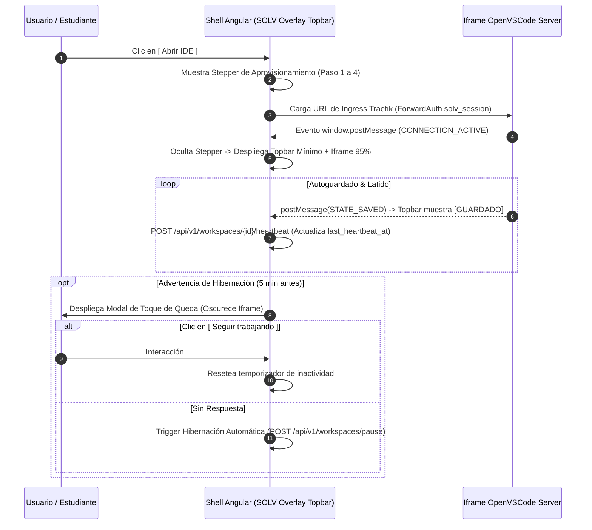

# Vista 2: Laboratorio Activo (Modo Inmersivo OpenVSCode Server)

> **Especificación Oficial de Interfaz, Flujos de Protocolo y Wireframe**  
> **Rol:** Estudiante  
> **Gobernanza:** SDD / Docs-as-Code / SOLV Design System  

---

## 1. Diagrama de Arquitectura de Comunicación (Mermaid HD — window.postMessage)



---

## 2. Anatomía Visual y Wireframes ASCII Técnicos

### 2.1 Topbar Mínimo e Iframe de OpenVSCode Server (95% Pantalla)
- **Componentes:**
  - `[<- Volver]`: Regresa al Dashboard sin destruir el contenedor.
  - `Lab #04 - Bases de Datos`: Título del laboratorio y materia.
  - `[ ESTADO: CONECTADO ]`: Indicador de estado de conexión WebSocket.
  - `[ GUARDADO ]`: Confirmación de autoguardado vía `postMessage`.

```text
┌──────────────────────────────────────────────────────────────────────────────────────────────────┐
│ [< Volver al Dashboard] | Lab #04 - Bases de Datos | [ ESTADO: CONECTADO ] | [ GUARDADO ]        │
├──────────────────────────────────────────────────────────────────────────────────────────────────┤
│                                                                                                  │
│                                IFRAME OPENVSCODE SERVER                                          │
│                     (Entorno VS Code Completo en el Navegador al 95%+)                           │
│                                                                                                  │
└──────────────────────────────────────────────────────────────────────────────────────────────────┘
```

### 2.2 Stepper Conversacional de Aprovisionamiento (Pantalla de Carga)
Sin exposición de logs crudos de Docker ni fallos de infraestructura.

```text
┌──────────────────────────────────────────────────────────────────────────────────────────────────┐
│                                                                                                  │
│                     Preparando tu laboratorio de desarrollo...                                   │
│                                                                                                  │
│                     [X] Paso 1: Verificando tu sesión académica                              │
│                     [X] Paso 2: Asignando volumen y memoria RAM                                  │
│                     [>] Paso 3: Cargando tus archivos de proyecto...                             │
│                     [ ] Paso 4: Listo para programar                                             │
│                                                                                                  │
│                     Progreso: [=======================      ] 75%                                │
│                                                                                                  │
└──────────────────────────────────────────────────────────────────────────────────────────────────┘
```

### 2.3 Modal de Toque de Queda (Inactividad Detectada — 5 Minutos Antes)

```text
┌──────────────────────────────────────────────────────────────────────────────────────────────────┐
│                                                                                                  │
│                  ┌────────────────────────────────────────────────────────────┐                  │
│                  │ ALERTA DE HIBERNACIÓN POR INACTIVIDAD                      │                  │
│                  │                                                            │                  │
│                  │ Tu laboratorio se pausará en 04:59 minutos.                │                  │
│                  │ Tu código y cambios están guardados automáticamente.       │                  │
│                  │                                                            │                  │
│                  │                  [ Seguir Trabajando ]                     │                  │
│                  └────────────────────────────────────────────────────────────┘                  │
│                                                                                                  │
└──────────────────────────────────────────────────────────────────────────────────────────────────┘
```

### 2.4 Modal de Bifurcación de Error Fatal (Lenguaje Humano Accionable)

```text
┌──────────────────────────────────────────────────────────────────────────────────────────────────┐
│                                                                                                  │
│                  ┌────────────────────────────────────────────────────────────┐                  │
│                  │ ATENCIÓN: EL LABORATORIO SE DETUVO                         │                  │
│                  │                                                            │                  │
│                  │ El entorno excedió los recursos asignados y se reinició     │                  │
│                  │ por seguridad del servidor. Tu código está a salvo.        │                  │
│                  │                                                            │                  │
│                  │         [ Reanudar Laboratorio ]  [ Volver ]               │                  │
│                  └────────────────────────────────────────────────────────────┘                  │
│                                                                                                  │
└──────────────────────────────────────────────────────────────────────────────────────────────────┘
```

### 2.5 Modo Revisión Docente (Variante Solo Lectura con Montaje Backend `:ro`)

```text
┌──────────────────────────────────────────────────────────────────────────────────────────────────┐
│ MODO REVISIÓN DOCENTE — Entorno en Solo Lectura (Estudiante: Alvaro Rivera - Fecha: 2026-08-24)   │
├──────────────────────────────────────────────────────────────────────────────────────────────────┤
│ [< Volver al Panel Docente] | Entrega: Lab #04 - Bases de Datos           [ MODO: SOLO LECTURA ] │
├──────────────────────────────────────────────────────────────────────────────────────────────────┤
│                                                                                                  │
│                                IFRAME OPENVSCODE SERVER (READ-ONLY)                              │
│                      (Inspección de código con montaje inmutable :ro)                            │
│                                                                                                  │
└──────────────────────────────────────────────────────────────────────────────────────────────────┘
```

---

## 3. Protocolo de Comunicación Inter-Iframe (`window.postMessage`)

| Dirección | Evento `postMessage` | Descripción y Acción |
|---|---|---|
| `iframe -> Angular` | `STATE_SAVED` | Notifica que los archivos se guardaron. El Topbar conmuta a `[ GUARDADO ]`. |
| `iframe -> Angular` | `CONNECTION_LOST` | Notifica pérdida de WebSocket. El Topbar conmuta a `[ RECONECTANDO... ]`. |
| `Angular -> iframe` | `SAVE_ALL_AND_CLOSE` | Envía orden de guardado forzado previo al cierre o hibernación automática. |
| `Angular -> iframe` | `SET_READONLY` | Configura el cliente de VSCode con `files.readonlyInclude` para la revisión docente. |
