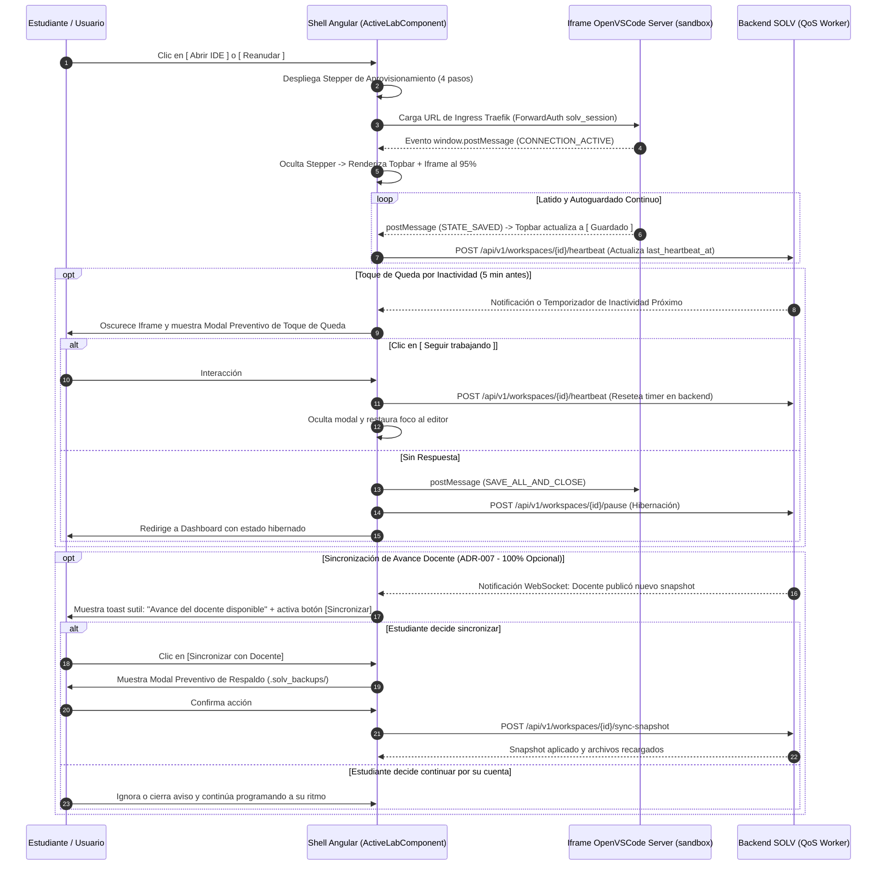

# Vista 2: Laboratorio Activo (Modo Inmersivo OpenVSCode Server)

> **Especificación Oficial de Interfaz, Protocolos, Contratos y Flujos de Usuario**  
> **Rol:** Estudiante (con variante de auditoría para Docente)  
> **Estado del Sistema:** Integrado con OpenVSCode 1.96.0, Traefik v3 y `qos_worker.go`  
> **Gobernanza:** SDD / Docs-as-Code / SOLV Design System  

---

## 1. Modelo Mental y Principios de Dominio

### 1.1. Modo Inmersivo de Desarrollo
Cuando el estudiante entra a un laboratorio activo, la plataforma abandona la navegación general y cede el **95%+ del viewport al editor OpenVSCode Server**.
- **Sensación de Entorno Local:** El estudiante no debe lidiar con la plataforma web; debe sentir que está en su propio editor de código.
- **Topbar Mínimo Exterior:** SOLV solo interviene con un marco superior ultraliviano para navegación, contexto académico y estado de red.
- **Cero Jerga de Infraestructura:** Queda prohibido mostrar identificadores de contenedor, códigos de salida (ej. exit code 137), puertos o consumo de RAM/CPU.

---

## 2. Diagrama de Arquitectura de Comunicación (`window.postMessage`)


```mermaid
sequenceDiagram
    autonumber
    participant U as Estudiante / Usuario
    participant S as Shell Angular (ActiveLabComponent)
    participant I as Iframe OpenVSCode Server (sandbox)
    participant B as Backend SOLV (QoS Worker)

    U->>S: Clic en [ Abrir IDE ] o [ Reanudar ]
    S->>S: Despliega Stepper de Aprovisionamiento (4 pasos)
    S->>I: Carga URL de Ingress Traefik (ForwardAuth solv_session)
    I-->>S: Evento window.postMessage (CONNECTION_ACTIVE)
    S->>S: Oculta Stepper -> Renderiza Topbar + Iframe al 95%
    
    loop Latido y Autoguardado Continuo
        I-->>S: postMessage (STATE_SAVED) -> Topbar actualiza a [ Guardado ]
        S->>B: POST /api/v1/workspaces/{id}/heartbeat (Actualiza last_heartbeat_at)
    end

    opt Toque de Queda por Inactividad (5 min antes)
        B-->>S: Notificación o Temporizador de Inactividad Próximo
        S->>U: Oscurece Iframe y muestra Modal Preventivo de Toque de Queda
        alt Clic en [ Seguir trabajando ]
            U->>S: Interacción
            S->>B: POST /api/v1/workspaces/{id}/heartbeat (Resetea timer en backend)
            S->>S: Oculta modal y restaura foco al editor
        else Sin Respuesta
            S->>I: postMessage (SAVE_ALL_AND_CLOSE)
            S->>B: POST /api/v1/workspaces/{id}/pause (Hibernación)
            S->>U: Redirige a Dashboard con estado hibernado
        end
    end

    opt Sincronización de Avance Docente (ADR-007 - 100% Opcional)
        B-->>S: Notificación WebSocket: Docente publicó nuevo snapshot
        S->>U: Muestra toast sutil: "Avance del docente disponible" + activa botón [Sincronizar]
        alt Estudiante decide sincronizar
            U->>S: Clic en [Sincronizar con Docente]
            S->>U: Muestra Modal Preventivo de Respaldo (.solv_backups/)
            U->>S: Confirma acción
            S->>B: POST /api/v1/workspaces/{id}/sync-snapshot
            B-->>S: Snapshot aplicado y archivos recargados
        else Estudiante decide continuar por su cuenta
            U->>S: Ignora o cierra aviso y continúa programando a su ritmo
        end
    end
```

---

## 3. Anatomía Visual y Wireframes ASCII Técnicos

### 3.1. Topbar Mínimo Exterior
El topbar contiene los elementos esenciales de navegación, estado y la acción contextual de sincronización cuando el docente emite código:

```text
┌──────────────────────────────────────────────────────────────────────────────────────────────────┐
│ [← Volver al Dashboard]  │  Lab #04 · Programación II  │  [Sincronizar]  │  [Conectado]  │  Guardado│
├──────────────────────────────────────────────────────────────────────────────────────────────────┤
│                                                                                                  │
│                                IFRAME OPENVSCODE SERVER                                          │
│                         (Entorno Completo en el Navegador al 95%+)                               │
│                                                                                                  │
└──────────────────────────────────────────────────────────────────────────────────────────────────┘
```

1. **`[← Volver al Dashboard]`:** Regresa al panel principal. Si hay cambios pendientes, activa guard de salida.
2. **Contexto Académico:** `Lab #04 · Programación II` (nombre de práctica y materia).
3. **Acción Contextual de Sincronización (ADR-007):** Botón `[Sincronizar]` que se ilumina únicamente cuando el docente emite un nuevo avance de clase (100% opcional).
4. **Semáforo de Conexión:** Estado en tiempo real del enlace de red/WebSocket.
5. **Estado de Guardado:** `Guardado` permanente tras confirmación de `STATE_SAVED`.

---

### 3.2. Matriz de Estados del Semáforo de Conexión

| Estado | Indicador Visual | Comportamiento en la Interfaz | Tolerancia / Acción |
| :--- | :--- | :--- | :--- |
| **Normal** | `[Conectado]` | Topbar fondo neutro/blanco. | Operación fluida. |
| **Error Transitorio** | `[Reconectando...]` | Mini-spinner en topbar y toast sutil no invasivo en esquina superior derecha. | Ventana de 10s sin bloquear la pantalla. Si la red regresa, vuelve a verde silenciosamente. |
| **Error Fatal** | `[Desconectado]` | El editor se detiene y se despliega el Modal de Error Fatal. | Requiere acción explícita del usuario (`[ Reanudar ]`). |
| **En Pausa** | `[Pausado]` | Pantalla de reposo tras inactividad. | Ofrece botón directo `[ Reanudar Laboratorio ]`. |

---

### 3.3. Stepper Conversacional de Aprovisionamiento (Pantalla de Espera)
Maneja la latencia de arranque del contenedor (3 a 12 segundos) en lenguaje humano y sin exponer logs crudos de Docker:

```text
┌──────────────────────────────────────────────────────────────────────────────────────────────────┐
│                                                                                                  │
│                             Preparando tu laboratorio de desarrollo...                           │
│                                                                                                  │
│                             [x] Paso 1: Verificando tu sesión académica                          │
│                             [x] Paso 2: Asignando recursos de trabajo                            │
│                             [] Paso 3: Cargando tus archivos de proyecto...                    │
│                             [ ] Paso 4: Listo para programar                                     │
│                                                                                                  │
│                             Progreso: [=======================      ] 75%                        │
│                                                                                                  │
│                             Esto puede tomar unos segundos adicionales...                        │
│                                                                                                  │
└──────────────────────────────────────────────────────────────────────────────────────────────────┘
```

---

### 3.4. Modal de Toque de Queda (Prevención de Hibernación Sorpresa)
Aparece 5 minutos antes del límite de inactividad configurado en el servidor:

```text
┌──────────────────────────────────────────────────────────────────────────────────────────────────┐
│                                                                                                  │
│                  ┌────────────────────────────────────────────────────────────┐                  │
│                  │ ALERTA DE HIBERNACIÓN POR INACTIVIDAD                   │                  │
│                  │                                                            │                  │
│                  │ Tu laboratorio se pausará en 04:59 minutos.                │                  │
│                  │ Tu código y cambios están guardados automáticamente.       │                  │
│                  │                                                            │                  │
│                  │                  [ Seguir Trabajando ]                     │                  │
│                  └────────────────────────────────────────────────────────────┘                  │
│                                                                                                  │
└──────────────────────────────────────────────────────────────────────────────────────────────────┘
```

---

### 3.5. Modal de Error Fatal (Psicología Empática)
Se activa si el contenedor cae por OOM Killer o falla de infraestructura:

```text
┌──────────────────────────────────────────────────────────────────────────────────────────────────┐
│                                                                                                  │
│                  ┌────────────────────────────────────────────────────────────┐                  │
│                  │ ATENCIÓN: EL LABORATORIO SE DETUVO                      │                  │
│                  │                                                            │                  │
│                  │ El entorno consumió todos los recursos permitidos y se     │                  │
│                  │ reinició por seguridad. Tu código está a salvo.            │                  │
│                  │                                                            │                  │
│                  │         [ Reanudar Laboratorio ]  [ Volver al Dashboard ]  │                  │
│                  └────────────────────────────────────────────────────────────┘                  │
│                                                                                                  │
└──────────────────────────────────────────────────────────────────────────────────────────────────┘
```

---

### 3.6. Modo Revisión Docente (Variante Solo Lectura)
Cuando un profesor entra a auditar el trabajo de un estudiante:
- **Banner Ámbar Superior:** `MODO REVISIÓN: Estás viendo el trabajo de [Nombre del Estudiante] en solo lectura`.
- **Bloqueo a Nivel Servidor:** OpenVSCode se instancia con `files.readonlyInclude` activado y volúmenes montados con flag inmutable `:ro`. Ningún atajo (Ctrl+S) puede modificar el código del alumno.

```text
┌──────────────────────────────────────────────────────────────────────────────────────────────────┐
│ MODO REVISIÓN DOCENTE — Solo Lectura (Estudiante: Alvaro Rivera - Fecha: 2026-09-14)          │
├──────────────────────────────────────────────────────────────────────────────────────────────────┤
│ [← Volver al Panel Docente]  │  Lab #04 · Bases de Datos            │  [ MODO: SOLO LECTURA ]    │
├──────────────────────────────────────────────────────────────────────────────────────────────────┤
│                                                                                                  │
│                                IFRAME OPENVSCODE SERVER (READ-ONLY)                              │
│                                                                                                  │
└──────────────────────────────────────────────────────────────────────────────────────────────────┘
```

---

## 4. Protocolo de Comunicación Inter-Iframe (`window.postMessage`)

| Dirección | Evento | Payload / Datos | Descripción y Acción en Shell |
| :--- | :--- | :--- | :--- |
| `iframe -> Angular` | `CONNECTION_ACTIVE` | `{ ready: true }` | El editor cargó. Oculta el stepper y revela el topbar. |
| `iframe -> Angular` | `STATE_SAVED` | `{ timestamp: number }` | Confirma autoguardado. Conmuta indicador a `Guardado`. |
| `iframe -> Angular` | `CONNECTION_LOST` | `{ code: number }` | Pérdida de WebSocket. Conmuta semáforo a `[Reconectando...]`. |
| `Angular -> iframe` | `SAVE_ALL_AND_CLOSE` | `{}` | Fuerza guardado en disco antes de hibernar o navegar. |
| `Angular -> iframe` | `SET_READONLY` | `{ enabled: true }` | Configura el cliente en modo solo lectura para revisión docente. |

---

## 5. Contrato Técnico del Iframe (Seguridad y Aislamiento)

La etiqueta `<iframe>` debe configurarse con atributos de aislamiento estricto que permitan el funcionamiento del IDE sin vulnerar el shell contenedor:

```html
<iframe
  #vscodeIframe
  [src]="trustedWorkspaceUrl()"
  class="solv-ide-viewport"
  allow="clipboard-read; clipboard-write; fullscreen"
  sandbox="allow-scripts allow-same-origin allow-forms allow-downloads allow-modals"
  title="Entorno de Desarrollo OpenVSCode">
</iframe>
```

---

## 6. Guards de Navegación y Cierre de Pestaña

### 6.1. Guard `CanDeactivate` (Salida Controlada)
Si el usuario hace clic en `[← Volver]` mientras el indicador muestra cambios en vuelo o `[Reconectando...]`:
1. El guard intercepta la navegación.
2. Emite `SAVE_ALL_AND_CLOSE` hacia el iframe vía `postMessage`.
3. Espera confirmación con un timeout de seguridad de 800ms.
4. Permite la transición limpia hacia el Dashboard.

### 6.2. Cierre Abrupto de Ventana (`beforeunload`)
Si el estudiante cierra la pestaña o navegador directamente:
- No se bloquea al usuario con diálogos molestos.
- La ausencia de latidos HTTP (`POST /api/v1/workspaces/{id}/heartbeat`) es detectada de forma autónoma por `qos_worker.go` en el backend, el cual aplica la hibernación programada preservando el volumen de datos intacto.


