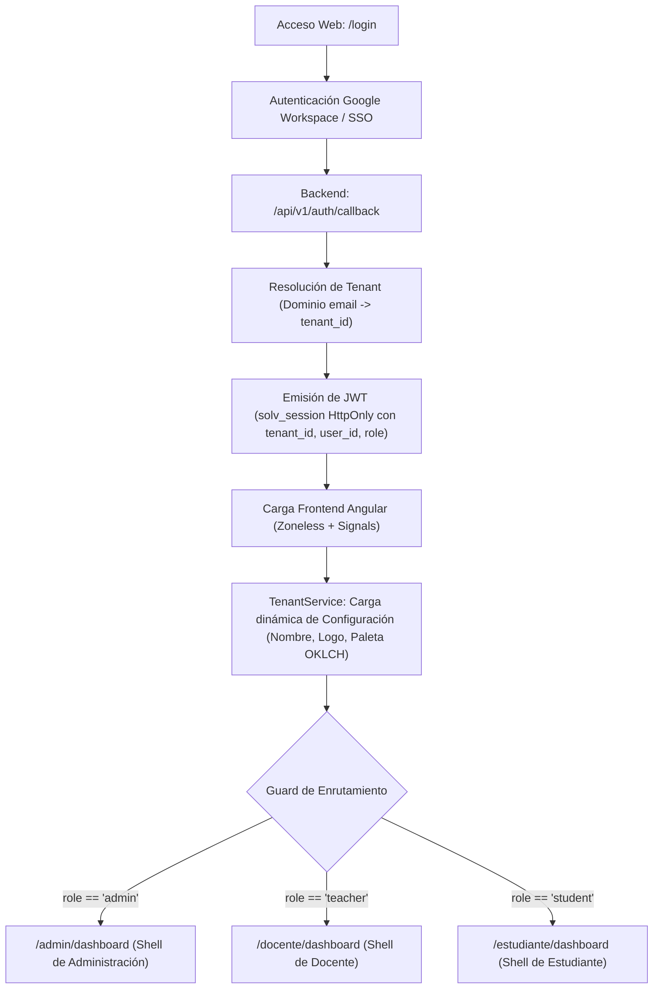

# Mapa Integral de Vistas y Arquitectura de Navegación de SOLV

> **Documento Maestro de Arquitectura de Información (IA)**  
> **Sistema:** SOLV — Plataforma de Orquestación de Laboratorios Virtuales  
> **Alcance:** Multi-tenant Dinámico · Todos los Roles (Admin, Docente, Estudiante) · Contratos de Interfaz  
> **Gobernanza:** SDD / Docs-as-Code / SOLV Design System / Decisión D1–D6  

---

## 1. Arquitectura Global y Resolución Dinámica Multi-Tenant

El sistema opera bajo un esquema **100% Multi-Tenant Dinámico**. No existen dominios, nombres de facultades ni logotipos fijos en el código.

### 1.1. Flujo de Entrada y Derivación por Rol



### 1.2. Principio de Inyección Visual de Tenant
* **Topbar e Identidad:** El componente `solv-topbar` lee de `TenantService.config()` de forma reactiva:
  * Si hay `logo_url`, renderiza la imagen institucional.
  * Si no hay logo o falla la carga, renderiza `brand-shield` con las iniciales calculadas (`tenantInitials()`).
  * Inyecta la variable CSS `--tenant-primary` en formato OKLCH ajustada para contraste WCAG AA.

---

## 2. Árbol General de Navegación

```text
/ (Raíz)
├── /login .............................. Portal institucional de inicio de sesión
│
├── /admin (Rol: Administrador de Institución)
│   ├── /admin/dashboard ................ Salud del servidor, consumo de recursos y contenedores
│   ├── /admin/docentes ................. Gestión del plantel docente e invitaciones
│   ├── /admin/plantillas ............... Catálogo y aprobación de plantillas Docker
│   ├── /admin/configuracion ............ Períodos académicos, marca institucional y servidor
│   └── /admin/auditoria ................ Registro inmutable de eventos y trazabilidad
│
├── /docente (Rol: Docente)
│   ├── /docente/dashboard .............. Resumen de cursos, cola de revisión y alertas críticas
│   ├── /docente/cursos/:id ............. Detalle de curso (estudiantes, laboratorios y métricas)
│   ├── /docente/laboratorios/nuevo ..... Asistente de configuración de laboratorio (IDE o Juez)
│   ├── /docente/laboratorios/:id/editar  Modificación de parámetros y fechas de entrega
│   ├── /docente/laboratorios/:id/monitoreo Radar en tiempo real de contenedores de alumnos
│   └── /docente/juez ................... Banco de problemas algorítmicos, tests y auditoría
│
└── /estudiante (Rol: Estudiante)
    ├── /estudiante/dashboard ........... Cuaderno académico (cursos, hojas de trabajo y entregas)
    ├── /estudiante/laboratorios/:id .... Modo Inmersivo: OpenVSCode Server (95%+ viewport)
    └── /estudiante/juez/:ejercicioId ... Juez Virtual: Monaco Editor, AST Semgrep y veredictos
```

---

## 3. Rol Administrador: Fichas Técnicas de Pantallas

### 3.1. Dashboard de Infraestructura y Salud (`/admin/dashboard`)
* **Propósito:** Supervisar la estabilidad del servidor host (CPU, RAM, Disco) y la carga de contenedores en tiempo real.
* **Información que muestra:**
  * 4 Tarjetas KPI de Hardware: Memoria RAM utilizada/total con barra de umbral semántico, Carga media de vCPU, Almacenamiento NVMe (`/var/lib/docker`) y Concurrencia de contenedores (Activos / Hibernados / Límite).
  * Gráfico de Carga Temporal: Consumo de los últimos 60 minutos con línea proyectada de capacidad máxima.
  * Tabla de Contenedores Activos: Alumno, Curso, Imagen Docker base, RAM consumida, TTL restante y estado de red.
* **Acciones Principales:**
  * `[Hibernar Todo]` — Pasa todos los contenedores inactivos a estado hibernado para liberar RAM.
  * `[Detener Contenedor]` — Finaliza una instancia específica que exceda límites de consumo.
  * `[Ver Logs de Docker]` — Abre un panel lateral con salida directa del motor Docker.

### 3.2. Gestión de Docentes e Invitaciones (`/admin/docentes`)
* **Propósito:** Administrar el ciclo de vida del personal docente asignado a la institución.
* **Información que muestra:**
  * Tabla de Docentes: Nombre completo, correo institucional, cursos asignados, último acceso y estado (Activo / Invitación Pendiente / Inactivo).
  * Contador de cupos docentes utilizados vs contratados.
* **Acciones y Disparadores:**
  * `[+ Invitar Profesor]` — Abre Modal de Invitación: solicita correo electrónico institucional; genera token de un solo uso con TTL de 72 horas y envía enlace por correo.
  * `[Reenviar Enlace]` — Renueva la vigencia de una invitación pendiente.
  * `[Revocar Acceso]` — Abre diálogo de confirmación para deshabilitar credenciales del profesor.

### 3.3. Catálogo y Gobernanza de Plantillas Docker (`/admin/plantillas`)
* **Propósito:** Mantener la lista blanca de imágenes Docker seguras que los docentes pueden seleccionar al crear laboratorios.
* **Información que muestra:**
  * Grilla de Plantillas Aprobadas: Nombre del perfil (ej. *Python Data Science*, *C++ Algoritmos*, *PostgreSQL 16*), tag fijado (prohibido `:latest`), límite de RAM por defecto y fecha de validación.
  * Bandeja de Solicitudes Pendientes: Peticiones enviadas por docentes solicitando imágenes nuevas.
* **Acciones y Disparadores:**
  * `[+ Nueva Plantilla]` — Modal para registrar imagen Docker aprobada, asignando cuota base de RAM/CPU y comprobando existencia en registro.
  * `[Revisar Solicitud]` — Abre diálogo de revisión técnica: inspección de capas, vulnerabilidades y aprobación/rechazo con justificación.

### 3.4. Configuración Institucional (`/admin/configuracion`)
* **Propósito:** Control centralizado de parámetros académicos, marca de la institución y políticas del servidor en 3 pestañas:
  * **Pestaña 1 (Períodos Académicos):** Listado de semestres (Activo, Planificado, Archivado). Botón `[+ Nuevo Período]` y acción `[Archivar Período]` (requiere confirmación manual escribiendo el código del semestre; pasa los cursos y laboratorios a modo solo lectura `:ro`).
  * **Pestaña 2 (Marca e Identidad White-Label):** Subida de logotipo institucional, nombre formal de la universidad y selector de color primario en OKLCH con validación automática de contraste WCAG AA (4.5:1). Incluye vista previa en vivo sin recargar la página.
  * **Pestaña 3 (Servidor y Respaldos):** Cuotas de RAM máxima por estudiante, tiempo de inactividad antes de hibernar (por defecto 15 minutos) y panel de respaldos automáticos con checksum SHA-256 y botón `[Generar Respaldo Ahora]`.

### 3.5. Registro de Auditoría (`/admin/auditoria`)
* **Propósito:** Consulta de registros inmutables de seguridad y eventos del sistema.
* **Información que muestra:**
  * Tabla paginada de eventos: Marca de tiempo ISO-8601, Actor (correo o sistema), Acción ejecutada (ej. `AUTH_LOGIN`, `CONTAINER_START`, `PERIOD_ARCHIVE`), Dirección IP y Veredicto/Estado HTTP.
  * Filtros avanzados por rango de fechas, actor y tipo de operación.
* **Acciones:**
  * `[Exportar CSV/JSON]` — Descarga del segmento filtrado para auditorías externas.

---

## 4. Rol Docente: Fichas Técnicas de Pantallas

### 4.1. Dashboard del Docente (`/docente/dashboard`)
* **Propósito:** Centro de control diario del profesor para gestionar sus cursos y atender requerimientos urgentes de alumnos.
* **Información que muestra:**
  * Saludo contextual con alertas priorizadas (entregas por revisar, bloqueos de Semgrep, contenedores caídos).
  * Selector de Período Académico activo.
  * Grilla de Cursos a Cargo: Tarjetas con nombre de materia, código de comisión, total de alumnos inscritos y cantidad de laboratorios abiertos.
  * Panel Lateral "Atención Requerida": Lista de incidentes pedagógicos o técnicos que demandan intervención inmediata.
* **Acciones:**
  * `[+ Crear Laboratorio]` — Acceso directo al asistente de creación.
  * Clic en tarjeta de curso — Navega a `/docente/cursos/:id`.

### 4.2. Detalle de Curso (`/docente/cursos/:id`)
* **Propósito:** Gestión interna de una materia específica mediante 3 pestañas:
  * **Laboratorios:** Lista cronológica de actividades prácticas con sus fechas límite y estado (Borrador / Publicado / Cerrado).
  * **Estudiantes:** Nómina de alumnos, estado de avance individual y enlaces directos a sus entornos.
  * **Métricas:** Estadísticas agregadas de tiempos de resolución, tasa de éxito y problemas comunes.

### 4.3. Asistente de Creación/Edición de Laboratorio (`/docente/laboratorios/nuevo`)
* **Propósito:** Formulario paso a paso para desplegar una nueva actividad práctica.
* **Flujo en 3 Pasos:**
  * **Paso 1 (Datos Generales):** Título, curso asignado, fechas de apertura y cierre, descripción pedagógica.
  * **Paso 2 (Modalidad Técnica):**
    * *Opción A - Entorno Completo (IDE):* Selección de plantilla Docker del catálogo de la institución, límite de RAM y tiempo de inactividad permitido.
    * *Opción B - Juez Virtual (Algoritmos):* Selección de lenguaje base, tiempo máximo de ejecución por caso de prueba y memoria límite.
  * **Paso 3 (Restricciones y Evaluación):** Carga de casos de prueba (públicos para el estudiante y privados para calificación) y reglas de análisis estático de código (Semgrep).
* **Acciones:**
  * `[Guardar Borrador]` — Guarda los cambios sin hacer visible el laboratorio a los alumnos.
  * `[Publicar a la Clase]` — Habilita el laboratorio en el calendario de los estudiantes.

### 4.4. Radar de Monitoreo en Tiempo Real (`/docente/laboratorios/:id/monitoreo`)
* **Propósito:** Observar en directo a la clase durante el desarrollo de una sesión de laboratorio.
* **Información que muestra:**
  * Grilla de Alumnos: Tarjeta por estudiante indicando si está conectado, tiempo de actividad, estado del contenedor (`running`, `hibernated`, `failed`).
* **Acciones por Alumno:**
  * `[Auditar Entorno]` — Abre una sesión de inspección en modo lectura sobre el contenedor del alumno.
  * `[Reiniciar Contenedor]` — Permite levantar nuevamente el contenedor de un estudiante en caso de bloqueo.

### 4.5. Juez Virtual — Auditoría y Calificación (`/docente/juez`)
* **Propósito:** Banco de ejercicios algorítmicos y revisión manual de código entregado.
* **Información que muestra:**
  * Banco de Problemas del profesor clasificados por dificultad y etiquetas.
  * Cola de Envíos Pendientes de Calificación.
* **Pantalla de Auditoría de Código:**
  * Editor Monaco en modo solo lectura (`:ro`) con la solución enviada por el alumno.
  * Detalle de ejecución de casos de prueba (tiempos en milisegundos y memoria utilizada).
  * Resumen de reglas Semgrep aplicadas (ej. verificación de no uso de librerías prohibidas).
  * Campo para retroalimentación cualitativa y botón `[Confirmar Calificación]`.

---

## 5. Rol Estudiante: Fichas Técnicas de Pantallas

### 5.1. Dashboard del Estudiante (`/estudiante/dashboard`)
* **Propósito:** Centro de mando organizado bajo el modelo mental del **Cuaderno Académico**.
* **Información que muestra:**
  * Banner de Próximas Entregas: Alertas claras de laboratorios o ejercicios con fecha límite cercana.
  * Sección de Cursos: Cada materia funciona como una libreta donde se agrupan cronológicamente sus hojas de trabajo (laboratorios).
  * Estado de cada Laboratorio: Etiqueta semántica (*No iniciado*, *En progreso*, *Entregado*, *Calificado*).
* **Acciones:**
  * `[Iniciar Laboratorio]` / `[Continuar Trabajo]` — Abre la vista inmersiva del laboratorio activo.
  * `[Ver Retroalimentación]` — Muestra los comentarios y la nota otorgada por el docente.

### 5.2. Laboratorio Activo en Modo Inmersivo (`/estudiante/laboratorios/:id`)
* **Propósito:** Espacio de desarrollo libre de distracciones donde el 95%+ del área visual corresponde a **OpenVSCode Server**.
* **Componentes de la Pantalla:**
  * **Topbar Mínimo Superior:**
    * Nombre de la materia y número de laboratorio.
    * Indicador de tiempo restante de la sesión.
    * Botón `[Extender Tiempo]` (añade tiempo si las políticas del laboratorio lo permiten).
    * Botón `[Guardar y Salir]` (hiberna el contenedor de forma segura y regresa al dashboard).
  * **Área Central Completa:**
    * Iframe seguro comunicándose mediante `window.postMessage` para sincronización de estado, sin exponer identificadores de contenedor, puertos ni consumo interno.

### 5.3. Juez Virtual — Resolución y Evaluación (`/estudiante/juez/:ejercicioId`)
* **Propósito:** Resolución de problemas de lógica y algoritmos con evaluación formativa instantánea.
* **Componentes de la Pantalla:**
  * **Panel Izquierdo:** Consigna del problema, ejemplos de entrada/salida y restricciones de diseño pedagógico (lo que está permitido o prohibido usar).
  * **Panel Superior Derecho:** Monaco Editor interactivo con resaltado de sintaxis y autocompletado para el lenguaje configurado.
  * **Panel Inferior Derecho (Consola y Veredictos):**
    * Botón `[Ejecutar Pruebas]` — Corre el código frente a los casos de prueba visibles.
    * Botón `[Enviar Solución]` — Ejecuta la validación completa (casos privados + análisis estático Semgrep).
    * Indicador de Veredicto Semántico:
      * `AC` (Aceptado): Verde.
      * `WA` (Respuesta Incorrecta): Rojo.
      * `TLE` (Tiempo Límite Excedido): Ámbar.
      * `RE` (Error de Ejecución): Naranja.
      * `AST_BLOCKED` (Restricción de Código Violada): Rojo intenso con explicación constructiva de la regla infringida.

---

## 6. Matriz de Estados Globales del Sistema

| Estado Técnico | Color Semántico | Significado para el Usuario |
| :--- | :--- | :--- |
| `running` | Verde éxito | Contenedor o servicio funcionando con normalidad |
| `pending` | Amarillo advertencia | Contenedor levantando, comprobación en cola o invitación enviada |
| `hibernated` | Gris neutro | Contenedor pausado en disco para preservar recursos |
| `failed` / `oom_killed` | Rojo error | Proceso finalizado por error o falta de memoria |
| `AC` | Verde éxito | Solución aprobada en todos los casos |
| `WA` | Rojo error | La salida generada no coincide con la esperada |
| `TLE` | Ámbar advertencia | El algoritmo superó el tiempo máximo asignado |
| `RE` | Naranja error | Error fatal durante la ejecución del programa |
| `AST_BLOCKED` | Rojo intenso | El código contiene estructuras o funciones no permitidas por la cátedra |
